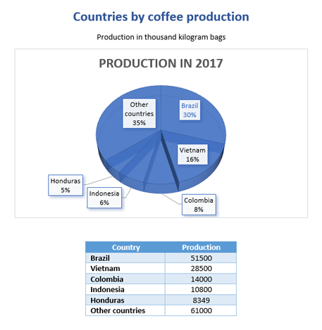
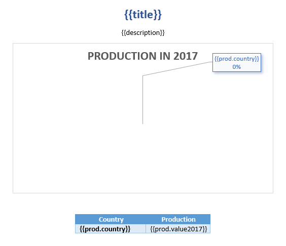
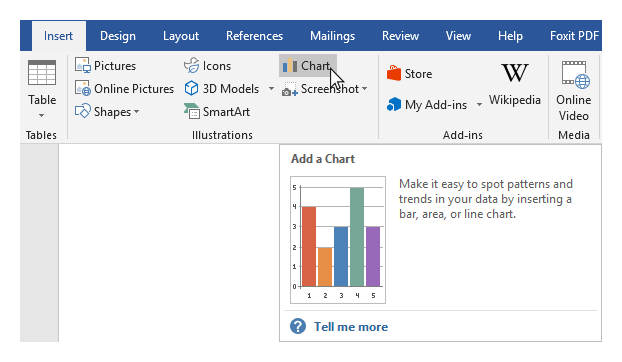
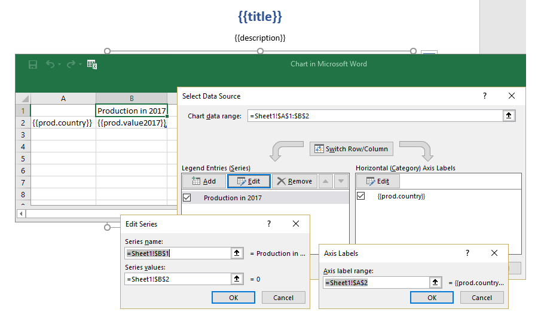
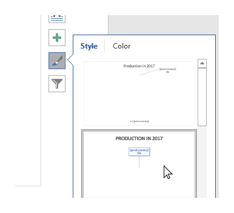
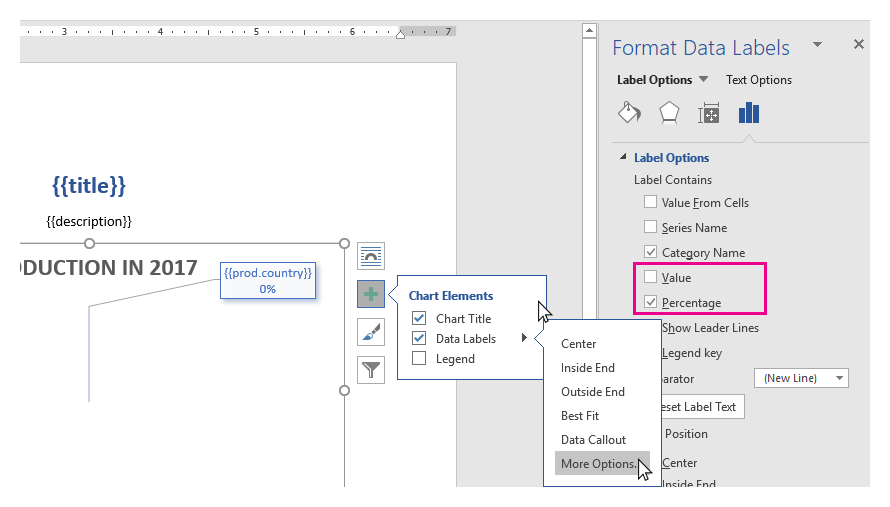
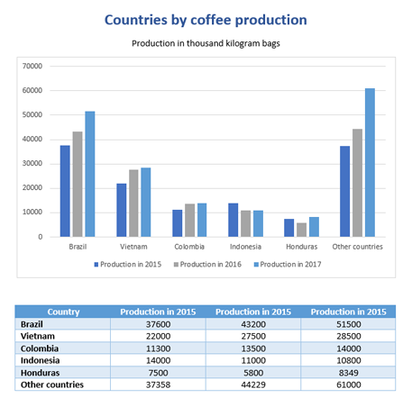
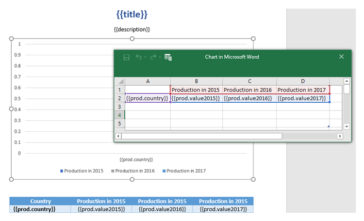
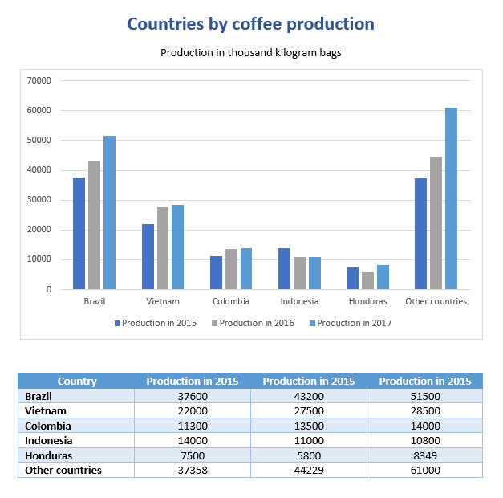

Charts in DOCX templates
========================

With help of the templating engine, you can create different types of charts based on differently structured data.

Charts in Word are spreadsheet files embedded within the zip. During analysis Templater will drill down into embedded xlsx file for tags. They will be available through low level API as if they were defined in Word.

Let us check a few examples.

.. contents:: Content
    :local:
    :depth: 1

.. _pie-charts:

Pie charts
----------

In this section, we will see how to build a pie chart in a MS Word document. The chart will be based on a rendered into an embedded xlsx file data from a JSON object.

Let us take an object containing statistics of coffee production in 2017 by country. We want to build a simple pie chart with percentage value for each country.

You can download the source document and the result document for this example in the `pie charts demo <./demos.html#pie-charts>`_. Description of the example is below.

This is how our result document will look like:

JSON representation of the object:

.. code:: json

    [
        {
            "title": "Countries by coffee production",
            "description": "Production in thousand kilogram bags",
            "prod": [
                {
                    "country": "Brazil",
                    "value2017": 51500
                },
                {
                    "country": "Vietnam",
                    "value2017": 28500
                },
                {
                    "country": "Colombia",
                    "value2017": 14000
                },
                {
                    "country": "Indonesia",
                    "value2017": 10800
                },
                {
                    "country": "Honduras",
                    "value2017": 8349
                },
                {
                    "country": "Other countries",
                    "value2017": 61000
                }
            ]
        }
    ]

Now, let us take a look at the source template:

We add :code:`{{title}}` and :code:`{{description}}` tags to the top of the page to let the engine know that we want to render the corresponding properties.

To create a chart in MS Word we navigate to the *Insert tab* in the top ribbon, click *Chart*, choose a type for our chart and click *OK*:

We have to let the engine know what data needs to be rendered. We select the chart, click the *Filter icon* and click *Select data* link. Then we edit the embedded spreadsheet file adding :code:`{{prod.country}}` and :code:`{{prod.value2017}}` tags to refer the properties inside our JSON objects and Series and Labels settings in the **Select Data Source** dialog box:

Basically, the template for the chart is ready. We just want to change the design a bit and add percentage values to the data labels. We apply one of the default styles:

Then, we open *Data Label* settings, check the *Percentage* checkbox and uncheck the *Value* one:

We also added a simple table under the chart. You may find instructions how to work with the tables in the `tables section <./tables.html>`_ of the documentation.

Let us have a look at the result of rendering another time. The templating engine automatically created rows with production data in the embedded spreadsheet and built a chart based on it:

Clustered column charts
------------------------

In this section, we will create a table with countries coffee production by years and build a clustered column chart.

Let us have a look at an example. You can download the source template and the result document for this example in `clustered column charts demo <./demos.html#clustered-column-charts>`_.

This is how our result document will look like:

JSON representation of the object:

.. code:: json

    [
        {
            "title": "Countries by coffee production",
            "description": "Production in thousand kilogram bags",
            "prod": [
                {
                    "country": "Brazil",
                    "value2015": 37600,
                    "value2016": 43200,
                    "value2017": 51500
                },
                {
                    "country": "Vietnam",
                    "value2015": 22000,
                    "value2016": 27500,
                    "value2017": 28500
                },
                {
                    "country": "Colombia",
                    "value2015": 11300,
                    "value2016": 13500,
                    "value2017": 14000
                },
                {
                    "country": "Indonesia",
                    "value2015": 14000,
                    "value2016": 11000,
                    "value2017": 10800
                },
                {
                    "country": "Honduras",
                    "value2015": 7500,
                    "value2016": 5800,
                    "value2017": 8349
                },
                {
                    "country": "Other countries",
                    "value2015": 37358,
                    "value2016": 44229,
                    "value2017": 61000
                }
            ]
        }
    ]

Now, let us take a look at the source template:

We add :code:`{{title}}` and :code:`{{description}}` tags to the top of the page to let the engine know that we want to render the corresponding properties.

To create the chart we navigate to the *Insert* tab in the top ribbon, click *Chart* and choose a clustered column chart.  We add :code:`{{prod.country}}` and :code:`{{prod.value2015}}`, :code:`{{prod.value2016}}`, :code:`{{prod.value2017}}` tags to the embedded spreadsheet file to refer the properties inside our objects. The templating engine will iterate through all objects in the array to render them and add the rows automatically.

Series and Labels settings in the **Select Data Source** dialog box are set automatically and look like this:

.. image:: ../../_static/img/document-generation/clustered-columns-settings-dox.png
    :alt: clustered column settings

We just change the colors and the template is ready.

Let us have a look at the result of rendering another time. The templating engine automatically created rows with production data in the embedded spreadsheet and built a chart based on it:

