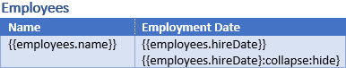
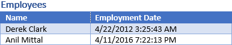
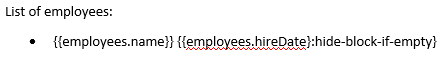
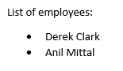
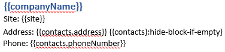
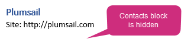

Conditionally hide blocks in DOCX templates
===========================================

You can use `hide-block-if formatter <../common-docx-xlsx/formatters.html#hhide-block-if>`_ to hide blocks of a document. 

The formatter checks if a value for current tag is equal to a value of the parameter, then finds closest collapsible block and hides it:

- Table row
- Bullet list item

First of all, review the `demo for this case <./demos.html#conditionally-hide-blocks>`_. 

Here we will learn how it works:

.. contents::
    :local:
    :depth: 1    

.. _hide-table-rows:

Hide table rows
---------------

Let us assume we have a collection of employees. We want to render a table with information about them, but we want to hide employees from a specific department (:code:`development`).

This is JSON representation of employees data:

.. code:: json

    {           
        "employees": [
            {
                "name": "Derek Clark",
                "department":"marketing"
            },
            {
                "name": "Jessica Adams",
                "department":"sales"
            },
            {
                "name": "Anil Mittal",
                "department":"development"        
            }
        ]
    }

We will use the template like this:

As you can see, we added this string to the template row: :code:`{{employees.department}:hide-block-if(development)}`. The :code:`hide-block-if(development)` formatter checks if the department is development and hides table row that contains this tag.

The result bullet list will look like this:

The employee with the name "Anil Mittal" was hidden because he works in the development department.

Hide bullet list items
----------------------

We will use the same JSON data as in the example for table rows above.

Our template will look like this:

As you can see, we added this string to the bullet list item template: :code:`{{employees.name}} {{employees.department}} {{employees.department}:hide-block-if(development)}` formatter works the same way as in `the example for table rows <#hide-table-rows>`_ above.

The result table will look like this:

Hide arbitrary block
--------------------

If you want to hide arbitrary section that is not a table row or a bullet list item, we recommend you to wrap it into a table cell with invisible borders.

In this example, we will use information about a company as a source data for the template and a specific case of the formatter: `hide-block-if-empty formatter <../common-docx-xlsx/formatters.html#hhide-block-if-empty>`_.
The formatter hides parts of a document if some value or collection of values is null, empty or empty array.

This is JSON representation of company data:

.. code:: json

    {       
        "companyName": "Plumsail",    
        "site": "http://plumsail.com",
        "contacts": null    
    }

We want to display company name, site and contacts and hide contacts if they are empty. We will just wrap all text related to contacts into a table cell with transparent borders:

As you can see, we added this string to the template for contact information: :code:`{{contacts}:hide-block-if-empty}`. The :code:`hide-block-if-empty` formatter works the same way as in `the example for table rows <#hide-table-rows>`_ above.

The result will look like this:

