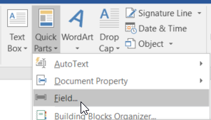
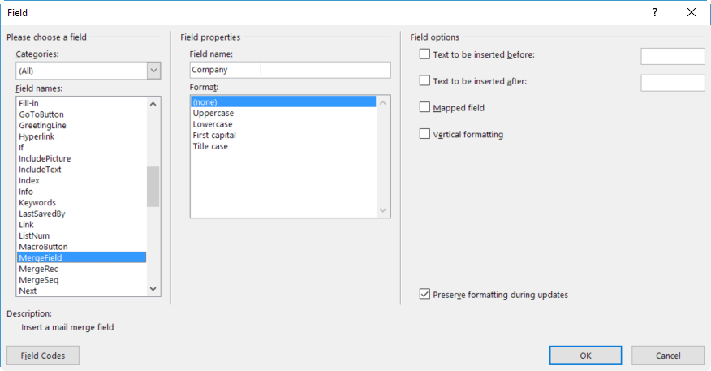
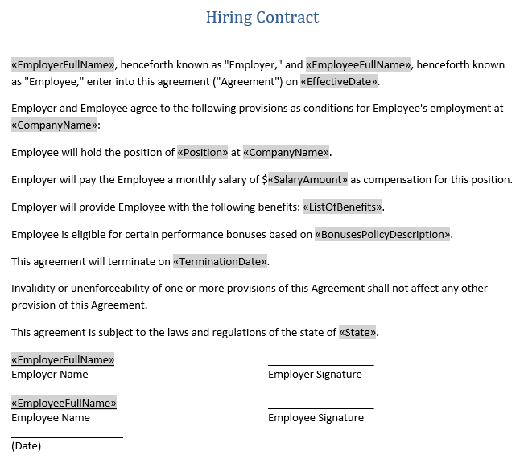

Create DOCX document with merge fields
======================================

This article demonstrates how to create .docx Word document with merge fields. This document can be used document generation actions. For example, in the `Fill Merge Fields in DOCX <../../flow/actions/document-processing.html#fill-merge-fields-in-docx-document>`_ action.

In this example, we will prepare a template for hiring contract. We need to insert special placeholders (merge fields) into our word document. They will be replaced by the text in the future. To do this, open Microsoft Word, click in the text where you want to add a placeholder, navigate to *'Insert'* tab and select *'Quick Parts'*. Then select *'Field'*.

Select *'MergeField'* from the list of categories and fill in *'Field name'*:

.. note:: *'Field Name'* has to correspond to a name of a property in the data object, that you want to apply to this document. For example, you may have an object with property *'EmployerFullName'*. Use the same name for merge field.

After adding all required placeholders, the document should look like this:

Use `this link <../../_static/files/flow/how-tos/Hiring%20Contract%20Template%20(merge%20fields).docx>`_ to download it.