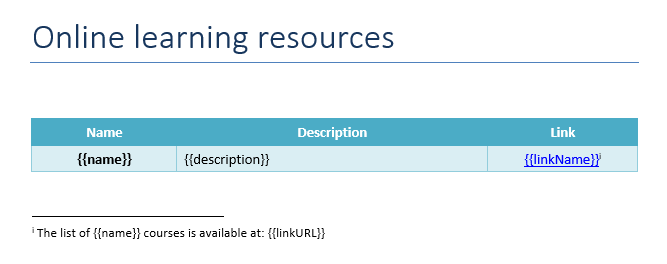
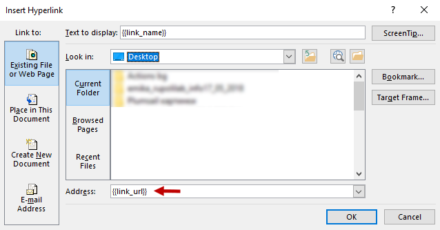
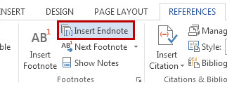
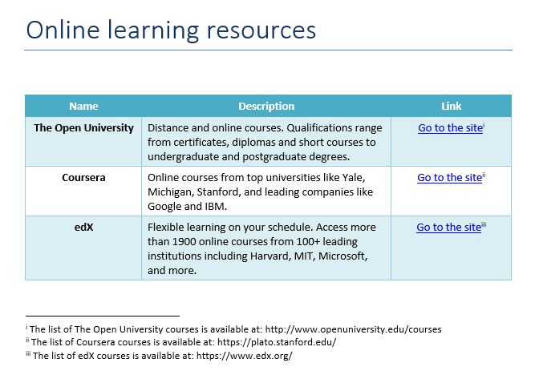

Links and endnotes
==================

.. contents:: Content
    :local:
    :depth: 1

.. _external-links:

**Create DOCX document from template** action allows you to add dynamic hyperlinks to a location on the web, as well as endnotes and footnotes.

You can download the source document and the result document for the example described below in `links and endnotes demo <./demos.html#links-and-endnotes>`_.

Links
-----

Let us assume we have a list of online learning resources.

JSON representation of the object:

.. code:: json

    [
        {
            "name": "The Open University",
            "description": "Distance and online courses. Qualifications range from certificates, diplomas and short courses to undergraduate and postgraduate degrees.",
            "linkName": "Go to the site",
            "linkURL": "http://www.openuniversity.edu/courses"
        },
        {
            "name": "Coursera",
            "description": "Online courses from top universities like Yale, Michigan, Stanford, and leading companies like Google and IBM.",
            "linkName": "Go to the site",
            "linkURL": "https://plato.stanford.edu/"
        },
        {
            "name": "edX",
            "description": "Flexible learning on your schedule. Access more than 1900 online courses from 100+ leading institutions including Harvard, MIT, Microsoft, and more.",
            "linkName": "Go to the site",
            "linkURL": "https://www.edx.org/"
        }
    ]

Now, let us take a look at the source template for this structure:

We designed a table with a header and just one row that contains our tags. The templating engine is smart enough to understand what content needs to be duplicated.

To refer properties of the objects we just used the names of the properties:

:code:`{{name}}`, :code:`{{description}}`, :code:`{{linkName}}`, :code:`{{linkURL}}`.

To create a hyperlink to a location on the web we select the text that we want to display as a hyperlink, in the **Insert** tab in MS Word, click **Link**, navigate to the **Existing File or Web Page** tab and add a tag into the **Address** field:

Endnotes
--------

We have also added endnotes to our template. To do that please click where you want to add an endnote, click **References** in the top ribbon and **Insert Endnote**.

Endnotes and footnotes maintain the context of their definition. This allows the template engine to replace multiple tags which belong to the same context.

You can see the result of rendering below. The templating engine created web hyperlinks and endnotes in the document:

