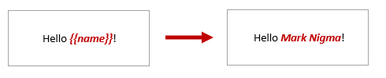
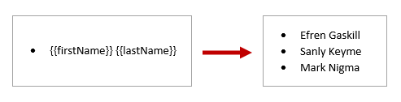
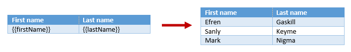

How Word DOCX templates work
=======================

Word DOCX templates in Plumsail Actions use a different approach than most other templating solutions. It uses a minimal amount of syntax to make your work done. Let us start with basics and move to more advanced scenarios.

First of all, pick how you will apply templates:

- Use Microsoft Flow action `Create DOCX document from template <../../flow/actions/document-processing.html#create-docx-document-from-template>`_
- User rich `REST API <../../getting-started/use-as-rest-api.html>`_.

If you decide to use Microsoft Flow, learn `how to create your first flow <../../getting-started/use-from-flow.html>`_.

Basic syntax
------------

Let us assume we have some simple data object that we want to apply to our template.

JSON representation of the object:

.. code:: json

    {
        "name": "Mark Nigma"
    }

And we want to include the name in the generated document. We need to surround the property with braces. The template is on the left side, the result is on the right side:

Simple bullet list and table
----------------------------

You don't need to declare any loops, the templating engine is smart enough to understand the structure of source object applied to your document. Thus, if you refer property of object inside a collection, it understands that we need to iterate it.

Let us assume we have information about customer names. JSON representation of the object:

.. code:: json

    [
        {        
            "firstName": "Efren",
            "lastName": "Gaskill"
        }, {        
            "firstName": "Sanly",
            "lastName": "Keyme"            
        }, {        
            "firstName": "Mark",
            "lastName": "Nigma"            
        }        
    ]

The template on the left side will result in the document on the right side:

Review `Lists <./lists.html>`_ for more complex scenarios.

The same approach works for tables:

Review `Tables <./tables.html>`_ for more complex scenarios.

Advanced scenarios
------------------

Now, when you know how to create basic templates, it is time to review more advanced scenarios:
                              
- `Lists <lists.html>`_
- `Tables <tables.html>`_
- `Loops and nesting <loops-and-nesting.html>`_
- `Conditionally hide blocks <conditionally-hide-blocks.html>`_
- `Value formatters <../common-docx-xlsx/formatters.html>`_