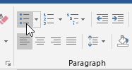
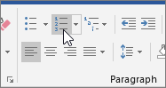
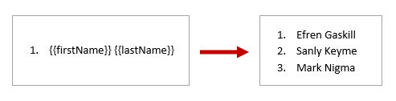
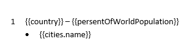
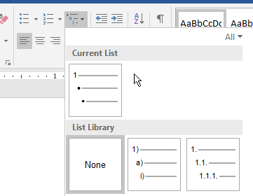
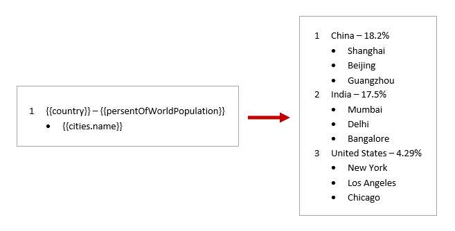

Lists in DOCX templates
=======================

.. contents:: Content
    :local:
    :depth: 1

.. _bullet-lists:
.. _numbered-lists:
.. _multilevel-lists:

Bullet lists
------------

You don't need to declare any loops, the templating engine is smart enough to understand the structure of source object applied to your document. Thus, if you refer a property of an object inside a collection, it understands that we need to iterate it.

Let us assume we have information about customer names. JSON representation of the object:

.. code:: json

    [
        {
            "firstName": "Efren",
            "lastName": "Gaskill"
        }, {
            "firstName": "Sanly",
            "lastName": "Keyme"
        }, {
            "firstName": "Mark",
            "lastName": "Nigma"
        }
    ]

Tags in the template will look like this:

:code:`{{firstName}} {{lastName}}`

Just select the string and change it into a bullet list by clicking the **Bullets** button:

The template on the left side will result in the document on the right side:

.. image:: ../../_static/img/document-generation/simple-bullet-list-template-result.png
    :alt: Bullet list template

Numbered lists
--------------

As with the bullet lists, you don't need to declare any loops, the templating engine will understand the structure of source object applied to your document. Thus, if you refer a property of an object inside a collection, it understands that we need to iterate it.

We take the same information about customer names. Here is JSON representation of the object:

.. code:: json

    [
        {
            "firstName": "Efren",
            "lastName": "Gaskill"
        }, {
            "firstName": "Sanly",
            "lastName": "Keyme"
        }, {
            "firstName": "Mark",
            "lastName": "Nigma"
        }
    ]

Tags in the template will look like this:

:code:`{{firstName}} {{lastName}}`

Select the sting and change it into a numbered list by clicking the **Numbering** button:

The template on the left side will result in the document on the right side:

Multilevel lists
----------------

You don't need to declare any loops, the templating engine is smart enough to understand the structure of source object applied to your document. Thus, if you refer a property of an object inside a collection, it understands that we need to iterate it.

Let us take information about countries, their population, and cities. JSON representation of the object:

.. code:: json

    [
        {
            "country": "China",
            "persentOfWorldPopulation": "18.2%",
            "cities": [
                {
                "name" : "Shanghai"
                }, {
                "name" : "Beijing"
                }, {
                "name" : "Guangzhou"
                }
            ]
        }, {
            "country": "India",
            "persentOfWorldPopulation": "17.5%",
            "cities": [
                {
                "name" : "Mumbai"
                }, {
                "name" : "Delhi"
                }, {
                "name" : "Bangalore"
                }
            ]
        }, {
            "country": "United States",
            "persentOfWorldPopulation": "4.29%",
            "cities": [
                {
                "name" : "New York"
                }, {
                "name" : "Los Angeles"
                }, {
                "name" : "Chicago"
                }
            ]
        }
    ]

Here we have a collection of counties. Each country has a collection of cities.

The source template for this structure will look like this:

You can refer a property inside a collection and a property inside collection nested in another collection.

Tags:

- The :code:`{{country}}` and :code:`{{persentOfWorldPopulation}}` tags let the engine know that we want to render the list of countries and its population.
- The :code:`{{cities.name}}` tag lets the engine know that we want to render the list of city names in a country.

You can learn more about `loops and nesting <./loops-and-nesting.html>`_ in other sections of the documentation.

To create the template add these tags to your document:

:code:`{{country}} – {{persentOfWorldPopulation}}`

:code:`{{cities.name}}`

And turn the strings into a multilevel list using **Multilevel List** button:

The template on the left side will result in the document on the right side:

