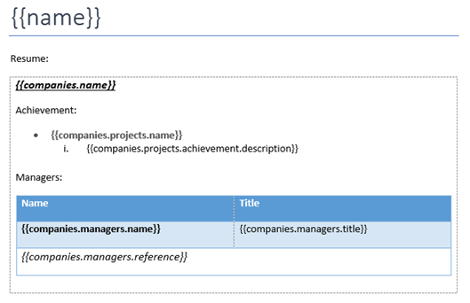
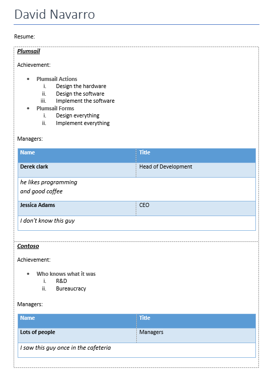

Loops and nesting in DOCX templates
===================================

You can learn how to create simple `bullet lists <./lists.html>`_ and `tables <./tables.html>`_ in other sections of this documentation. Here we will learn how to implement more complex scenarios with nesting. 

The templating engine allows you to create following repeating objects:

- Tables
- Bullet lists
- Chapters

You can create nested constructions by putting one repeating object inside another. 

First of all, review the `loops and nesting demo <./demos.html#loops-and-nesting>`_. 

We will take simplified version of source object from this demo. It is complex object with a few nested objects and collections:

.. code::

    [
        {
            "name": "David Navarro",
            "companies": [
                {
                    "name": "Plumsail",
                    "projects": [
                        {
                            "name": "Plumsail Actions",
                            "achievement": [
                                {
                                    "description": "Design the hardware"
                                }
                            ]
                        }
                    ],
                    "managers": [
                        {
                            "name": "Derek clark",
                            "title": "Head of Development",
                            "reference": "he likes programming \nand good coffee"
                        }
                    ]
                }
            ]
        }
    ]

Here we have collection of employees. Each employee has collection of companies where they worked. For each company they have colleciton of project. Each project has collection of achievements.

Now let us take a look at the source template for this structure:

You can refer a property inside collection in your template. You can even refer a property inside collection nested in another collection.

Examples:

- The :code:`{{name}}` tag lets the engine know that we want to render list of employee names.
- The :code:`{{companies.name}}` tag lets the engine know that we want to render list of company names.
- The :code:`{{companies.projects.name}}` tag lets engine know that we want to render bullet list of project names under the list of companies.

Actually all tags in the template above refer properties inside collecitons. The templating engine understands it and iterates through all objects in those nested collecitons to render them. It is smart enought to understand what content needs to be duplicated.

When the engine finds a tag that refers to collection, it tries to find nearest object that can be duplicated. For example:

- Table cell
- Bullet list item
- Chapter

If nothing found, it thinks that whole document needs to bee duplicated.

You can see the result of rendering below. There are all possible types of repeating objects nested one inside another:

.. note:: If you need to repeat some content that is not table, bullet list or chapter, just create a single table cell and put content that you want to repeat inside. This approach is used in the example above to to repeat companies with tag :code:`{{companies.name}}`.