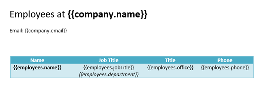
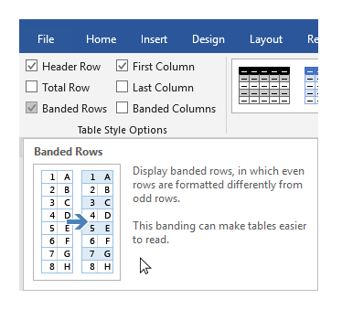
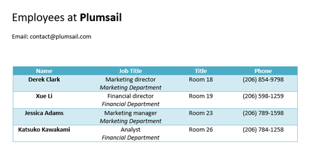
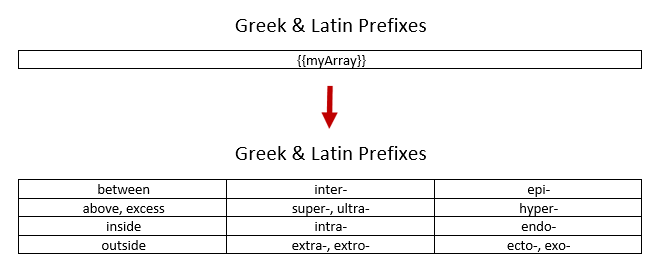
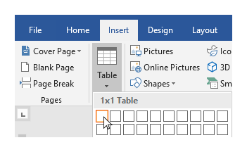
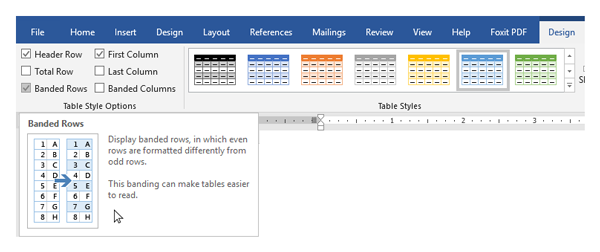
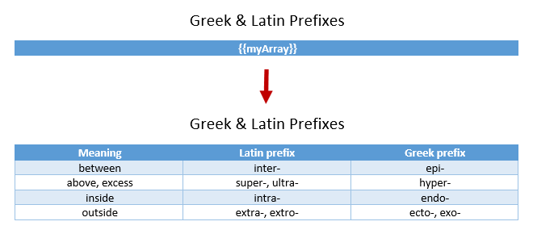
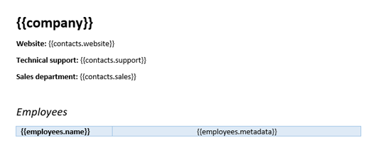
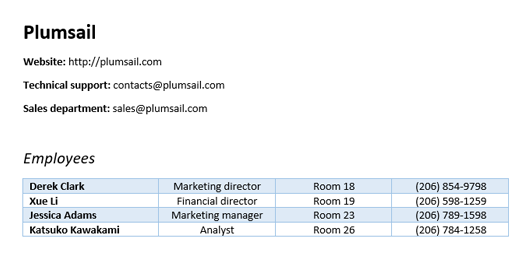
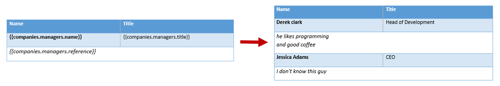

Tables in DOCX templates
========================

.. contents:: Content
    :local:
    :depth: 1

With help of **Plumsail Word DOCX templates** action you can create rich tables based on templates with minimal amount of syntax. In the templates, you can refer properties inside simple objects and collections, as well as properties in nested constructions. Let us check a few examples.

Regular table
-------------

In this section, we will see how to create a table based on an array of objects.

Let us take an object containing information about a company and a collection of employees working there. Each employee has a list of properties. We want to display the name of the company and its contact email at the top of the page and create a table with information about the employees.

You can check `demo <./demos.html#regular-tables>`_ of the example described below in another sections of this documentation.

JSON representation of the object:

.. code:: json

    {
        "company": {
            "name": "Plumsail",
            "email": "contact@plumsail.com"
        },
        "employees": [
            {
                "name": "Derek Clark",
                "jobTitle": "Marketing director",
                "department": "Marketing Department",
                "office": "Room 18",
                "phone": "(206) 854-9798",
            },
            {
                "name": "Xue Li",
                "jobTitle": "Financial director",
                "department": "Financial Department",
                "office": "Room 19",
                "phone": "(206) 598-1259",
            },
            {
                "name": "Jessica Adams",
                "jobTitle": "Marketing manager",
                "department": "Marketing Department",
                "office": "Room 23",
                "phone": "(206) 789-1598",
            },
            {
                "name": "Katsuko Kawakami",
                "jobTitle": "Analyst",
                "department": "Financial Department",
                "office": "Room 26",
                "phone": "(206) 784-1258"
            }
        ]
    }

Now, let us take a look at the source template for this structure:

In our template, we can refer properties inside simple objects and collections, as well as properties in nested constructions. To select properties of our objects inside of the array we just use a dot operator:

- The :code:`{{company.name}}` tag lets the engine know that we want to render the company name property.
- The :code:`{{company.email}}` tag lets the engine know that we want to render the company email property.
- The :code:`{{employees.name}}` tag lets the engine know that we want to render the list of employees names.
- The :code:`{{employees.jobTitle}}`, :code:`{{employees.department}}`, :code:`{{employees.office}}`, :code:`{{employees.phone}}` tags lets the engine know that we want to render other employees properties.

We designed a table with a header and just one row that contains our tags. The templating engine is smart enough to understand what content needs to be duplicated. It will iterate through all objects in the array to render them and add the rows automatically.

You can choose a design for the table and check the *Banded Rows* checkbox to make the rows banded:

You can see the result of rendering below. The templating engine automatically created rows with information about the employees:

Dynamic table from array
-------------------------

You can create tables from arrays by just adding a single tag into the template document. The templating engine is smart enough to understand what content needs to be duplicated.

You can check `demo <./demos.html#dynamic-tables>`_ of the example described below in another sections of this documentation.

Let us take an object containing an array with a few nested arrays. JSON representation of the object:

.. code:: json

    {
        "myArray": [
            [
                "between",
                "inter-",
                "epi-"
            ],
            [
                "above, excess",
                "super-, ultra-",
                "hyper-"
            ],
            [
                "inside",
                "intra-",
                "endo-"
            ],
            [
                "outside",
                "extra-, extro-",
                "ecto-, exo-"
            ]
        ]
    }

In the template document, create a table and put :code:`{{myArray}}` tag inside of it. The templating engine will understand what content needs to be duplicated and will automatically create a table.

The template on the top will result in the document at the bottom:

You may want to turn the first nested array into the table header and to make the rows banded. Just design a table with the corresponding style. The templating engine will automatically render the object according to the chosen design.

We have also added an additional nested array for the header to the JSON object:

.. code:: json

    {
        "myArray": [
            [
                "Meaning",
                "Latin prefix",
                "Greek prefix"
            ],
            ...
    }

The template on the top will result in the document at the bottom:

Table columns from array
---------------------

You can create table columns from arrays by just adding a single tag into the template document. The templating engine is smart enough to understand what content needs to be duplicated.

You can check `demo <./demos.html#dynamic-table-columns>`_ of the example described below in another sections of this documentation.

Let us take an object containing information about a company and a list of employees working there. Each employee object contains a name and an array with detailed information about the employee.

We want to display the name of the company and contacts at the top of the page and create a table with information about the employees.

JSON representation of the object:

.. code:: json

    {
        "company": "Plumsail",
        "contacts": {
            "website": "http://plumsail.com",
            "support": "contacts@plumsail.com",
            "sales": "sales@plumsail.com"
        },
        "employees": [
            {
                "name": "Derek Clark",
                "metadata": [
                    [
                        "Marketing director",
                        "Room 18",
                        "(206) 854-9798"
                    ]
                ]
            },
            {
                "name": "Xue Li",
                "metadata": [
                    [
                        "Financial director",
                        "Room 19",
                        "(206) 598-1259"
                    ]
                ]
            },
            {
                "name": "Jessica Adams",
                "metadata": [
                    [
                        "Marketing manager",
                        "Room 23",
                        "(206) 789-1598"
                    ]
                ]
            },
            {
                "name": "Katsuko Kawakami",
                "metadata": [
                    [
                        "Analyst",
                        "Room 26",
                        "(206) 784-1258"
                    ]
                ]
            }
        ]
    }

Now, let us take a look at the source template for this structure:

To refer properties inside objects or collections we just use a dot operator:

- The :code:`{{contacts.website}}`, :code:`{{employees.support}}`, :code:`{{employees.sales}}` tags let the engine know that we want to render properties of the contacts object.
- The :code:`{{employees.name}}` tag lets the engine know that we want to render the list of employees names.
- The :code:`{{employees.metadata}}` tag lets the engine know that we want to render the employees metadata.

To render the array of employees we designed a very simple two cells table. The templating engine is smart enough to understand what content needs to be duplicated. It will iterate through all objects in the array to render them and add the rows and columns automatically.

You can see the result of rendering below. The templating engine automatically created columns with information about the employees:

Repeat multiple table rows
--------------------------

You may notice that in the example above we not just duplicate table rows. Single object from collection of managers occupies two table rows:

Yes, the engine is smart enough to understand that you placed properties of the same object into two sibling table cells. Thus, it knows that we need to repeat two rows instead of one.

Automatic tables and columns resizing
-------------------------------------

Arrays in source objects can be used to achieve adding new columns and rows to tables. The templating engine processes data and split and populate tables accordingly.

Let us check an example. Once the document is processed, :code:`{{myArray}}` tag will be replaced with corresponding data, as shown in the picture:

Please, see more detailed description in `Dynamic table from array <tables.html#dynamic-table-from-array>`_ and `Table columns from array <tables.html#table-columns-from-array>`_ sections.