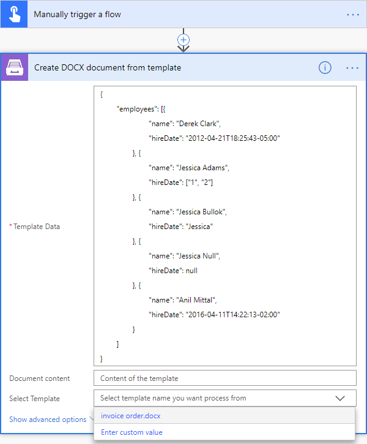
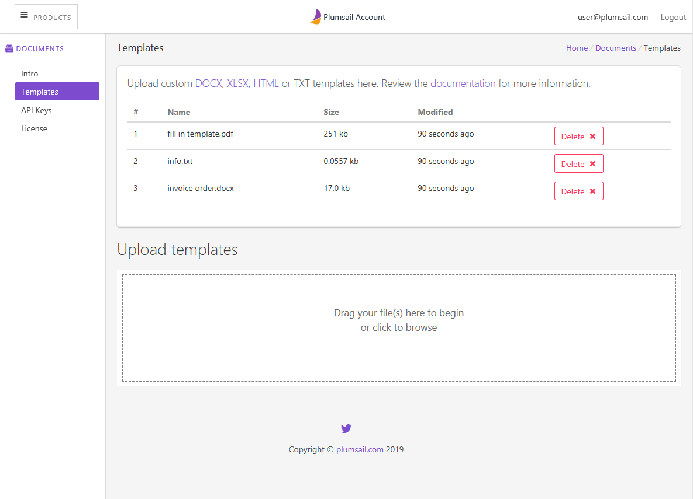

User Templates
==============

User Templates is the feature to reuse predefined documents like
`DOCX <https://plumsail.com/docs/documents/v1.x/document-generation/docx/index.html>`_, `XLSX <https://plumsail.com/docs/documents/v1.x/document-generation/xlsx/index.html>`_, `HTML <https://plumsail.com/docs/documents/v1.x/document-generation/html/index.html>`_ or TXT as a source for generation of a new document.
You can use the document as a source for generation actions like before by specifying Document content parameter or select a predefined document from the list as on the image below:

You can manage (add, update, delete and download existing) the list of available templates from user cabinet in the `Document product section <https://account.plumsail.com/documents/templates>`_.

User templates are available for use in the following actions:

- `Create DOCX document from template <../flow/actions/document-processing.html#create-docx-document-from-template>`_
- `Create HTML from template <../flow/actions/document-processing.html#create-html-from-template>`_
- `Create XLSX document from template <../flow/actions/document-processing.html#create-xlsx-document-from-template>`_
- `Fill in PDF Form  <../flow/actions/document-processing.html#fill-in-pdf-form>`_
- `Fill merge fields in DOCX document  <../flow/actions/document-processing.html#fill-merge-fields-in-docx-document>`_