Charts in XLSX templates
========================

With help of **Create XLSX document from template** action, you can create different type of charts based on differently structured data. Let us check a few examples.

.. contents:: Content
    :local:
    :depth: 1

.. _pie-charts:

Pie charts
----------

In this section, we will see how to render an array of objects into a table and build a chart based on this table.

Let us take an object containing a list of coffee production countries and annual production of each country. We want to display a simple table with countries coffee production in 2017 and build a pie chart with  percentage value for each country.

This is how our result document will look like:

You can download the source document and the result document for this example in `pie and clustered columns charts demo <./demos.html#tables>`_. Description of the example is below.

JSON representation of the object:

.. code:: json

    [
        {
            "title": "Countries by coffee production",
            "description": "Production in thousand kilogram bags",
            "prod": [
                {
                    "country": "Brazil",
                    "value2015": 37600,
                    "value2016": 43200,
                    "value2017": 51500
                },
                {
                    "country": "Vietnam",
                    "value2015": 22000,
                    "value2016": 27500,
                    "value2017": 28500
                },
                {
                    "country": "Colombia",
                    "value2015": 11300,
                    "value2016": 13500,
                    "value2017": 14000
                },
                {
                    "country": "Indonesia",
                    "value2015": 14000,
                    "value2016": 11000,
                    "value2017": 10800
                },
                {
                    "country": "Honduras",
                    "value2015": 7500,
                    "value2016": 5800,
                    "value2017": 8349
                },
                {
                    "country": "Other countries",
                    "value2015": 37358
                    "value2016": 44229,
                    "value2017": 51000,
                }
            ]
        }
    ]

Now, let us take a look at the source template:

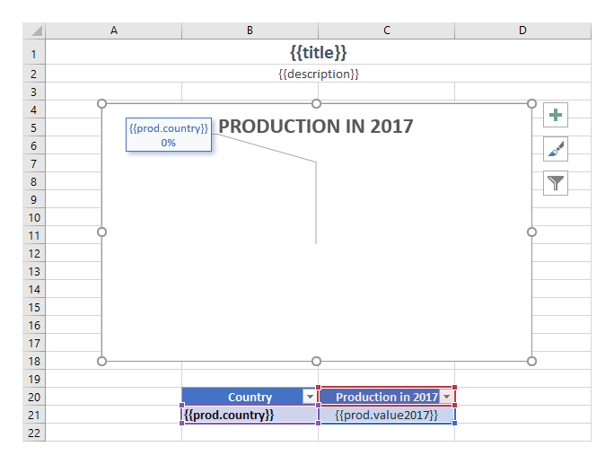

As we want to display production from 2017 only, we create a simple table and use :code:`{{prod.country}}` and :code:`{{prod.value2017}}` tags to refer needed properties inside our objects. To learn how to build a chart based on multiple columns of data please review the next `clustered columns <./charts.html#clustered-columns-charts>`_ section.

We also add :code:`{{title}}` and :code:`{{description}}` tags to the top of the page to let the engine know that we want to render corresponding properties.

To crate a chart we select our table, navigate to the **Insert** tab in the top ribbon and choose a 3-D pie chart:

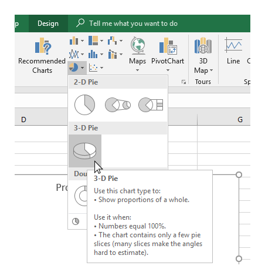

Basically, the template is ready. We just want to change the design a bit and add percentage values to the data labels. We apply one of the default styles:

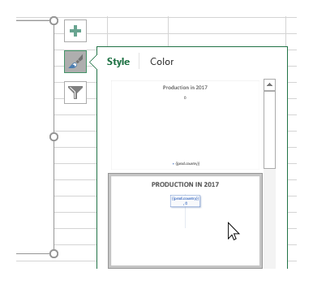

Then, we open **Data Label** settings, check the *Percentage* checkbox and uncheck the *Value* one:

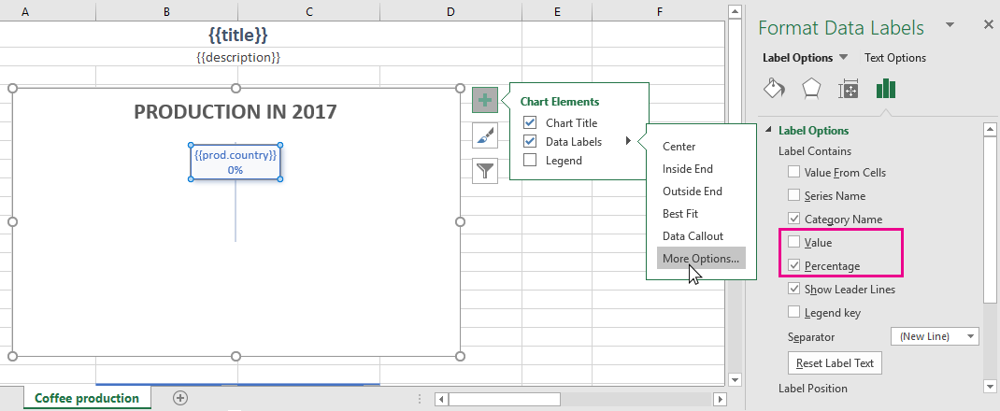

Let us have a look at the result of rendering another time. The templating engine automatically created rows with production data and built a chart based on it:

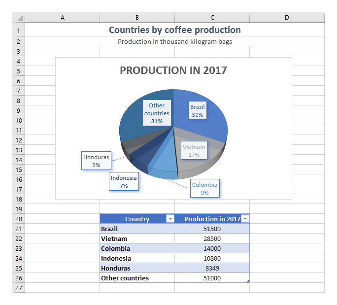

.. _clustered-columns-charts:

Clustered columns charts
------------------------

In this section, using the data from the same JSON object as we used in the previous `pie charts example <./charts.html#pie-charts>`_ we will create a table with countries coffee production by years and build a clustered columns chart.

This is how our result document will look like:

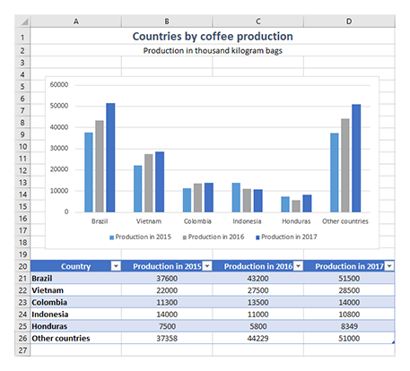

You can download the source document and the result document for this example in `pie and clustered columns charts demo <./demos.html#tables>`_. Description of the example is below.

JSON representation of the object:

.. code:: json

    [
        {
            "title": "Countries by coffee production",
            "description": "Production in thousand kilogram bags",
            "prod": [
                {
                    "country": "Brazil",
                    "value2015": 37600,
                    "value2016": 43200,
                    "value2017": 51500
                },
                {
                    "country": "Vietnam",
                    "value2015": 22000,
                    "value2016": 27500,
                    "value2017": 28500
                },
                {
                    "country": "Colombia",
                    "value2015": 11300,
                    "value2016": 13500,
                    "value2017": 14000
                },
                {
                    "country": "Indonesia",
                    "value2015": 14000,
                    "value2016": 11000,
                    "value2017": 10800
                },
                {
                    "country": "Honduras",
                    "value2015": 7500,
                    "value2016": 5800,
                    "value2017": 8349
                },
                {
                    "country": "Other countries",
                    "value2015": 37358
                    "value2016": 44229,
                    "value2017": 51000,
                }
            ]
        }
    ]

Now, let us take a look at the source template:

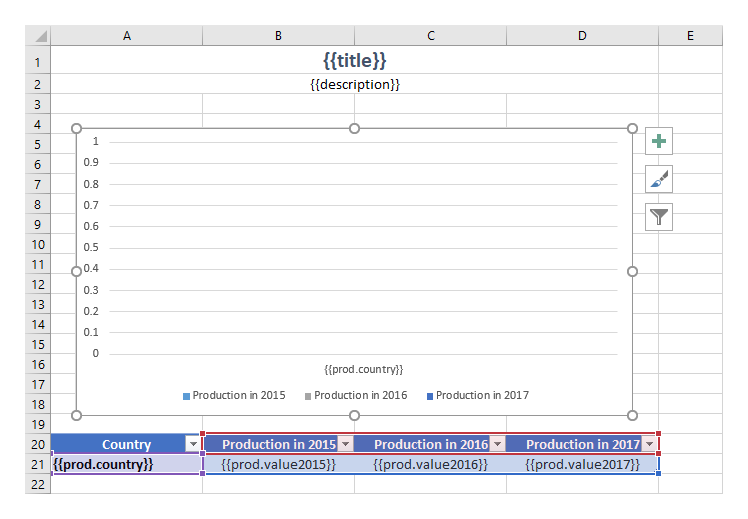

To display production by years, we create a table and add :code:`{{prod.country}}` and :code:`{{prod.value2015}}`, :code:`{{prod.value2016}}`, :code:`{{prod.value2017}}` tags to refer the properties inside our objects.

We also add :code:`{{title}}` and :code:`{{description}}` tags to the top of the page to let the engine know that we want to render corresponding properties.

To crate a chart we select our table, navigate to the **Insert** tab in the top ribbon and choose a clustered columns chart:

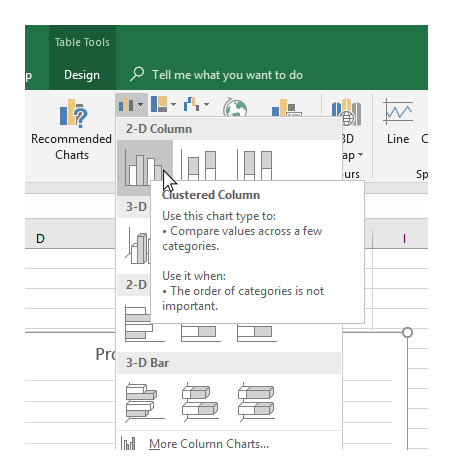

Now, we need to edit the data that will be visible in our chart. We select the chart, click the *Filer* icon and click *Select data* link. Here we need to add entries for production in 2015 and 2016. We may use *Production in 2017* entry as a reference:

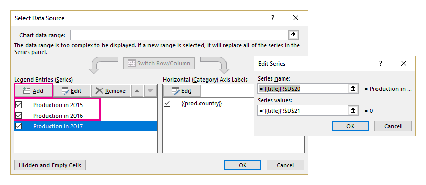

Then, we edit the horizontal axis labels to display there the text from the first column only:

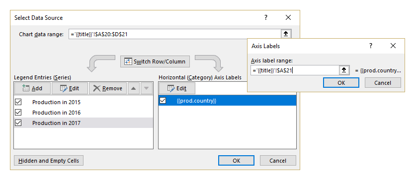

In general, the template is ready. We just want to change the colors and add a legend under the chart:

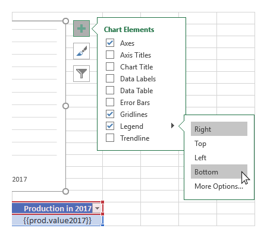

Let us have a look the result of rendering another time. The templating engine automatically created rows with production data and built a chart based on it:

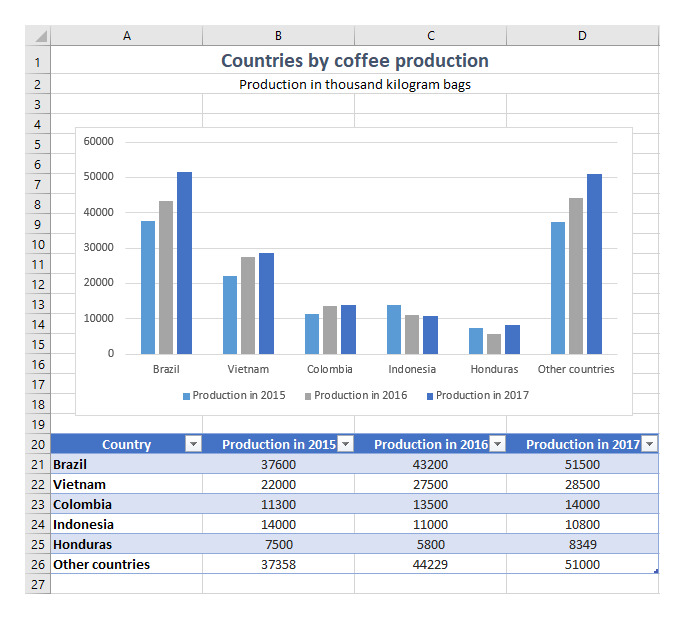

.. _charts-on-multiple-worksheets:

Charts on multiple worksheets
-----------------------------

In the examples above, we created a single chart from a single array. In this section, we will see how to create charts on multiple worksheets in one file.

You can download the source document and the result document for the example described below in `charts on multiple worksheets demo <./demos.html#charts-on-multiple-worksheets>`_.

Let us take an object containing information about a few countries production of coffee, cocoa and another product. Nested objects contain information about yearly production of a certain commodity by country and some general data. We want to display information about each product in a line chart on a separate worksheet.

The result document will look like this:

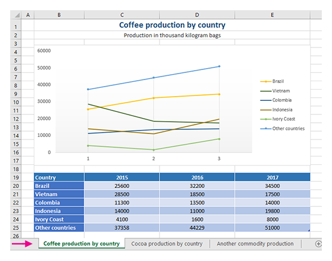

JSON representation of the object:

.. code:: json

    [
        {
            "title": "Coffee production by country",
            "description": "Production in thousand kilogram bags",
            "prod": [
                {
                    "Brazil": {
                        "value1": 25600,
                        "value2": 32200,
                        "value3": 34500
                    },
                    "Vietnam": {
                        "value1": 28500,
                        "value2": 18500,
                        "value3": 17500
                    },
                    "Colombia": {
                        "value1": 11300,
                        "value2": 13500,
                        "value3": 14000
                    },
                    "Indonesia": {
                        "value1": 14000,
                        "value2": 11000,
                        "value3": 19800
                    },
                    "IvoryCoast": {
                        "value1": 4100,
                        "value2": 1600,
                        "value3": 8000
                    },
                    "OtherCountries": {
                        "value1": 37358,
                        "value2": 44229,
                        "value3": 51000
                    }
                }
            ]
        },
        {
            "title": "Cocoa production by country",
            "description": "Production in 1000 tonnes",
            "prod": [
                {
                    "Brazil": {
                        "value1": 256,
                        "value2": 140,
                        "value3": 180
                    },
                    "Vietnam": {
                        "value1": 34,
                        "value2": 12,
                        "value3": 6
                    },
                    "Colombia": {
                        "value1": 0,
                        "value2": 0,
                        "value3": 0
                    },
                    "Indonesia": {
                        "value1": 777,
                        "value2": 600,
                        "value3": 500
                    },
                    "IvoryCoast": {
                        "value1": 1345,
                        "value2": 1200,
                        "value3": 1448
                    },
                    "OtherCountries": {
                        "value1": 1834,
                        "value2": 1789,
                        "value3": 1085
                    }
                }
            ]
        },
        {
            "title": "Another commodity production",
            "description": "Production in some units",
            "prod": [
                {
                    "Brazil": {
                        "value1": 106,
                        "value2": 158,
                        "value3": 80
                    },
                    "Vietnam": {
                        "value1": 34,
                        "value2": 56,
                        "value3": 10
                    },
                    "Colombia": {
                        "value1": 33,
                        "value2": 48,
                        "value3": 65
                    },
                    "Indonesia": {
                        "value1": 98,
                        "value2": 105,
                        "value3": 80
                    },
                    "IvoryCoast": {
                        "value1": 23,
                        "value2": 30,
                        "value3": 41
                    },
                    "OtherCountries": {
                        "value1": 151,
                        "value2": 184,
                        "value3": 216
                    }
                }
            ]
        }
    ]

Now, let us take a look at the source template:

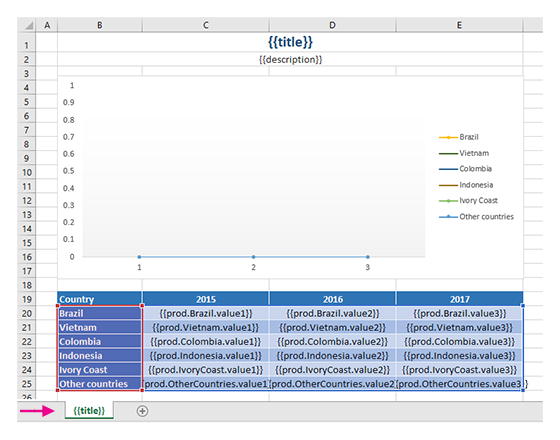

Just type the :code:`{{title}}` tag into the tab name field. The templating engine is smart enough to understand that it needs to render a separate sheet for each table of data and a chart based on it. The same :code:`{{title}}` tag is also used at the top of the sheet. There it just displays regular bold Excel cell with larger font size.

We created a table containing information about yearly production of a product by country.

In our template, we can refer properties inside simple objects and collections, as well as properties in nested constructions. To select properties of our objects inside of the array we just used a dot operator. The :code:`{{prod.Brazil.value1}}`, :code:`{{prod.Colombia.value2}}`, :code:`{{prod.Indonesia.value3}}` tags let the engine know that we want to render countries properties.

The templater engine will automatically create a separate table for each product and display each table on a separate sheet.

Now, we select our template table, navigate to the **Insert** tab in the top ribbon and choose a line chart:

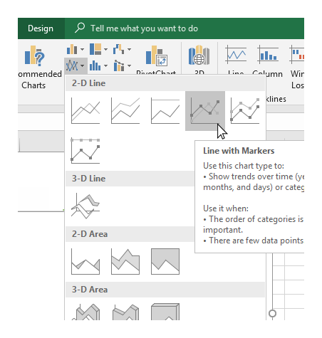

We need to edit the data that will be visible in our chart. To do that we select the chart, click the *Filer* icon and click *Select data* link:

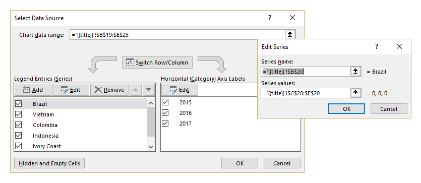

Basically, the template is ready. We just change the colors and add a legend to the right side the chart.

Let us have a look at the result document another time. The templating engine automatically created tables and charts on separate worksheets:

