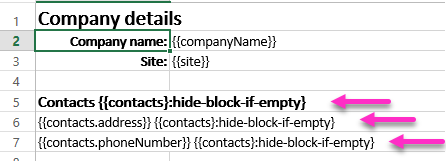
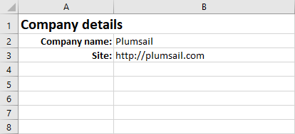
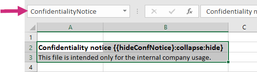
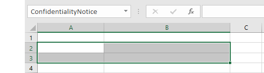

Conditionally clear cells in XLSX templates
===========================================

You can use `hide-block-if-empty formatter <../common-docx-xlsx/formatters.html#hide-block-if-empty>`_ to clear cells of an Excel document. 

First of all, review the `conditionally clear cells demo <./demos.html#clear-cells>`_. There is a template for the case that we describe here.

The formatter checks if a value for current tag is empty or :code:`true`, then clears the content of cells.

.. contents:: Two cases when you can use it:
    :local:
    :depth: 1

.. _clear-single-cell:

Clear content of a single cell
------------------------------

Les us assume that we have data about some company, but contacts data may be missing. JSON representation of the object:

.. code:: JSON

  {
    "companyName": "Plumsail",
    "site": "http://plumsail.com",
    "contacts": null    
  }

We want to clear content of all cells with information about contacts if the :code:`contacts` property is null. To do it we need to put a tag with `hide-block-if-empty formatter <../common-docx-xlsx/formatters.html#hide-block-if-empty>`_ to each cell that we want to clear. In our case we will apply formatter to :code:`contacts` property like this:

As you can see, there are tags with :code:`hide-block-if-empty` formatter inside each that we want to clear. You may notice that we also use :code:`hide` formatter with :code:`hide-block-if-empty` formatter together. It hides the value current tag.

The generated document will look like this:

Clear content of a named range
------------------------------

.. include:: named-ranges.rst

Let us assume that sometimes we need to display confidentiality notice inside our document. Thus, sometimes we need to display it, sometimes we want to clear cells that contain it.

In our case confidentiality notice occupies two cells. We can assign a named range to them and put :code:`hide-block-if-empty` formatter only inside one of them. The templating engine will see that there is a named range and clear all cells inside it.

.. note:: This approach works only if there is a single tag inside your named range. If there are multiple tags, the templating engine will switch to logic with `hiding content of a single cell <#clear-single-cell>`_

We can manipulate visibility of confidentiality notice by a single boolean property in our JSON object:

.. code:: JSON

  {    
    "hideConfNotice": true
  }

That is how our template with named range looks:

The result will clear content of all cells inside the named range:

