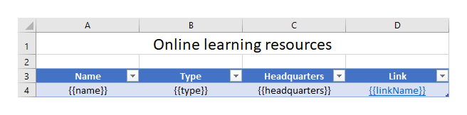
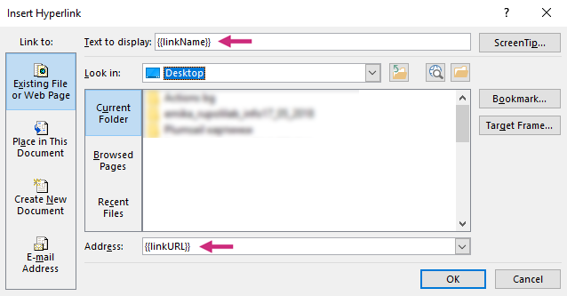
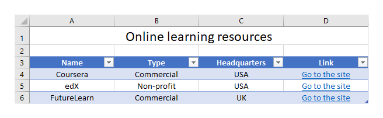

Links
=====

The templating engine allows you to add dynamic hyperlinks to a location on the web.

You can download the source document and the result document for the example described below in `links demo <./demos.html#links>`_.

Let us assume we have a list of online learning resources.

JSON representation of the object:

.. code:: json

    [
        {
            "name": "Coursera",
            "type": "Commercial",
            "headquarters": "USA",
            "linkName": "Go to the site",
            "linkURL": "https://plato.stanford.edu/"
        },
        {
            "name": "edX",
            "type": "Non-profit",
            "headquarters": "USA",
            "linkName": "Go to the site",
            "linkURL": "https://www.edx.org/"
        },
        {
            "name": "FutureLearn",
            "type": "Commercial",
            "headquarters": "UK",
            "linkName": "Go to the site",
            "linkURL": "https://www.futurelearn.com/"
        }
    ]

Now, let us take a look at the source template for this structure:

We designed a table with a header and just one row that contains our tags. The templating engine is smart enough to understand what content needs to be duplicated.

To refer properties of the objects we just used the names of the properties:

:code:`{{name}}`, :code:`{{type}}`, :code:`{{headquarters}}`, :code:`{{linkName}}`, :code:`{{linkURL}}`.

To create a hyperlink to a location on the web we select a tab where we want to display our hyperlink, in the **Insert** tab in MS Word, click **Link**, navigate to the **Existing File or Web Page** tab and add a tag into the **Text to display** and **Address** fields:

You can see the result of rendering below. The templating engine created web hyperlinks in the document:

