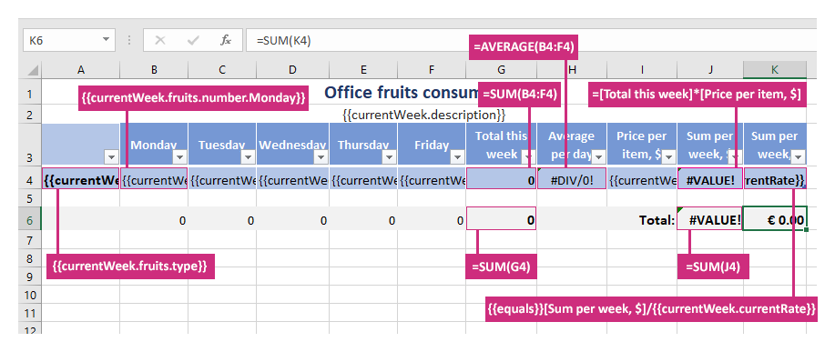
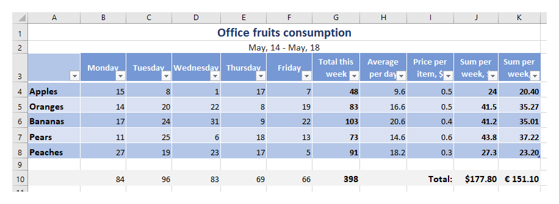

Formulas in XLSX templates
===========================

You can use formulas in your templates to automate the work with Excel documents. When you make a formula, you can use different elements to supply the source data to the formula and indicate what operators should be performed on those data.

Let us have a look at an example. You can download the source template and the result document for this example in `formulas demo <./demos.html#formulas>`_.

We have an object containing information about fruits consumption in an office during a week. We want to show how many fruits of each type were eaten by day, check some averages, and calculate how much money was spent on the fruits in dollars and a local currency. Scroll down to see the source data for the template in JSON format.

This is how our source template looks like:

Here is the basic syntax:

- :code:`=SUM(B4:F4)`, :code:`=AVERAGE(B4:F4)` - to sum a fixed number of values or find an average we use cell ranges in the usual way.
- :code:`=SUM(G4)` - to sum values or find an average in dynamic cells, we just select a cell that is going to be multiplied. The templating engine is smart enough to understand what content needs to be calculated.
- :code:`=[Total this week]*[Price per item, $]` - use names of the columns in the square braces to manipulate values in dynamic table cells.
- :code:`{{equals}}[Sum per week, $]/{{currentWeek.currentRate}}` - we use :code:`{{equals}}` tag instead of **=** symbol as in our formula we have another tag: :code:`{{currentWeek.currentRate}}`.

.. important::

 Please,note it is required to use :code:`{{equals}}` tag in place of the **=** symbol in formulas containing other tags. Otherwise, the formula will not pass Excel data validation.

In our template, we also use tags as :code:`{{currentWeek.fruits.type}}` and :code:`{{currentWeek.fruits.number.Friday}}` ones. The templating engine is smart enough to understand what content needs to be duplicated. It will iterate through all objects in the array to render them and add the rows automatically.

This is our result document:

JSON representation of the object:

.. code:: json

    {
        "currentWeek": [
            {
                "description": "May, 14 - May, 18",
                "currentRate": "1.1767",
                "fruits": [
                    {
                        "type": "Apples",
                        "number": {
                            "Monday": 15,
                            "Tuesday": 8,
                            "Wednesday": 1,
                            "Thursday": 17,
                            "Friday": 7
                        },
                        "price": 0.5
                    },
                    {
                        "type": "Oranges",
                        "number": {
                            "Monday": 14,
                            "Tuesday": 20,
                            "Wednesday": 22,
                            "Thursday": 8,
                            "Friday": 19
                        },
                        "price": 0.5
                    },
                    {
                        "type": "Bananas",
                        "number": {
                            "Monday": 17,
                            "Tuesday": 24,
                            "Wednesday": 31,
                            "Thursday": 9,
                            "Friday": 22
                        },
                        "price": 0.4
                    },
                    {
                        "type": "Pears",
                        "number": {
                            "Monday": 11,
                            "Tuesday": 25,
                            "Wednesday": 6,
                            "Thursday": 18,
                            "Friday": 13
                        },
                        "price": 0.6
                    },
                    {
                        "type": "Peaches",
                        "number": {
                            "Monday": 27,
                            "Tuesday": 19,
                            "Wednesday": 23,
                            "Thursday": 17,
                            "Friday": 5
                        },
                        "price": 0.3
                    }
                ]
            }
        ]
    }