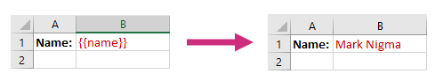
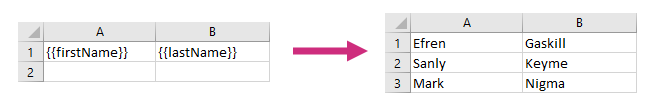
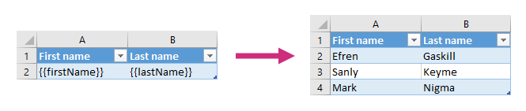

How Excel XLSX templates work
=============================

Let us assume we have some simple data object that we want to apply to our template.

JSON representation of the object:

.. code:: json

    {
        "name": "Mark Nigma"
    }

And we want to include the name in the generated document. We need to surround the property with braces. The template is on the left side, the result is on the right side:

.. _repeating-rows-and-tables:

Repeating rows and tables
-------------------------

You can easily display collections of items in Excel document. You don't need to declare any loops, the templating engine is smart enough to understand the structure of source object applied to your document. Thus, if you refer property of object inside a collection, it understands that we need to iterate it.

Let us assume we have information about customer names. JSON representation of the object:

.. code:: json

    [
        {        
            "firstName": "Efren",
            "lastName": "Gaskill"
        }, {        
            "firstName": "Sanly",
            "lastName": "Keyme"            
        }, {        
            "firstName": "Mark",
            "lastName": "Nigma"            
        }        
    ]

The template on the left side will result in the document on the right side:

The same approach as above works for tables:

Review `Tables <./tables.html>`_ for more complex scenarios.

Advanced scenarios
------------------

Now, when you know how to create basic templates, it is time to review more advanced scenarios:
                              
- `Tables <tables.html>`_
- `Loops and nesting <loops-and-nesting.html>`_
- `Conditionally hide blocks <conditionally-hide-blocks.html>`_
- `Value formatters <../common-docx-xlsx/formatters.html>`_