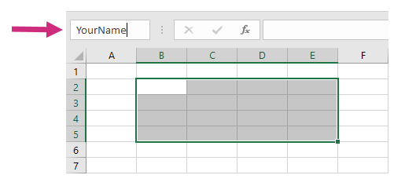
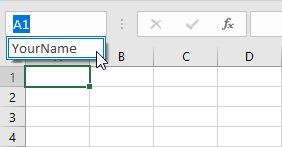

Loops and nesting in XLSX templates
===================================

You can learn how to create `tables <./tables.html>`_ and `repeating rows <./how-it-works.html#repeating-rows-and-tables>`_ in other sections of this documentation. Here we will learn how to implement more complex scenarios with nesting. 

The templating engine allows you to create following repeating objects in Excel:

- Regular rows
- Table rows
- Named ranges
- Sheets

You can create nested constructions by putting one named range inside another or by putting a table inside a named range.

Thus, you can create nested structures like this:

- Sheets
    - Regular rows
    - Tables
    - Named range 1
        - Regular rows
        - Tables
        - Named range N
            - Regular cells
            - Tables

Named ranges
------------

Excel allows you select cells and assign some name to them. You can learn about names in `the Excel documentation <https://support.office.com/en-us/article/define-and-use-names-in-formulas-4d0f13ac-53b7-422e-afd2-abd7ff379c64>`_.

The templating engine uses named ranges extensively. Here is how you can create one:

Then it will appear in the dropdown like this:

