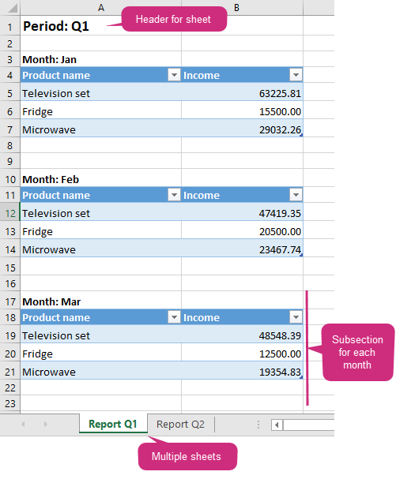
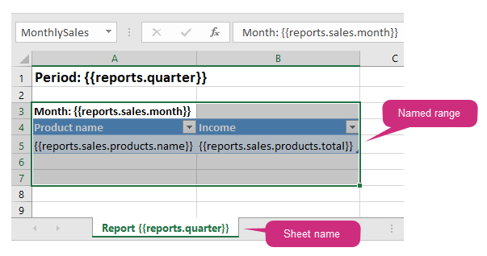

Loops and nesting in XLSX templates
===================================

You can learn how to create `tables <./tables.html>`_ and `repeating rows <./how-it-works.html#repeating-rows-and-tables>`_ in other sections of this documentation. Here we will learn how to implement more complex scenarios with nesting. 

The templating engine allows you to create following repeating objects in Excel:

- Regular rows
- Table rows
- Named ranges
- Sheets

Named ranges
------------

Excel allows you select cells and assign some name to them. You can learn about names in `the Excel documentation <https://support.office.com/en-us/article/define-and-use-names-in-formulas-4d0f13ac-53b7-422e-afd2-abd7ff379c64>`_.

The templating engine uses named ranges extensively. Here is how you can create one:

.. image:: ../../_static/img/document-generation/named-range-creation.png
   :alt: Named range creation

Then it will appear in the dropdown like this:

.. image:: ../../_static/img/document-generation/named-range-selection.png
   :alt: Named range selection

You can create nested constructions by putting one named range inside another or by putting a table inside a named range.

Loops and nesting example
--------------------------

First of all, review the `loops and nesting demo <./demos.html#loops-and-nesting>`_. There is a template for the case that we describe here.

Let us create a document with following nested structure:

- Sheets
    - Regular rows
    - Named ranges
        - Regular rows
        - Tables

Let us assume we have data for quarterly sales report. We will display report for each quarter on a separate sheet. The result document will look like this:

As you can see, there are multiple sheets. Each sheet has header with period name. Then sales table with month name displayed for each month.

Before we started researching our template, review `the source data in JSON format <./demos.html#loops-and-nesting-data>`_. 

Here is general structure of the data from demo. Most of content is omited by ":code:`...`" symbols:

.. code:: json

    {
        "reports":[
            {
                "quarter": "Q1",
                "sales": [
                    {
                        "month": "Jan",
                        "products": [
                            {
                                "name": "Television set", 
                                "total": 63225.81
                            },
                            ...
                        ]
                    },
                    ...
                ]
            },
            {
                "quarter": "Q2",
                "sales": [
                    {
                        "month": "Apr",
                        "products": [
                            {
                                "name": "Television set", 
                                "total": 54193.55
                            },
                            ...
                        ]
                    },
                    ...
                ]
            }
        ]
    }

Here is the template that renders reports:

You can refer a property inside collection in your template. You can even refer a property inside collection nested in another collection. The templating engine understands that it needs to render all items of a collection. It is smart enough to understand what content needs to be duplicated.

Examples:

- The :code:`{{reports.quarter}}` tag lets the engine know that we want to render a separate sheet for each quarter when it is used as a sheet name. The same tag is also used at the top of the sheet. There it just displays regular bold Excel cell with larger font size.
- The :code:`{{reports.sales.month}}` tag displays name for each month and lets the engine know that we want to render a list of months.
- The :code:`{{reports.sales.products.name}}` tag is used inside a table and lets engine know that we want to render a list of product sales inside each month.

We also used a named range around the month title and the table with product sales. It lets the engine know that we want to repeat this particular set of cells for each month.

Named ranges is a handy way to define a set of cells that should be repeated. You can create as many named ranges as you need and they can be nested.