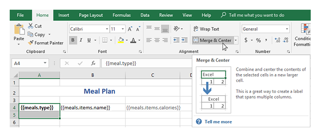
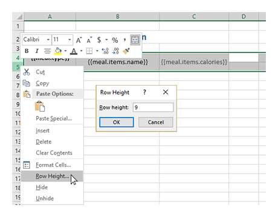
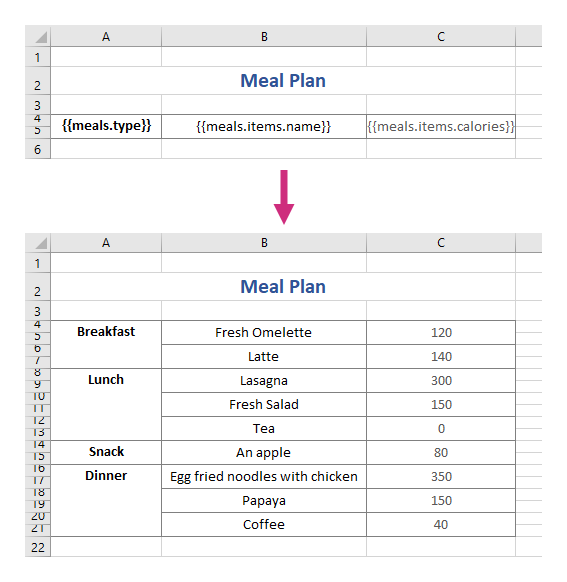

Merge cells vertically in XLSX templates
========================================

Templater allows you to merges cells vertically if you put a top level tag and a tag for a nested collection in one row.

Just select a cell with the top level tag and a cell under it to apply the **Merge** property to them. Do the same thing for the cells with collection tags:

You might want to adjust the row height:

The template on the top will result in the document at the bottom:

JSON representation of the object:

.. code:: json

    {
        "meals": [
            {
                "type": "Breakfast",
                "items": [
                    {
                        "name": "Fresh Omelette",
                        "calories": 120
                    },
                    {
                        "name": "Latte",
                        "calories": 140
                    }
                ]
            },
            {
                "type": "Lunch",
                "items": [
                    {
                        "name": "Lasagna",
                        "calories": 300
                    },
                    {
                        "name": "Fresh Salad",
                        "calories": 150
                    },
                    {
                        "name": "Tea",
                        "calories": 0
                    }
                ]
            },
            {
                "type": "Snack",
                "items": [
                    {
                        "name": "An apple",
                        "calories": 80
                    }
                ]
            },
            {
                "type": "Dinner",
                "items": [
                    {
                        "name": "Egg fried noodles with chicken",
                        "calories": 350
                    },
                    {
                        "name": "Papaya",
                        "calories": 150
                    },
                    {
                        "name": "Coffee",
                        "calories": 40
                    }
                ]
            }
        ]
    }