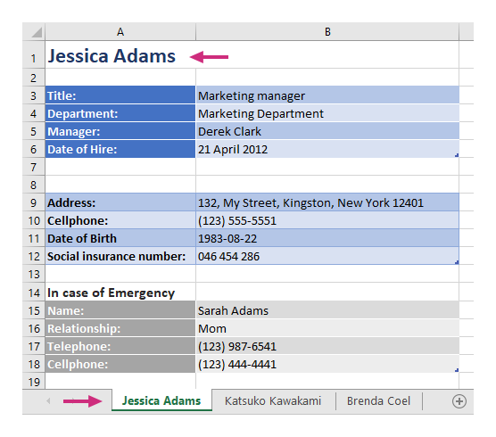

Multiple worksheets
===================

.. contents:: Content
    :local:
    :depth: 1

.. _multiple-worksheets:

With help of **Create XLSX document from template** action, you can create multiple worksheets in one file.

You can download the source document and the result document for the example described below in `multiple worksheets demo <./demos.html#multiple-worksheets>`_.

Let us take an object containing information about employees working in a company. Each employee has a list of properties. We want to display information about each employee in a separate worksheet. The result document will look like this:

Each worksheet has a name and a title with an employee's name.

JSON representation of the object:

.. code:: json

    [
        {
            "name": "Jessica Adams",
            "jobInfo": {
                "title": "Marketing manager",
                "department": "Marketing Department",
                "manager": "Derek Clark",
                "telephone": "(206) 789-1598",
                "dateOfHire": "2012-04-21T00:00:00"
            },
            "personalInfo": {
                "address": "132, My Street, Kingston, New York 12401",
                "cell": "(123) 555-5551",
                "dateOfBirth": "1983-08-22",
                "SIN": "046 454 286"
            },
            "inCaseOfEmergency": {
                "name": "Sarah Adams",
                "relationship": "Mom",
                "telephone": "(123) 987-6541",
                "cell": "(123) 444-4441"
            }
        },
        {
            "name": "Katsuko Kawakami",
            "jobInfo": {
                "title": "Analyst",
                "department": "Financial Department",
                "manager": "Xue Li",
                "telephone": "(206) 784-1258",
                "dateOfHire": "2016-03-06T00:00:00"
            },
            "personalInfo": {
                "address": "257, My Street, East Village, New York 12401",
                "cell": "(123) 555-5552",
                "dateOfBirth": "1979-09-19",
                "SIN": "073 454 287"
            },
            "inCaseOfEmergency": {
                "name": "Jane Smith",
                "relationship": "Friend",
                "telephone": "(123) 987-6542",
                "cell": "(123) 333-3332"
            }
        },
        {
            "name": "Brenda Coel",
            "jobInfo": {
                "title": "Marketing director",
                "department": "Marketing Department",
                "manager": "Derek Clark",
                "telephone": "(206) 854-9798",
                "dateOfHire": "2011-11-05T00:00:00"
            },
            "personalInfo": {
                "address": "87, My Street, Lower East Side, New York 12401",
                "cell": "(123) 555-5553",
                "dateOfBirth": "1975-12-01",
                "SIN": "051 454 288"
            },
            "inCaseOfEmergency": {
                "name": "John Smith",
                "relationship": "Husband",
                "telephone": "(123) 987-6543",
                "cell": "(123) 222-2223"
            }
        }
    ]

Now, let us take a look at the source template for this structure:

.. image:: ../../_static/img/document-generation/multiple-worksheets-template.png
    :alt: Multiple worksheets template

You can refer a property inside collection in your template. You can even refer a property inside collection nested in another collection. The templating engine understands that it needs to render all items of a collection. It is smart enough to understand what content needs to be duplicated.

Examples:

- The :code:`{{name}}` tag lets the engine know that we want to render the employees name property. It will result in the worksheet name and a title in the top of the page.
- The :code:`{{jobInfo.title}}` tag lets the engine know that we want to render the job title property of *jobInfo* object.
- The :code:`{{jobInfo.dateOfHire}:format(d MMMM yyyy)}` tag lets the engine know that we want to render the Date of Hire property and change its format. For more information about value formatting please have a look at the `value formatters  <../common-docx-xlsx/formatters.html>`_ section of the documentation.
- The :code:`{{personalInfo.address}}`, :code:`{{inCaseOfEmergency.name}}` lets the engine know that we want to render an employee address and emergency contact name properties of *personalInfo* and *inCaseOfEmergency* objects.