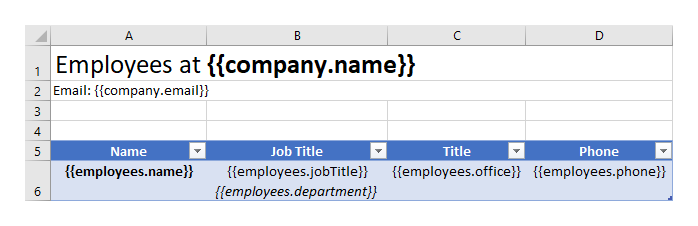
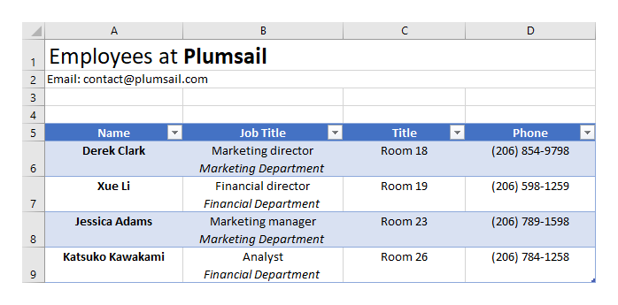
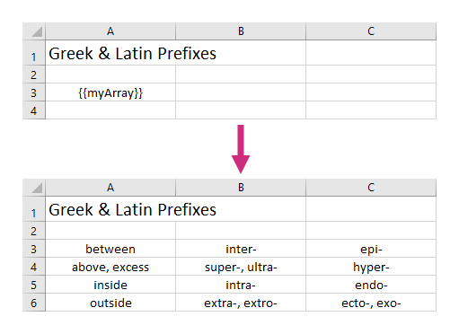
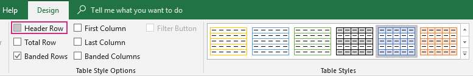
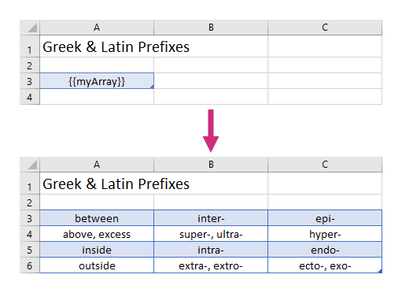
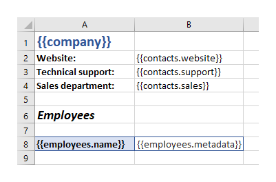
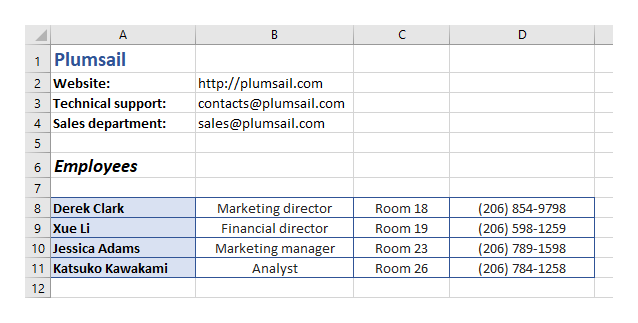
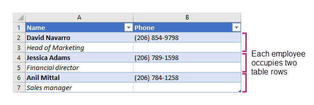

Tables in XLSX templates
========================

.. contents:: Content
    :local:
    :depth: 1

With help of the templating engine, you can create rich tables based on templates with a minimal amount of syntax. In the templates, you can refer properties inside simple objects and collections, as well as properties in nested constructions. Let us check a few examples.

.. _tables:

Regular table
-------------

In this section, we will see how to create a table based on an array of objects.

Let us take an object containing information about a company and a collection of employees working there. Each employee has a list of properties. We want to display the name of the company and its contact email at the top of the page and create a table with information about the employees.

You can download the source document and the result document for this example in `the regular table demo <./demos.html#tables>`_. Description of the example is below.

JSON representation of the object:

.. code:: json

    {
        "company": {
            "name": "Plumsail",
            "email": "contact@plumsail.com"
        },
        "employees": [
            {
                "name": "Derek Clark",
                "jobTitle": "Marketing director",
                "department": "Marketing Department",
                "office": "Room 18",
                "phone": "(206) 854-9798"
            },
            {
                "name": "Xue Li",
                "jobTitle": "Financial director",
                "department": "Financial Department",
                "office": "Room 19",
                "phone": "(206) 598-1259"
            },
            {
                "name": "Jessica Adams",
                "jobTitle": "Marketing manager",
                "department": "Marketing Department",
                "office": "Room 23",
                "phone": "(206) 789-1598"
            },
            {
                "name": "Katsuko Kawakami",
                "jobTitle": "Analyst",
                "department": "Financial Department",
                "office": "Room 26",
                "phone": "(206) 784-1258"
            }
        ]
    }

Now, let us take a look at the source template for this structure:

In our template, we can refer properties inside simple objects and collections, as well as properties in nested constructions. To select properties of our objects inside of the array we just use a dot operator:

- The :code:`{{company.name}}` tag lets the engine know that we want to render the company name property.
- The :code:`{{company.email}}` tag lets the engine know that we want to render the company email property.
- The :code:`{{employees.name}}` tag lets the engine know that we want to render the list of employees names.
- The :code:`{{employees.jobTitle}}`, :code:`{{employees.department}}`, :code:`{{employees.office}}`, :code:`{{employees.phone}}` tags let the engine know that we want to render other employees properties.

We designed a table with a header and just one row that contains our tags. The templating engine is smart enough to understand what content needs to be duplicated. It will iterate through all objects in the array to render them and add the rows automatically.

You can see the result of rendering below. The templating engine automatically created rows with information about the employees:

.. _dynamic-table:

Dynamic table
-------------

Dynamic table from an array
~~~~~~~~~~~~~~~~~~~~~~~~~~~

You can create dynamic tables from two-dimensional arrays by just adding a single tag into the template document. The templating engine is smart enough to understand what content needs to be duplicated.

Use a two-dimensional array as a source object. If the engine encounters a two-dimensional array it is able to render the whole table automatically.

Download the source document and the result document for this example in `the dynamic table demo <./demos.html#dynamic-table>`_. Description of the example is below.

Example of the object in JSON format:

.. code:: json

    {
        "myArray": [
            [
                "between",
                "inter-",
                "epi-"
            ],
            [
                "above, excess",
                "super-, ultra-",
                "hyper-"
            ],
            [
                "inside",
                "intra-",
                "endo-"
            ],
            [
                "outside",
                "extra-, extro-",
                "ecto-, exo-"
            ]
        ]
    }

In the template document, create a table and put :code:`{{myArray}}` tag inside of it. The templating engine will understand what content needs to be duplicated. It will automatically create a table.

The template on the top will result in the document at the bottom:

You may want to make the rows banded. Just design a table with the corresponding style. The templating engine will automatically render the object according to the chosen design. Please, note that the rendering will not work if you put the array in a header of a table.

.. image:: ../../_static/img/document-generation/design-xlsx-table.png
    :alt: Design a table

To remove the header row please uncheck the "Header row" checkbox in the table design settings:

The template on the top will result in the document at the bottom:

.. _dynamic-table-columns:

Dynamic table from a number of arrays
~~~~~~~~~~~~~~~~~~~~~~~~~~~~~~~~~~~~~

Your source object can be structured a bit different. Let us have a look at an example where we have several objects with nested arrays.

Download the source document and the result document for this example in the `dynamic table from a number of arrays <./demos.html#dynamic-table-columns>`_ demo. Description of the example is below.

Our source object contains information about a company and a list of employees working there. Each employee object contains a name property and an array with detailed information about the employee.

JSON representation of the object:

.. code:: json

    {
        "company": "Plumsail",
        "contacts": {
            "website": "http://plumsail.com",
            "support": "contacts@plumsail.com",
            "sales": "sales@plumsail.com"
        },
        "employees": [
            {
                "name": "Derek Clark",
                "metadata": [
                    [
                        "Marketing director",
                        "Room 18",
                        "(206) 854-9798"
                    ]
                ]
            },
            {
                "name": "Xue Li",
                "metadata": [
                    [
                        "Financial director",
                        "Room 19",
                        "(206) 598-1259"
                    ]
                ]
            },
            {
                "name": "Jessica Adams",
                "metadata": [
                    [
                        "Marketing manager",
                        "Room 23",
                        "(206) 789-1598"
                    ]
                ]
            },
            {
                "name": "Katsuko Kawakami",
                "metadata": [
                    [
                        "Analyst",
                        "Room 26",
                        "(206) 784-1258"
                    ]
                ]
            }
        ]
    }

We use two-dimensional arrays in the source object. If the engine encounters a two-dimensional array it is able to render it automatically.

We want to display the name of the company and the contacts at the top of the page and create a table with information about the employees. Let us take a look at the template for this structure:

We add :code:`{{employees.name}}` and :code:`{{employees.metadata}}` tags into the same row. Please, note, we do not convert the cells into a "real" table, just style them. We need to do it this way so that our template could be rendered properly. :code:`{{employees.metadata}}` tag will let the engine know that we want to render the employees metadata by adding dynamic columns next to the employees name column.

The :code:`{{contacts.website}}`, :code:`{{employees.support}}`, :code:`{{employees.sales}}` tags let the engine know that we want to render properties of the contacts object.

You can see the result of rendering below. The templating engine automatically created rows with information about the employees:

.. _repeat-multiple-table-rows:

Repeat multiple table rows
--------------------------

You already learned how to create different kinds of tables. In the examples above we always repeated a single table row for a single object from a source object. But you can actually occupy multiple table rows by a single object and repeat those rows for each object of your source array.

Download the source document and the result document for this example in `the repeat multiple table rows demo <./demos.html#repeat-multiple-table-rows>`_. Description of the example is below.

Let us assume we have a list of employees:

.. code:: json

    [
        {
            "name": "David Navarro",
            "phone": "(206) 854-9798",
            "title": "Head of Marketing"
        },
        {
            "name": "Jessica Adams",
            "phone": "(206) 789-1598",
            "title": "Financial director"
        },
        {
            "name": "Anil Mittal",
            "phone": "(206) 784-1258",
            "title": "Sales manager"
        }
    ]

We want to put a name and a phone in the first table row and a job title in the second row. Then we want to repeat both lines for each employee.

This is how our source template will look in this case:

.. image:: ../../_static/img/document-generation/repeat-multiple-table-rows-template-xlsx.png
    :alt: Repeat multiple table rows template

And this is the result document:

The templating engine understands that we used tags for properties of the same object in both table rows. Thus, it knows that it needs to repeat both rows.
