Microsoft Flow actions
======================

This connector helps you to automatically generate and convert documents with the help of Microsoft Flow. Before starting, ensure that you `added Plumsail Documents connector to Microsoft Flow <../../getting-started/use-from-flow.html>`_.

.. contents:: List of actions in this connector
   :local:
   :depth: 1

Create DOCX document from template
----------------------------------

Created Word DOCX document from template. Review `Word DOCX templates <../../document-generation/docx/index.html>`_ section for more information about template syntax.

We have `an article <../how-tos/documents/create-docx-from-template.html>`_ describing how to work with this action in case of managing documents.

.. rubric:: Output Parameters

.. list-table::
    :header-rows: 1
    :widths: 10 30 20

    *  -  Parameter
       -  Description
       -  Example
    *  -  File Content
       -  The content of the result .docx file.
       -  It is the content of the result file.

.. rubric:: Input Parameters

.. list-table::
    :header-rows: 1
    :widths: 10 30 20

    *  -  Parameter
       -  Description
       -  Example
    *  -  Document content
       -  The raw content of the source .docx template file. You can extract file content from other connectors like:

          - SharePoint
          - Salesforce
          - Box
          - OneDrive
          - Google Drive
          - Dropbox
          - SFTP
          - File System

          `List of Microsoft Flow connectors <https://flow.microsoft.com/en-us/connectors/>`_

       -  Review `Word DOCX templates <../../document-generation/docx/index.html>`_ section for more information about template syntax.          

          Example of simple table template:

          .. image:: ../../_static/img/flow/documents/simple-table-template.png
             :alt: Simple table template         

    *  -  Template name
       -  You can use predefined user templates. `See more <../../document-generation/templates/index.html>`_
       -  .. code::
          invoice.docx

    *  -  Template data
       -  Data to bind to the template in JSON format. You can get this data from some other Microsoft Flow connector. For example you can query SharePoint list or some other system.
       -  .. code-block:: json

            [
                {        
                    "firstName": "Efren",
                    "lastName": "Gaskill",
                    "email": "egaskill0@opensource.org",                        
                    "payments": [
                        {
                            "date": "3/10/2018",
                            "amount": "$8.91"
                        },
                        {
                            "date": "1/7/2018",
                            "amount": "$0.56"
                        }
                    ]
                }
            ]
    *  -  Locale
       -  An optional parameter that allow to specify the desired regional culture format. You can pick the value from predefined list. If you don`t specify value, default value will be "en-US" (english, USA). All allowable regional culture formats you can find `here <../../document-generation/common-docx-xlsx/allowableCultures.html>`_ 
       -

.. rubric:: Example

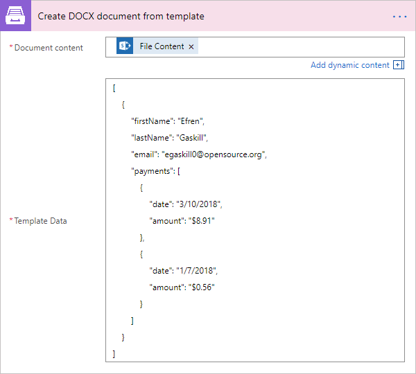

Create XLSX document from template
----------------------------------

Created Word XLSX document from template. Review `Excel XLSX templates <../../document-generation/xlsx/index.html>`_ section for more information about template syntax.

Also there is `an article <../how-tos/documents/create-xlsx-from-template.html>`_ describing how to work with this action in case of managing documents.

.. rubric:: Output Parameters

.. list-table::
    :header-rows: 1
    :widths: 10 30 20

    *  -  Parameter
       -  Description
       -  Example
    *  -  File Content
       -  The content of the result .xlsx file.
       -  It is the content of the result file.

.. rubric:: Input Parameters

.. list-table::
    :header-rows: 1
    :widths: 10 30 20

    *  -  Parameter
       -  Description
       -  Example
    *  -  Document content
       -  The raw content of the source .xlsx template file. You can extract file content from other connectors like:

          - SharePoint
          - Salesforce
          - Box
          - OneDrive
          - Google Drive
          - Dropbox
          - SFTP
          - File System

          `List of Microsoft Flow connectors <https://flow.microsoft.com/en-us/connectors/>`_

       -  Review `Word XLSX templates <../../document-generation/xlsx/index.html>`_ section for more information about template syntax.          

          Example of simple table template:

          .. image:: ../../_static/img/flow/documents/simple-xlsx-table-template.png
             :alt: Simple table template         

    *  -  Template name
       -  You can use predefined user templates. `See more <../../document-generation/templates/index.html>`_
       -  .. code::
          invoice.xlsx

    *  -  Template data
       -  Data to bind to the template in JSON format. You can get this data from some other Microsoft Flow connector. For example you can query SharePoint list or some other system.
       -  .. code-block:: json

            [
                {        
                    "firstName": "Efren",
                    "lastName": "Gaskill",
                    "email": "egaskill0@opensource.org",                        
                    "payments": [
                        {
                            "date": "3/10/2018",
                            "amount": "$8.91"
                        },
                        {
                            "date": "1/7/2018",
                            "amount": "$0.56"
                        }
                    ]
                }
            ]
    *  -  Locale
       -  An optional parameter that allow to specify the desired regional culture format. You can pick the value from predefined list. If you don`t specify value, default value will be "en-US" (english, USA). All allowable regional culture formats you can find `here <../../document-generation/common-docx-xlsx/allowableCultures.html>`_ 
       -
          

.. rubric:: Example

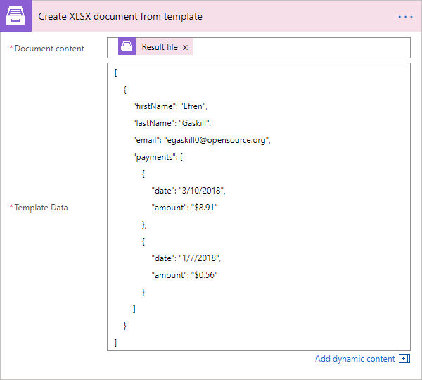

Create HTML from template
-------------------------

Generates raw HTML from a raw HTML template with the help of Microsoft Flow. You can find more examples in `this article <../how-tos/documents/create-html-from-template.html>`_.

.. rubric:: Output Parameters

.. list-table::
    :header-rows: 1
    :widths: 10 30 20

    *  -  Parameter
       -  Description
       -  Example
    *  -  Result HTML
       -  Raw HTML result created from a source HTML template.
       -  .. code-block:: html

            <!doctype html>
            <html>
            <head>
                <meta charset="utf-8">
                <title>HTML from template</title>  
            </head>
            <body>
                <ul>                            
                    <li>David Navarro </li>                    
                    <li>Jessica Adams</li>                    
                    <li>Derek Clark</li>                    
                </ul>    
            </body>
            </html>                    

.. rubric:: Input Parameters

.. list-table::
    :header-rows: 1
    :widths: 10 30 20

    *  -  Parameter
       -  Description
       -  Example
    *  -  Source HTML
       -  HTML content of a source template. You can specify raw HTML here or extract file content from other connectors like:

          - SharePoint
          - Salesforce
          - Box
          - OneDrive
          - Google Drive
          - Dropbox
          - SFTP
          - File System          

          `List of Microsoft Flow connectors <https://flow.microsoft.com/en-us/connectors/>`_          

       -  You can find description of template syntax in `this article <../../document-generation/html/index.html>`_. 
       
          .. code-block:: html

            <!doctype html>
            <html>
            <head>
                <meta charset="utf-8">
                <title>HTML from template</title>  
            </head>
            <body>
                <ul>        
                    {{#each data}}
                    <li>{{name}}</li>
                    {{/each}}
                </ul>    
            </body>
            </html>

    *  -  Template name
       -  You can use predefined user templates. `See more <../../document-generation/templates/index.html>`_
       -  .. code::
          invoice.html

    *  -  Template data
       -  Data to bind to the template in JSON format. You can get this data from some other Microsoft Flow connector. For example you can query SharePoint list or some other system.
       -  .. code-block:: json

            {
                "data": [
                    {
                        "name": "David Navarro "
                    },
                    {
                        "name": "Jessica Adams"
                    },
                    {
                        "name": "Derek Clark"
                    }
                ]
            }  
    *  -  Locale
       -  An optional parameter that allow to specify the desired regional culture format. You can pick the value from predefined list. If you don`t specify value, default value will be "en-US" (english, USA). All allowable regional culture formats you can find `here <../../document-generation/common-docx-xlsx/allowableCultures.html>`_ 
       -

.. rubric:: Example

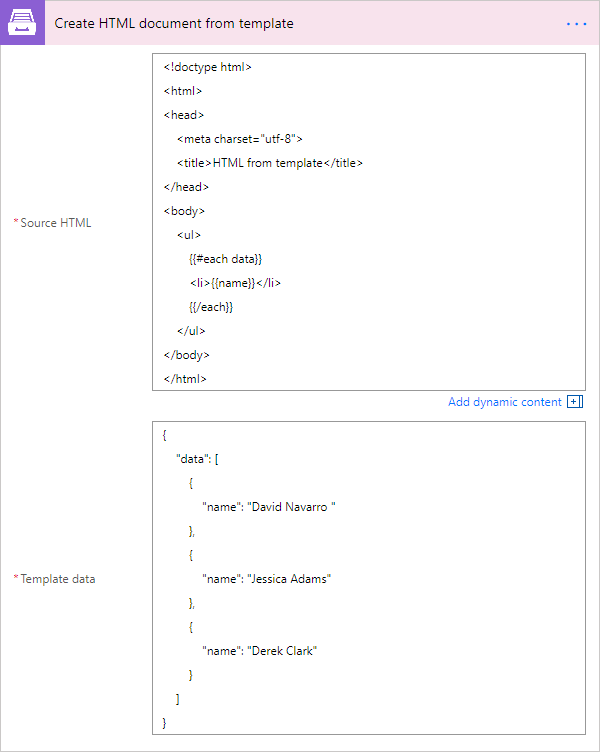

Fill Merge Fields in DOCX document
----------------------------------

Creates .docx document by filling merge fields in a .docx document with the help of Microsoft Flow. You can find more examples in `this article <../how-tos/documents/fill-docx-merge-fields.html>`_.

.. rubric:: Output Parameters

.. list-table::
    :header-rows: 1
    :widths: 10 30 20

    *  -  Parameter
       -  Description
       -  Example
    *  -  File Content
       -  The content of the result .docx file.
       -  It is a Base64 encoded content of the result file.

.. rubric:: Input Parameters

.. list-table::
    :header-rows: 1
    :widths: 10 30 20

    *  -  Parameter
       -  Description
       -  Example
    *  -  DOCX document content
       -  The raw content of the source .docx file with merge fields. You can extract file content from other connectors like:

          - SharePoint
          - Salesforce
          - Box
          - OneDrive
          - Google Drive
          - Dropbox
          - SFTP
          - File System

          `List of Microsoft Flow connectors <https://flow.microsoft.com/en-us/connectors/>`_

       -  You can find insturctions about creation of a document with merge fields in `this article <../../document-generation/docx/create-docx-with-merge-fields.html>`_. 
       
          Use `this link <../../_static/files/flow/how-tos/Hiring%20Contract%20Template%20(merge%20fields).docx>`_ to download the sample document.

    *  -  Template name
       -  You can use predefined user templates. `See more <../../document-generation/templates/index.html>`_
       -  .. code::
          invoice.docx

    *  -  Template data
       -  Data in JSON format that will be used to fill merge fields in the source document. You can get this data from some other Microsoft Flow connector. For example you can query SharePoint list or some other system.
       -  .. code-block:: json

            {
                "EmployerFullName": "David Navarro",
                "EmployeeFullName": "Anil Mittal",
                "CompanyName": "Contoso LLC",
                "Position": "Marketing manager",
                "SalaryAmount": 5000,
                "ListOfBenefits": "list of any benefits that come with employment",
                "BonusesPolicyDescription": "annual evaluation",
                "EffectiveDate": "10/27/2017",
                "TerminationDate": "10/27/2018",
                "State": "New York"
            }    

.. rubric:: Example

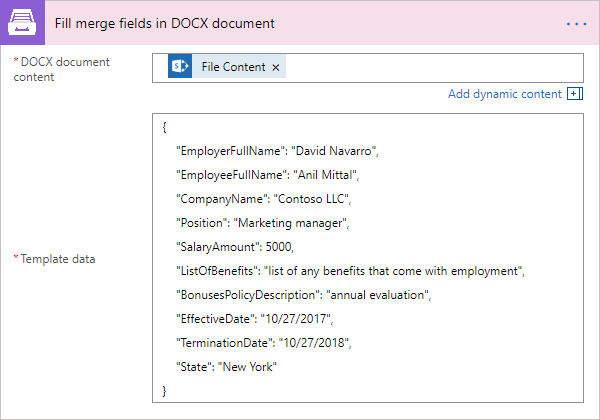

Convert DOCX to PDF
-------------------

Converts .docx document to PDF document with the help of Microsoft Flow. You can find more examples in `this article <../how-tos/documents/convert-word-to-pdf.html>`_.

.. rubric:: Output Parameters

.. list-table::
    :header-rows: 1
    :widths: 10 30 20

    *  -  Parameter
       -  Description
       -  Example
    *  -  File Content
       -  The content of the result PDF file.
       -  It is a Base64 encoded content of the result file.

.. rubric:: Input Parameters

.. list-table::
    :header-rows: 1
    :widths: 10 30 20

    *  -  Parameter
       -  Description
       -  Example
    *  -  Document content
       -  The raw content of the source .docx file. You can extract file content from other connectors like:

          - SharePoint
          - Salesforce
          - Box
          - OneDrive
          - Google Drive
          - Dropbox
          - SFTP
          - File System

          `List of Microsoft Flow connectors <https://flow.microsoft.com/en-us/connectors/>`_

       -  It is content of the source template file.          

.. rubric:: Example

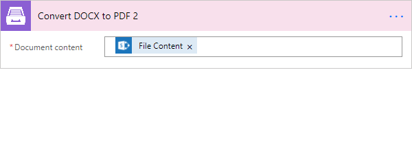

Convert XLSX to PDF
-------------------

Converts .xlsx document to PDF document with the help of Microsoft Flow. You can find more examples in `this article <../how-tos/documents/convert-excel-to-pdf.html>`_.

.. note:: At this moment the action is only available in custom connector. Please read `here <../create-custom-connector.html>`_ how to create one.

.. rubric:: Output Parameters

.. list-table::
    :header-rows: 1
    :widths: 10 30 20

    *  -  Parameter
       -  Description
       -  Example
    *  -  File Content
       -  The content of the result PDF file.
       -  It is a Base64 encoded content of the result file.

.. rubric:: Input Parameters

.. list-table::
    :header-rows: 1
    :widths: 10 30 20

    *  -  Parameter
       -  Description
       -  Example
    *  -  Document content
       -  The raw content of the source .xlsx file. You can extract file content from other connectors like:

          - SharePoint
          - Salesforce
          - Box
          - OneDrive
          - Google Drive
          - Dropbox
          - SFTP
          - File System

          `List of Microsoft Flow connectors <https://flow.microsoft.com/en-us/connectors/>`_

       -  It is content of the source template file.          

.. rubric:: Example

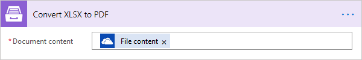

Convert DOC to DOCX
-------------------

Converts .doc document to .docx document with the help of Microsoft Flow.
.. note:: At this moment the action is only available in custom connector. Please read `here <../create-custom-connector.html>`_ how to create one.

.. rubric:: Output Parameters

.. list-table::
    :header-rows: 1
    :widths: 10 30 20

    *  -  Parameter
       -  Description
       -  Example
    *  -  File Content
       -  The content of the result DOCX file.
       -  It is a Base64 encoded content of the result file.

.. rubric:: Input Parameters

.. list-table::
    :header-rows: 1
    :widths: 10 30 20

    *  -  Parameter
       -  Description
       -  Example
    *  -  Document content
       -  The raw content of the source .doc file. You can extract file content from other connectors like:

          - SharePoint
          - Salesforce
          - Box
          - OneDrive
          - Google Drive
          - Dropbox
          - SFTP
          - File System

          `List of Microsoft Flow connectors <https://flow.microsoft.com/en-us/connectors/>`_

       -  It is content of the source template file.          

.. rubric:: Example

Convert XLS to XLSX
-------------------

Converts .xls document to .xlsx document with the help of Microsoft Flow.
.. note:: At this moment the action is only available in custom connector. Please read `here <../create-custom-connector.html>`_ how to create one.

.. rubric:: Output Parameters

.. list-table::
    :header-rows: 1
    :widths: 10 30 20

    *  -  Parameter
       -  Description
       -  Example
    *  -  File Content
       -  The content of the result XLSX file.
       -  It is a Base64 encoded content of the result file.

.. rubric:: Input Parameters

.. list-table::
    :header-rows: 1
    :widths: 10 30 20

    *  -  Parameter
       -  Description
       -  Example
    *  -  Document content
       -  The raw content of the source .xls file. You can extract file content from other connectors like:

          - SharePoint
          - Salesforce
          - Box
          - OneDrive
          - Google Drive
          - Dropbox
          - SFTP
          - File System

          `List of Microsoft Flow connectors <https://flow.microsoft.com/en-us/connectors/>`_

       -  It is content of the source template file.        

.. rubric:: Example

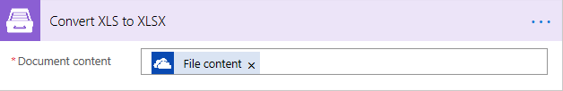

Convert PPT to PPTX
-------------------

Converts .ppt document to .pptx document with the help of Microsoft Flow.
.. note:: At this moment the action is only available in custom connector. Please read `here <../create-custom-connector.html>`_ how to create one.

.. rubric:: Output Parameters

.. list-table::
    :header-rows: 1
    :widths: 10 30 20

    *  -  Parameter
       -  Description
       -  Example
    *  -  File Content
       -  The content of the result PPTX file.
       -  It is a Base64 encoded content of the result file.

.. rubric:: Input Parameters

.. list-table::
    :header-rows: 1
    :widths: 10 30 20

    *  -  Parameter
       -  Description
       -  Example
    *  -  Document content
       -  The raw content of the source .ppt file. You can extract file content from other connectors like:

          - SharePoint
          - Salesforce
          - Box
          - OneDrive
          - Google Drive
          - Dropbox
          - SFTP
          - File System

          `List of Microsoft Flow connectors <https://flow.microsoft.com/en-us/connectors/>`_

       -  It is content of the source template file.          

.. rubric:: Example

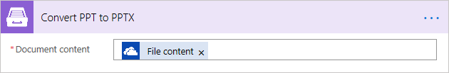

Convert PPTX to PDF
-------------------

Converts .pptx document to PDF document with the help of Microsoft Flow.

.. note:: At this moment the action is only available in custom connector. Please read `here <../create-custom-connector.html>`_ how to create one.

.. rubric:: Output Parameters

.. list-table::
    :header-rows: 1
    :widths: 10 30 20

    *  -  Parameter
       -  Description
       -  Example
    *  -  File Content
       -  The content of the result PDF file.
       -  It is a Base64 encoded content of the result file.

.. rubric:: Input Parameters

.. list-table::
    :header-rows: 1
    :widths: 10 30 20

    *  -  Parameter
       -  Description
       -  Example
    *  -  Document content
       -  The raw content of the source .pptx file. You can extract file content from other connectors like:

          - SharePoint
          - Salesforce
          - Box
          - OneDrive
          - Google Drive
          - Dropbox
          - SFTP
          - File System

          `List of Microsoft Flow connectors <https://flow.microsoft.com/en-us/connectors/>`_

       -  It is content of the source template file.          

.. rubric:: Example

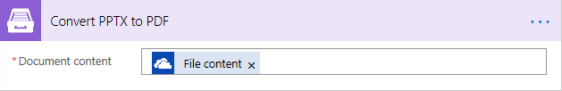

Convert HTML to PDF
-------------------

Converts HTML document to PDF document with the help of Microsoft Flow. You can find more examples in `this article <../how-tos/documents/convert-html-to-pdf.html>`_.

.. note:: At this moment options: Header HTML, Footer HTML and Margins are only available in custom connector. Please read `here <../create-custom-connector.html>`_ how to create one.

.. rubric:: Output Parameters

.. list-table::
    :header-rows: 1
    :widths: 10 30 20

    *  -  Parameter
       -  Description
       -  Example
    *  -  File Content
       -  The content of the result PDF file.
       -  It is a Base64 encoded content of the result file.

.. rubric:: Input Parameters

.. list-table::
    :header-rows: 1
    :widths: 10 30 20

    *  -  Parameter
       -  Description
       -  Example
    *  -  Source HTML
       -  HTML content of a source file. You can specify raw HTML here or extract file content from other connectors like:

          - SharePoint
          - Salesforce
          - Box
          - OneDrive
          - Google Drive
          - Dropbox
          - SFTP
          - File System          

          `List of Microsoft Flow connectors <https://flow.microsoft.com/en-us/connectors/>`_          

       -  .. code-block:: html

            <!doctype html>
            <html>

            <head>
                <meta charset="utf-8">
                <title>HTML to PDF example
                
            </head>
            <body>
                

                    Text in box1
                

                

                    Text in box2
                
    
            </body>
            </html>

    *  -  Header HTML
       -  HTML markup that should be added as a Header. 

       -  .. code-block:: html

            <!DOCTYPE html>
            <html>
              <head>
                <title></title>
              </head>
            <body>
            This is header
            </body>
            </html>

    *  -  Footer HTML
       -  HTML markup that should be added as a Footer.          

       -  .. code-block:: html

           <!DOCTYPE html>
            <html>
              <head>
                <title></title>
              </head>
            <body>
            This is footer
            </body>
            </html>

    *  -  Paper Size
       -  Paper size for output PDF file.
       -  

          - A4
          - Letter
          - LetterSmall
          - Tabloid
          - Ledger
          - Legal
          - Statement
          - Executive
          - A2
          - A3
          - A4Small
          - A5
          - B4
          - B5

    *  -  Orientation
       -  Page orientation for output PDF file.
       -  

          - Portrait
          - Landscape

    *  -  Margins
       -  The page margins that separated ' '.
       -  

          50;
                  

.. rubric:: Example

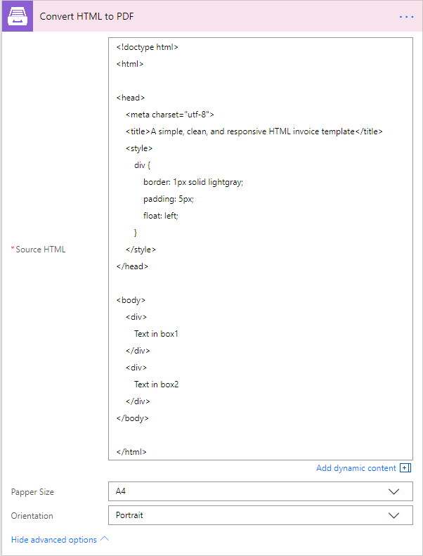

Add watermark to PDF
-------------------

"Add watermark to PDF" action support a few types of watermarks: Text, Image, PDF. You can find examples on how yo use the action `here <../how-tos/documents/add-an-image-watermark-to-a-PDF-document.html>`_.

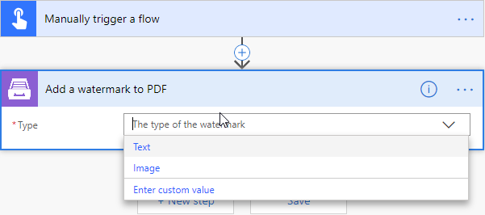

When you added this action to your Flow, you need to pick of those: text, image, pdf.

You can find the documentation for all watermark types included in "Add watermark to PDF" action below:

- :ref:`image-watermark-type`
- :ref:`text-watermark-type`
- :ref:`pdf-watermark-type`

.. _image-watermark-type:

Add image watermark to PDF
~~~~~~~~~~~~~~~~~~~~~~~~~~~~

Please, see a detailed example `here <../how-tos/documents/add-an-image-watermark-to-a-PDF-document.html>`_.

.. rubric:: Output Parameters

.. list-table::
    :header-rows: 1
    :widths: 10 30 20

    *  -  Parameter
       -  Description
       -  Example
    *  -  File Content
       -  The content of the result PDF file.
       -  It is a Base64 encoded content of the result file.

.. rubric:: Input Parameters

.. list-table::
    :header-rows: 1
    :widths: 10 30 20

    *  -  Parameter
       -  Description
       -  Example

    *  -  Document content
       -  Raw content of PDF document.
       -  You may get the content of the source PDF file by "Get file content" action from "SharePoint" connector or from some other connector.

          You may use `this link <../../_static/files/flow/how-tos/file-to-split.pdf>`_ to download a sample 10 pages PDF file.

    *  -  Image content
       -  Raw content of image source.
          Available extensions: bmp, jpeg, png.

       -  You may get the content of the source image file by "Get file content" action from "SharePoint" connector or from some other connector. 

    *  -  Watermark position
       -  You can select one of the predefined position of watermark on the page. Available preset positions on the document page:

          1. Top Left
          2. Top Middle
          3. Top Right
          4. Middle Left
          5. Center
          6. Middle Right
          7. Bottom Left
          8. Bottom Middle
          9. Bottom Right

          .. image:: ../../_static/img/flow/documents/add-a-watermark-to-pdf-content-positions.png
          
       -  MiddleRight
    
    *  -  Opacity
       -  The degree of transparency of the watermark image. This is a percentage value.
       -  50

    *  -  Start Page
       -  Index of the first page from which the watermark will be added (indexes start from 1).
       -  3

    *  -  End Page
       -  Index of the last page to adding watermark (inclusive). By default will use the last page of the source document.
       -  7 

    *  -  Pages
       -  The range of target pages delimeted by ';'. If set then "Start Page" and "End Page" will be ignored.
       -  1;3;5

    *  -  Password
       -  The password to decrypt the source document. If it was encrypted earlier.
       -  PAs$word

    *  -  PDF owner password
       -  Enter an optional owner password here. This password can be used to disable document restrictions.
       -  OwNEr_PAs$word

    *  -  Watermark image width
       -  A new width of the image that will be used for watermark. If set - source image will be resized
       -  150

    *  -  Watermark image height
       -  A new height of the image that will be used for watermark. If set - source image will be resized
       -  100
    
    *  -  Auto scale
       -  If true, the image will be scaled as close as possible to the values given in Width and Height while maintaining the original proportions.
          Otherwise, the image will be converted to the specified Height and Width without preserving the proportions.

       -  true

    *  -  X coordinate
       -  Absolute X coordinate value.
          If the predefined positions (see "Watermark position") do not suit you, then you can set the desired location of the watermark using absolute coordinates.
          The origin in the bottom left corner. See the picture

          .. image:: ../../_static/img/flow/documents/add-a-watermark-to-pdf-coordinates-start.png

          If set - "Watermark position" parameter will be ignored

       -  50

    *  -  Y coordinate
       -  Absolute Y coordinate value. If set - "Watermark position" parameter will be ignored
       -  50

  

.. rubric:: Example

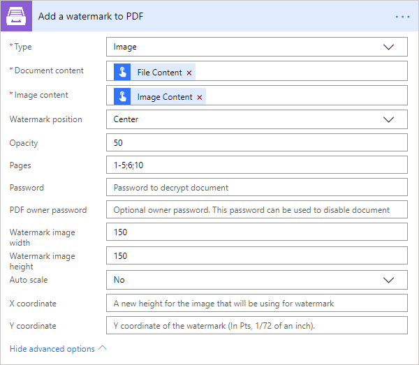

.. _text-watermark-type:

Add text watermark to PDF
~~~~~~~~~~~~~~~~~~~~~~~~~~

Please, see a detailed example `here <../how-tos/documents/add-a-text-watermark-to-a-PDF-document.html>`_.

.. rubric:: Output Parameters

.. list-table::
    :header-rows: 1
    :widths: 10 30 20

    *  -  Parameter
       -  Description
       -  Example
    *  -  File Content
       -  The content of the result PDF file.
       -  It is a Base64 encoded content of the result file.

.. rubric:: Input Parameters

.. list-table::
    :header-rows: 1
    :widths: 10 30 20

    *  -  Parameter
       -  Description
       -  Example

    *  -  Document content
       -  Raw content of PDF document.
       -  You may get the content of the source PDF file by "Get file content" action from "SharePoint" connector or from some other connector.

          You may use `this link <../../_static/files/flow/how-tos/file-to-split.pdf>`_ to download a sample 10 pages PDF file.

    *  -  Text content
       -  Text that will be used as watermark
       -  watermark test

    *  -  Angle
       -  The rotation angle of the text. The value in degrees.
       -  45

    *  -  Color
       -  Hex value of html color. You can select the desired color using this tool https://www.w3schools.com/colors/colors_picker.asp
       -  
          -  000000
          -  FFFFFF

    *  -  Watermark position
       -  You can select one of the predefined position of watermark on the page. Available preset positions on the document page:

          1. Top Left
          2. Top Middle
          3. Top Right
          4. Middle Left
          5. Center
          6. Middle Right
          7. Bottom Left
          8. Bottom Middle
          9. Bottom Right

          .. image:: ../../_static/img/flow/documents/add-a-watermark-to-pdf-content-positions.png
          
       -  MiddleRight
    
    *  -  Opacity
       -  The degree of transparency of the watermark image. This is a percentage value.
       -  50

    *  -  Start Page
       -  Index of the first page from which the watermark will be added (indexes start from 1).
       -  3

    *  -  End Page
       -  Index of the last page to adding watermark (inclusive). By default will use the last page of the source document.
       -  7 

    *  -  Pages
       -  The range of target pages delimeted by ';'. If set then "Start Page" and "End Page" will be ignored.
       -  1;3;5

    *  -  Password
       -  The password to decrypt the source document. If it was encrypted earlier.
       -  PAs$word

    *  -  PDF owner password
       -  Enter an optional owner password here. This password can be used to disable document restrictions.
       -  OwNEr_PAs$word

    *  -  X coordinate
       -  Absolute X coordinate value.
          If the predefined positions (see "Watermark position") do not suit you, then you can set the desired location of the watermark using absolute coordinates.
          The origin in the bottom left corner. See the picture

          .. image:: ../../_static/img/flow/documents/add-a-watermark-to-pdf-coordinates-start.png

          If set - "Watermark position" parameter will be ignored

       -  50

    *  -  Y coordinate
       -  Absolute Y coordinate value. If set - "Watermark position" parameter will be ignored
       -  50

.. rubric:: Example

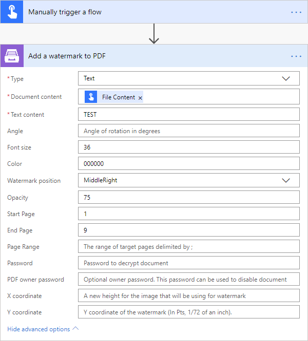

.. _pdf-watermark-type:

Add pdf watermark to PDF
~~~~~~~~~~~~~~~~~~~~~~~~~

Please, see a detailed example `here <../how-tos/documents/add-a-PDF-watermark-to-a-PDF-document.html>`_.

.. rubric:: Output Parameters

.. list-table::
    :header-rows: 1
    :widths: 10 30 20

    *  -  Parameter
       -  Description
       -  Example
    *  -  File Content
       -  The content of the result PDF file.
       -  It is a Base64 encoded content of the result file.

.. rubric:: Input Parameters

.. list-table::
    :header-rows: 1
    :widths: 10 30 20

    *  -  Parameter
       -  Description
       -  Example

    *  -  Document content
       -  Raw content of PDF document.
       -  You may get the content of the source PDF file by "Get file content" action from "SharePoint" connector or from some other connector.

          You may use `this link <../../_static/files/flow/how-tos/file-to-split.pdf>`_ to download a sample 10 pages PDF file.

    *  -  PDF watermark document
       -  Raw content of the PDF file that will be used as a watermark.
       -  You may use `this link <../../_static/files/flow/how-tos/overlay.pdf>`_ to download a sample PDF file for using as PDF watermark.

    *  -  Overlay position
       -  You can select one of the predefined layer for overlay rendering position. Available preset positions:

          - Background
          - Foreground

         
            Default value is "Background".

       -  Background

    *  -  Start Page
       -  Index of the first page from which the watermark will be added (indexes start from 1).
       -  3

    *  -  End Page
       -  Index of the last page to adding watermark (inclusive). By default will use the last page of the source document.
       -  7 

    *  -  Pages
       -  The range of target pages delimeted by ';'. If set then "Start Page" and "End Page" will be ignored.
       -  1;3;5

.. rubric:: Example

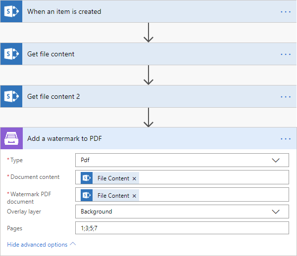

Split PDF
---------

Split PDF document with the help of Microsoft Flow. You can find more examples in `this article <https://plumsail.com/docs/actions/v1.x/flow/how-tos/documents/split-pdf-files.html>`_.

.. rubric:: Output Parameters

.. list-table::
    :header-rows: 1
    :widths: 10 30 20

    *  -  Parameter
       -  Description
       -  Example
    *  -  Result Files Contents
       -  The array of raw content of result files.
       -  It is an array of Base64 encoded files. You can iterate through them and save them somewhere.

.. rubric:: Input Parameters

.. list-table::
    :header-rows: 1
    :widths: 10 30 20

    *  -  Parameter
       -  Description
       -  Example
    *  -  PDF Document Content
       -  Raw content of PDF document.       

       -  You may get the content of the source PDF file by "Get file content" action from "SharePoint" connector or from some other connector.

          You may use `this link <../../_static/files/flow/how-tos/file-to-split.pdf>`_ to download a sample 10 pages PDF file.

    *  -  Start Page
       -  Index of the first page to start split from (indexes start from 1).
       -  3

    *  -  End Page
       -  Index of the last page to split (inclusive). By default will use the last page of the source document.
       -  7 

    *  -  Split at Page
       -  Number of pages per partition.
       -  2

    *  -  Password
       -  The password to decrypt the source document. If it was encrypted earlier.
       -  PAs$word       

.. rubric:: Example

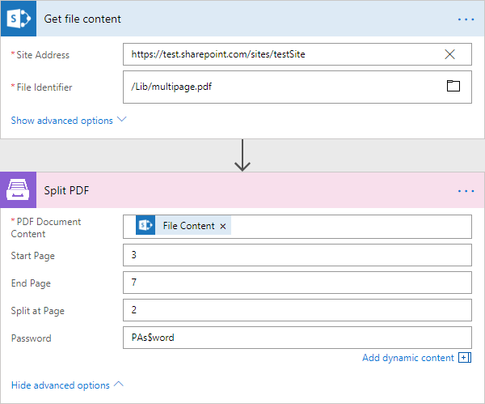

Merge PDF
---------

Merge PDF document with the help of Microsoft Flow. Please, see a detailed example `here <../how-tos/documents/merge-pdf-files.html>`_.

.. rubric:: Output Parameters

.. list-table::
    :header-rows: 1
    :widths: 10 30 20

    *  -  Parameter
       -  Description
       -  Example
    *  -  File Content
       -  Raw content of the result file.
       -  It is a Base64 encoded content of the result file.

.. rubric:: Input Parameters

.. list-table::
    :header-rows: 1
    :widths: 10 30 20

    *  -  Parameter
       -  Description
       -  Example
    *  -  PDF Documents Content
       -  The array of raw content of PDF documents.       

       -  You may get the content of the source PDF file by "Get file content" action from "SharePoint" connector or from some other connector.

.. rubric:: Example

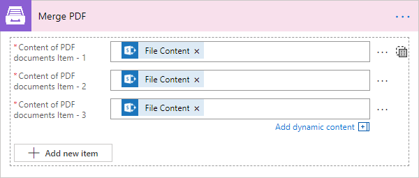

Merge DOCX
----------

Merge DOCX document with the help of Microsoft Flow.

.. rubric:: Output Parameters

.. list-table::
    :header-rows: 1
    :widths: 10 30 20

    *  -  Parameter
       -  Description
       -  Example
    *  -  File Content
       -  Raw content of the result file.
       -  It is a Base64 encoded content of the result file.

.. rubric:: Input Parameters

.. list-table::
    :header-rows: 1
    :widths: 10 30 20

    *  -  Parameter
       -  Description
       -  Example
    *  -  DOCX Documents Content
       -  The array of raw content of DOCX documents.       

       -  You may get the content of the source DOCX file by "Get file content" action from "SharePoint" connector or from some other connector.

.. rubric:: Example

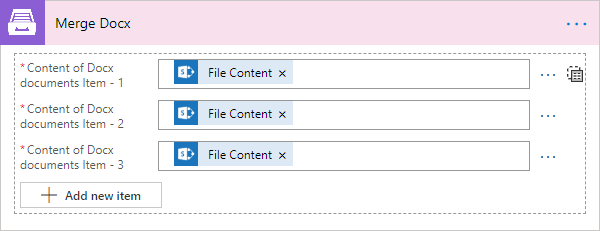

Extract text from PDF document
------------------------------

Extracts text from PDF document to Raw or HTML format with the help of Microsoft Flow.

.. rubric:: Output Parameters

.. list-table::
    :header-rows: 1
    :widths: 10 30 20

    *  -  Parameter
       -  Description
       -  Example
    *  -  File Content
       -  Text or raw HTML from the result file.
       -  .. code-block:: html
       
            <!DOCTYPE html PUBLIC "-//W3C//DTD HTML 4.01 Transitional//EN" "http://www.w3.org/TR/html4/loose.dtd">
                <html>
                    <head><title></title>
                        <meta http-equiv="Content-Type" content="text/html; charset="UTF-8">
                    </head>
                    <body>
                        

                            

                                

                                    <b>3</b>
                                

                            

                        

                        

                            

                                

                                    <b>4</b>
                                

                            

                        

                        

                            

                                

                                    <b>5</b>
                                

                            

                        

                        

                            

                                

                                    <b>6</b>
                                

                            

                        

                        

                            

                                

                                    <b>7</b>
                                

                            

                        

                        

                    </body>
                </html>

.. rubric:: Input Parameters

.. list-table::
    :header-rows: 1
    :widths: 10 30 20

    *  -  Parameter
       -  Description
       -  Example
    *  -  PDF Document Content
       -  Raw content of PDF document.       

       -  You may get the content of the source PDF file by "Get file content" action from "SharePoint" connector or from some other connector.

    *  -  Start Page
       -  Index of the first page to start extraction (indexes start from 1).
       -  3

    *  -  End Page
       -  Index of the last page to extract (inclusive). By default we will use the last page of the source document.
       -  7 

    *  -  Result Type
       -  Raw or HTML.
       -  HTML

    *  -  Password
       -  The password to decrypt the source document. If it was encrypted earlier.
       -  PAs$word       

.. rubric:: Example

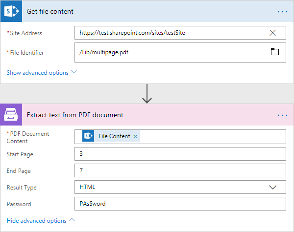

Convert PDF to Image
--------------------

Converts PDF document to image (jpeg, png, gif, bmp) with the help of Microsoft Flow.

.. rubric:: Output Parameters

.. list-table::
    :header-rows: 1
    :widths: 10 30 20

    *  -  Parameter
       -  Description
       -  Example
    *  -  Result Files Contents
       -  The array of raw content of result image files.
       -  It is an array of Base64 encoded contents of result image files. You can iterate through them and save somewhere.

.. rubric:: Input Parameters

.. list-table::
    :header-rows: 1
    :widths: 10 30 20

    *  -  Parameter
       -  Description
       -  Example
    *  -  PDF Document Content
       -  Raw content of PDF document.       

       -  You may get the content of the source PDF file by "Get file content" action from "SharePoint" connector or from some other connector.

    *  -  Start Page
       -  Index of the first page to start extraction (indexes start from 1).
       -  3

    *  -  End Page
       -  Index of the last page to extract (inclusive). By default we will use the last page of the source document.
       -  7 

    *  -  Pages
       -  Page numbers for extraction separated by ';' (only these pages will be extracted).
       -  4;6;7

    *  -  Image Format
       -  The format of the result image.
       -  

          - Jpeg
          - Png
          - Gif
          - Bmp

    *  -  DPI
       -  The resolution of the result image (150 based).
       -  300

    *  -  Password
       -  The password to decrypt the source document. If it was encrypted earlier.
       -  PAs$word       

.. rubric:: Example

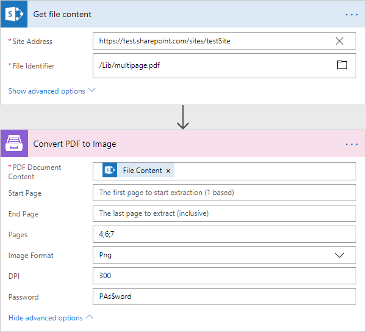

Fill in PDF Form
----------------

Fills in PDF form by provided data with the help of Microsoft Flow.

.. rubric:: Output Parameters

.. list-table::
    :header-rows: 1
    :widths: 10 30 20

    *  -  Parameter
       -  Description
       -  Example
    *  -  File Content
       -  Raw content of result file.
       -  It is a Base64 encoded content of result file.

.. rubric:: Input Parameters

.. list-table::
    :header-rows: 1
    :widths: 10 30 20

    *  -  Parameter
       -  Description
       -  Example
    *  -  PDF Document Content
       -  Raw content of PDF document.       

       -  You may get the content of the source PDF file by "Get file content" action from "SharePoint" connector or from some other connector.

    *  -  Template name
       -  You can use predefined user templates. `See more <../../document-generation/templates/index.html>`_
       -  .. code::
          invoice.pdf

    *  -  JSON Data
       -  The data that will be used to fill in the form.
       -  .. code-block:: json

            {
                "FirstName": "David",
                "LastName": "Navarro",
                "CompanyName": "Contoso LLC",
                "Position": "Marketing manager"
            }      

.. rubric:: Example

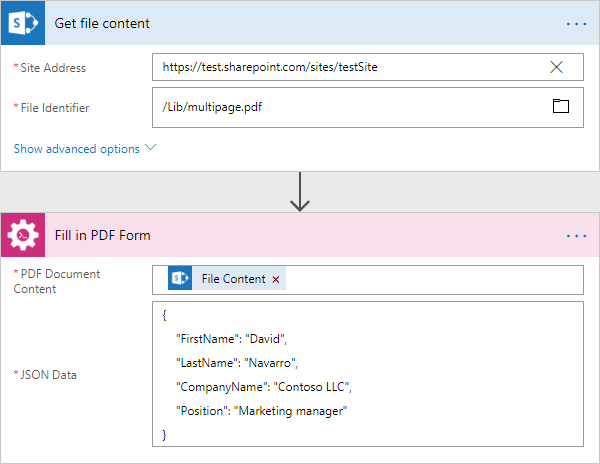

Get Form from PDF
-----------------

Returns data from fillable PDF as JSON with the help of Microsoft Flow.

.. rubric:: Output Parameters

.. list-table::
    :header-rows: 1
    :widths: 10 30 20

    *  -  Parameter
       -  Description
       -  Example
    *  -  Form Data
       -  Data from fillable PDF form as JSON.
       -  .. code-block:: json

            {
                "FirstName": "David",
                "LastName": "Navarro",
                "CompanyName": "Contoso LLC",
                "Position": "Marketing manager"
            }

.. rubric:: Input Parameters

.. list-table::
    :header-rows: 1
    :widths: 10 30 20

    *  -  Parameter
       -  Description
       -  Example
    *  -  PDF Document Content
       -  Raw content of PDF document.       

       -  You may get the content of the source PDF file by "Get file content" action from "SharePoint" connector or from some other connector.

    *  -  Password
       -  The password to decrypt the source document. If it was encrypted earlier.
       -  PAs$word       

.. rubric:: Example

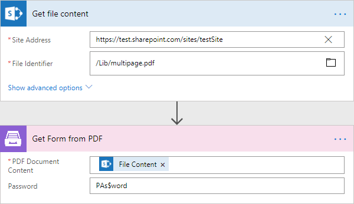

Protect PDF document
--------------------

Protects PDF by adding passwords, copy-, printing-, and other protections to PDF file with the help of Microsoft Flow.

.. rubric:: Output Parameters

.. list-table::
    :header-rows: 1
    :widths: 10 30 20

    *  -  Parameter
       -  Description
       -  Example
    *  -  File Content
       -  Raw content of result file.
       -  It is a Base64 encoded content of result file.

.. rubric:: Input Parameters

.. list-table::
    :header-rows: 1
    :widths: 10 30 20

    *  -  Parameter
       -  Description
       -  Example
    *  -  PDF Document Content
       -  Raw content of PDF document.       

       -  You may get the content of the source PDF file by "Get file content" action from "SharePoint" connector or from some other connector.

    *  -  Enable Printing
       -  Protect the PDF file from being printed out.
       -  Yes    

    *  -  Enable Modification
       -  Protect the PDF file from being edited.
       -  Yes     

    *  -  Enable Extract Data
       -  Allows extraction of text, images, and other media from the PDF file.
       -  Yes     

    *  -  Enable Annotate
       -  Allows annotation (e.g. comments, form fill-in, signing) of the PDF file.
       -  Yes     

    *  -  PDF Owner Password
       -  Enter an optional owner password here. This password can be used to disable document restrictions.
       -  OwNEr_PAs$word     

    *  -  PDF User Password
       -  Enter an optional user password here. Each time an user opens the PDF he will be asked for this password. If you do not want a password prompt then leave this field blank.
       -  U$er_PAs$word  

    *  -  Password
       -  The password to decrypt the source document. If it was encrypted earlier.
       -  PAs$word 

.. rubric:: Example

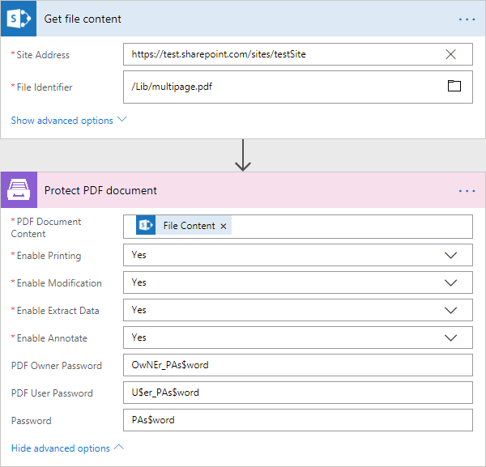

Parse CSV
-------------------

Parses a CSV file into an array of objects with properties in Microsoft Flow.

.. note:: At this moment the action is only available in custom connector. Please read `here <../create-custom-connector.html>`_ how to create one.

.. rubric:: Output Parameters

.. list-table::
    :header-rows: 1
    :widths: 10 30 20

    *  -  Parameter
       -  Description
       -  Example
    *  -  Items
       -  The JSON representation of the resulting items' array in Microsoft Flow
       -  Each CSV header is represented by an output parameter. You can refer to a single item selecting it in MS Flow.
          
           .. code-block:: html

             [
               {
                 "Id": "12345",
                 "PurchaseDate": "2019-05-01",
                 "ExpirationDate": "2020-05-01",
                 "ProductName": "Product1",
                }
              ]

          .. image:: ../../_static/img/flow/documents/parse-csv-output.png                 

        

.. rubric:: Input Parameters

.. list-table::
    :header-rows: 1
    :widths: 10 30 20

    *  -  Parameter
       -  Description
       -  Example
    *  -  Source CSV file
       -  The raw content of the source .csv file.. You can extract file content from other connectors like:

          - SharePoint
          - Salesforce
          - Box
          - OneDrive
          - Google Drive
          - Dropbox
          - SFTP
          - File System          

          `List of Microsoft Flow connectors <https://flow.microsoft.com/en-us/connectors/>`_          

       -  It is content of the source template file.

    *  -  Headers
       -  Comma separated list of columns.
       -  You need to specify the headers in the same order as in the CSV file. Ex.: Id, PurchaseDate, ExpirationDate, ProductName

    *  -  Delimiter
       -  Delimiter of columns. By default it's a comma.
       -  You can select from the following default values: Comma, Semicolon, Tab or specify a custom value.

                  
.. rubric:: Example

.. image:: ../../_static/img/flow/documents/parse-csv-example.png
   :alt: Parse CSV file

Regular Expression Match
----------------------------

Searches an input string for all occurrences of a regular expression and returns all the matches with the help of Microsoft Flow. We would recommend you to use `Regex Hero tool <http://regexhero.net/>`_ to test your expressions. It supports the same syntax as actions.

You can find more examples in `this article <../how-tos/documents/use-regex-match-to-extract-values.html>`_.

.. rubric:: Output Parameters

.. list-table::
    :header-rows: 1
    :widths: 10 30 20

    *  -  Parameter
       -  Description
       -  Example
    *  -  Is Success
       -  True if the input string has at least one occurrences of a regular expression, otherwise false.
       -  true

    *  -  Matches
       -  The dynamic response based on a pattern that is used in this action. Contains all matches groups that included in the pattern (named or unnamed).
       -  Match0, TaskId, status

.. rubric:: Input Parameters

.. list-table::
    :header-rows: 1
    :widths: 10 30 20

    *  -  Parameter
       -  Description
       -  Example
    *  -  Pattern
       -  Regular expression pattern. This pattern can contain inline options to modify behavior of the regular expression. Such options have to be placed in the beginning of the expression inside brackets with question mark: ``(?YOUR_OPTIONS)``. For example options ``(?mi)`` will allow to process multi line text with case insensitivity.   
          You can find additional information about inline options in the `MSDN article <http://msdn.microsoft.com/en-us/library/yd1hzczs%28v=vs.110%29.aspx>`_.
          Also you can find an example in `this article <https://plumsail.com/docs/actions/v1.x/flow/how-tos/documents/use-regex-match-to-extract-values.html>`_.
       -  ``Task (?<TaskId>\d+):(?<status>Approve|Reject)``

    *  -  Text
       -  String to search for matches.
       -  ``Task 5:Approve\nTask 53:Reject\nTask 52:Approve``    

.. rubric:: Example

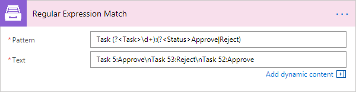

Regular Expression Replace
--------------------------

In a specified input string, replaces all strings that match a regular expression pattern with a specified replacement string. We would recommend you to use `Regex Hero tool <http://regexhero.net/>`_ to test your expressions. It supports the same syntax as actions.

.. rubric:: Output Parameters

.. list-table::
    :header-rows: 1
    :widths: 10 30 20

    *  -  Parameter
       -  Description
       -  Example
    *  -  Result
       -  Result string with replaced substrings that match a regular expression pattern.
       -  ``sd-df-f-ddd-dff-fff``

.. rubric:: Input Parameters

.. list-table::
    :header-rows: 1
    :widths: 10 30 20

    *  -  Parameter
       -  Description
       -  Example
    *  -  Pattern
       -  Regular expression pattern. This pattern can contain inline options to modify behavior of the regular expression. Such options have to be placed in the beginning of the expression inside brackets with question mark: ``(?YOUR_OPTIONS)``. For example options ``(?mi)`` will allow to process multi line text with case insensitivity.   
          You can find additional information about inline options in the `MSDN article <http://msdn.microsoft.com/en-us/library/yd1hzczs%28v=vs.110%29.aspx>`_.     
       -  ``\s+``

    *  -  Text
       -  String to search for matches.
       -  ``sd    df f     ddd    dff   fff``   

    *  -  Replacement
       -  Replacement string.
       -  ``-`` 

.. rubric:: Example

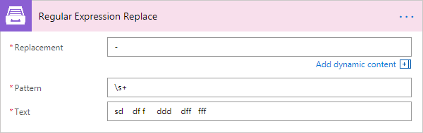

Regular Expression Test
----------------------------

Indicates whether the regular expression specified in the Regex constructor finds a match in a specified input string. We would recommend you to use `Regex Hero tool <http://regexhero.net/>`_ to test your expressions. It supports the same syntax as actions.

.. rubric:: Output Parameters

.. list-table::
    :header-rows: 1
    :widths: 10 30 20

    *  -  Parameter
       -  Description
       -  Example

    *  -  Is Success
       -  True if the input string has at least one occurrences of a regular expression, otherwise false.
       -  true

.. rubric:: Input Parameters

.. list-table::
    :header-rows: 1
    :widths: 10 30 20

    *  -  Parameter
       -  Description
       -  Example
    *  -  Pattern
       -  Regular expression pattern. This pattern can contain inline options to modify behavior of the regular expression. Such options have to be placed in the beginning of the expression inside brackets with question mark: ``(?YOUR_OPTIONS)``. For example options ``(?mi)`` will allow to process multi line text with case insensitivity.   
          You can find additional information about inline options in the `MSDN article <http://msdn.microsoft.com/en-us/library/yd1hzczs%28v=vs.110%29.aspx>`_.     
       -  ``(?<TestGroup1>\d4) (\d5)``

    *  -  Text
       -  String to search for matches.
       -  ``24 45\n435 64 85``    

.. rubric:: Example

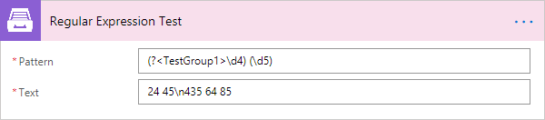