Documents connector
==================================

This connector helps you to automatically generate and convert documents with the help of Microsoft Flow. Before starting, ensure that you `added Plumsail Documents connector to Microsoft Flow <../../getting-started/use-from-flow.html>`_.

.. contents:: List of actions in this connector
   :local:
   :depth: 1

Create document from DOCX template
----------------------------------

Creates .docx document from .docx template with the help of Microsoft Flow. You can find more examples in `this article <../how-tos/documents/create-docx-from-template.html>`_.

.. rubric:: Output Parameters

.. list-table::
    :header-rows: 1
    :widths: 10 30 20

    *  -  Parameter
       -  Description
       -  Example
    *  -  File Content
       -  The content of the result .docx file.
       -  It is a Base64 encoded content of the result file.

.. rubric:: Input Parameters

.. list-table::
    :header-rows: 1
    :widths: 10 30 20

    *  -  Parameter
       -  Description
       -  Example
    *  -  DOCX document content
       -  The raw content of the source .docx template file. You can extract file content from other connectors like:

          - SharePoint
          - Salesforce
          - Box
          - OneDrive
          - Google Drive
          - Dropbox
          - SFTP
          - File System

          `List of Microsoft Flow connectors <https://flow.microsoft.com/en-us/connectors/>`_

       -  You can find insturctions about creation of a template file in `this article <../../advanced/create-docx-template.html>`_. 
       
          Use `this link <../../_static/files/flow/how-tos/Hiring%20Contract%20Template.docx>`_ to download the sample template.

    *  -  Template data
       -  Data to bind to the template in JSON format. You can get this data from some other Microsoft Flow connector. For example you can query SharePoint list or some other system.
       -  .. code-block:: json

            {
                "EmployerFullName": "David Navarro",
                "EmployeeFullName": "Anil Mittal",
                "CompanyName": "Contoso LLC",
                "Position": "Marketing manager",
                "SalaryAmount": 5000,
                "ListOfBenefits": "list of any benefits that come with employment",
                "BonusesPolicyDescription": "annual evaluation",
                "EffectiveDate": "10/27/2017",
                "TerminationDate": "10/27/2018",
                "State": "New York"
            }    

.. rubric:: Example

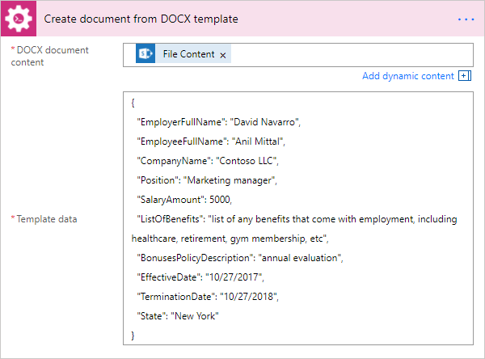

Create HTML from template
----------------------------------

Generates raw HTML from a raw HTML template with the help of Microsoft Flow. You can find more examples in `this article <../how-tos/documents/create-html-from-template.html>`_.

.. rubric:: Output Parameters

.. list-table::
    :header-rows: 1
    :widths: 10 30 20

    *  -  Parameter
       -  Description
       -  Example
    *  -  Result HTML
       -  Raw HTML result created from a source HTML template.
       -  .. code-block:: html

            <!doctype html>
            <html>
            <head>
                <meta charset="utf-8">
                <title>HTML from template</title>  
            </head>
            <body>
                <ul>                            
                    <li>David Navarro </li>                    
                    <li>Jessica Adams</li>                    
                    <li>Derek Clark</li>                    
                </ul>    
            </body>
            </html>                    

.. rubric:: Input Parameters

.. list-table::
    :header-rows: 1
    :widths: 10 30 20

    *  -  Parameter
       -  Description
       -  Example
    *  -  Source HTML
       -  HTML content of a source template. You can specify raw HTML here or extract file content from other connectors like:

          - SharePoint
          - Salesforce
          - Box
          - OneDrive
          - Google Drive
          - Dropbox
          - SFTP
          - File System          

          `List of Microsoft Flow connectors <https://flow.microsoft.com/en-us/connectors/>`_          

       -  You can find description of template syntax in `this article <../../advanced/html-template-syntax.html>`_. 
       
          .. code-block:: html

            <!doctype html>
            <html>
            <head>
                <meta charset="utf-8">
                <title>HTML from template</title>  
            </head>
            <body>
                <ul>        
                    {{#each data}}
                    <li>{{name}}</li>
                    {{/each}}
                </ul>    
            </body>
            </html>

    *  -  Template data
       -  Data to bind to the template in JSON format. You can get this data from some other Microsoft Flow connector. For example you can query SharePoint list or some other system.
       -  .. code-block:: json

            {
                "data": [
                    {
                        "name": "David Navarro "
                    },
                    {
                        "name": "Jessica Adams"
                    },
                    {
                        "name": "Derek Clark"
                    }
                ]
            }  

.. rubric:: Example

.. image:: ../../_static/img/flow/how-tos/html-from-template-raw.png
   :alt: Convert HTML document to PDF Example

Convert DOCX to PDF
----------------------------

Converts .docx document to PDF document with the help of Microsoft Flow. You can find more examples in `this article <../how-tos/documents/convert-word-to-pdf.html>`_.

.. rubric:: Output Parameters

.. list-table::
    :header-rows: 1
    :widths: 10 30 20

    *  -  Parameter
       -  Description
       -  Example
    *  -  File Content
       -  The content of the result PDF file.
       -  It is a Base64 encoded content of the result file.

.. rubric:: Input Parameters

.. list-table::
    :header-rows: 1
    :widths: 10 30 20

    *  -  Parameter
       -  Description
       -  Example
    *  -  Document content
       -  The raw content of the source .docx file. You can extract file content from other connectors like:

          - SharePoint
          - Salesforce
          - Box
          - OneDrive
          - Google Drive
          - Dropbox
          - SFTP
          - File System

          `List of Microsoft Flow connectors <https://flow.microsoft.com/en-us/connectors/>`_

       -  It is a Base64 encoded content of the source template file.          

.. rubric:: Example

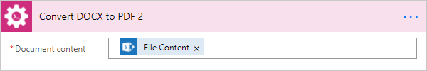

Convert HTML to PDF
----------------------------

Converts HTML document to PDF document with the help of Microsoft Flow. You can find more examples in `this article <../how-tos/documents/convert-html-to-pdf.html>`_.

.. rubric:: Output Parameters

.. list-table::
    :header-rows: 1
    :widths: 10 30 20

    *  -  Parameter
       -  Description
       -  Example
    *  -  File Content
       -  The content of the result PDF file.
       -  It is a Base64 encoded content of the result file.

.. rubric:: Input Parameters

.. list-table::
    :header-rows: 1
    :widths: 10 30 20

    *  -  Parameter
       -  Description
       -  Example
    *  -  Source HTML
       -  HTML content of a source file. You can specify raw HTML here or extract file content from other connectors like:

          - SharePoint
          - Salesforce
          - Box
          - OneDrive
          - Google Drive
          - Dropbox
          - SFTP
          - File System          

          `List of Microsoft Flow connectors <https://flow.microsoft.com/en-us/connectors/>`_          

       -  .. code-block:: html

            <!doctype html>
            <html>

            <head>
                <meta charset="utf-8">
                <title>HTML to PDF example
                
            </head>
            <body>
                

                    Text in box1
                

                

                    Text in box2
                
    
            </body>
            </html>

    *  -  Papper Size
       -  Paper size for output PDF file.
       -  

          - A4
          - Letter
          - LetterSmall
          - Tabloid
          - Ledger
          - Legal
          - Statement
          - Executive
          - A2
          - A3
          - A4Small
          - A5
          - B4
          - B5

    *  -  Orientation
       -  Page orientation for output PDF file.
       -  

          - Portrait
          - Landscape          

.. rubric:: Example

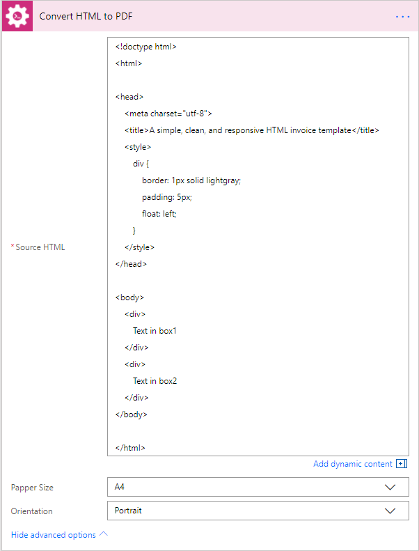

Split PDF
----------------------------

Split PDF document with the help of Microsoft Flow.

.. rubric:: Output Parameters

.. list-table::
    :header-rows: 1
    :widths: 10 30 20

    *  -  Parameter
       -  Description
       -  Example
    *  -  Result Files Contents
       -  The array of raw content of result files.
       -  It is an array of Base64 encoded contents of result files.

.. rubric:: Input Parameters

.. list-table::
    :header-rows: 1
    :widths: 10 30 20

    *  -  Parameter
       -  Description
       -  Example
    *  -  PDF document content
       -  Raw content of PDF document.       

       -  You are may getting the content from the source PDF file via "Get file content" action from "SharePoint" connector.

    *  -  Start Page
       -  The first page to start split (1 based).
       -  3

    *  -  End Page
       -  The last page to split (inclusive). By default will use the last page of the source document.
       -  7 

    *  -  Split At Page
       -  Number of pages per partition.
       -  2

    *  -  Password
       -  The password to decrypt the source document.
       -  PAs$word       

.. rubric:: Example

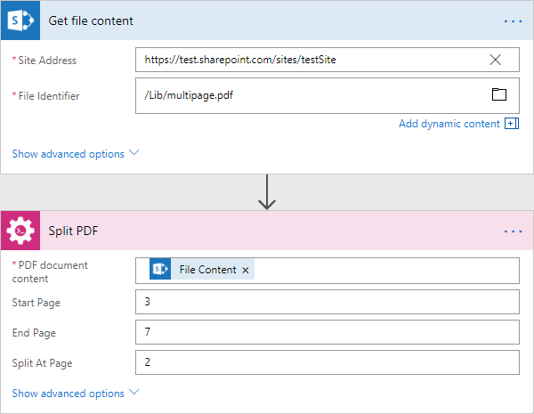

Merge PDF
----------------------------

Merge PDF document with the help of Microsoft Flow.

.. rubric:: Output Parameters

.. list-table::
    :header-rows: 1
    :widths: 10 30 20

    *  -  Parameter
       -  Description
       -  Example
    *  -  File Content
       -  Raw content of the result file.
       -  It is a Base64 encoded content of the result file.

.. rubric:: Input Parameters

.. list-table::
    :header-rows: 1
    :widths: 10 30 20

    *  -  Parameter
       -  Description
       -  Example
    *  -  PDF documents content
       -  The array of raw content of PDF documents.       

       -  You are may getting the content from the source PDF file via "Get file content" action from "SharePoint" connector.

.. rubric:: Example

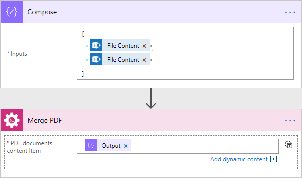

Extract text from PDF document
---------------------------------

Extracts text from PDF document to Raw or HTML format with the help of Microsoft Flow.

.. rubric:: Output Parameters

.. list-table::
    :header-rows: 1
    :widths: 10 30 20

    *  -  Parameter
       -  Description
       -  Example
    *  -  File Content
       -  Text or raw HTML from the result file.
       -  .. code-block:: html
       
            <!DOCTYPE html PUBLIC "-//W3C//DTD HTML 4.01 Transitional//EN" "http://www.w3.org/TR/html4/loose.dtd">
                <html>
                    <head><title></title>
                        <meta http-equiv="Content-Type" content="text/html; charset="UTF-8">
                    </head>
                    <body>
                        

                            

                                

                                    <b>3</b>
                                

                            

                        

                        

                            

                                

                                    <b>4</b>
                                

                            

                        

                        

                            

                                

                                    <b>5</b>
                                

                            

                        

                        

                            

                                

                                    <b>6</b>
                                

                            

                        

                        

                            

                                

                                    <b>7</b>
                                

                            

                        

                        

                    </body>
                </html>

.. rubric:: Input Parameters

.. list-table::
    :header-rows: 1
    :widths: 10 30 20

    *  -  Parameter
       -  Description
       -  Example
    *  -  PDF document content
       -  Raw content of PDF document.       

       -  You are may getting the content from the source PDF file via "Get file content" action from "SharePoint" connector.

    *  -  Start Page
       -  The first page to start extraction (1 based).
       -  3

    *  -  End Page
       -  The last page to extract (inclusive). By default will use the last page of the source document.
       -  7 

    *  -  Result Type
       -  Raw or HTML.
       -  HTML

    *  -  Password
       -  The password to decrypt the source document.
       -  PAs$word       

.. rubric:: Example

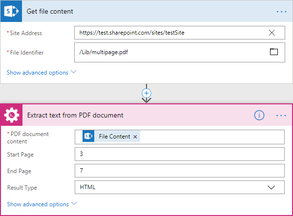

Convert PDF to Image
----------------------------

Converts PDF document to image (jpeg, png, gif, bmp) with the help of Microsoft Flow.

.. rubric:: Output Parameters

.. list-table::
    :header-rows: 1
    :widths: 10 30 20

    *  -  Parameter
       -  Description
       -  Example
    *  -  Result Files Contents
       -  The array of raw content of result image files.
       -  It is an array of Base64 encoded contents of result image files.

.. rubric:: Input Parameters

.. list-table::
    :header-rows: 1
    :widths: 10 30 20

    *  -  Parameter
       -  Description
       -  Example
    *  -  PDF document content
       -  Raw content of PDF document.       

       -  You are may getting the content from the source PDF file via "Get file content" action from "SharePoint" connector.

    *  -  Start Page
       -  The first page to start extraction (1 based).
       -  3

    *  -  End Page
       -  The last page to extract (inclusive). By default will use the last page of the source document.
       -  7 

    *  -  Pages
       -  Page numbers for extraction separated by ';' (only this pages will be extracted).
       -  4;6;7

    *  -  Image Format
       -  The format of the result image.
       -  

          - Jpeg
          - Png
          - Gif
          - Bmp

    *  -  DPI
       -  The resolution of the result image (150 based).
       -  300

    *  -  Password
       -  The password to decrypt the source document.
       -  PAs$word       

.. rubric:: Example

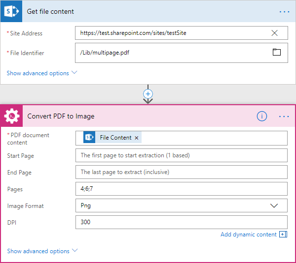

Fill in PDF Form
----------------------------

Filling out PDF form by provided data with the help of Microsoft Flow.

.. rubric:: Output Parameters

.. list-table::
    :header-rows: 1
    :widths: 10 30 20

    *  -  Parameter
       -  Description
       -  Example
    *  -  File Content
       -  Raw content of result file.
       -  It is a Base64 encoded content of result file.

.. rubric:: Input Parameters

.. list-table::
    :header-rows: 1
    :widths: 10 30 20

    *  -  Parameter
       -  Description
       -  Example
    *  -  PDF document content
       -  Raw content of PDF document.       

       -  You are may getting the content from the source PDF file via "Get file content" action from "SharePoint" connector.

    *  -  JSON data
       -  The data that will be used to fill out the form.
       -  .. code-block:: json

            {
                "FirstName": "David",
                "LastName": "Navarro",
                "CompanyName": "Contoso LLC",
                "Position": "Marketing manager"
            }      

.. rubric:: Example

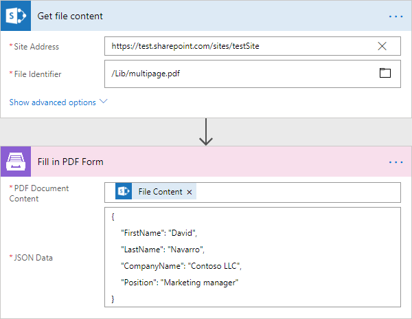

Get Form from PDF
----------------------------

Returns fillable form data from PDF as JSON with the help of Microsoft Flow.

.. rubric:: Output Parameters

.. list-table::
    :header-rows: 1
    :widths: 10 30 20

    *  -  Parameter
       -  Description
       -  Example
    *  -  Form Data
       -  Fillable form data as JSON.
       -  .. code-block:: json

            {
                "FirstName": "David",
                "LastName": "Navarro",
                "CompanyName": "Contoso LLC",
                "Position": "Marketing manager"
            }

.. rubric:: Input Parameters

.. list-table::
    :header-rows: 1
    :widths: 10 30 20

    *  -  Parameter
       -  Description
       -  Example
    *  -  PDF document content
       -  Raw content of PDF document.       

       -  You are may getting the content from the source PDF file via "Get file content" action from "SharePoint" connector.

    *  -  Password
       -  The password to decrypt the source document.
       -  PAs$word       

.. rubric:: Example

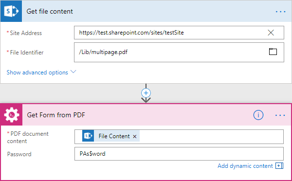

Protect PDF document
----------------------------

Adds passwords, copy-, printing-, and other protections to PDF file with the help of Microsoft Flow.

.. rubric:: Output Parameters

.. list-table::
    :header-rows: 1
    :widths: 10 30 20

    *  -  Parameter
       -  Description
       -  Example
    *  -  File Content
       -  Raw content of result file.
       -  It is a Base64 encoded content of result file.

.. rubric:: Input Parameters

.. list-table::
    :header-rows: 1
    :widths: 10 30 20

    *  -  Parameter
       -  Description
       -  Example
    *  -  PDF document content
       -  Raw content of PDF document.       

       -  You are may getting the content from the source PDF file via "Get file content" action from "SharePoint" connector.

    *  -  Enable printing
       -  Protect the PDF file from being printed out.
       -  Yes    

    *  -  Enable modification
       -  Protect the PDF file from being edited.
       -  Yes     

    *  -  Enable extract data
       -  Allows extraction of text, images, and other media from the PDF file.
       -  Yes     

    *  -  Enable annotate
       -  Allows annotation (e.g. comments, form fill-in, signing) of the PDF file.
       -  Yes     

    *  -  PDF owner password
       -  Enter an optional owner password here. This password can be used to disable document restrictions.
       -  OwNEr_PAs$word     

    *  -  PDF user password
       -  Enter an optional user password here. Each time an user opens the PDF he will be asked for this password. If you do not want a password prompt then leave this field blank.
       -  U$er_PAs$word  

    *  -  Password
       -  The password to decrypt the source document.
       -  PAs$word 

.. rubric:: Example

.. image:: ../../_static/img/flow/how-tos/protect-pdf-example.png
   :alt: Protect PDF Example  

Regular Expression Match
----------------------------

Searches an input string for all occurrences of a regular expression and returns all the matches with the help of Microsoft Flow. We would recommend you to use Regex Hero to test your expressions. It supports the same syntax as actions.

.. rubric:: Output Parameters

.. list-table::
    :header-rows: 1
    :widths: 10 30 20

    *  -  Parameter
       -  Description
       -  Example
    *  -  IsSuccess
       -  True if the input string has at least one occurrences of a regular expression, otherwise false.
       -  true

    *  -  Matches
       -  The dynamic response based on a pattern that used in this action. Contains all matches groups that included in the pattern (named or unnamed).
       -  Match0, TaskId, status

.. rubric:: Input Parameters

.. list-table::
    :header-rows: 1
    :widths: 10 30 20

    *  -  Parameter
       -  Description
       -  Example
    *  -  Pattern
       -  Regular expression pattern. This pattern can contain inline options to modify behavior of the regular expression. Such options have to be placed in the beginning of the expression inside brackets with question mark: ``(?YOUR_OPTIONS)``. For example options ``(?mi)`` will allow to process multi line text with case insensitivity.   
          You can find additional information about inline options in the `MSDN article <http://msdn.microsoft.com/en-us/library/yd1hzczs%28v=vs.110%29.aspx>`_. 
       -  ``Task (?<TaskId>\d+):(?<status>Approve|Reject)``

    *  -  Text
       -  String to search for matches.
       -  ``Task 5:Approve\nTask 53:Reject\nTask 52:Approve``    

.. rubric:: Example

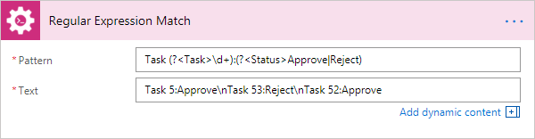

Regular Expression Replace
----------------------------

In a specified input string, replaces all strings that match a regular expression pattern with a specified replacement string. We would recommend you to use Regex Hero to test your expressions. It supports the same syntax as actions.

.. rubric:: Output Parameters

.. list-table::
    :header-rows: 1
    :widths: 10 30 20

    *  -  Parameter
       -  Description
       -  Example
    *  -  Result
       -  Result string with replaced substrings that match a regular expression pattern.
       -  ``sd-df-f-ddd-dff-fff``

.. rubric:: Input Parameters

.. list-table::
    :header-rows: 1
    :widths: 10 30 20

    *  -  Parameter
       -  Description
       -  Example
    *  -  Pattern
       -  Regular expression pattern. This pattern can contain inline options to modify behavior of the regular expression. Such options have to be placed in the beginning of the expression inside brackets with question mark: ``(?YOUR_OPTIONS)``. For example options ``(?mi)`` will allow to process multi line text with case insensitivity.   
          You can find additional information about inline options in the `MSDN article <http://msdn.microsoft.com/en-us/library/yd1hzczs%28v=vs.110%29.aspx>`_.     
       -  ``\s+``

    *  -  Text
       -  String to search for matches.
       -  ``sd    df f     ddd    dff   fff``   

    *  -  Replacement
       -  Replacement string.
       -  ``-`` 

.. rubric:: Example

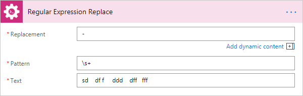

Regular Expression Test
----------------------------

Indicates whether the regular expression specified in the Regex constructor finds a match in a specified input string. We would recommend you to use Regex Hero to test your expressions. It supports the same syntax as actions.

.. rubric:: Output Parameters

.. list-table::
    :header-rows: 1
    :widths: 10 30 20

    *  -  Parameter
       -  Description
       -  Example

    *  -  IsSuccess
       -  True if the input string has at least one occurrences of a regular expression, otherwise false.
       -  true

.. rubric:: Input Parameters

.. list-table::
    :header-rows: 1
    :widths: 10 30 20

    *  -  Parameter
       -  Description
       -  Example
    *  -  Pattern
       -  Regular expression pattern. This pattern can contain inline options to modify behavior of the regular expression. Such options have to be placed in the beginning of the expression inside brackets with question mark: ``(?YOUR_OPTIONS)``. For example options ``(?mi)`` will allow to process multi line text with case insensitivity.   
          You can find additional information about inline options in the `MSDN article <http://msdn.microsoft.com/en-us/library/yd1hzczs%28v=vs.110%29.aspx>`_.     
       -  ``(?<TestGroup1>\d4) (\d5)``

    *  -  Text
       -  String to search for matches.
       -  ``24 45\n435 64 85``    

.. rubric:: Example

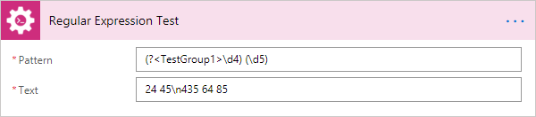