SP connector (SharePoint)
==================================

Provides advanced set of Microsoft Flow actions for SharePoint. It allows you to change permissions on sites, lists, list items. You can create sites from templates and many more. 

Before starting, ensure that you `added Plumsail connector to Microsoft Flow <../../getting-started/use-from-flow.html>`_.

.. contents:: List of actions in this connector
   :local:
   :depth: 1

Change Permissions on SharePoint site, list or list item
-----------------------------------------------------------

"Change Permissions" is a complex action that includes 12 different operations for granting, removing or restoring permissions on sites, lists, and list items.

Once you added this action to your Flow, you need to specify two initial parameters:

* Action type - type of action for changing permissions: Grant, Remove, RemoveAll, RestoreInheritance
* Target - target of action: Site, List, Item

.. image:: ../../_static/img/flow/sharepoint/ChangePermissionsExample.png
   :alt: Change SharePoint Permissions Example

Once you did this, you will see the rest of parameters for this particular operation.

You can find the documentation for all operations included in "Change Permissions" action below:

- :ref:`grant-permissions-site`
- :ref:`remove-permissions-site`
- :ref:`remove-all-permissions-site`
- :ref:`restore-inheritance-permissions-site`
- :ref:`grant-permissions-list`
- :ref:`remove-permissions-list`
- :ref:`remove-all-permissions-list`
- :ref:`restore-inheritance-permissions-list`
- :ref:`grant-permissions-item`
- :ref:`remove-permissions-item`
- :ref:`remove-all-permissions-item`
- :ref:`restore-inheritance-permissions-item`

.. _grant-permissions-site:

Grant Permissions on SharePoint Site
~~~~~~~~~~~~~~~~~~~~~~~~~~~~~~~~~~~~~~~~~~~~~~~~~~

Grant specific permissions on site to a SharePoint user or Group with the help of Microsoft Flow.

.. rubric:: Input Parameters

.. list-table::
    :header-rows: 1
    :widths: 10 30 20

    *  -  Parameter
       -  Description
       -  Example
    *  -  Action type
       -  The type of action for changing permissions. You should pick 'Grant' for this case.
       -  Grant
    *  -  Target
       -  The target of action: Site, List, Item. You should pick 'Site' for this case.
       -  Site
    *  -  User or group
       -  Login, Email or Name of a User or Group. Also you can specify multiple items using semicolon ';' delimited
       -  :code:`user@contoso.com`
    *  -  Role Type
       -  permission levels:
                   * Full control
                   * Design
                   * Edit
                   * Contribute
                   * Read
                   * ViewOnly
                
       -  Read
    *  -  SharePoint Site Url
       -  This property defines the context of the action. The action will be executed on specified SharePoint site.
       -  :code:`https://contoso.sharepoint.com/sites/subSite`

.. rubric:: Example

.. image:: ../../_static/img/flow/sharepoint/GrantPermissionsOnSiteExample.png
   :alt: Grant Permissions on SharePoint Site Example

.. _remove-permissions-site:

Remove Permissions from SharePoint Site
~~~~~~~~~~~~~~~~~~~~~~~~~~~~~~~~~~~~~~~~~~~~~~~~~~

Delete specific permissions from site for specified SharePoint user or group with the help of Microsoft Flow.

.. rubric:: Input Parameters

.. list-table::
    :header-rows: 1
    :widths: 10 30 20

    *  -  Parameter
       -  Description
       -  Example
    *  -  Action type
       -  The type of action for changing permissions. You should pick 'Remove' for this case.
       -  Remove
    *  -  Target
       -  The target of action: Site, List, Item. You should pick 'Site' for this case.
       -  Site
    *  -  User or group
       -  Login, Email or Name of a User or Group. Also you can specify multiple items using semicolon ';' delimited
       -  :code:`user@contoso.com`
    *  -  Role Type
       -  permission levels:
                   * Full control
                   * Design
                   * Edit
                   * Contribute
                   * Read
                   * ViewOnly
                
       -  Read
    *  -  SharePoint Site Url
       -  This property defines the context of the action. The action will be executed on specified SharePoint site.
       -  :code:`https://contoso.sharepoint.com/sites/subSite`

.. rubric:: Example

.. image:: ../../_static/img/flow/sharepoint/RemovePermissionsOnSiteExample.png
   :alt: Remove Permissions from SharePoint Site Example   

.. _remove-all-permissions-site:

Remove All Permissions from SharePoint Site
~~~~~~~~~~~~~~~~~~~~~~~~~~~~~~~~~~~~~~~~~~~~~~~~~~

Removing all user permissions from a SharePoint site with the help of Microsoft Flow.

.. rubric:: Input Parameters

.. list-table::
    :header-rows: 1
    :widths: 10 30 20

    *  -  Parameter
       -  Description
       -  Example
    *  -  Action type
       -  The type of action for changing permissions. You should pick 'RemoveAll' for this case.
       -  RemoveAll
    *  -  Target
       -  The target of action: Site, List, Item. You should pick 'Site' for this case.
       -  Site
    *  -  SharePoint Site Url
       -  This property defines the context of the action. The action will be executed on specified SharePoint site.
       -  :code:`https://contoso.sharepoint.com/sites/subSite`

.. rubric:: Example

.. image:: ../../_static/img/flow/sharepoint/RemoveAllPermissionsOnSiteExample.png
   :alt: Remove All Permissions from SharePoint Site Example    

.. _restore-inheritance-permissions-site:

Restore Permissions Inheritance for SharePoint Site
~~~~~~~~~~~~~~~~~~~~~~~~~~~~~~~~~~~~~~~~~~~~~~~~~~~~~

Remove unique permissions and restore permission inheritance on current SharePoint site with the help of Microsoft Flow.

.. rubric:: Input Parameters

.. list-table::
    :header-rows: 1
    :widths: 10 30 20

    *  -  Parameter
       -  Description
       -  Example
    *  -  Action type
       -  The type of action for changing permissions. You should pick 'RestoreInheritance' for this case.
       -  RestoreInheritance
    *  -  Target
       -  The target of action: Site, List, Item. You should pick 'Site' for this case.
       -  Site
    *  -  SharePoint Site Url
       -  This property defines the context of the action. The action will be executed on specified SharePoint site.
       -  :code:`https://contoso.sharepoint.com/sites/subSite`

.. rubric:: Example

.. image:: ../../_static/img/flow/sharepoint/RestorePermissionsOnSiteExample.png
   :alt: Restore Permissions Inheritance for SharePoint Site Example  

.. _grant-permissions-list:

Grant Permissions on SharePoint List
~~~~~~~~~~~~~~~~~~~~~~~~~~~~~~~~~~~~~~~~~~~~~~~~~~

Grant specific permissions to a user on a SharePoint list with the help of Microsoft Flow.

.. rubric:: Input Parameters

.. list-table::
    :header-rows: 1
    :widths: 10 30 20

    *  -  Parameter
       -  Description
       -  Example
    *  -  Action type
       -  The type of action for changing permissions. You should pick 'Grant' for this case.
       -  Grant
    *  -  Target
       -  The target of action: Site, List, Item. You should pick 'List' for this case.
       -  List
    *  -  List name
       -  Title or Url of a list
       -  Sales
    *  -  User or group
       -  Login, Email or Name of a User or Group. Also you can specify multiple items using semicolon ';' delimited
       -  :code:`user@contoso.com`
    *  -  Role Type
       -  permission levels:
                   * Full control
                   * Design
                   * Edit
                   * Contribute
                   * Read
                   * ViewOnly
                
       -  Read
    *  -  SharePoint Site Url
       -  This property defines the context of the action. The action will be executed on specified SharePoint site.
       -  :code:`https://contoso.sharepoint.com/sites/subSite`

.. rubric:: Example

.. image:: ../../_static/img/flow/sharepoint/GrantPermissionsOnListExample.png
   :alt: Grant Permissions on SharePoint List Example

.. _remove-permissions-list:

Remove Permissions from SharePoint List
~~~~~~~~~~~~~~~~~~~~~~~~~~~~~~~~~~~~~~~~~~~~~~~~~~

Delete specific permissions from a user on a SharePoint list with the help of Microsoft Flow.

.. rubric:: Input Parameters

.. list-table::
    :header-rows: 1
    :widths: 10 30 20

    *  -  Parameter
       -  Description
       -  Example
    *  -  Action type
       -  The type of action for changing permissions. You should pick 'Remove' for this case.
       -  Remove
    *  -  Target
       -  The target of action: Site, List, Item. You should pick 'List' for this case.
       -  List
    *  -  List name
       -  Title or Url of a list
       -  Sales
    *  -  User or group
       -  Login, Email or Name of a User or Group. Also you can specify multiple items using semicolon ';' delimited
       -  :code:`user@contoso.com`
    *  -  Role Type
       -  permission levels:
                   * Full control
                   * Design
                   * Edit
                   * Contribute
                   * Read
                   * ViewOnly
                
       -  Read
    *  -  SharePoint Site Url
       -  This property defines the context of the action. The action will be executed on specified SharePoint site.
       -  :code:`https://contoso.sharepoint.com/sites/subSite`

.. rubric:: Example

.. image:: ../../_static/img/flow/sharepoint/RemovePermissionsOnListExample.png
   :alt: Remove Permissions from SharePoint List Example   

.. _remove-all-permissions-list:

Remove All Permissions from SharePoint List
~~~~~~~~~~~~~~~~~~~~~~~~~~~~~~~~~~~~~~~~~~~~~~~~~~

Remove all user permissions from a SharePoint list with the help of Microsoft Flow.

.. rubric:: Input Parameters

.. list-table::
    :header-rows: 1
    :widths: 10 30 20

    *  -  Parameter
       -  Description
       -  Example
    *  -  Action type
       -  The type of action for changing permissions. You should pick 'RemoveAll' for this case.
       -  RemoveAll
    *  -  Target
       -  The target of action: Site, List, Item. You should pick 'List' for this case.
       -  List
    *  -  List name
       -  Title or Url of a list
       -  Sales
    *  -  SharePoint Site Url
       -  This property defines the context of the action. The action will be executed on specified SharePoint site.
       -  :code:`https://contoso.sharepoint.com/sites/subSite`

.. rubric:: Example

.. image:: ../../_static/img/flow/sharepoint/RemoveAllPermissionsOnListExample.png
   :alt: Remove All Permissions from SharePoint List Example    

.. _restore-inheritance-permissions-list:

Restore Permissions Inheritance for SharePoint List
~~~~~~~~~~~~~~~~~~~~~~~~~~~~~~~~~~~~~~~~~~~~~~~~~~~~~~

Remove unique permissions and restore permission inheritance on a SharePoint list with the help of Microsoft Flow.

.. rubric:: Input Parameters

.. list-table::
    :header-rows: 1
    :widths: 10 30 20

    *  -  Parameter
       -  Description
       -  Example
    *  -  Action type
       -  The type of action for changing permissions. You should pick 'RestoreInheritance' for this case.
       -  RestoreInheritance
    *  -  Target
       -  The target of action: Site, List, Item. You should pick 'List' for this case.
       -  List
    *  -  List name
       -  Title or Url of a list
       -  Sales
    *  -  SharePoint Site Url
       -  This property defines the context of the action. The action will be executed on specified SharePoint site.
       -  :code:`https://contoso.sharepoint.com/sites/subSite`

.. rubric:: Example

.. image:: ../../_static/img/flow/sharepoint/RestorePermissionsOnListExample.png
   :alt: Restore Permissions Inheritance for SharePoint List Example  

.. _grant-permissions-item:

Grant Permissions on SharePoint Item
~~~~~~~~~~~~~~~~~~~~~~~~~~~~~~~~~~~~~~~~~~~~~~~~~~

Grant specific permissions to a user on a SharePoint list item with the help of Microsoft Flow.

.. rubric:: Input Parameters

.. list-table::
    :header-rows: 1
    :widths: 10 30 20

    *  -  Parameter
       -  Description
       -  Example
    *  -  Action type
       -  The type of action for changing permissions. You should pick 'Grant' for this case.
       -  Grant
    *  -  Target
       -  The target of action: Site, List, Item. You should pick 'Item' for this case.
       -  Item
    *  -  Item ID
       -  ID of the item
       -  7
    *  -  List name
       -  Title or Url of a list
       -  Sales
    *  -  User or group
       -  Login, Email or Name of a User or Group. Also you can specify multiple items using semicolon ';' delimited
       -  :code:`user@contoso.com`
    *  -  Role Type
       -  permission levels:
                   * Full control
                   * Design
                   * Edit
                   * Contribute
                   * Read
                   * ViewOnly
                
       -  Read
    *  -  SharePoint Site Url
       -  This property defines the context of the action. The action will be executed on specified SharePoint site.
       -  :code:`https://contoso.sharepoint.com/sites/subSite`

.. rubric:: Example

.. image:: ../../_static/img/flow/sharepoint/GrantPermissionsOnItemExample.png
   :alt: Grant Permissions on SharePoint Item Example

.. _remove-permissions-item:

Remove Permissions from SharePoint Item
~~~~~~~~~~~~~~~~~~~~~~~~~~~~~~~~~~~~~~~~~~~~~~~~~~

Delete specific permissions from a user on a SharePoint list item with the help of Microsoft Flow.

.. rubric:: Input Parameters

.. list-table::
    :header-rows: 1
    :widths: 10 30 20

    *  -  Parameter
       -  Description
       -  Example
    *  -  Action type
       -  The type of action for changing permissions. You should pick 'Remove' for this case.
       -  Remove
    *  -  Target
       -  The target of action: Site, List, Item. You should pick 'Item' for this case.
       -  Item
    *  -  Item ID
       -  ID of the item
       -  7
    *  -  List name
       -  Title or Url of a list
       -  Sales
    *  -  User or group
       -  Login, Email or Name of a User or Group. Also you can specify multiple items using semicolon ';' delimited
       -  :code:`user@contoso.com`
    *  -  Role Type
       -  permission levels:
                   * Full control
                   * Design
                   * Edit
                   * Contribute
                   * Read
                   * ViewOnly
                
       -  Read
    *  -  SharePoint Site Url
       -  This property defines the context of the action. The action will be executed on specified SharePoint site.
       -  :code:`https://contoso.sharepoint.com/sites/subSite`

.. rubric:: Example

.. image:: ../../_static/img/flow/sharepoint/RemovePermissionsOnItemExample.png
   :alt: Remove Permissions from SharePoint Item Example   

.. _remove-all-permissions-item:

Remove All Permissions from SharePoint Item
~~~~~~~~~~~~~~~~~~~~~~~~~~~~~~~~~~~~~~~~~~~~~~~~~~

Removing all user permissions from a SharePoint Item with the help of Microsoft Flow.

.. rubric:: Input Parameters

.. list-table::
    :header-rows: 1
    :widths: 10 30 20

    *  -  Parameter
       -  Description
       -  Example
    *  -  Action type
       -  The type of action for changing permissions. You should pick 'RemoveAll' for this case.
       -  RemoveAll
    *  -  Target
       -  The target of action: Site, List, Item. You should pick 'Item' for this case.
       -  Item
    *  -  Item ID
       -  ID of the item
       -  7
    *  -  List name
       -  Title or Url of a list
       -  Sales
    *  -  SharePoint Site Url
       -  This property defines the context of the action. The action will be executed on specified SharePoint site.
       -  :code:`https://contoso.sharepoint.com/sites/subSite`

.. rubric:: Example

.. image:: ../../_static/img/flow/sharepoint/RemoveAllPermissionsOnItemExample.png
   :alt: Remove All Permissions from SharePoint Item Example    

.. _restore-inheritance-permissions-item:

Restore Permissions Inheritance for SharePoint Item
~~~~~~~~~~~~~~~~~~~~~~~~~~~~~~~~~~~~~~~~~~~~~~~~~~~~~~~

Remove unique permissions and restore permission inheritance on a SharePoint list item with the help of Microsoft Flow.

.. rubric:: Input Parameters

.. list-table::
    :header-rows: 1
    :widths: 10 30 20

    *  -  Parameter
       -  Description
       -  Example
    *  -  Action type
       -  The type of action for changing permissions. You should pick 'RestoreInheritance' for this case.
       -  RestoreInheritance
    *  -  Target
       -  The target of action: Site, List, Item. You should pick 'Item' for this case.
       -  Item
    *  -  Item ID
       -  ID of the item
       -  7
    *  -  List name
       -  Title or Url of a list
       -  Sales
    *  -  SharePoint Site Url
       -  This property defines the context of the action. The action will be executed on specified SharePoint site.
       -  :code:`https://contoso.sharepoint.com/sites/subSite`

.. rubric:: Example

.. image:: ../../_static/img/flow/sharepoint/RestorePermissionsOnItemExample.png
   :alt: Restore Permissions Inheritance for SharePoint Item Example

Activate SharePoint Feature
----------------------------------

Activate a SharePoint feature with specific ID with the help of Microsoft Flow.

.. rubric:: Input Parameters

.. list-table::
    :header-rows: 1
    :widths: 10 30 20

    *  -  Parameter
       -  Description
       -  Example
    *  -  Feature ID
       -  Unique ID of the feature to activate
       -  {D7891031-E7F5-4734-8077-9189DD35551C}

    *  -  Force
       -  Yes to force activation of the Feature even if there are errors; otherwise, false.
       -  Yes 

    *  -  Is Web Feature
       -  Yes if it is web feature otherwise, false.
       -  Yes

    *  -  SharePoint Site Url
       -  This property defines the context of the action. The action will be executed on specified SharePoint site.
       -  :code:`https://contoso.sharepoint.com/sites/subSite`

.. rubric:: Example

.. image:: ../../_static/img/flow/sharepoint/ActivateFeatureExample.png
   :alt: Activate SharePoint Feature Example

Create SharePoint List or Library
------------------------------------

Create SharePoint list by template with the help of Microsoft Flow.

.. rubric:: Input Parameters

.. list-table::
    :header-rows: 1
    :widths: 10 30 20

    *  -  Parameter
       -  Description
       -  Example
    *  -  Title
       -  Title of a list.
       -  Sales reports

    *  -  Template
       -  Title of the template that will be used for this list.
       -  Custom List

    *  -  Partial Url
       -  Usually, when you create a list you can't control which URL it will get. For example, if you create a document library with the name "Some document lib" it will get the following URL: Some%20doc%20lib. But in some cases more useful to choose other URL, using this field, you can specify the required value. This is an optional field you can leave it blank. By default, URL will be automatically generated.
       -  Sales_Department

    *  -  Description
       -  Description of a list.
       -  Library contains sales reports

    *  -  On Quick Nav
       -  Display this list on the Quick Launch.
       -  Yes

    *  -  SharePoint Site Url
       -  This property defines the context of the action. The action will be executed on specified SharePoint site.
       -  :code:`https://contoso.sharepoint.com/sites/subSite`

.. rubric:: Example

.. image:: ../../_static/img/flow/sharepoint/CreateListOrLibraryExample.png
   :alt: Create SharePoint List or Library Example

Create SharePoint Site from Template
---------------------------------------

Create a new SharePoint site based on specific template  with the help of Microsoft Flow.

.. rubric:: Output Parameters

.. list-table::
    :header-rows: 1
    :widths: 10 30 20

    *  -  Parameter
       -  Description
       -  Example
    *  -  Web URL
       -  URL of the created SharePoint site.
       -  :code:`https://contoso/sites/subSite/Sales_Department`

.. rubric:: Input Parameters

.. list-table::
    :header-rows: 1
    :widths: 10 30 20

    *  -  Parameter
       -  Description
       -  Example
    *  -  Title
       -  Title of new site.
       -  Sales department
       
    *  -  Description
       -  Description of the web.
       -  Sales department's site
       
    *  -  Template
       -  Title of the site template that will be used for the new site.
       -  Team Site

    *  -  Leaf URL
       -  A string that represents the URL leaf name
       -  Sales_Department

    *  -  Lcid
       -  LCID of the new web.
       -  1033

    *  -  Inherit Permissions
       -  Specifies whether the new site will inherit permissions from its parent site.
       -  Yes

    *  -  Inherit navigation
       -  Specifies whether the site inherits navigation.
       -  No

    *  -  On top navigation
       -  Display this site on the top link bar of the parent site. The default value is Yes.
       -  Yes

    *  -  On quick launch
       -  Display this site on the Quick Launch of the parent site. The default value is No.
       -  No

    *  -  SharePoint Site Url
       -  This property defines the context of the action. The action will be executed on specified SharePoint site.
       -  :code:`https://contoso.sharepoint.com/sites/subSite`

.. rubric:: Example

.. image:: ../../_static/img/flow/sharepoint/CreateSiteFromTemplateExample.png
   :alt: Create SharePoint Site from Template Example

Create Modern SharePoint Site
---------------------------------------
Creates a modern SharePoint Team or Communication site with the help of Microsoft Flow.

.. important:: 

  This action is not available in public connector in Microsoft Flow yet. It will become available soon. If you want to use this action right now, you can `add this connector as a custom connector <../create-custom-connector.html>`_.

"Create Modern SharePoint Site" is a complex action that includes 2 different operations for creating Team's or Communication's sites.

Once you added this action to your Flow, you need to specify the initial parameter:

* Site type - the type of the site for create: TeamSite, CommunicationSite

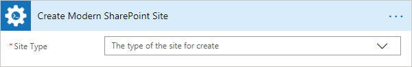

Once you did this, you will see the rest of parameters for this particular operation.

You can find the documentation for all operations included in "Create Modern SharePoint Site" action below:

- :ref:`create-team-site`
- :ref:`create-communication-site`

.. _create-team-site:

Create Team SharePoint Site
~~~~~~~~~~~~~~~~~~~~~~~~~~~~~~~~~~~~~~~~~~~~~~~~~~
.. rubric:: Output Parameters

.. list-table::
    :header-rows: 1
    :widths: 10 30 20

    *  -  Parameter
       -  Description
       -  Example
    *  -  Web URL
       -  The URL of a new site.
       -  :code:`https://contoso.sharepoint.com/sites/team-site`

.. rubric:: Input Parameters

.. list-table::
    :header-rows: 1
    :widths: 10 30 20

    *  -  Parameter
       -  Description
       -  Example
    *  -  URL
       -  The full qualified URL (e.g. :code:`https://yourtenant.sharepoint.com/sites/team-site`).
       -  :code:`https://contoso.sharepoint.com/sites/team-site`
       
    *  -  Display Name
       -  The title of the site to create.
       -  Team site

    *  -  Classification
       -  The Site classification to use.
       -  HR

    *  -  Description
       -  The description to use for the site.
       -  Site for HR

    *  -  Is Public
       -  Defines whether the Office 365 Group will be public (default), or private.
       -  Yes

.. rubric:: Example

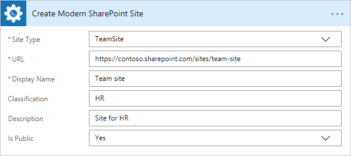

.. _create-communication-site:

Create Communication SharePoint Site
~~~~~~~~~~~~~~~~~~~~~~~~~~~~~~~~~~~~~~~~~~~~~~~~~~
.. rubric:: Output Parameters

.. list-table::
    :header-rows: 1
    :widths: 10 30 20

    *  -  Parameter
       -  Description
       -  Example
    *  -  Web URL
       -  The URL of a new site.
       -  :code:`https://contoso.sharepoint.com/sites/communication-site`

.. rubric:: Input Parameters

.. list-table::
    :header-rows: 1
    :widths: 10 30 20

    *  -  Parameter
       -  Description
       -  Example
    *  -  URL
       -  The full qualified URL (e.g. :code:`https://yourtenant.sharepoint.com/sites/communication-site` or :code:`https://yourtenant.sharepoint.com/teams/communication-site`).
       -  :code:`https://contoso.sharepoint.com/sites/communication-site`
       
    *  -  Title
       -  The title of the site to create.
       -  Communication site

    *  -  Description
       -  The description to use for the site.
       -  Site for HR

    *  -  Site Design
       -  The built-in site design to used.
       -  ::

            Topic
            Showcase
            Blank

    *  -  LCID
       -  The language to use for the site. If not specified will default to the language setting of the clientcontext.
       -  1033

    *  -  Allow File Sharing For Guest Users
       -  If set to true, file sharing for guest users will be allowed.
       -  Yes

    *  -  Classification
       -  The site classification to use.
       -  HR

.. rubric:: Example

.. image:: ../../_static/img/flow/sharepoint/CreateCommunicationSiteExample.png
   :alt: Create Communication SharePoint Site Example 

Get SharePoint Site Option Value  
----------------------------------
Reads a value from SharePoint Site Options (Property Bag) with the help of Microsoft Flow.

.. rubric:: Output Parameters

.. list-table::
    :header-rows: 1
    :widths: 10 30 20

    *  -  Parameter
       -  Description
       -  Example
    *  -  Option Value
       -  A value of a specific SharePoint site option.
       -  SPOStandard

.. rubric:: Input Parameters

.. list-table::
    :header-rows: 1
    :widths: 10 30 20

    *  -  Parameter
       -  Description
       -  Example
    *  -  Option Name
       -  Name of the option.
       -  sharepointhelpoverride

    *  -  SharePoint Site Url
       -  This property defines the context of the action. The action will be executed on specified SharePoint site.
       -  :code:`https://contoso.sharepoint.com/sites/subSite`

.. rubric:: Example

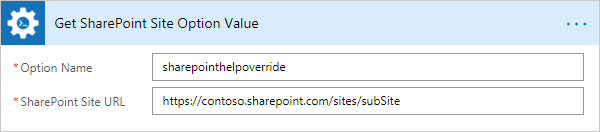

Update SharePoint Site Properties
----------------------------------
Updates web properties with the help of Microsoft Flow.

.. rubric:: Input Parameters

.. list-table::
    :header-rows: 1
    :widths: 10 30 20

    *  -  Parameter
       -  Description
       -  Example
    *  -  SharePoint Site Url
       -  This property defines the context of the action. The action will be executed on specified SharePoint site.
       -  :code:`https://contoso.sharepoint.com/sites/subSite`  

    *  -  Title
       -  The title for the website.     
       -  Sales  
         
    *  -  Description
       -  The description for the site.   
       -  The site for Sales department
         
    *  -  Quick Launch Enabled
       -  A value that specifies whether the Quick Launch area is enabled on the website.
       -  Yes 
         
    *  -  Tree View Enabled
       -  A value that specifies whether the SharePoint Foundation TreeView is enabled in the left navigational area of website pages.
       -  Yes 
         
    *  -  Site Logo URL
       -  The absolute URL of the website logo.     
       -  :code:`https://contoso.sharepoint.com/sites/subSite/pics/logo.png` 
         
    *  -  Alternate CSS URL
       -  The URL for an alternate cascading style sheet (CSS) to use in the website.
       -  :code:`https://contoso.sharepoint.com/sites/subSite/css/alternate_css.css`
         
    *  -  Associated Member Group
       -  The users who have been given contribute permissions to the website.
       -  SalesMembersGroup 
         
    *  -  Associated Owner Group
       -  The associated owner groups of the website.
       -  SalesOwnersGroup
         
    *  -  Associated Visitor Group
       -  The associated visitor group of the website.
       -  SalesVisitorsGroup 
         
    *  -  Contains Confidential Info
       -  A value that specifies whether the SharePoint site contain a confidential information.
       -  Yes 
         
    *  -  Custom Master URL
       -  The URL for a custom master page file to apply to the website.
       -  :code:`https://contoso.sharepoint.com/sites/subSite/masterurl/custom.master` 

    *  -  Enable Minimal Download
       -  A value that specifies whether the Web site should use Minimal Download Strategy.
       -  Yes  
         
    *  -  Is Multilingual
       -  A value that indicates whether a multilingual user interface is enabled for the website.
       -  Yes 
         
    *  -  Master URL
       -  The URL of the master page that is used for the website.
       -  :code:`https://contoso.sharepoint.com/sites/subSite/masterurl/master.master` 
         
    *  -  Members Can Share
       -  Allow Members to share the site and invite others.
       -  Yes 
         
    *  -  No Crawl
       -  A value that specifies whether searching is enabled for the website.
       -  Yes 
         
    *  -  Overwrite Translations on Change
       -  A value that indicates whether changes made to user-specified text in the default language should automatically overwrite existing translations made in all alternate languages.
       -  Yes 
         
    *  -  Request Access Email
       -  The e-mail address to which requests for access are sent.
       -  :code:`admin@contoso.onmicrosoft.com`
         
    *  -  Save Site as Template Enabled
       -  A value that specifies whether the Web site can be saved as a site template.
       -  Yes 
         
    *  -  Server Relative URL
       -  The server-relative URL for the website.
       -  Sales_Department 
         
    *  -  Syndication Enabled
       -  A value that specifies whether Really Simple Syndication (RSS) is enabled in the website.
       -  Yes 
         
    *  -  UI Version
       -  The current version number of the user interface.
       -  1

.. rubric:: Example

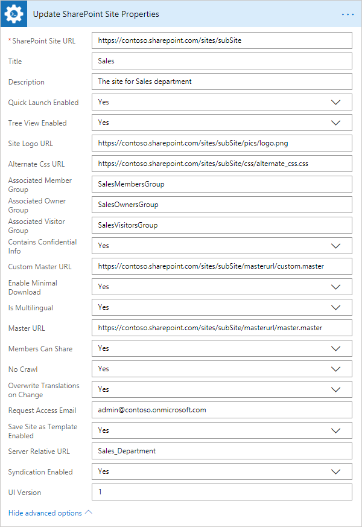

Delete SharePoint Site
------------------------
Deletes the SharePoint site by a specific URL with the help of Microsoft Flow.

.. rubric:: Input Parameters

.. list-table::
    :header-rows: 1
    :widths: 10 30 20

    *  -  Parameter
       -  Description
       -  Example
    *  -  SharePoint Site Url
       -  This property defines the context of the action. The action will be executed on specified SharePoint site.
       -  :code:`https://contoso.sharepoint.com/sites/subSite`         

.. rubric:: Example

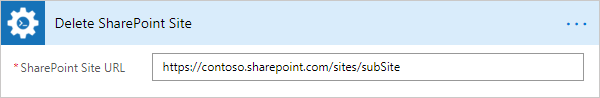

Invite External User to SharePoint
---------------------------------------
Invites external users with specific permission to a SharePoint site, a specific SharePoint group or an item in a SharePoint list with the help of Microsoft Flow.

.. important:: 

  This action is not available in public connector in Microsoft Flow yet. It will become available soon. If you want to use this action right now, you can `add this connector as a custom connector <../create-custom-connector.html>`_.

"Invite External User to SharePoint" is a complex action that includes 3 different operations for inviting external users to a SharePoint site, a SharePoint list item or a SharePoint group.

Once you added this action to your Flow, you need to specify the initial parameter:

* Target - the target of the operation: Site, Item, Group

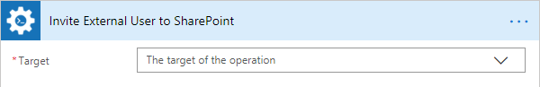

Once you did this, you will see the rest of parameters for this particular operation.

You can find the documentation for all operations included in "Create Modern SharePoint Site" action below:

- :ref:`invite-external-user-site`
- :ref:`invite-external-user-item`
- :ref:`invite-external-user-group`

Also, you can find examples how to share a site with external users in `this article <https://plumsail.com/docs/actions/v1.x/flow/how-tos/sharepoint/how-to-share-SharePoint-sites.html>`_ and how to share documents in `this one <https://plumsail.com/docs/actions/v1.x/flow/how-tos/sharepoint/how-to-share-SharePoint-documents.html>`_.

.. _invite-external-user-site:

Invite External User to SharePoint Site
~~~~~~~~~~~~~~~~~~~~~~~~~~~~~~~~~~~~~~~~~
Invites external users with specific permission to an SharePoint site with the help of Microsoft Flow.

.. rubric:: Input Parameters

.. list-table::
    :header-rows: 1
    :widths: 10 30 20

    *  -  Parameter
       -  Description
       -  Example
    *  -  Email Addresses
       -  Email addresses to send an invitation, you can specify multiple using semicolon as delimiter.
       -  :code:`Chris@plumsail.com;John@plumsail.com`

    *  -  Email Body
       -  Body of the invitation message.
       -  External Users

    *  -  Permission Role
       -  The permission role which will granted to the user. You may specify a custom value for this field. 
       -  ::

            Full Control
            Design
            Edit
            Contribute
            Read
            Approve

    *  -  SharePoint Site URL
       -  This property defines the context of the action. The action will be executed on specified SharePoint site.
       -  :code:`https://contoso.sharepoint.com/sites/subSite`

.. rubric:: Example

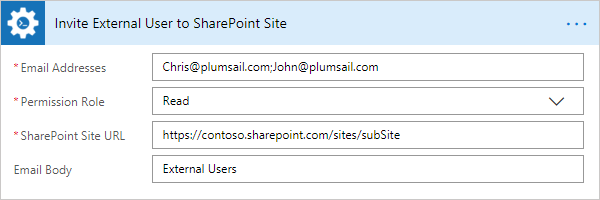

.. _invite-external-user-item:

Invite External User to SharePoint Item
~~~~~~~~~~~~~~~~~~~~~~~~~~~~~~~~~~~~~~~~~~~
Invites external users with specific permission to an item in a SharePoint list with the help of Microsoft Flow.

.. rubric:: Input Parameters

.. list-table::
    :header-rows: 1
    :widths: 10 30 20

    *  -  Parameter
       -  Description
       -  Example
    *  -  List URL
       -  List name, URL or Guid.
       -  Employees
    
    *  -  Item ID
       -  ID of the item for which you want to grant the permission.
       -  25
    
    *  -  Email Addresses
       -  Email addresses to send an invitation, you can specify multiple using semicolon as delimiter.
       -  :code:`Chris@plumsail.com;John@plumsail.com`

    *  -  Email Body
       -  Body of the invitation message.
       -  External Users

    *  -  Permission Role
       -  The permission role which will granted to the user. You may specify a custom value for this field. 
       -  ::

            Full Control
            Design
            Edit
            Contribute
            Read
            Approve

    *  -  SharePoint Site URL
       -  This property defines the context of the action. The action will be executed on specified SharePoint site.
       -  :code:`https://contoso.sharepoint.com/sites/subSite`

.. rubric:: Example

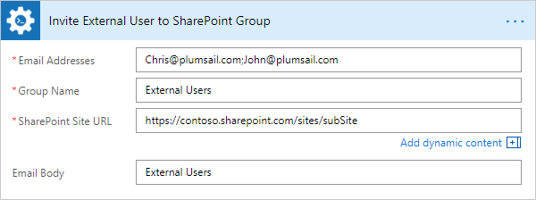

.. _invite-external-user-group:

Invite External User to SharePoint Group
~~~~~~~~~~~~~~~~~~~~~~~~~~~~~~~~~~~~~~~~~~
Invites external users to an specific SharePoint group with the help of Microsoft Flow.

.. rubric:: Input Parameters

.. list-table::
    :header-rows: 1
    :widths: 10 30 20

    *  -  Parameter
       -  Description
       -  Example    
    *  -  Email Addresses
       -  Email addresses to send an invitation, you can specify multiple using semicolon as delimiter.
       -  :code:`Chris@plumsail.com;John@plumsail.com`

    *  -  Email Body
       -  Body of the invitation message.
       -  External Users

    *  -  Group Name
       -  Name of the group which will include invited users. 
       -  External Users

    *  -  SharePoint Site URL
       -  This property defines the context of the action. The action will be executed on specified SharePoint site.
       -  :code:`https://contoso.sharepoint.com/sites/subSite`

.. rubric:: Example

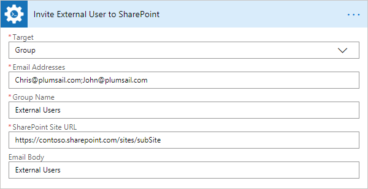

Set Default SharePoint Site Group
----------------------------------

Configure default groups for a site with the help of Microsoft Flow. It is alternative of the permsetup.aspx page in SharePoint UI.

.. rubric:: Input Parameters

.. list-table::
    :header-rows: 1
    :widths: 10 30 20

    *  -  Parameter
       -  Description
       -  Example
    *  -  Group Type
       -  Type of the group: owners, members or visitors     
       -  Owners

    *  -  Group Name
       -  Name or ID of the group
       -  Sales owners

    *  -  SharePoint Site Url
       -  This property defines the context of the action. The action will be executed on specified SharePoint site.
       -  :code:`https://contoso.sharepoint.com/sites/subSite`         

.. rubric:: Example

.. image:: ../../_static/img/flow/sharepoint/SetDefaultSiteGroupExample.png
   :alt: Set Default SharePoint Site Group Example

Copy SharePoint Document from Library
-----------------------------------------
Copies the document from the document library to the specified URL with the help of Microsoft Flow. You can copy the document to another document library cross-site, to another site collection or to another folder.

.. rubric:: Output Parameters

.. list-table::
    :header-rows: 1
    :widths: 10 30 20

    *  -  Parameter
       -  Description
       -  Example
    *  -  Document ID
       -  The ID of the copied document
       -  ``1024``
    *  -  Document URL
       -  The URL of the copied document
       -  :code:`https://contoso.sharepoint.com/sites/subSite/Folder2/NewDoc.docx`

.. rubric:: Input Parameters

.. list-table::
    :header-rows: 1
    :widths: 10 30 20

    *  -  Parameter
       -  Description
       -  Example
    *  -  Source URL
       -  The URL of the document to be copied. You can use full URL as well as domain relative URL.
       -  ::
       
            /sites/subSite/Folder1/Doc.docx
            https://contoso.sharepoint.com/sites/subSite/Folder1/Doc.docx

    *  -  Destination URL
       -  The URL where the source document will be copied. You can use full URL as well as domain relative URL.
       -  ::

            https://contoso.sharepoint.com/sites/subSite/Folder2/
            https://contoso.sharepoint.com/sites/subSite/Folder2/NewDoc.docx

    *  -  SharePoint Site URL
       -  This property defines the context of the action. The action will be executed on specified SharePoint site.
       -  :code:`https://contoso.sharepoint.com/sites/subSite`

.. rubric:: Example

.. image:: ../../_static/img/flow/sharepoint/CopyDocumentFromLibraryExample.png
   :alt: Copy SharePoint Document from Library Example

Move SharePoint Document from Library
-----------------------------------------
Moves the document from the document library to the specified URL with the help of Microsoft Flow. You can move the document to another document library cross-site, to another site collection or to another folder.

.. rubric:: Output Parameters

.. list-table::
    :header-rows: 1
    :widths: 10 30 20

    *  -  Parameter
       -  Description
       -  Example
    *  -  Document ID
       -  The ID of the moved document
       -  ``1024``
    *  -  Document URL
       -  The URL of the moved document
       -  :code:`https://contoso.sharepoint.com/sites/subSite/Folder2/NewDoc.docx`

.. rubric:: Input Parameters

.. list-table::
    :header-rows: 1
    :widths: 10 30 20

    *  -  Parameter
       -  Description
       -  Example
    *  -  Source URL
       -  The URL of the document to be moved. You can use full URL as well as domain relative URL.
       -  ::
       
            /sites/subSite/LibraryName/FolderName/DocumentName.docx
            https://contoso.sharepoint.com/sites/subSite/Folder1/Doc.docx

    *  -  Destination URL
       -  The URL where the source document will be moved. You can use full URL as well as domain relative URL.
       -  ::

            https://contoso.sharepoint.com/sites/subSite/Folder2/
            https://contoso.sharepoint.com/sites/subSite/Folder2/NewDoc.docx

    *  -  SharePoint Site URL
       -  This property defines the context of the action. The action will be executed on specified SharePoint site.
       -  :code:`https://contoso.sharepoint.com/sites/subSite`

.. rubric:: Example

.. image:: ../../_static/img/flow/sharepoint/MoveDocumentFromLibraryExample.png
   :alt: Move SharePoint Document from Library Example   

Remove SharePoint Document by URL
-----------------------------------------
Remove a SharePoint document by a specific URL with the help of Microsoft Flow.

.. rubric:: Input Parameters

.. list-table::
    :header-rows: 1
    :widths: 10 30 20

    *  -  Parameter
       -  Description
       -  Example
    *  -  Document URL
       -  The URL of the document to be removed. You can use full URL as well as domain relative URL.
       -  ::

            /sites/subSite/LibraryName/FolderName/DocumentName.docx
            https://contoso.sharepoint.com/sites/subSite/Folder/Doc.docx

    *  -  SharePoint Site URL
       -  This property defines the context of the action. The action will be executed on specified SharePoint site.
       -  :code:`https://contoso.sharepoint.com/sites/subSite`

.. rubric:: Example

.. image:: ../../_static/img/flow/sharepoint/RemoveDocumentByURLExample.png
   :alt: Remove SharePoint Document by URL Example   

Create SharePoint Document Set
-----------------------------------------
Creates a new document set in the document library by the specified URL with the help of Microsoft Flow.

.. rubric:: Output Parameters

.. list-table::
    :header-rows: 1
    :widths: 10 30 20

    *  -  Parameter
       -  Description
       -  Example
    *  -  Document set ID
       -  The ID of the created document set
       -  ``1024``
    *  -  Document set URL
       -  The URL of the created document set
       -  :code:`https://contoso.sharepoint.com/sites/subSite/Lib/DocSet`

.. rubric:: Input Parameters

.. list-table::
    :header-rows: 1
    :widths: 10 30 20

    *  -  Parameter
       -  Description
       -  Example
    *  -  DocumentSet Name
       -  The name of the document set.
       -  DocSet

    *  -  Target List
       -  The name or the URL of a library or a list where the document set will be created. You can use full URL as well as domain relative URL.
       -  :code:`https://contoso.sharepoint.com/sites/subSite/Lib/`

    *  -  SharePoint Site URL
       -  This property defines the context of the action. The action will be executed on specified SharePoint site.
       -  :code:`https://contoso.sharepoint.com/sites/subSite`

.. rubric:: Example

.. image:: ../../_static/img/flow/sharepoint/CreateSharePointDocumentSetExample.png
   :alt: Create SharePoint Document Set Example

Copy SharePoint Document Set
-----------------------------------------
Copies a SharePoint document set from the document library to the specified URL with the help of Microsoft Flow. You can copy the document sets to another document library cross-site, to another site collection or to another folder.

.. rubric:: Output Parameters

.. list-table::
    :header-rows: 1
    :widths: 10 30 20

    *  -  Parameter
       -  Description
       -  Example
    *  -  Document set ID
       -  The ID of the copied document set
       -  ``1024``
    *  -  Document set URL
       -  The URL of the copied document set
       -  :code:`https://contoso.sharepoint.com/sites/subSite/Folder2/NewDocSet`

.. rubric:: Input Parameters

.. list-table::
    :header-rows: 1
    :widths: 10 30 20

    *  -  Parameter
       -  Description
       -  Example
    *  -  Source URL
       -  The URL of the document set to be copied. You can use full URL as well as domain relative URL.
       -  ::
       
            /sites/subSite/LibraryName/FolderName/DocumentSet
            https://contoso.sharepoint.com/sites/subSite/Folder1/DocSet

    *  -  Destination URL
       -  The URL where the source document set will be copied. You can use full URL as well as domain relative URL. If the url ends with slash '/' the document sets will be placed in this folder without name changes. Otherwise, the document set will be renamed.
       -  ::

            https://contoso.sharepoint.com/sites/subSite/Folder2/
            https://contoso.sharepoint.com/sites/subSite/Folder2/NewDocSet

    *  -  SharePoint Site URL
       -  This property defines the context of the action. The action will be executed on specified SharePoint site.
       -  :code:`https://contoso.sharepoint.com/sites/subSite`

.. rubric:: Example

.. image:: ../../_static/img/flow/sharepoint/CopyDocumentSetExample.png
   :alt: Copy SharePoint Document Set Example
   
Move SharePoint Document Set
-----------------------------------------
Moves a SharePoint document set from the document library to the specified URL with the help of Microsoft Flow. You can move the document sets to another document library cross-site, to another site collection or to another folder.

.. rubric:: Output Parameters

.. list-table::
    :header-rows: 1
    :widths: 10 30 20

    *  -  Parameter
       -  Description
       -  Example
    *  -  Document set ID
       -  The ID of the moved document set
       -  ``1024``
    *  -  Document set URL
       -  The URL of the moved document set
       -  :code:`https://contoso.sharepoint.com/sites/subSite/Folder2/NewDocSet`

.. rubric:: Input Parameters

.. list-table::
    :header-rows: 1
    :widths: 10 30 20

    *  -  Parameter
       -  Description
       -  Example
    *  -  Source URL
       -  The URL of the document set to be moved. You can use full URL as well as domain relative URL.
       -  ::
       
            /sites/subSite/LibraryName/FolderName/DocumentSet
            https://contoso.sharepoint.com/sites/subSite/Folder1/DocSet

    *  -  Destination URL
       -  The URL where the source document set will be moved. You can use full URL as well as domain relative URL. If the url ends with slash '/' the document sets will be placed in this folder without name changes. Otherwise, the document set will be renamed.
       -  ::

            https://contoso.sharepoint.com/sites/subSite/Folder2/
            https://contoso.sharepoint.com/sites/subSite/Folder2/NewDocSet

    *  -  SharePoint Site URL
       -  This property defines the context of the action. The action will be executed on specified SharePoint site.
       -  :code:`https://contoso.sharepoint.com/sites/subSite`

.. rubric:: Example

.. image:: ../../_static/img/flow/sharepoint/MoveDocumentSetExample.png
   :alt: Move SharePoint Document Set Example

Create SharePoint Folder by URL
-----------------------------------------
Creates a new SharePoint folder in the document library by the specified URL with the help of Microsoft Flow.

.. rubric:: Output Parameters

.. list-table::
    :header-rows: 1
    :widths: 10 30 20

    *  -  Parameter
       -  Description
       -  Example
    *  -  Folder ID
       -  The ID of the created folder
       -  ``1024``
    *  -  Folder URL
       -  The URL of the created folder
       -  :code:`https://contoso.sharepoint.com/sites/subSite/Folder2/Folder`

.. rubric:: Input Parameters

.. list-table::
    :header-rows: 1
    :widths: 10 30 20

    *  -  Parameter
       -  Description
       -  Example
    *  -  Folder URL
       -  The URL of the folder. If you specify full path, you can create several folders.
       -  :code:`https://contoso.sharepoint.com/sites/subSite/Folder2/Folder`

    *  -  SharePoint Site URL
       -  This property defines the context of the action. The action will be executed on specified SharePoint site.
       -  :code:`https://contoso.sharepoint.com/sites/subSite`

.. rubric:: Example

.. image:: ../../_static/img/flow/sharepoint/CreateFolderByURLExample.png
   :alt: Create SharePoint Folder by URL Example

Create SharePoint Folder in List
-----------------------------------------
Creates a new SharePoint folder in the document library or list using the specified path with the help of Microsoft Flow.

.. rubric:: Output Parameters

.. list-table::
    :header-rows: 1
    :widths: 10 30 20

    *  -  Parameter
       -  Description
       -  Example
    *  -  Folder ID
       -  The ID of the created folder
       -  ``1024``
    *  -  Folder URL
       -  The URL of the created folder
       -  :code:`https://contoso.sharepoint.com/sites/subSite/Lib/Folder1/Folder2`

.. rubric:: Input Parameters

.. list-table::
    :header-rows: 1
    :widths: 10 30 20

    *  -  Parameter
       -  Description
       -  Example
    *  -  Target List
       -  The name or the URL of the library or the list where the folder will be created. You can use full URL as well as domain relative URL.
       -  ::

            LibraryName
            /sites/subSite/LibraryName
            https://contoso.sharepoint.com/sites/subSite/Lib

    *  -  Folder Path
       -  The path where the folder will be created. The action will create all folders included into the path.
       -  :code:`Folder1/Folder2`

    *  -  SharePoint Site URL
       -  This property defines the context of the action. The action will be executed on specified SharePoint site.
       -  :code:`https://contoso.sharepoint.com/sites/subSite`

.. rubric:: Example

.. image:: ../../_static/img/flow/sharepoint/CreateFolderInListExample.png
   :alt: Create SharePoint Folder in List Example

Remove SharePoint Folder by URL
-----------------------------------------
Removes a SharePoint folder from the document library or list by the specified URL with the help of Microsoft Flow.

.. rubric:: Input Parameters

.. list-table::
    :header-rows: 1
    :widths: 10 30 20

    *  -  Parameter
       -  Description
       -  Example
    *  -  Folder URL
       -  The URL of the library where the source folder will be removed. You can use full URL as well as domain relative URL.
       -  ::

            /sites/subSite/LibraryName/FolderName
            https://contoso.sharepoint.com/sites/subSite/Lib/Folder

    *  -  SharePoint Site URL
       -  This property defines the context of the action. The action will be executed on specified SharePoint site.
       -  :code:`https://contoso.sharepoint.com/sites/subSite`

.. rubric:: Example

.. image:: ../../_static/img/flow/sharepoint/RemoveFolderByURLExample.png
   :alt: Remove SharePoint Folder by URL Example

Copy SharePoint Folder from Library
-----------------------------------------
Copies a SharePoint folder from the document library to the specified URL with the help of Microsoft Flow. You can copy the folder to another document library cross-site, to another site collection or to another folder.

.. rubric:: Output Parameters

.. list-table::
    :header-rows: 1
    :widths: 10 30 20

    *  -  Parameter
       -  Description
       -  Example
    *  -  Folder ID
       -  The ID of the copied folder
       -  ``1024``
    *  -  Folder URL
       -  The URL of the copied folder
       -  :code:`https://contoso.sharepoint.com/sites/subSite/Lib2/Folder2`

.. rubric:: Input Parameters

.. list-table::
    :header-rows: 1
    :widths: 10 30 20

    *  -  Parameter
       -  Description
       -  Example
    *  -  Source URL
       -  The URL of the folder to be copied. You can use full URL as well as domain relative URL.
       -  ::
            
            /sites/subSite/LibraryName/FolderName
            https://contoso.sharepoint.com/sites/subSite/Lib/Folder

    *  -  Destination URL
       -  The URL where the source folder will be copied. You can use full URL as well as domain relative URL
       -  ::

            https://contoso.sharepoint.com/sites/subSite/Lib2
            https://contoso.sharepoint.com/sites/subSite/Lib2/Folder2

    *  -  SharePoint Site URL
       -  This property defines the context of the action. The action will be executed on specified SharePoint site.
       -  :code:`https://contoso.sharepoint.com/sites/subSite`

.. rubric:: Example

.. image:: ../../_static/img/flow/sharepoint/CopyFolderFromLibraryExample.png
   :alt: Copy SharePoint Folder from Library Example

Move SharePoint Folder from Library
-----------------------------------------
Moves a SharePoint folder from the document library to the specified URL with the help of Microsoft Flow. You can move the folder to another document library cross-site, to another site collection or to another folder.

.. rubric:: Output Parameters

.. list-table::
    :header-rows: 1
    :widths: 10 30 20

    *  -  Parameter
       -  Description
       -  Example
    *  -  Folder ID
       -  The ID of the moved folder
       -  ``1024``
    *  -  Folder URL
       -  The URL of the moved folder
       -  :code:`https://contoso.sharepoint.com/sites/subSite/Lib2/Folder2`

.. rubric:: Input Parameters

.. list-table::
    :header-rows: 1
    :widths: 10 30 20

    *  -  Parameter
       -  Description
       -  Example
    *  -  Source URL
       -  The URL of the folder to be moved. You can use full URL as well as domain relative URL.
       -  ::
            
            /sites/subSite/LibraryName/FolderName
            https://contoso.sharepoint.com/sites/subSite/Lib/Folder

    *  -  Destination URL
       -  The URL where the source folder will be moved. You can use full URL as well as domain relative URL
       -  ::

            https://contoso.sharepoint.com/sites/subSite/Lib2
            https://contoso.sharepoint.com/sites/subSite/Lib2/Folder2

    *  -  SharePoint Site URL
       -  This property defines the context of the action. The action will be executed on specified SharePoint site.
       -  :code:`https://contoso.sharepoint.com/sites/subSite`

.. rubric:: Example

.. image:: ../../_static/img/flow/sharepoint/MoveFolderFromLibraryExample.png
   :alt: Move SharePoint Folder from Library Example

Check In SharePoint Document
-----------------------------------------
Check-in a SharePoint document at the specified URL with the specified comment with the help of Microsoft Flow.

.. rubric:: Output Parameters

.. list-table::
    :header-rows: 1
    :widths: 10 30 20

    *  -  Parameter
       -  Description
       -  Example
    *  -  Document ID
       -  The ID of the document which was check in
       -  ``1024``
    *  -  Document URL
       -  The URL of the document which was check in
       -  :code:`https://contoso.sharepoint.com/sites/subSite/Lib/Doc.docx`

.. rubric:: Input Parameters

.. list-table::
    :header-rows: 1
    :widths: 10 30 20

    *  -  Parameter
       -  Description
       -  Example
    *  -  Document URL
       -  The URL of the document to check in.
       -  :code:`https://contoso.sharepoint.com/sites/subSite/Lib/Doc.docx`

    *  -  Comment
       -  The comment to accompany document check in.
       -  Comment to the document

    *  -  SharePoint Site URL
       -  This property defines the context of the action. The action will be executed on specified SharePoint site.
       -  :code:`https://contoso.sharepoint.com/sites/subSite`

.. rubric:: Example

.. image:: ../../_static/img/flow/sharepoint/CheckInDocumentExample.png
   :alt: Check In SharePoint Document Example

Check Out SharePoint Document
-----------------------------------------
Check-out a SharePoint document at the specified URL with the specified comment with the help of Microsoft Flow.

.. rubric:: Output Parameters

.. list-table::
    :header-rows: 1
    :widths: 10 30 20

    *  -  Parameter
       -  Description
       -  Example
    *  -  Document ID
       -  The ID of the document which was check out.
       -  ``1024``
    *  -  Document URL
       -  The URL of the document which was check out.
       -  :code:`https://contoso.sharepoint.com/sites/subSite/Lib/Doc.docx`

.. rubric:: Input Parameters

.. list-table::
    :header-rows: 1
    :widths: 10 30 20

    *  -  Parameter
       -  Description
       -  Example
    *  -  Document URL
       -  The URL of the document to check out.
       -  :code:`https://contoso.sharepoint.com/sites/subSite/Lib/Doc.docx`

    *  -  SharePoint Site URL
       -  This property defines the context of the action. The action will be executed on specified SharePoint site.
       -  :code:`https://contoso.sharepoint.com/sites/subSite`

.. rubric:: Example

.. image:: ../../_static/img/flow/sharepoint/CheckOutDocumentExample.png
   :alt: Check Out SharePoint Document Example

Create SharePoint Group
-----------------------------------------
Creates the SharePoint group with a specified name with the help of Microsoft Flow.

.. important:: 

  This action is not available in public connector in Microsoft Flow yet. It will become available soon. If you want to use this action right now, you can `add this connector as a custom connector <../create-custom-connector.html>`_.

.. rubric:: Input Parameters

.. list-table::
    :header-rows: 1
    :widths: 10 30 20

    *  -  Parameter
       -  Description
       -  Example
    *  -  Group Name
       -  The name of the SharePoint group.
       -  SharePointGroup

    *  -  SharePoint Site URL
       -  This property defines the context of the action. The action will be executed on specified SharePoint site.
       -  :code:`https://contoso.sharepoint.com/sites/subSite`

    *  -  Group Description
       -  The description of the SharePoint group.
       -  Can approve documents

    *  -  Group Owner
       -  The owner of the SharePoint group, can be email or the user login.
       -  :code:`m.anderson@contoso.onmicrosoft.com`

.. rubric:: Example

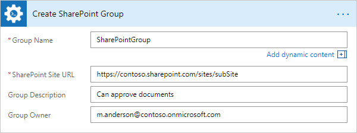

Update SharePoint Group Properties
-----------------------------------------
Updates SharePoint group properties with the help of Microsoft Flow.

.. important:: 

  This action is not available in public connector in Microsoft Flow yet. It will become available soon. If you want to use this action right now, you can `add this connector as a custom connector <../create-custom-connector.html>`_.

.. rubric:: Input Parameters

.. list-table::
    :header-rows: 1
    :widths: 10 30 20

    *  -  Parameter
       -  Description
       -  Example
    *  -  Group Name
       -  The name of the SharePoint group.
       -  SharePointGroup

    *  -  SharePoint Site URL
       -  This property defines the context of the action. The action will be executed on specified SharePoint site.
       -  :code:`https://contoso.sharepoint.com/sites/subSite`

    *  -  Title
       -  The title for the SharePoint group.
       -  New SharePoint Group
       
    *  -  Description
       -  The description of the SharePoint group.
       -  Can approve documents
       
    *  -  Owner
       -  The owner for the SharePoint group, which can be a user or another group.
       -  :code:`m.anderson@contoso.onmicrosoft.com`
       
    *  -  Allow Members Edit Membership
       -  A value that specifies whether group members can modify membership in the group.
       -  Yes
       
    *  -  Allow Request to Join Leave
       -  A value that specifies whether to allow users to request membership in the group and to allow users to request to leave the group.
       -  Yes
       
    *  -  Auto Accept Request to Join Leave
       -  A value that specifies whether users are automatically added or removed when they make a request.
       -  Yes
       
    *  -  Only Allow Members View Membership
       -  A value that specifies whether only group members are allowed to view the list of members in the group.
       -  Yes
       
    *  -  Request to Join Leave Email Setting
       -  The e-mail address to which membership requests are sent.
       -  :code:`m.anderson@contoso.onmicrosoft.com`

.. rubric:: Example

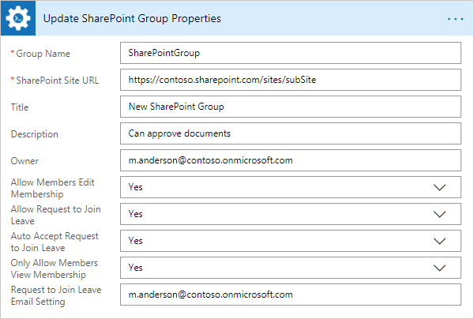

Remove SharePoint Group
-----------------------------------------
Removes the SharePoint group by a specified name with the help of Microsoft Flow.

.. important:: 

  This action is not available in public connector in Microsoft Flow yet. It will become available soon. If you want to use this action right now, you can `add this connector as a custom connector <../create-custom-connector.html>`_.

.. rubric:: Input Parameters

.. list-table::
    :header-rows: 1
    :widths: 10 30 20

    *  -  Parameter
       -  Description
       -  Example
    *  -  Group Name
       -  The name of the SharePoint group.
       -  SharePointGroup

    *  -  SharePoint Site URL
       -  This property defines the context of the action. The action will be executed on specified SharePoint site.
       -  :code:`https://contoso.sharepoint.com/sites/subSite`

.. rubric:: Example

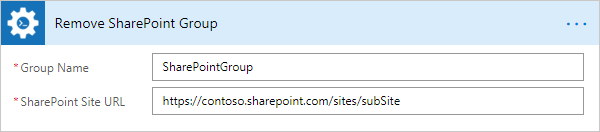

Add User to SharePoint Group
-----------------------------------------
Adds a user to a specific SharePoint group with the help of Microsoft Flow.

.. important:: 

  This action is not available in public connector in Microsoft Flow yet. It will become available soon. If you want to use this action right now, you can `add this connector as a custom connector <../create-custom-connector.html>`_.

.. rubric:: Input Parameters

.. list-table::
    :header-rows: 1
    :widths: 10 30 20

    *  -  Parameter
       -  Description
       -  Example
    *  -  Group Name
       -  The name of the SharePoint group.
       -  SharePointGroup

    *  -  User
       -  Login or email of the user which will be added to the specific group. Also you can specify multiple items using semicolon ';' delimited.
       -  :code:`m.anderson@contoso.onmicrosoft.com`

    *  -  SharePoint Site URL
       -  This property defines the context of the action. The action will be executed on specified SharePoint site.
       -  :code:`https://contoso.sharepoint.com/sites/subSite`

.. rubric:: Example

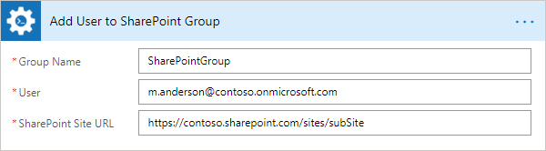

Is User Member of SharePoint Group
-----------------------------------------
Checks if a user is a member of a specifed SharePoint group with the help of Microsoft Flow.

.. important:: 

  This action is not available in public connector in Microsoft Flow yet. It will become available soon. If you want to use this action right now, you can `add this connector as a custom connector <../create-custom-connector.html>`_.

.. rubric:: Output Parameters

.. list-table::
    :header-rows: 1
    :widths: 10 30 20

    *  -  Parameter
       -  Description
       -  Example
    *  -  User Exists
       -  Boolean result of checking.
       -  True

.. rubric:: Input Parameters

.. list-table::
    :header-rows: 1
    :widths: 10 30 20

    *  -  Parameter
       -  Description
       -  Example
    *  -  Group Name
       -  The name of the SharePoint group.
       -  SharePointGroup

    *  -  User
       -  Login or email of a user for checking if he is a member in the specified group.
       -  :code:`m.anderson@contoso.onmicrosoft.com`

    *  -  SharePoint Site URL
       -  This property defines the context of the action. The action will be executed on specified SharePoint site.
       -  :code:`https://contoso.sharepoint.com/sites/subSite`

.. rubric:: Example

Get Members of SharePoint Group
-----------------------------------------
Gets members of a specific SharePoint group with the help of Microsoft Flow.

.. important:: 

  This action is not available in public connector in Microsoft Flow yet. It will become available soon. If you want to use this action right now, you can `add this connector as a custom connector <../create-custom-connector.html>`_.

.. rubric:: Output Parameters

.. list-table::
    :header-rows: 1
    :widths: 10 30 20

    *  -  Parameter
       -  Description
       -  Example
    *  -  Users
       -  The list of information about users that contain in a specified SharePoint group. Include Id, LoginName, Email.
       -  ::

              [{
                  "Id": "25",
                  "LoginName": "i:0#.f|membership|admin@contoso.onmicrosoft.com",
                  "Email": "admin@contoso.onmicrosoft.com"
              }, {
                  "Id": "32",
                  "LoginName": "i:0#.f|membership|m.anderson@contoso.onmicrosoft.com",
                  "Email": "m.anderson@contoso.onmicrosoft.com"
              }]

.. rubric:: Input Parameters

.. list-table::
    :header-rows: 1
    :widths: 10 30 20

    *  -  Parameter
       -  Description
       -  Example
    *  -  Group Name
       -  The name of the SharePoint group.
       -  SharePointGroup

    *  -  SharePoint Site URL
       -  This property defines the context of the action. The action will be executed on specified SharePoint site.
       -  :code:`https://contoso.sharepoint.com/sites/subSite`

.. rubric:: Example

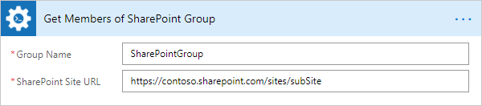

Remove User from SharePoint Group
-----------------------------------------
Removes a user from a specific SharePoint group with the help of Microsoft Flow.

.. important:: 

  This action is not available in public connector in Microsoft Flow yet. It will become available soon. If you want to use this action right now, you can `add this connector as a custom connector <../create-custom-connector.html>`_.

.. rubric:: Input Parameters

.. list-table::
    :header-rows: 1
    :widths: 10 30 20

    *  -  Parameter
       -  Description
       -  Example
    *  -  Group Name
       -  The name of the SharePoint group.
       -  SharePointGroup

    *  -  User
       -  Login or email of the user which will be removed from the specific group. Also you can specify multiple items using semicolon ';' delimited.
       -  :code:`m.anderson@contoso.onmicrosoft.com`

    *  -  SharePoint Site URL
       -  This property defines the context of the action. The action will be executed on specified SharePoint site.
       -  :code:`https://contoso.sharepoint.com/sites/subSite`

.. rubric:: Example

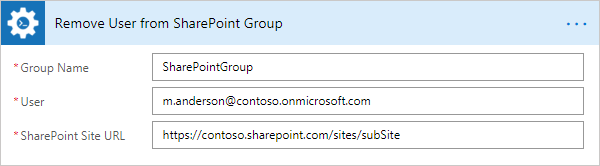

Get SharePoint Items By CAML Query
-----------------------------------------
Executes a CAML query on a list or on a document library and returns the collection of elements with the help of Microsoft Flow.

.. important:: 

  This action is not available in public connector in Microsoft Flow yet. It will become available soon. If you want to use this action right now, you can `add this connector as a custom connector <../create-custom-connector.html>`_.

.. rubric:: Output Parameters

.. list-table::
    :header-rows: 1
    :widths: 10 30 20

    *  -  Parameter
       -  Description
       -  Example
    *  -  Count Items
       -  Count of items in the result.
       -  21
    *  -  Items
       -  The output variable where the results will be saved. You may see the fields from found items as fields of "Items" in "Apply to each" action if you are used "ViewFields" tags in your CAML query and you will get JSON string as result of this action otherwise.
       -  ::

            {
                "countItems": 14,
                "items": [
                    {
                    "FileRef": "/sites/subSite/Shared Documents/Folder",
                    "FileLeafRef": "Folder"
                    },
                    {
                    "FileRef": "/sites/krios/Shared Documents/Folder/1.png",
                    "FileLeafRef": "1.png"
                    }
                ]
            }

.. rubric:: Input Parameters

.. list-table::
    :header-rows: 1
    :widths: 10 30 20

    *  -  Parameter
       -  Description
       -  Example
    *  -  List URL
       -  List name, URL or Guid.
       -  Documents

    *  -  Folder URL
       -  The server relative URL of a list folder from which results will be returned.
       -  :code:`/SiteUrl/Lists/ListName/Folder1/SubFolder`

    *  -  CAML Query
       -  CAML query that will be run.
       -  ::

            <View Scope="RecursiveAll">
                <Query>
                    <Where>
                        <Contains>
                            <FieldRef Name="FileLeafRef" />
                            <Value Type="Text">Contract</Value>
                        </Contains>
                    </Where>
                </Query>
                <ViewFields>
                    <FieldRef Name="FileRef"/>
                    <FieldRef Name="FileLeafRef"/>
                </ViewFields>
            </View>

    *  -  SharePoint Site URL
       -  This property defines the context of the action. The action will be executed on specified SharePoint site.
       -  :code:`https://contoso.sharepoint.com/sites/subSite`

.. rubric:: Example

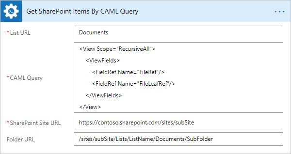

Get SharePoint Item Versions History
-----------------------------------------
Returns the changes history for the specific field from the SharePoint list item with the help of Microsoft Flow.

.. important:: 

  This action is not available in public connector in Microsoft Flow yet. It will become available soon. If you want to use this action right now, you can `add this connector as a custom connector <../create-custom-connector.html>`_.

.. rubric:: Output Parameters

.. list-table::
    :header-rows: 1
    :widths: 10 30 20

    *  -  Parameter
       -  Description
       -  Example
    *  -  Count Versions
       -  Count of versions.
       -  2
    *  -  Versions
       -  The list of information about each version that includes Editor, Modified, and Value.
       -  ::

            [
                {
                    "Editor": "10;#John Smith,#i:0#.f|membership|john@plumsail.onmicrosoft.com,#john@plumsail.onmicrosoft.com,#john@plumsail.onmicrosoft.com,#John Smith",
                    "Modified": "2016-04-15T16:48:00+00:00",
                    "Value": "Test 3"
                },
                {
                    "Editor": "10;#John Smith,#i:0#.f|membership|john@plumsail.onmicrosoft.com,#john@plumsail.onmicrosoft.com,#john@plumsail.onmicrosoft.com,#John Smith",
                    "Modified": "2016-04-15T16:47:12+00:00",
                    "Value": "Test 2"
                }
            ]

.. rubric:: Input Parameters

.. list-table::
    :header-rows: 1
    :widths: 10 30 20

    *  -  Parameter
       -  Description
       -  Example
    *  -  List URL
       -  List name, URL or Guid.
       -  Documents

    *  -  Item ID
       -  Item ID of the item for which you want to get the version history.
       -  10

    *  -  Field Name
       -  Name of the field for which you want to get the version history.
       -  Title

    *  -  SharePoint Site URL
       -  This property defines the context of the action. The action will be executed on specified SharePoint site.
       -  :code:`https://contoso.sharepoint.com/sites/subSite`

.. rubric:: Example

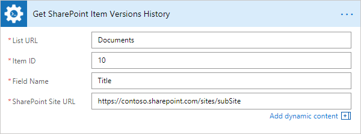

Copy SharePoint Item Attachments to URL
-----------------------------------------
Copies attachments from the SharePoint list item to the library using the specified folder URL with the help of Microsoft Flow.

.. important:: 

  This action is not available in public connector in Microsoft Flow yet. It will become available soon. If you want to use this action right now, you can `add this connector as a custom connector <../create-custom-connector.html>`_.

.. rubric:: Output Parameters

.. list-table::
    :header-rows: 1
    :widths: 10 30 20

    *  -  Parameter
       -  Description
       -  Example
    *  -  File URLs
       -  The list of copied files URLs.
       -  ::

            [
                'https://contoso.sharepoint.com/sites/subSite/SharedDocuments/Doc1.docx',
                'https://contoso.sharepoint.com/sites/subSite/SharedDocuments/Doc2.docx'
            ]

.. rubric:: Input Parameters

.. list-table::
    :header-rows: 1
    :widths: 10 30 20

    *  -  Parameter
       -  Description
       -  Example
    *  -  List URL
       -  List name, URL or Guid.
       -  Issues

    *  -  Item ID
       -  The ID of the source item.
       -  22

    *  -  Destination Folder URL
       -  The URL of the folder where the attachments will be copied.
       -  https://contoso.sharepoint.com/sites/subSite/SharedDocuments/

    *  -  Overwrite
       -  Overwrite if a file with the same name already exists.
       -  Yes

    *  -  SharePoint Site URL
       -  This property defines the context of the action. The action will be executed on specified SharePoint site.
       -  :code:`https://contoso.sharepoint.com/sites/subSite`

.. rubric:: Example

Move SharePoint Item Attachments to URL
-----------------------------------------
Moves attachments from the SharePoint list item to the library using the specified folder URL with the help of Microsoft Flow.

.. important:: 

  This action is not available in public connector in Microsoft Flow yet. It will become available soon. If you want to use this action right now, you can `add this connector as a custom connector <../create-custom-connector.html>`_.

.. rubric:: Output Parameters

.. list-table::
    :header-rows: 1
    :widths: 10 30 20

    *  -  Parameter
       -  Description
       -  Example
    *  -  File URLs
       -  The list of moved files URLs.
       -  ::

            [
                'https://contoso.sharepoint.com/sites/subSite/SharedDocuments/Doc1.docx',
                'https://contoso.sharepoint.com/sites/subSite/SharedDocuments/Doc2.docx'
            ]

.. rubric:: Input Parameters

.. list-table::
    :header-rows: 1
    :widths: 10 30 20

    *  -  Parameter
       -  Description
       -  Example
    *  -  List URL
       -  List name, URL or Guid.
       -  Issues

    *  -  Item ID
       -  The ID of the source item.
       -  22

    *  -  Destination Folder URL
       -  The URL of the folder where the attachments will be moved.
       -  https://contoso.sharepoint.com/sites/subSite/SharedDocuments/

    *  -  Overwrite
       -  Overwrite if a file with the same name already exists.
       -  Yes

    *  -  SharePoint Site URL
       -  This property defines the context of the action. The action will be executed on specified SharePoint site.
       -  :code:`https://contoso.sharepoint.com/sites/subSite`

.. rubric:: Example

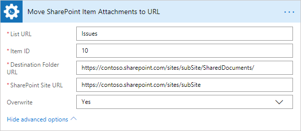

Add Content Type to SharePoint List
-----------------------------------------
Adds the specified content type to a SharePoint list with the help of Microsoft Flow.

.. important:: 

  This action is not available in public connector in Microsoft Flow yet. It will become available soon. If you want to use this action right now, you can `add this connector as a custom connector <../create-custom-connector.html>`_.

.. rubric:: Input Parameters

.. list-table::
    :header-rows: 1
    :widths: 10 30 20

    *  -  Parameter
       -  Description
       -  Example
    *  -  List URL
       -  List name, URL or Guid.
       -  Employees

    *  -  Content Type Name
       -  Name of the content type.
       -  Contact

    *  -  Make It Default
       -  Make the content type default for the list.
       -  Yes

    *  -  SharePoint Site URL
       -  This property defines the context of the action. The action will be executed on specified SharePoint site.
       -  :code:`https://contoso.sharepoint.com/sites/subSite`

.. rubric:: Example

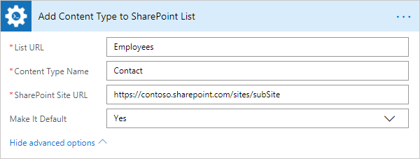

Copy List Item to SharePoint List
-----------------------------------------
Copies the specified list item to another SharePoint list with the help of Microsoft Flow.

.. important:: 

  This action is not available in public connector in Microsoft Flow yet. It will become available soon. If you want to use this action right now, you can `add this connector as a custom connector <../create-custom-connector.html>`_.

.. rubric:: Output Parameters

.. list-table::
    :header-rows: 1
    :widths: 10 30 20

    *  -  Parameter
       -  Description
       -  Example
    *  -  Result Item ID
       -  The ID of the copied item in the new SharePoint list.
       -  22

.. rubric:: Input Parameters

.. list-table::
    :header-rows: 1
    :widths: 10 30 20

    *  -  Parameter
       -  Description
       -  Example
    *  -  List URL
       -  List name, URL or Guid.
       -  Issues

    *  -  Item ID
       -  The ID of the source item.
       -  10

    *  -  Destination List URL
       -  The URL of the destination list. This list must contain same fields like in the source list.
       -  https://contoso.sharepoint.com/sites/subSite/Lists/Problems

    *  -  Copy Attachments
       -  Copy the item with attached files or not.
       -  Yes

    *  -  SharePoint Site URL
       -  This property defines the context of the action. The action will be executed on specified SharePoint site.
       -  :code:`https://contoso.sharepoint.com/sites/subSite`

.. rubric:: Example

.. image:: ../../_static/img/flow/sharepoint/CopyListItemSharePointListExample.png
   :alt: Copy List Item to SharePoint List Example

Move List Item to SharePoint List
-----------------------------------------
Moves the specified list item to another SharePoint list with the help of Microsoft Flow.

.. important:: 

  This action is not available in public connector in Microsoft Flow yet. It will become available soon. If you want to use this action right now, you can `add this connector as a custom connector <../create-custom-connector.html>`_.

.. rubric:: Output Parameters

.. list-table::
    :header-rows: 1
    :widths: 10 30 20

    *  -  Parameter
       -  Description
       -  Example
    *  -  Result Item ID
       -  The ID of the moved item in the new SharePoint list.
       -  22

.. rubric:: Input Parameters

.. list-table::
    :header-rows: 1
    :widths: 10 30 20

    *  -  Parameter
       -  Description
       -  Example
    *  -  List URL
       -  List name, URL or Guid.
       -  Issues

    *  -  Item ID
       -  The ID of the source item.
       -  10

    *  -  Destination List URL
       -  The URL of the destination list. This list must contain same fields like in the source list.
       -  https://contoso.sharepoint.com/sites/subSite/Lists/Problems

    *  -  Move Attachments
       -  Move the item with attached files or not.
       -  Yes

    *  -  SharePoint Site URL
       -  This property defines the context of the action. The action will be executed on specified SharePoint site.
       -  :code:`https://contoso.sharepoint.com/sites/subSite`

.. rubric:: Example

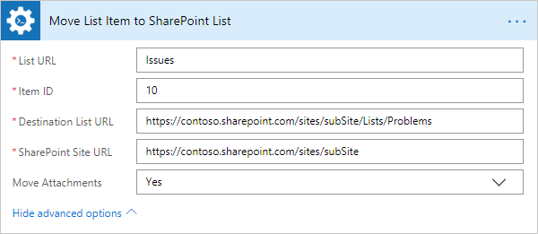

Start SharePoint Site Workflow (2013)
-----------------------------------------
Starts a SharePoint site level workflow and pass input parameters, if they were specified. The action can run only 2013 workflows with the help of Microsoft Flow.

.. important:: 

  This action is not available in public connector in Microsoft Flow yet. It will become available soon. If you want to use this action right now, you can `add this connector as a custom connector <../create-custom-connector.html>`_.

.. rubric:: Output Parameters

.. list-table::
    :header-rows: 1
    :widths: 10 30 20

    *  -  Parameter
       -  Description
       -  Example
    *  -  Workflow GUID
       -  Guid of a site level workflow that was started.
       -  {89823af6-95f8-4694-85ba-665abc180f1c}

.. rubric:: Input Parameters

.. list-table::
    :header-rows: 1
    :widths: 10 30 20

    *  -  Parameter
       -  Description
       -  Example
    *  -  Workflow Name
       -  Name of the workflow which will be started.
       -  Send notifications

    *  -  Input Parameters
       -  JSON string that contains input parameters for workflow.
       -  ::

            {
                "Address":"john@plumsail.com",
                "Body":"Notification message"
            }

    *  -  SharePoint Site URL
       -  This property defines the context of the action. The action will be executed on specified SharePoint site.
       -  :code:`https://contoso.sharepoint.com/sites/subSite`

.. rubric:: Example

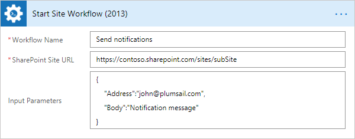

Start SharePoint List Workflow (2013)
-----------------------------------------
Starts a SharePoint list level workflow and pass input parameters, if they were specified. The action can run only 2013 workflows with the help of Microsoft Flow.

.. important:: 

  This action is not available in public connector in Microsoft Flow yet. It will become available soon. If you want to use this action right now, you can `add this connector as a custom connector <../create-custom-connector.html>`_.

.. rubric:: Output Parameters

.. list-table::
    :header-rows: 1
    :widths: 10 30 20

    *  -  Parameter
       -  Description
       -  Example
    *  -  Workflow GUID
       -  Guid of a list level workflow that was started.
       -  {89823af6-95f8-4694-85ba-665abc180f1c}

.. rubric:: Input Parameters

.. list-table::
    :header-rows: 1
    :widths: 10 30 20

    *  -  Parameter
       -  Description
       -  Example
    *  -  List URL
       -  List name, URL or Guid.
       -  Notifications

    *  -  Item ID
       -  Item ID of the item for which you want to start the list workflow.
       -  22

    *  -  Workflow Name
       -  Name of the workflow which will be started.
       -  Send notifications

    *  -  Input Parameters
       -  JSON string that contains input parameters for workflow.
       -  ::

            {
                "Address":"john@plumsail.com",
                "Body":"Notification message"
            }

    *  -  SharePoint Site URL
       -  This property defines the context of the action. The action will be executed on specified SharePoint site.
       -  :code:`https://contoso.sharepoint.com/sites/subSite`

.. rubric:: Example

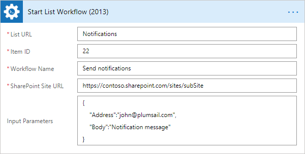