SP connector (SharePoint)
==================================

Provides advanced set of Microsoft Flow actions for SharePoint. It allows you to change permissions on sites, lists, list items. You can create sites from templates and many more. 

Before starting, ensure that you `added Plumsail connector to Microsoft Flow <../../getting-started/use-from-flow.html>`_.

.. contents:: List of actions in this connector
   :local:
   :depth: 1

Change Permissions on SharePoint site, list or list item
-----------------------------------------------------------

"Change Permissions" is a complex action that includes 12 different operations for granting, removing or restoring permissions on sites, lists, and list items.

Once you added this action to your Flow, you need to specify two initial parameters:

* Action type - type of action for changing permissions: Grant, Remove, RemoveAll, RestoreInheritance
* Target - target of action: Site, List, Item

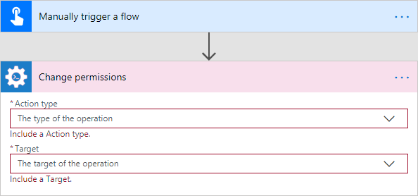

Once you did this, you will see the rest of parameters for this particular operation.

You can find the documentation for all operations included in "Change Permissions" action below:

- :ref:`grant-permissions-site`
- :ref:`remove-permissions-site`
- :ref:`remove-all-permissions-site`
- :ref:`restore-inheritance-permissions-site`
- :ref:`grant-permissions-list`
- :ref:`remove-permissions-list`
- :ref:`remove-all-permissions-list`
- :ref:`restore-inheritance-permissions-list`
- :ref:`grant-permissions-item`
- :ref:`remove-permissions-item`
- :ref:`remove-all-permissions-item`
- :ref:`restore-inheritance-permissions-item`

.. _grant-permissions-site:

Grant Permissions on SharePoint Site
~~~~~~~~~~~~~~~~~~~~~~~~~~~~~~~~~~~~~~~~~~~~~~~~~~

Grant specific permissions on site to a SharePoint user or Group with the help of Microsoft Flow.

.. rubric:: Input Parameters

.. list-table::
    :header-rows: 1
    :widths: 10 30 20

    *  -  Parameter
       -  Description
       -  Example
    *  -  Action type
       -  The type of action for changing permissions. You should pick 'Grant' for this case.
       -  Grant
    *  -  Target
       -  The target of action: Site, List, Item. You should pick 'Site' for this case.
       -  Site
    *  -  User or group
       -  Login, Email or Name of a User or Group. Also you can specify multiple items using semicolon ';' delimited
       -  :code:`user@contoso.com`
    *  -  Role Type
       -  permission levels:
                   * Full control
                   * Design
                   * Edit
                   * Contribute
                   * Read
                   * ViewOnly
                
       -  Read
    *  -  SharePoint Site Url
       -  This property defines the context of the action. The action will be executed on specified SharePoint site.
       -  :code:`https://contoso.sharepoint.com/sites/subSite`

.. rubric:: Example

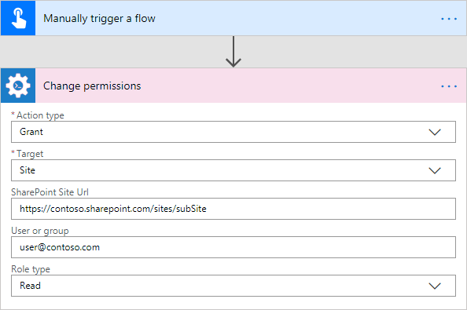

.. _remove-permissions-site:

Remove Permissions from SharePoint Site
~~~~~~~~~~~~~~~~~~~~~~~~~~~~~~~~~~~~~~~~~~~~~~~~~~

Delete specific permissions from site for specified SharePoint user or group with the help of Microsoft Flow.

.. rubric:: Input Parameters

.. list-table::
    :header-rows: 1
    :widths: 10 30 20

    *  -  Parameter
       -  Description
       -  Example
    *  -  Action type
       -  The type of action for changing permissions. You should pick 'Remove' for this case.
       -  Remove
    *  -  Target
       -  The target of action: Site, List, Item. You should pick 'Site' for this case.
       -  Site
    *  -  User or group
       -  Login, Email or Name of a User or Group. Also you can specify multiple items using semicolon ';' delimited
       -  :code:`user@contoso.com`
    *  -  Role Type
       -  permission levels:
                   * Full control
                   * Design
                   * Edit
                   * Contribute
                   * Read
                   * ViewOnly
                
       -  Read
    *  -  SharePoint Site Url
       -  This property defines the context of the action. The action will be executed on specified SharePoint site.
       -  :code:`https://contoso.sharepoint.com/sites/subSite`

.. rubric:: Example

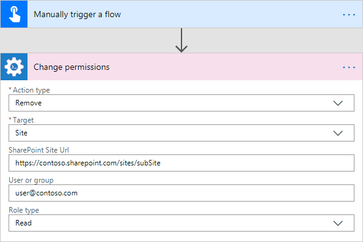

.. _remove-all-permissions-site:

Remove All Permissions from SharePoint Site
~~~~~~~~~~~~~~~~~~~~~~~~~~~~~~~~~~~~~~~~~~~~~~~~~~

Removing all user permissions from a SharePoint site with the help of Microsoft Flow.

.. rubric:: Input Parameters

.. list-table::
    :header-rows: 1
    :widths: 10 30 20

    *  -  Parameter
       -  Description
       -  Example
    *  -  Action type
       -  The type of action for changing permissions. You should pick 'RemoveAll' for this case.
       -  RemoveAll
    *  -  Target
       -  The target of action: Site, List, Item. You should pick 'Site' for this case.
       -  Site
    *  -  SharePoint Site Url
       -  This property defines the context of the action. The action will be executed on specified SharePoint site.
       -  :code:`https://contoso.sharepoint.com/sites/subSite`

.. rubric:: Example

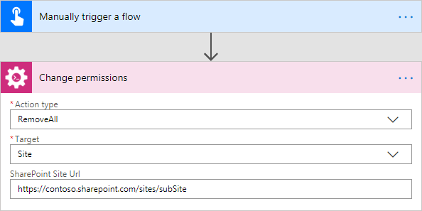

.. _restore-inheritance-permissions-site:

Restore Permissions Inheritance for SharePoint Site
~~~~~~~~~~~~~~~~~~~~~~~~~~~~~~~~~~~~~~~~~~~~~~~~~~~~~

Remove unique permissions and restore permission inheritance on current SharePoint site with the help of Microsoft Flow.

.. rubric:: Input Parameters

.. list-table::
    :header-rows: 1
    :widths: 10 30 20

    *  -  Parameter
       -  Description
       -  Example
    *  -  Action type
       -  The type of action for changing permissions. You should pick 'RestoreInheritance' for this case.
       -  RestoreInheritance
    *  -  Target
       -  The target of action: Site, List, Item. You should pick 'Site' for this case.
       -  Site
    *  -  SharePoint Site Url
       -  This property defines the context of the action. The action will be executed on specified SharePoint site.
       -  :code:`https://contoso.sharepoint.com/sites/subSite`

.. rubric:: Example

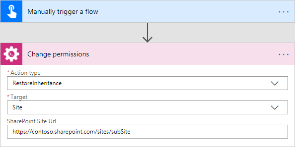

.. _grant-permissions-list:

Grant Permissions on SharePoint List
~~~~~~~~~~~~~~~~~~~~~~~~~~~~~~~~~~~~~~~~~~~~~~~~~~

Grant specific permissions to a user on a SharePoint list with the help of Microsoft Flow.

.. rubric:: Input Parameters

.. list-table::
    :header-rows: 1
    :widths: 10 30 20

    *  -  Parameter
       -  Description
       -  Example
    *  -  Action type
       -  The type of action for changing permissions. You should pick 'Grant' for this case.
       -  Grant
    *  -  Target
       -  The target of action: Site, List, Item. You should pick 'List' for this case.
       -  List
    *  -  List name
       -  Title or Url of a list
       -  Sales
    *  -  User or group
       -  Login, Email or Name of a User or Group. Also you can specify multiple items using semicolon ';' delimited
       -  :code:`user@contoso.com`
    *  -  Role Type
       -  permission levels:
                   * Full control
                   * Design
                   * Edit
                   * Contribute
                   * Read
                   * ViewOnly
                
       -  Read
    *  -  SharePoint Site Url
       -  This property defines the context of the action. The action will be executed on specified SharePoint site.
       -  :code:`https://contoso.sharepoint.com/sites/subSite`

.. rubric:: Example

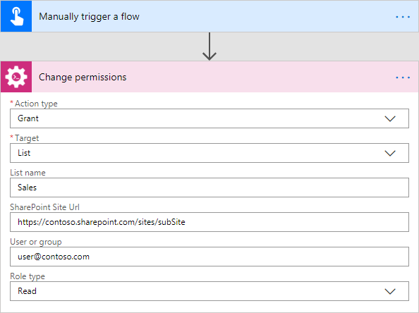

.. _remove-permissions-list:

Remove Permissions from SharePoint List
~~~~~~~~~~~~~~~~~~~~~~~~~~~~~~~~~~~~~~~~~~~~~~~~~~

Delete specific permissions from a user on a SharePoint list with the help of Microsoft Flow.

.. rubric:: Input Parameters

.. list-table::
    :header-rows: 1
    :widths: 10 30 20

    *  -  Parameter
       -  Description
       -  Example
    *  -  Action type
       -  The type of action for changing permissions. You should pick 'Remove' for this case.
       -  Remove
    *  -  Target
       -  The target of action: Site, List, Item. You should pick 'List' for this case.
       -  List
    *  -  List name
       -  Title or Url of a list
       -  Sales
    *  -  User or group
       -  Login, Email or Name of a User or Group. Also you can specify multiple items using semicolon ';' delimited
       -  :code:`user@contoso.com`
    *  -  Role Type
       -  permission levels:
                   * Full control
                   * Design
                   * Edit
                   * Contribute
                   * Read
                   * ViewOnly
                
       -  Read
    *  -  SharePoint Site Url
       -  This property defines the context of the action. The action will be executed on specified SharePoint site.
       -  :code:`https://contoso.sharepoint.com/sites/subSite`

.. rubric:: Example

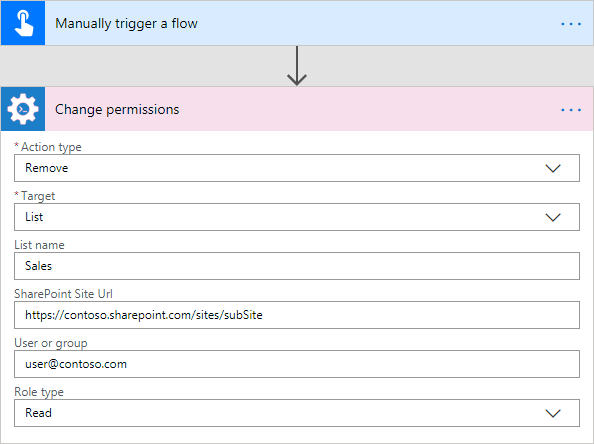

.. _remove-all-permissions-list:

Remove All Permissions from SharePoint List
~~~~~~~~~~~~~~~~~~~~~~~~~~~~~~~~~~~~~~~~~~~~~~~~~~

Remove all user permissions from a SharePoint list with the help of Microsoft Flow.

.. rubric:: Input Parameters

.. list-table::
    :header-rows: 1
    :widths: 10 30 20

    *  -  Parameter
       -  Description
       -  Example
    *  -  Action type
       -  The type of action for changing permissions. You should pick 'RemoveAll' for this case.
       -  RemoveAll
    *  -  Target
       -  The target of action: Site, List, Item. You should pick 'List' for this case.
       -  List
    *  -  List name
       -  Title or Url of a list
       -  Sales
    *  -  SharePoint Site Url
       -  This property defines the context of the action. The action will be executed on specified SharePoint site.
       -  :code:`https://contoso.sharepoint.com/sites/subSite`

.. rubric:: Example

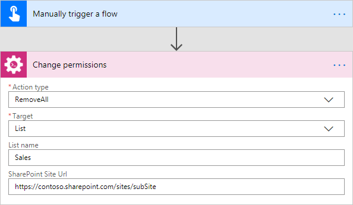

.. _restore-inheritance-permissions-list:

Restore Permissions Inheritance for SharePoint List
~~~~~~~~~~~~~~~~~~~~~~~~~~~~~~~~~~~~~~~~~~~~~~~~~~~~~~

Remove unique permissions and restore permission inheritance on a SharePoint list with the help of Microsoft Flow.

.. rubric:: Input Parameters

.. list-table::
    :header-rows: 1
    :widths: 10 30 20

    *  -  Parameter
       -  Description
       -  Example
    *  -  Action type
       -  The type of action for changing permissions. You should pick 'RestoreInheritance' for this case.
       -  RestoreInheritance
    *  -  Target
       -  The target of action: Site, List, Item. You should pick 'List' for this case.
       -  List
    *  -  List name
       -  Title or Url of a list
       -  Sales
    *  -  SharePoint Site Url
       -  This property defines the context of the action. The action will be executed on specified SharePoint site.
       -  :code:`https://contoso.sharepoint.com/sites/subSite`

.. rubric:: Example

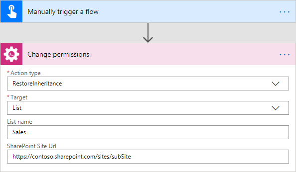

.. _grant-permissions-item:

Grant Permissions on SharePoint Item
~~~~~~~~~~~~~~~~~~~~~~~~~~~~~~~~~~~~~~~~~~~~~~~~~~

Grant specific permissions to a user on a SharePoint list item with the help of Microsoft Flow.

.. rubric:: Input Parameters

.. list-table::
    :header-rows: 1
    :widths: 10 30 20

    *  -  Parameter
       -  Description
       -  Example
    *  -  Action type
       -  The type of action for changing permissions. You should pick 'Grant' for this case.
       -  Grant
    *  -  Target
       -  The target of action: Site, List, Item. You should pick 'Item' for this case.
       -  Item
    *  -  Item ID
       -  ID of the item
       -  7
    *  -  List name
       -  Title or Url of a list
       -  Sales
    *  -  User or group
       -  Login, Email or Name of a User or Group. Also you can specify multiple items using semicolon ';' delimited
       -  :code:`user@contoso.com`
    *  -  Role Type
       -  permission levels:
                   * Full control
                   * Design
                   * Edit
                   * Contribute
                   * Read
                   * ViewOnly
                
       -  Read
    *  -  SharePoint Site Url
       -  This property defines the context of the action. The action will be executed on specified SharePoint site.
       -  :code:`https://contoso.sharepoint.com/sites/subSite`

.. rubric:: Example

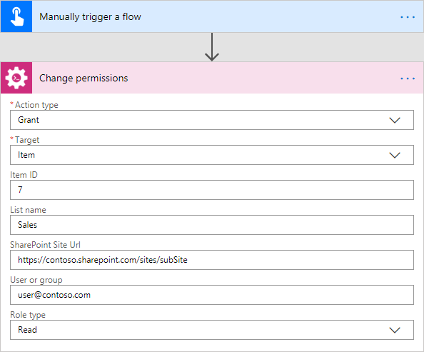

.. _remove-permissions-item:

Remove Permissions from SharePoint Item
~~~~~~~~~~~~~~~~~~~~~~~~~~~~~~~~~~~~~~~~~~~~~~~~~~

Delete specific permissions from a user on a SharePoint list item with the help of Microsoft Flow.

.. rubric:: Input Parameters

.. list-table::
    :header-rows: 1
    :widths: 10 30 20

    *  -  Parameter
       -  Description
       -  Example
    *  -  Action type
       -  The type of action for changing permissions. You should pick 'Remove' for this case.
       -  Remove
    *  -  Target
       -  The target of action: Site, List, Item. You should pick 'Item' for this case.
       -  Item
    *  -  Item ID
       -  ID of the item
       -  7
    *  -  List name
       -  Title or Url of a list
       -  Sales
    *  -  User or group
       -  Login, Email or Name of a User or Group. Also you can specify multiple items using semicolon ';' delimited
       -  :code:`user@contoso.com`
    *  -  Role Type
       -  permission levels:
                   * Full control
                   * Design
                   * Edit
                   * Contribute
                   * Read
                   * ViewOnly
                
       -  Read
    *  -  SharePoint Site Url
       -  This property defines the context of the action. The action will be executed on specified SharePoint site.
       -  :code:`https://contoso.sharepoint.com/sites/subSite`

.. rubric:: Example

.. _remove-all-permissions-item:

Remove All Permissions from SharePoint Item
~~~~~~~~~~~~~~~~~~~~~~~~~~~~~~~~~~~~~~~~~~~~~~~~~~

Removing all user permissions from a SharePoint Item with the help of Microsoft Flow.

.. rubric:: Input Parameters

.. list-table::
    :header-rows: 1
    :widths: 10 30 20

    *  -  Parameter
       -  Description
       -  Example
    *  -  Action type
       -  The type of action for changing permissions. You should pick 'RemoveAll' for this case.
       -  RemoveAll
    *  -  Target
       -  The target of action: Site, List, Item. You should pick 'Item' for this case.
       -  Item
    *  -  Item ID
       -  ID of the item
       -  7
    *  -  List name
       -  Title or Url of a list
       -  Sales
    *  -  SharePoint Site Url
       -  This property defines the context of the action. The action will be executed on specified SharePoint site.
       -  :code:`https://contoso.sharepoint.com/sites/subSite`

.. rubric:: Example

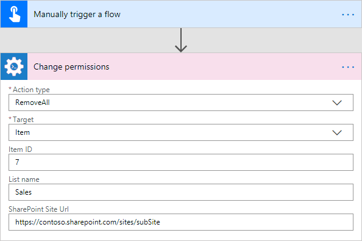

.. _restore-inheritance-permissions-item:

Restore Permissions Inheritance for SharePoint Item
~~~~~~~~~~~~~~~~~~~~~~~~~~~~~~~~~~~~~~~~~~~~~~~~~~~~~~~

Remove unique permissions and restore permission inheritance on a SharePoint list item with the help of Microsoft Flow.

.. rubric:: Input Parameters

.. list-table::
    :header-rows: 1
    :widths: 10 30 20

    *  -  Parameter
       -  Description
       -  Example
    *  -  Action type
       -  The type of action for changing permissions. You should pick 'RestoreInheritance' for this case.
       -  RestoreInheritance
    *  -  Target
       -  The target of action: Site, List, Item. You should pick 'Item' for this case.
       -  Item
    *  -  Item ID
       -  ID of the item
       -  7
    *  -  List name
       -  Title or Url of a list
       -  Sales
    *  -  SharePoint Site Url
       -  This property defines the context of the action. The action will be executed on specified SharePoint site.
       -  :code:`https://contoso.sharepoint.com/sites/subSite`

.. rubric:: Example

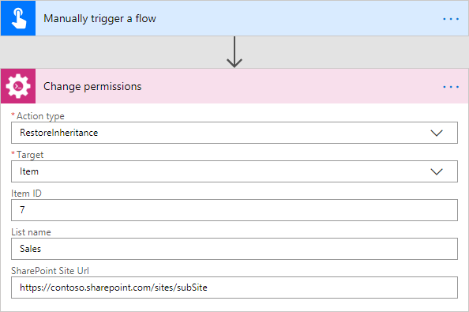

Activate SharePoint Feature
----------------------------------

Activate a SharePoint feature with specific ID with the help of Microsoft Flow.

.. rubric:: Input Parameters

.. list-table::
    :header-rows: 1
    :widths: 10 30 20

    *  -  Parameter
       -  Description
       -  Example
    *  -  Feature ID
       -  Unique ID of the feature to activate
       -  {D7891031-E7F5-4734-8077-9189DD35551C}

    *  -  Force
       -  Yes to force activation of the Feature even if there are errors; otherwise, false.
       -  Yes 

    *  -  Is Web Feature
       -  Yes if it is web feature otherwise, false.
       -  Yes

    *  -  SharePoint Site Url
       -  This property defines the context of the action. The action will be executed on specified SharePoint site.
       -  :code:`https://contoso.sharepoint.com/sites/subSite`

.. rubric:: Example

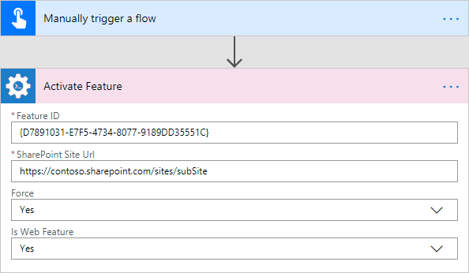

Create SharePoint List or Library
------------------------------------

Create SharePoint list by template with the help of Microsoft Flow.

.. rubric:: Input Parameters

.. list-table::
    :header-rows: 1
    :widths: 10 30 20

    *  -  Parameter
       -  Description
       -  Example
    *  -  Title
       -  Title of a list.
       -  Sales reports

    *  -  Template
       -  Title of the template that will be used for this list.
       -  Custom List

    *  -  Partial Url
       -  Usually, when you create a list you can't control which URL it will get. For example, if you create a document library with the name "Some document lib" it will get the following URL: Some%20doc%20lib. But in some cases more useful to choose other URL, using this field, you can specify the required value. This is an optional field you can leave it blank. By default, URL will be automatically generated.
       -  Sales_Department

    *  -  Description
       -  Description of a list.
       -  Library contains sales reports

    *  -  On Quick Nav
       -  Display this list on the Quick Launch.
       -  Yes

    *  -  SharePoint Site Url
       -  This property defines the context of the action. The action will be executed on specified SharePoint site.
       -  :code:`https://contoso.sharepoint.com/sites/subSite`

.. rubric:: Example

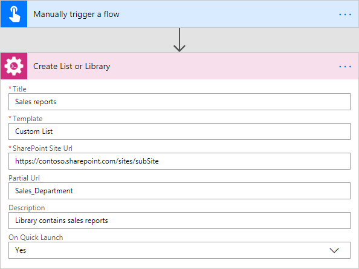

Create SharePoint Site from Template
---------------------------------------

Create a new SharePoint site based on specific template  with the help of Microsoft Flow.

.. rubric:: Output Parameters

.. list-table::
    :header-rows: 1
    :widths: 10 30 20

    *  -  Parameter
       -  Description
       -  Example
    *  -  Web URL
       -  URL of the created SharePoint site.
       -  :code:`https://contoso/sites/subSite/Sales_Department`

.. rubric:: Input Parameters

.. list-table::
    :header-rows: 1
    :widths: 10 30 20

    *  -  Parameter
       -  Description
       -  Example
    *  -  Title
       -  Title of new site.
       -  Sales department
       
    *  -  Description
       -  Description of the web.
       -  Sales department's site
       
    *  -  Template
       -  Title of the site template that will be used for the new site.
       -  Team Site

    *  -  Leaf URL
       -  A string that represents the URL leaf name
       -  Sales_Department

    *  -  Lcid
       -  LCID of the new web.
       -  1033

    *  -  Inherit Permissions
       -  Specifies whether the new site will inherit permissions from its parent site.
       -  Yes

    *  -  Inherit navigation
       -  Specifies whether the site inherits navigation.
       -  No

    *  -  On top navigation
       -  Display this site on the top link bar of the parent site. The default value is Yes.
       -  Yes

    *  -  On quick launch
       -  Display this site on the Quick Launch of the parent site. The default value is No.
       -  No

    *  -  SharePoint Site Url
       -  This property defines the context of the action. The action will be executed on specified SharePoint site.
       -  :code:`https://contoso.sharepoint.com/sites/subSite`

.. rubric:: Example

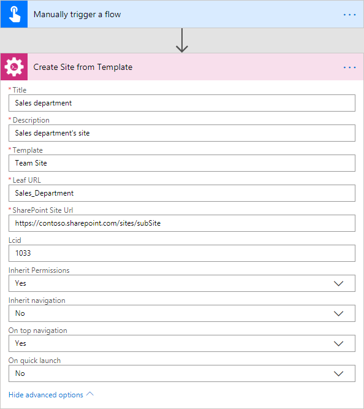

Set Default SharePoint Site Group
----------------------------------

Configure default groups for a site with the help of Microsoft Flow. It is alternative of the permsetup.aspx page in SharePoint UI.

.. rubric:: Input Parameters

.. list-table::
    :header-rows: 1
    :widths: 10 30 20

    *  -  Parameter
       -  Description
       -  Example
    *  -  Group Type
       -  Type of the group: owners, members or visitors     
       -  Owners

    *  -  Group Name
       -  Name or ID of the group
       -  Sales owners

    *  -  SharePoint Site Url
       -  This property defines the context of the action. The action will be executed on specified SharePoint site.
       -  :code:`https://contoso.sharepoint.com/sites/subSite`         

.. rubric:: Example

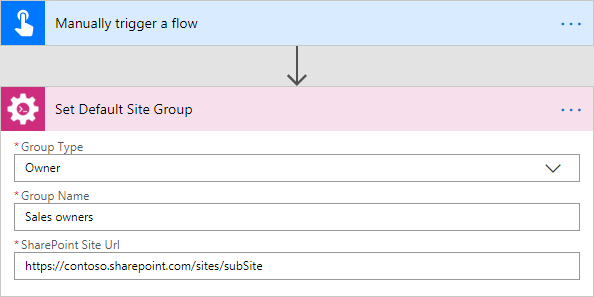

Copy SharePoint Document from Library
-----------------------------------------
Copies the document from the document library to the specified URL with the help of Microsoft Flow. You can copy the document to another document library cross-site, to another site collection or to another folder.

.. rubric:: Output Parameters

.. list-table::
    :header-rows: 1
    :widths: 10 30 20

    *  -  Parameter
       -  Description
       -  Example
    *  -  Document ID
       -  The ID of the copied document
       -  ``1024``
    *  -  Document URL
       -  The URL of the copied document
       -  :code:`https://contoso.sharepoint.com/sites/subSite/LibraryName/AnotherFolderName/NewDocumentName.docx`

.. rubric:: Input Parameters

.. list-table::
    :header-rows: 1
    :widths: 10 30 20

    *  -  Parameter
       -  Description
       -  Example
    *  -  Source URL
       -  The URL of the document to be copied. You can use full URL as well as domain relative URL.
       -  ::
       
            /sites/subSite/LibraryName/FolderName/DocumentName.docx
            https://contoso.sharepoint.com/sites/subSite/LibraryName/FolderName/DocumentName.docx

    *  -  Destination URL
       -  The URL where the source document will be copied. You can use full URL as well as domain relative URL.
       -  ::

            https://contoso.sharepoint.com/sites/subSite/LibraryName/AnotherFolderName/
            https://contoso.sharepoint.com/sites/subSite/LibraryName/AnotherFolderName/NewDocumentName.docx

    *  -  SharePoint Site URL
       -  This property defines the context of the action. The action will be executed on specified SharePoint site.
       -  :code:`https://contoso.sharepoint.com/sites/subSite`

.. rubric:: Example

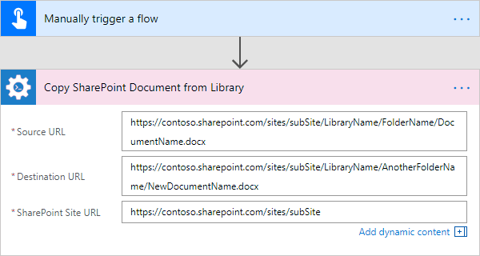

Move SharePoint Document from Library
-----------------------------------------
Moves the document from the document library to the specified URL with the help of Microsoft Flow. You can move the document to another document library cross-site, to another site collection or to another folder.

.. rubric:: Output Parameters

.. list-table::
    :header-rows: 1
    :widths: 10 30 20

    *  -  Parameter
       -  Description
       -  Example
    *  -  Document ID
       -  The ID of the moved document
       -  ``1024``
    *  -  Document URL
       -  The URL of the moved document
       -  :code:`https://contoso.sharepoint.com/sites/subSite/LibraryName/AnotherFolderName/NewDocumentName.docx`

.. rubric:: Input Parameters

.. list-table::
    :header-rows: 1
    :widths: 10 30 20

    *  -  Parameter
       -  Description
       -  Example
    *  -  Source URL
       -  The URL of the document to be moved. You can use full URL as well as domain relative URL.
       -  ::
       
            /sites/subSite/LibraryName/FolderName/DocumentName.docx
            https://contoso.sharepoint.com/sites/subSite/LibraryName/FolderName/DocumentName.docx

    *  -  Destination URL
       -  The URL where the source document will be moved. You can use full URL as well as domain relative URL.
       -  ::

            https://contoso.sharepoint.com/sites/subSite/LibraryName/AnotherFolderName/
            https://contoso.sharepoint.com/sites/subSite/LibraryName/AnotherFolderName/NewDocumentName.docx

    *  -  SharePoint Site URL
       -  This property defines the context of the action. The action will be executed on specified SharePoint site.
       -  :code:`https://contoso.sharepoint.com/sites/subSite`

.. rubric:: Example

Remove SharePoint Document by URL
-----------------------------------------
Remove a SharePoint document by a specific URL with the help of Microsoft Flow.

.. rubric:: Input Parameters

.. list-table::
    :header-rows: 1
    :widths: 10 30 20

    *  -  Parameter
       -  Description
       -  Example
    *  -  Document URL
       -  The URL of the document to be removed. You can use full URL as well as domain relative URL.
       -  ::

            /sites/subSite/LibraryName/FolderName/DocumentName.docx
            https://contoso.sharepoint.com/sites/subSite/LibraryName/FolderName/DocumentName.docx

    *  -  SharePoint Site URL
       -  This property defines the context of the action. The action will be executed on specified SharePoint site.
       -  :code:`https://contoso.sharepoint.com/sites/subSite`

.. rubric:: Example

Copy SharePoint Document Set
-----------------------------------------
Copies a SharePoint document set from the document library to the specified URL with the help of Microsoft Flow. You can copy the document sets to another document library cross-site, to another site collection or to another folder.

.. rubric:: Output Parameters

.. list-table::
    :header-rows: 1
    :widths: 10 30 20

    *  -  Parameter
       -  Description
       -  Example
    *  -  Document set ID
       -  The ID of the copied document set
       -  ``1024``
    *  -  Document set URL
       -  The URL of the copied document set
       -  :code:`https://contoso.sharepoint.com/sites/subSite/LibraryName/AnotherFolderName/NewDocumentSet`

.. rubric:: Input Parameters

.. list-table::
    :header-rows: 1
    :widths: 10 30 20

    *  -  Parameter
       -  Description
       -  Example
    *  -  Source URL
       -  The URL of the document set to be copied. You can use full URL as well as domain relative URL.
       -  ::
       
            /sites/subSite/LibraryName/FolderName/DocumentSet
            https://contoso.sharepoint.com/sites/subSite/LibraryName/FolderName/DocumentSet

    *  -  Destination URL
       -  The URL where the source document set will be copied. You can use full URL as well as domain relative URL. If the url ends with slash '/' the document sets will be placed in this folder without name changes. Otherwise, the document set will be renamed.
       -  ::

            https://contoso.sharepoint.com/sites/subSite/LibraryName/AnotherFolderName/
            https://contoso.sharepoint.com/sites/subSite/LibraryName/AnotherFolderName/NewDocumentSet

    *  -  SharePoint Site URL
       -  This property defines the context of the action. The action will be executed on specified SharePoint site.
       -  :code:`https://contoso.sharepoint.com/sites/subSite`

.. rubric:: Example

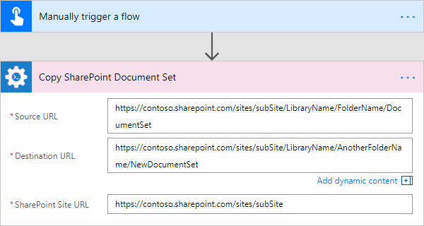
   
Move SharePoint Document Set
-----------------------------------------
Moves a SharePoint document set from the document library to the specified URL with the help of Microsoft Flow. You can move the document sets to another document library cross-site, to another site collection or to another folder.

.. rubric:: Output Parameters

.. list-table::
    :header-rows: 1
    :widths: 10 30 20

    *  -  Parameter
       -  Description
       -  Example
    *  -  Document set ID
       -  The ID of the moved document set
       -  ``1024``
    *  -  Document set URL
       -  The URL of the moved document set
       -  :code:`https://contoso.sharepoint.com/sites/subSite/LibraryName/AnotherFolderName/NewDocumentSet`

.. rubric:: Input Parameters

.. list-table::
    :header-rows: 1
    :widths: 10 30 20

    *  -  Parameter
       -  Description
       -  Example
    *  -  Source URL
       -  The URL of the document set to be moved. You can use full URL as well as domain relative URL.
       -  ::
       
            /sites/subSite/LibraryName/FolderName/DocumentSet
            https://contoso.sharepoint.com/sites/subSite/LibraryName/FolderName/DocumentSet

    *  -  Destination URL
       -  The URL where the source document set will be moved. You can use full URL as well as domain relative URL. If the url ends with slash '/' the document sets will be placed in this folder without name changes. Otherwise, the document set will be renamed.
       -  ::

            https://contoso.sharepoint.com/sites/subSite/LibraryName/AnotherFolderName/
            https://contoso.sharepoint.com/sites/subSite/LibraryName/AnotherFolderName/NewDocumentSet

    *  -  SharePoint Site URL
       -  This property defines the context of the action. The action will be executed on specified SharePoint site.
       -  :code:`https://contoso.sharepoint.com/sites/subSite`

.. rubric:: Example

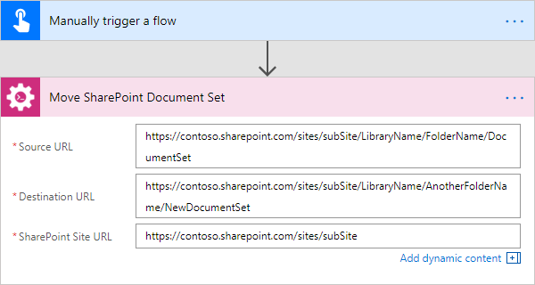

Create SharePoint Folder by URL
-----------------------------------------
Creates a new SharePoint folder in the document library by the specified URL with the help of Microsoft Flow.

.. rubric:: Output Parameters

.. list-table::
    :header-rows: 1
    :widths: 10 30 20

    *  -  Parameter
       -  Description
       -  Example
    *  -  Folder ID
       -  The ID of the created folder
       -  ``1024``
    *  -  Folder URL
       -  The URL of the created folder
       -  :code:`https://contoso.sharepoint.com/sites/subSite/LibraryName/FolderName/FolderName2`

.. rubric:: Input Parameters

.. list-table::
    :header-rows: 1
    :widths: 10 30 20

    *  -  Parameter
       -  Description
       -  Example
    *  -  Folder URL
       -  The URL of the folder. If you specify full path, you can create several folders.
       -  :code:`https://contoso.sharepoint.com/sites/subSite/LibraryName/FolderName/FolderName2`

    *  -  SharePoint Site URL
       -  This property defines the context of the action. The action will be executed on specified SharePoint site.
       -  :code:`https://contoso.sharepoint.com/sites/subSite`

.. rubric:: Example

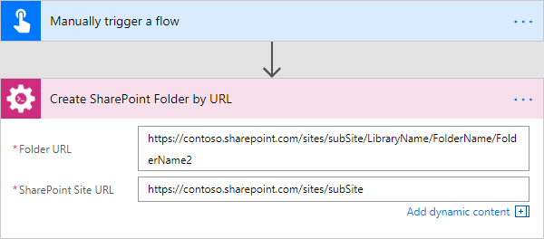

Create SharePoint Folder in List
-----------------------------------------
Creates a new SharePoint folder in the document library or list using the specified path with the help of Microsoft Flow.

.. rubric:: Output Parameters

.. list-table::
    :header-rows: 1
    :widths: 10 30 20

    *  -  Parameter
       -  Description
       -  Example
    *  -  Folder ID
       -  The ID of the created folder
       -  ``1024``
    *  -  Folder URL
       -  The URL of the created folder
       -  :code:`https://contoso.sharepoint.com/sites/subSite/LibraryName/FolderName/FolderName2`

.. rubric:: Input Parameters

.. list-table::
    :header-rows: 1
    :widths: 10 30 20

    *  -  Parameter
       -  Description
       -  Example
    *  -  Target List
       -  The name or the URL of the library or the list where the folder will be created. You can use full URL as well as domain relative URL.
       -  ::

            LibraryName
            /sites/subSite/LibraryName
            https://contoso.sharepoint.com/sites/subSite/LibraryName

    *  -  Folder Path
       -  The path where the folder will be created. The action will create all folders included into the path.
       -  :code:`FolderName/FolderName2`

    *  -  SharePoint Site URL
       -  This property defines the context of the action. The action will be executed on specified SharePoint site.
       -  :code:`https://contoso.sharepoint.com/sites/subSite`

.. rubric:: Example

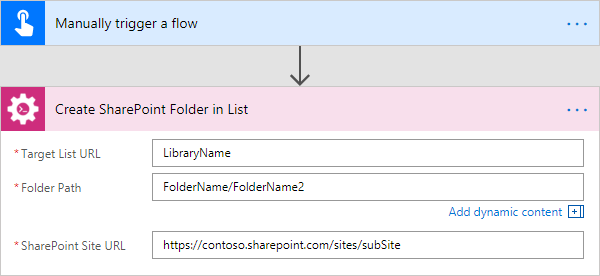

Remove SharePoint Folder by URL
-----------------------------------------
Removes a SharePoint folder from the document library or list by the specified URL with the help of Microsoft Flow.

.. rubric:: Input Parameters

.. list-table::
    :header-rows: 1
    :widths: 10 30 20

    *  -  Parameter
       -  Description
       -  Example
    *  -  Folder URL
       -  The URL of the library where the source folder will be removed. You can use full URL as well as domain relative URL.
       -  ::

            /sites/subSite/LibraryName/FolderName
            https://contoso.sharepoint.com/sites/subSite/LibraryName/FolderName

    *  -  SharePoint Site URL
       -  This property defines the context of the action. The action will be executed on specified SharePoint site.
       -  :code:`https://contoso.sharepoint.com/sites/subSite`

.. rubric:: Example

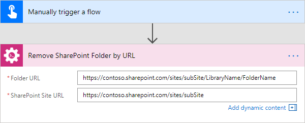

Copy SharePoint Folder from Library
-----------------------------------------
Copies a SharePoint folder from the document library to the specified URL with the help of Microsoft Flow. You can copy the folder to another document library cross-site, to another site collection or to another folder.

.. rubric:: Output Parameters

.. list-table::
    :header-rows: 1
    :widths: 10 30 20

    *  -  Parameter
       -  Description
       -  Example
    *  -  Folder ID
       -  The ID of the copied folder
       -  ``1024``
    *  -  Folder URL
       -  The URL of the copied folder
       -  :code:`https://contoso.sharepoint.com/sites/subSite/AnotherLibraryName/AnotherFolderName`

.. rubric:: Input Parameters

.. list-table::
    :header-rows: 1
    :widths: 10 30 20

    *  -  Parameter
       -  Description
       -  Example
    *  -  Source URL
       -  The URL of the folder to be copied. You can use full URL as well as domain relative URL.
       -  ::
            
            /sites/subSite/LibraryName/FolderName
            https://contoso.sharepoint.com/sites/subSite/LibraryName/FolderName

    *  -  Destination URL
       -  The URL where the source folder will be copied. You can use full URL as well as domain relative URL
       -  ::

            https://contoso.sharepoint.com/sites/subSite/AnotherLibraryName
            https://contoso.sharepoint.com/sites/subSite/AnotherLibraryName/AnotherFolderName

    *  -  SharePoint Site URL
       -  This property defines the context of the action. The action will be executed on specified SharePoint site.
       -  :code:`https://contoso.sharepoint.com/sites/subSite`

.. rubric:: Example

Move SharePoint Folder from Library
-----------------------------------------
Moves a SharePoint folder from the document library to the specified URL with the help of Microsoft Flow. You can move the folder to another document library cross-site, to another site collection or to another folder.

.. rubric:: Output Parameters

.. list-table::
    :header-rows: 1
    :widths: 10 30 20

    *  -  Parameter
       -  Description
       -  Example
    *  -  Folder ID
       -  The ID of the moved folder
       -  ``1024``
    *  -  Folder URL
       -  The URL of the moved folder
       -  :code:`https://contoso.sharepoint.com/sites/subSite/AnotherLibraryName/AnotherFolderName`

.. rubric:: Input Parameters

.. list-table::
    :header-rows: 1
    :widths: 10 30 20

    *  -  Parameter
       -  Description
       -  Example
    *  -  Source URL
       -  The URL of the folder to be moved. You can use full URL as well as domain relative URL.
       -  ::
            
            /sites/subSite/LibraryName/FolderName
            https://contoso.sharepoint.com/sites/subSite/LibraryName/FolderName

    *  -  Destination URL
       -  The URL where the source folder will be moved. You can use full URL as well as domain relative URL
       -  ::

            https://contoso.sharepoint.com/sites/subSite/AnotherLibraryName
            https://contoso.sharepoint.com/sites/subSite/AnotherLibraryName/AnotherFolderName

    *  -  SharePoint Site URL
       -  This property defines the context of the action. The action will be executed on specified SharePoint site.
       -  :code:`https://contoso.sharepoint.com/sites/subSite`

.. rubric:: Example

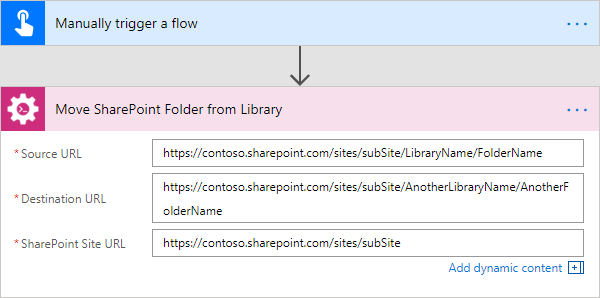

Check In SharePoint Document
-----------------------------------------
Check-in a SharePoint document at the specified URL with the specified comment with the help of Microsoft Flow.

.. rubric:: Output Parameters

.. list-table::
    :header-rows: 1
    :widths: 10 30 20

    *  -  Parameter
       -  Description
       -  Example
    *  -  Document ID
       -  The ID of the document which was check in
       -  ``1024``
    *  -  Document URL
       -  The URL of the document which was check in
       -  :code:`https://contoso.sharepoint.com/sites/subSite/LibraryName/FolderName/DocumentName.docx`

.. rubric:: Input Parameters

.. list-table::
    :header-rows: 1
    :widths: 10 30 20

    *  -  Parameter
       -  Description
       -  Example
    *  -  Document URL
       -  The URL of the document to check in.
       -  :code:`https://contoso.sharepoint.com/sites/subSite/LibraryName/FolderName/DocumentName.docx`

    *  -  Comment
       -  The comment to accompany document check in.
       -  Comment to the document

    *  -  SharePoint Site URL
       -  This property defines the context of the action. The action will be executed on specified SharePoint site.
       -  :code:`https://contoso.sharepoint.com/sites/subSite`

.. rubric:: Example

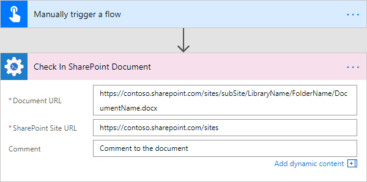

Check Out SharePoint Document
-----------------------------------------
Check-out a SharePoint document at the specified URL with the specified comment with the help of Microsoft Flow.

.. rubric:: Output Parameters

.. list-table::
    :header-rows: 1
    :widths: 10 30 20

    *  -  Parameter
       -  Description
       -  Example
    *  -  Document ID
       -  The ID of the document which was check out
       -  ``1024``
    *  -  Document URL
       -  The URL of the document which was check out
       -  :code:`https://contoso.sharepoint.com/sites/subSite/LibraryName/FolderName/DocumentName.docx`

.. rubric:: Input Parameters

.. list-table::
    :header-rows: 1
    :widths: 10 30 20

    *  -  Parameter
       -  Description
       -  Example
    *  -  Document URL
       -  The URL of the document to check out.
       -  :code:`https://contoso.sharepoint.com/sites/subSite/LibraryName/FolderName/DocumentName.docx`

    *  -  SharePoint Site URL
       -  This property defines the context of the action. The action will be executed on specified SharePoint site.
       -  :code:`https://contoso.sharepoint.com/sites/subSite`

.. rubric:: Example

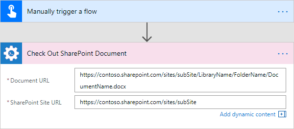