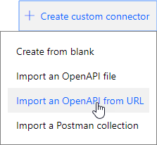
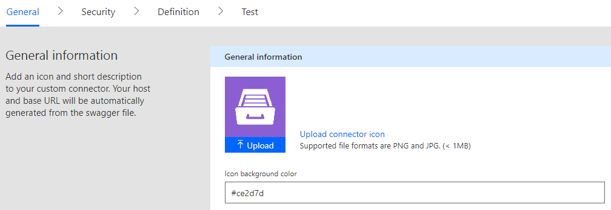

Create custom connector
=======================

Open Microsoft Flow account then navigate to *'Custom Connectors'*:

.. image:: ../_static/img/getting-started/1-flow-custom-connectors.png
   :alt: Microsoft Flow custom connectors menu

Click *'Create custom connector → Import an OpenAPI from URL'*:

Fill in name *'Plumsail Documents'* and swagger definition URL:

  https://api.plumsail.com/swagger/DocumentsFlow/swagger.json

Once you clicked *'Continue'* you will see *'General'* step of connector configuration:

You may want to differentiate this connector from others. In this case, you can assign a custom icon and custom color for it. We suggest this icon:

.. image:: ../_static/img/getting-started/documents-connector-icon.png
   :alt: Connector icon
   :target: ../_static/img/getting-started/actions-connector-icon.png

And this color:

::

  #7d4bcd

Then click *'Continue'*. You should see authentication type screen:

.. image:: ../_static/img/getting-started/2-flow-accesskey-label.png
   :alt: Microsoft Flow access key

Fill in *'Label'* with the value *'Access Key'* and click *'Create connector'*:

.. image:: ../_static/img/getting-started/create-connector-link.png
   :alt: Create Connector link