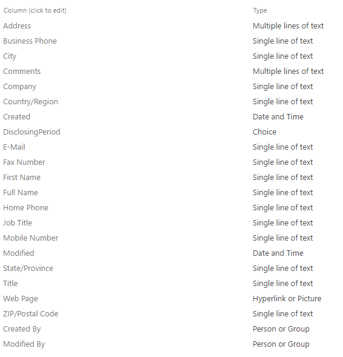
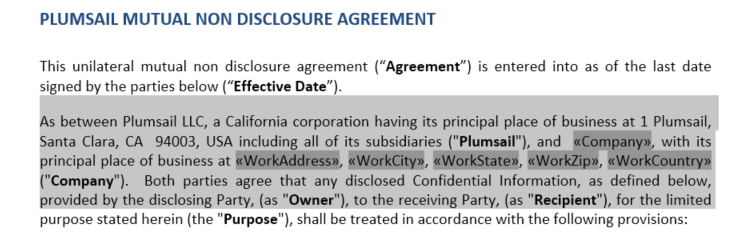
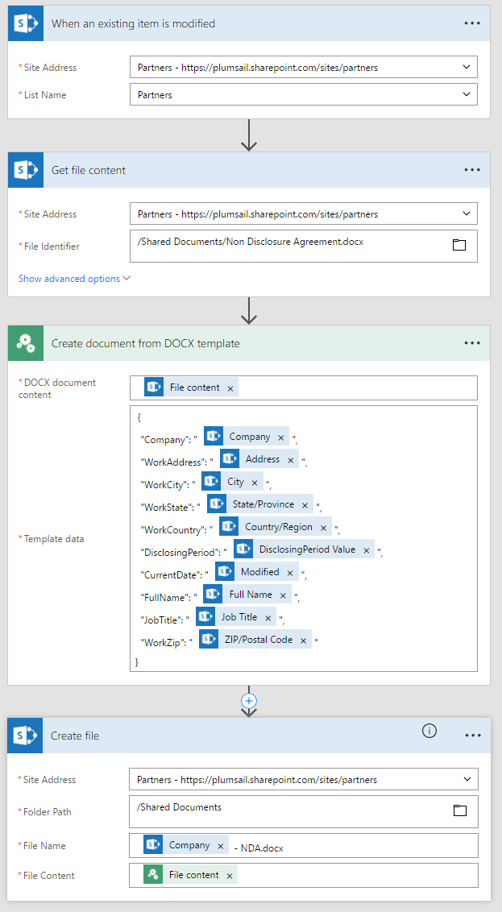

Create PDF from HTML template
==================================

There are a lot of use cases with converting a Word document to PDF. You can `generate DOCX document from template <create-docx-from-template.html>`_  

 Typically you have a skeleton of a document and some data that need to be inserted to specific places inside. As a result, you will get a new document with your data.

Some examples:

- Adding a new contractor and generate pack of legal documents (like contract, NDA, questionnaire)
- Adding a new employee and generate another pack of documents for him
- Generate invitations to a some event or common documents (like invoices, qoutes, etc…)

In this post I will use SharePoint Online conjunction with `Microsoft Flow <https://flow.microsoft.com/en-us/>`_ to generate NDA agreement for a new partner.

Creating contractors’ list
--------------------------

Firstly, we will add a new list to SharePoint. To do this, please navigate to Site Contents -> New List. To simplify demo configuration I added “Contact” content type, it contains some common fields like: Company, First Name, Last Name, Job Title etc…

Preparing document template
---------------------------

At the beginning we have a sample of agreement with some client. To prepare the template we need to insert a special placeholders that will be replaced to the text in the future. To do this, please navigate to “Insert” tab and select “Quick Parts” -> “Field”.

.. image:: ../../_static/img/flow/how-tos/Create-document-from-docx-template-sample-quick-parts.png
   :alt: Select fields

.. image:: ../../_static/img/flow/how-tos/Create-document-from-docx-template-sample-merge-field.png
   :alt: Pick merge field

.. note:: Please remember “Field Name” we will use it in the future.

After replacing all required data to Merge Field blocks, it should look like on the screen below:

I will save the template in SharePoint Document library and will use it from Flow in the next step.

Setting up a Flow
-----------------

SharePoint is a very flexible system it allows you to do the same job using different approaches, as example to automate your business process we can use SharePoint Workflows or Microsoft Flow. In this case I want to demonstrate how to use Microsoft Flow. It is a direct competitor to IFTTT, it is offering an interface that lets you mash up up two or more cloud services in order to create workflows – like those that let you automate file synchronization, alerting, data organization and more.

.. note:: Before start, please ensure that you have already added Plumsail Actions connector to Microsoft Flow.

Our flow consists from four simple steps:

1. Trigger – when a new item is created/modified. We want that the workflow was started each time when we create or modify contractor. It guarantees that we will have actual document information;
2. Get Template content – we need to retrive content of our template;
3. Merge template with data – we use Plumsail action: “Create Document from DOCX Template” to merge a contractor’s information with our template;
4. Save the generated document to a library with all legal documents;

You can find a screenshot of the Flow below:

I want to highlight that you are free to change the Flow, for example, you can send generated the document by email or start the approval process.

Conclusion
----------

In total, we spent around fifteen minutes to automate document generation process. I hope you can adopt this to your organization, I wonder to know about your own use cases, so please feel free to leave comments.