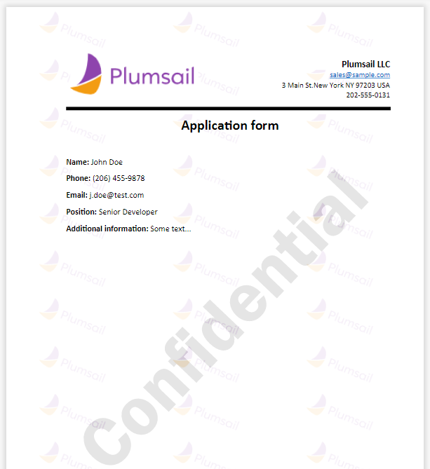
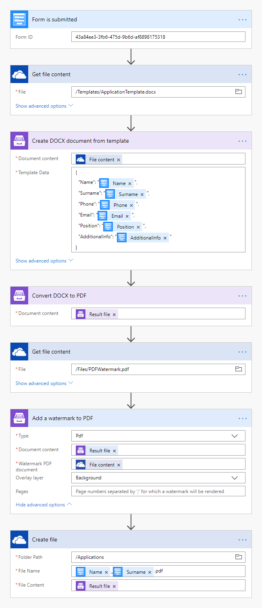
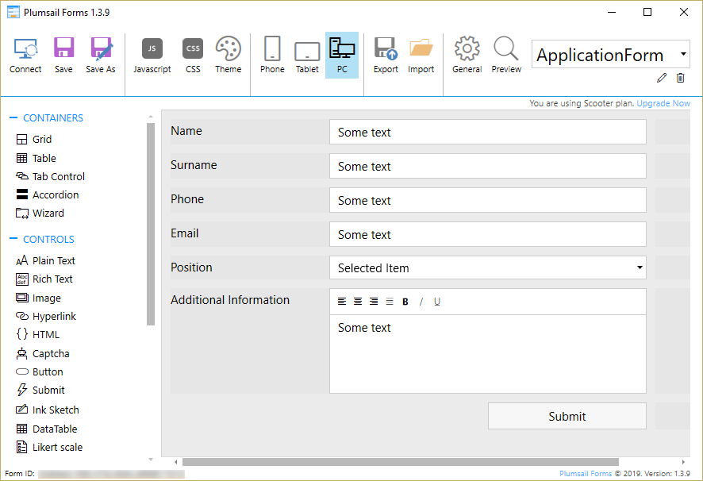
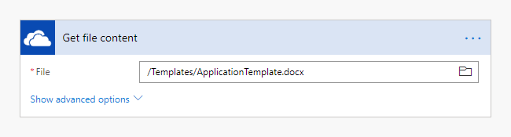
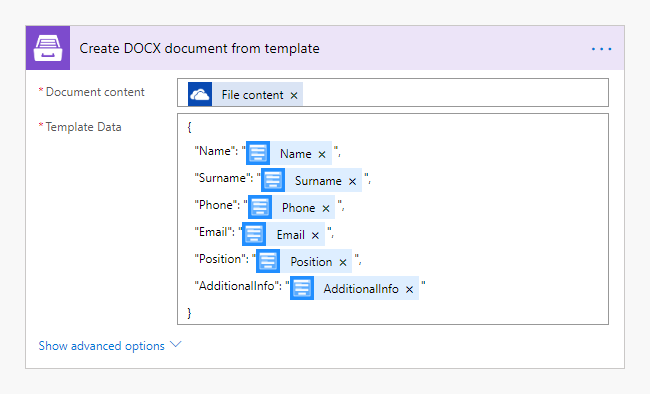
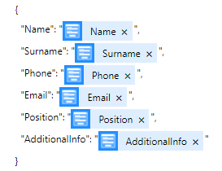
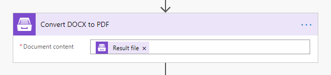
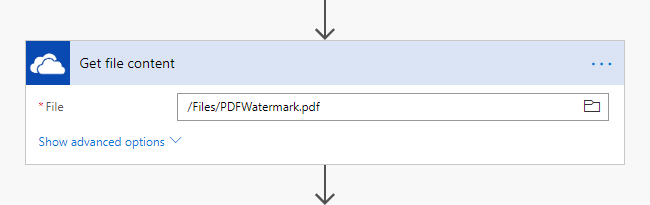
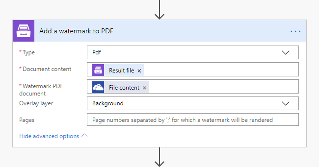
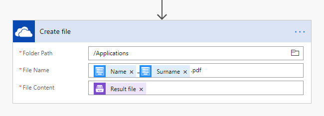

How to add a PDF watermark to a PDF document
=========================================

This is **the third article** in our "How to use Watermarks" series. We hope these articles will help you to get the best out of watermarking PDFs using `Plumsail Documents <https://plumsail.com/documents/>`_ in Microsoft Flow.
 
Before we dive in, here is where we are in our "How to use Watermarks" series:

  1. How to use `an image type watermark <../../../flow/how-tos/documents/add-an-image-watermark-to-a-PDF-document.html>`_ to automatically add a company logo to PDF files and save them in a new folder.

  2. How to use `a text type watermark <../../../flow/how-tos/documents/add-a-text-watermark-to-a-PDF-document.html>`_ to prevent documents dissemination.

  3. How to use **a PDF type watermark** to add a watermark with a specific design to PDF documents generated on submitting a form.

*Add watermark to PDF* action supports a few types of watermarks  —  Text, Image, and PDF:

.. image:: ../../../_static/img/flow/documents/add-a-watermark-to-pdf-select-type.png
    :alt: Selection of the watermark type

So, let us have a look at how to add a PDF type watermark to a document.

Use another PDF file to add a watermark with a specific design
--------------------------------------------------------------

With this type of watermark, you have full control over the position, size, opacity, and other properties of your watermarks. And you can save them for reuse.

In our example, we will collect data from a Plumsail Form, apply the data to our template, generate a new PDF document, and add a watermark to the document.

Here is the final document that we will get. It has a repeating pattern on the background and a large text that says "Confidential".

Description
~~~~~~~~~~~~~~~~

Our source and result documents have to be stored somewhere. In this example, we store our documents in OneDrive. You can store your source file anywhere.

We need to create a Microsoft Flow that will be triggered by a Plumail Form submission. The flow will get the template from OneDrive, apply data from a submitted Plumail form to this template, convert the generated document to PDF, add a watermark to it, and save it to OneDrive. This is how our complete flow looks like:

Create the flow
---------------

Form is submitted
~~~~~~~~~~~~~~~~~

We've already created a Plumsail form and we will use data from its submission in our flow. If you haven't created a form yet, you can learn how to design and publish a Plumsail Form `here <https://plumsail.com/docs/forms-web/design.html>`_.

Below is a screenshot of our form. You may also download the form `here <../../../_static/files/flow/how-tos/ApplicationForm.xfds>`_, import it into `Plumsail Forms <https://plumsail.com/forms/>`_ and use it as a template.

To start the flow on form submission we search for *Plumsail Forms* in MS Flow and add *Plumsail Forms  —  Form is submitted* trigger.

If this is your first Flow with Plumsail Forms, at this point you'll need to Sign into `Plumsail Account <https://auth.plumsail.com/account/login>`_ from MS Flow, so you can start using your forms inside your flows.

You'll need to add the ID of the form you want to track. Form ID can be found and copied in **Flow** settings in Forms Designer.

Get file content
~~~~~~~~~~~~~~~~

This action gets file content of the specified file from OneDrive. We use this action to read a .DOCX template. You can use any other connector to get files from your system.

Below is our template. You may download it `here <../../../_static/files/flow/how-tos/ApplicationTemplate.docx>`_.

.. image:: ../../../_static/img/flow/how-tos/application-form-template.png
    :alt: Application Template

*Plumsail Word DOCX templates* use a different approach than most other templating solutions. It uses a minimal amount of syntax to make your work done.

In short, the templating engine thinks that everything between these :code:`{{ }}` brackets is variables where it will write the data you specified in **Template data**.

Read `this article <https://plumsail.com/docs/documents/v1.x/document-generation/docx/how-it-works.html>`_ to get familiar with the templating engine.

Create DOCX Document from Template
~~~~~~~~~~~~~~~~~~~~~~~~~~~~~~~~~~

This is the action from `Plumasail Documents connector <https://plumsail.com/actions/documents/>`_. This action is suitable for creating documents from a template. You can find more information about the action by visiting `this page <https://plumsail.com/docs/documents/v1.x/flow/actions/document-processing.html#create-docx-document-from-template>`_.

There are two parameters:

**1. Document content**

In the first parameter **Document content**, we specified the output of the previous action as a template.

**2. Template data**

In the second parameter **Template data**, we specified data to apply to the template in JSON format:

This object contains information from our form. We selected the content from the output of *Form is submitted* action in the menu on the right.

Convert DOCX to PDF
~~~~~~~~~~~~~~~~~~~

This is also an action from Plumsail Documents connector.

Just put DOCX file content from the output of the previous action and receive PDF file content as an output from this action.

You can find more information about this action `here <https://plumsail.com/docs/documents/v1.x/flow/actions/document-processing.html#convert-docx-to-pdf>`_.

Get watermark file content
~~~~~~~~~~~~~~~~~~~~~~~~~~

Get the file you are going to use as the watermark. We store it in OneDrive. You can use any other connector to get files from your system.

Add a watermark to PDF
~~~~~~~~~~~~~~~~~~~~~~~

This is an action from `Plumasail Documents connector <https://plumsail.com/actions/documents/>`_.

Choose **PDF** type of the watermark. Put **File content** from the output of the *Convert DOCX to PDF* action into the **Document content** field, and the **File content** from the previous action into the **Watermark PDf document** field.

We set the layer of the overlay file. You may check detailed information on how to use these and other settings `here <https://plumsail.com/docs/documents/v1.x/flow/actions/document-processing.html#add-pdf-watermark-to-pdf>`_.

Create file
~~~~~~~~~~~~

Create a file in another folder. We used *Create file* action from *OneDrive* connector, but you can save your file in any other cloud service.

So, here is our result document:

Conclusion
----------

We hope this `series of articles <../../../flow/how-tos/documents/add-an-image-watermark-to-a-PDF-document.html#how-to-add-an-image-watermark-to-a-pdf-document>`_ on using *Add watermark to PDF* action will help you to ascertain the proper use of your PDF documents.

.. Hint:: For more security options please have a look at `Protects PDF action <https://plumsail.com/docs/documents/v1.x/flow/actions/document-processing.html#protect-pdf-document>`_. It allows you to add passwords, copy-, printing-, and other protections to PDF files with the help of Microsoft Flow and Azure Logic Apps.