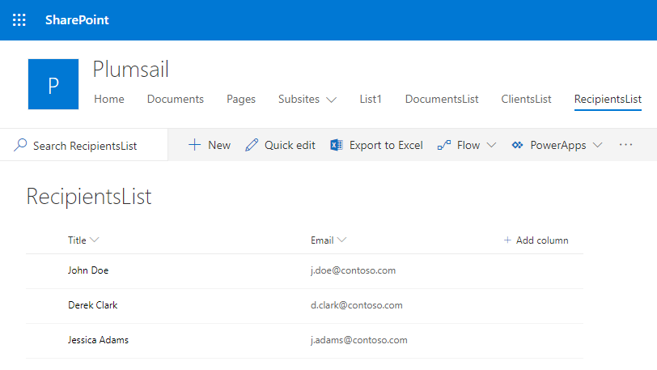
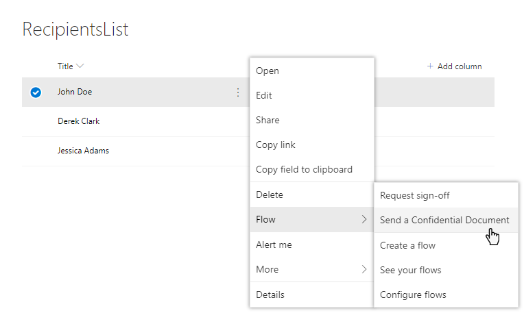
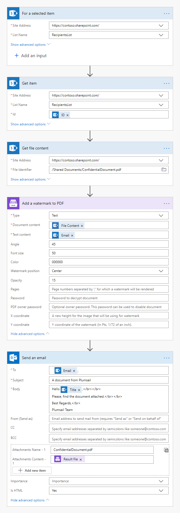
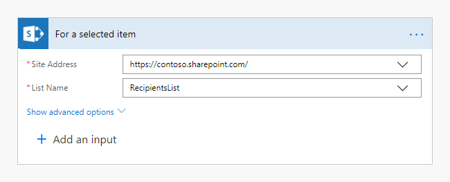
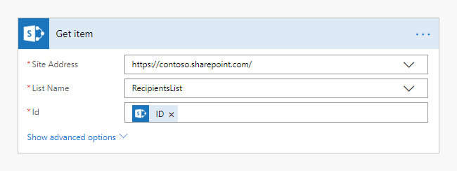
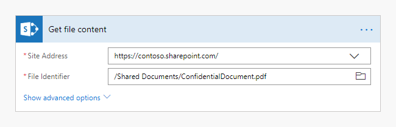
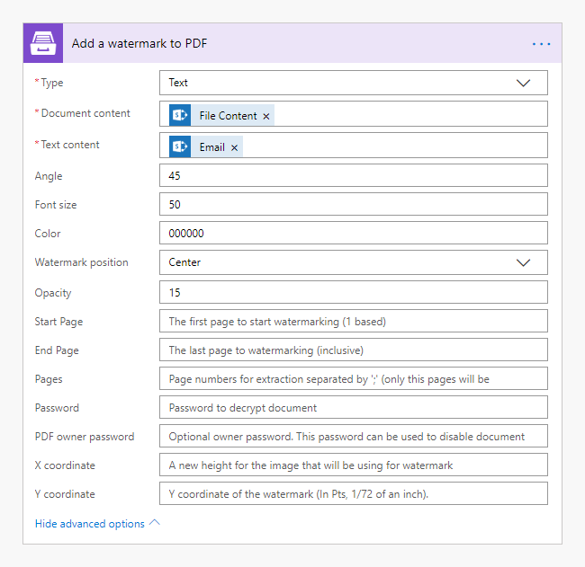
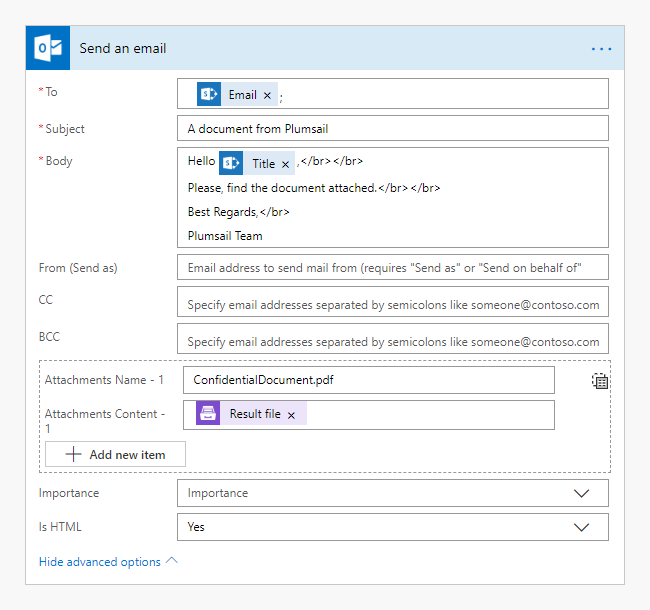
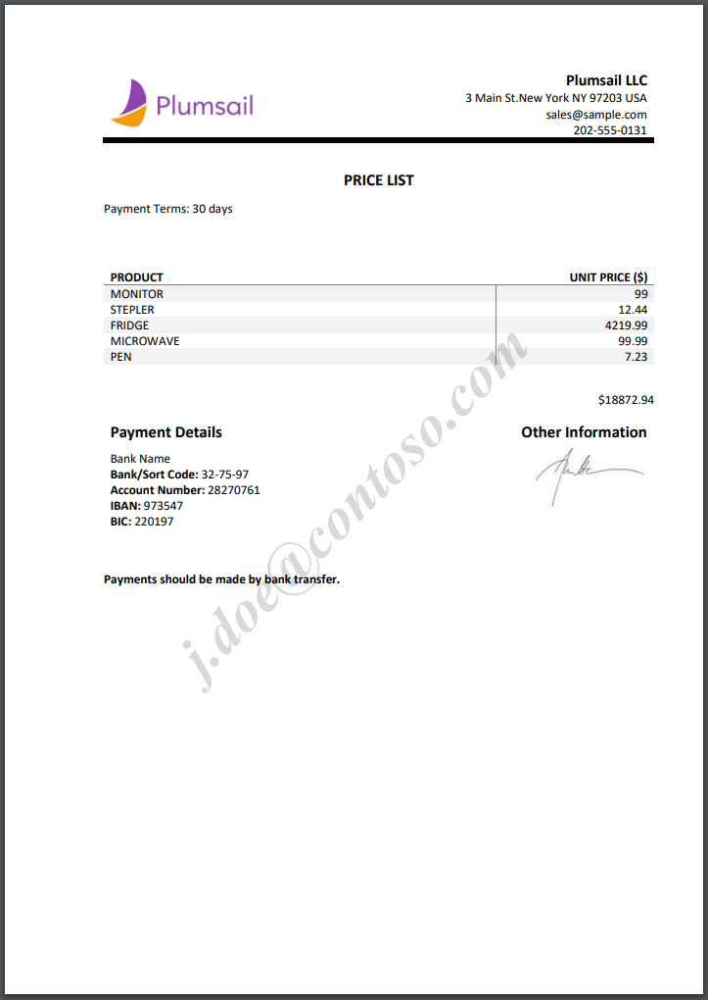

How to add a text watermark to a PDF document
===============================================

This is **the second article** in our "How to use Watermarks" series. We hope these articles will help you to get the best out of watermarking PDFs using `Plumsail Documents <https://plumsail.com/documents/>`_ in Microsoft Flow.
 
Before we dive in, here is where we are in our "How to use Watermarks" series:

  1. How to use `an image type watermark <../../../flow/how-tos/documents/add-an-image-watermark-to-a-PDF-document.html>`_ to automatically add a company logo to PDF files and save them in a new folder.

  2. How to use **a text type watermark** to prevent documents dissemination.

  3. How to use `a PDF type watermark <../../../flow/how-tos/documents/add-a-PDF-watermark-to-a-PDF-document.html>`_ to add a watermark with a specific design to PDF documents generated on submitting a form.

*Add watermark to PDF* action supports a few types of watermarks  —  Text, Image, and PDF:

.. image:: ../../../_static/img/flow/documents/add-a-watermark-to-pdf-select-type.png
    :alt: Selection of the watermark type

So, let us have a look at how to add a text watermark to a document.

Use custom text watermark
------------------------------

Classify your documents 
~~~~~~~~~~~~~~~~~~~~~~~

A watermark that states "Confidential" or "For internal use only" can be a reminder to others about how they should be handling the document. For example, people who have access to a document may be more conscious of leaving it open on their computer screen while they walk away from it if it states "Confidential".

Show the status of a document
~~~~~~~~~~~~~~~~~~~~~~~~~~~~~

You may also use the text type watermark to show the status of a document  — such as Reviewed, Approved, or Draft — so that other users immediately recognize the status of the document you have shared.

Identify the perpetrator if the document is leaked
~~~~~~~~~~~~~~~~~~~~~~~~~~~~~~~~~~~~~~~~~~~~~~~~~~

Imagine you need to send confidential documents outside of your organization. Adding a watermark that identifies the recipient can be an effective deterrent for people who might disseminate the information. Besides the email address, you may also use such information as the person's name and the time/date to protect PDF document and identify the leak if copies of the protected documents suddenly start circulating.

Let's have a look at an example. 

Let's say you have a list of recipients in your SharePoint site:

You need to send them a confidential document you would prefer not be spread around. For example, a price list.

You can create a flow that is started on a particular item from the list:

Here is how the entire flow looks like:

Create the flow
---------------

Let us have a look at each step of the flow.

Flow trigger
~~~~~~~~~~~~

Please navigate to `MS Flow <https://emea.flow.microsoft.com>`_, create a flow and find *For a selected item* action from the *SharePoint* connector. Using this trigger will allow you to start the flow on a selected item manually. Set your **Site Address** and the **List name**:

Get item
~~~~~~~~

Get item data using *Get item* action from the SharePoint connector. Put here **ID** from the output of the *For a selected item* action:

Get file content
~~~~~~~~~~~~~~~~

Get the  file you are going to send with help of *Get item* action from SharePoint connector:

Add a watermark to PDF
~~~~~~~~~~~~~~~~~~~~~~

This is an action from `Plumsail Documents connector <https://plumsail.com/documents>`_.

Choose **Text** type of the watermark. Put here **File content** from the output of the *Get file content* action and the recipient's **Email** from the output of *Get item* action.

We set custom values for **Angle, Font Size, Color, Watermark position**, and **Opacity**. You may check detailed information on how to use these and other settings `here <../../../flow/actions/document-processing.html#add-text-watermark-to-pdf>`_.

Send an email
~~~~~~~~~~~~~
We used *Send an email* action from *Office 365 Outlook* connector, but you can choose another one. **Attachment content** is the output of *Add watermark to PDF* action.

That is it. The recipient will receive the price list with their email address as the watermark. It will potentially discourage leaks by identifying the recipient.

Conclusion
----------

We hope this `series of articles <../../../flow/how-tos/documents/add-an-image-watermark-to-a-PDF-document.html#how-to-add-an-image-watermark-to-a-pdf-document>`_ on using *Add watermark to PDF* action will help you to ascertain the proper use of your PDF documents.

.. Hint:: For more security options please have a look at `Protects PDF action <https://plumsail.com/docs/documents/v1.x/flow/actions/document-processing.html#protect-pdf-document>`_. It allows you to add passwords, copy-, printing-, and other protections to PDF files with the help of Microsoft Flow and Azure Logic Apps.