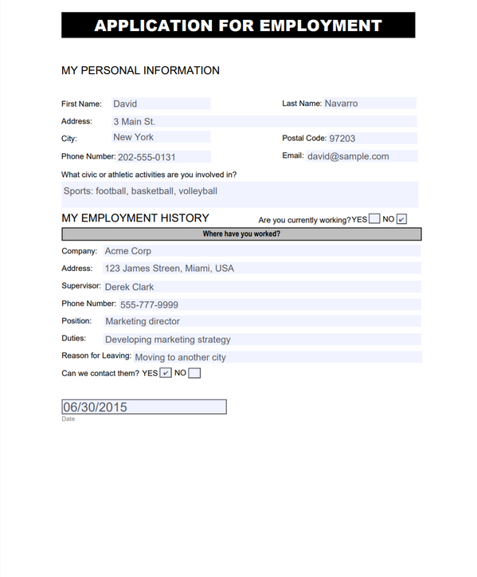
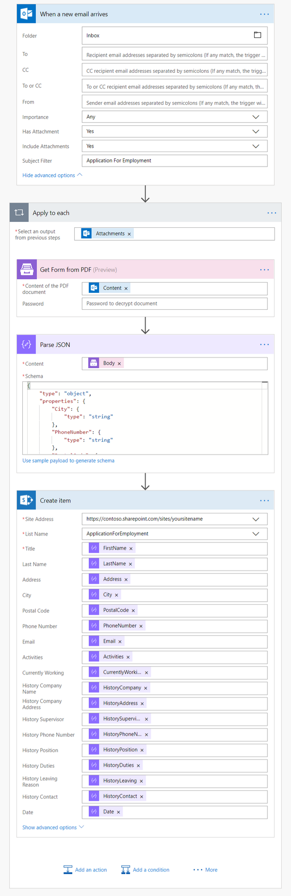
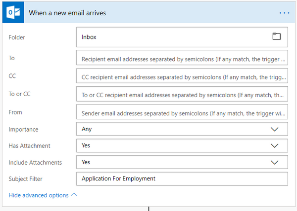
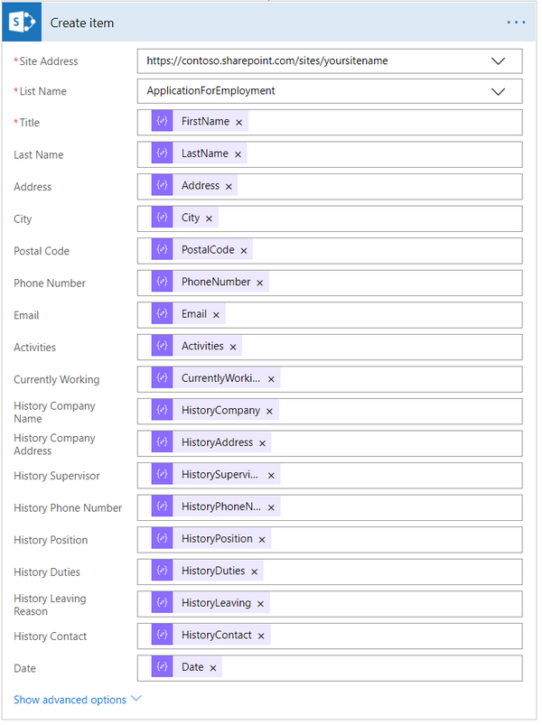

How to collect data from fillable PDF and save it into your system in Microsoft Flow, Azure Logic Apps or Power Apps
=====================================================================================================================
In this article, you will learn how to collect data from fillable PDF form in Microsoft Flow or Azure Logic Apps. We will use `Get Form from PDF`_ action from `Plumsail Documents connector`_.

In our case, we will collect data from Application for Employment form, we will get this PDF file via email using When a new email arrives trigger from Office 365 Outlook connector. However, you can get the file from any other source.

For example, you can use triggers from OneDrive or Dropbox connectors.

This is how our PDF file looks like:

|pdf-file|

In this example, we will store the information we get from the PDF file in the SharePoint list. You can save it as a new text document or transfer it to some other system. Microsoft Flow has a lot of connectors for different systems. Here are just a few of them:

- SharePoint
- Box
- OneDrive
- Google Drive
- Dropbox
- SFTP
- File System

Create Microsoft Flow
~~~~~~~~~~~~~~~~~~~~~
Now let us review the flow and learn how it is implemented:

|collect-data-flow|

Flow trigger
~~~~~~~~~~~~
We are using When a new email arrives trigger from Office 365 Outlook connector to get a newest received email which contains ‘Application for Employment’ in its subject. 

|collect-data-flow-trigger|

Please notice, that we also switched properties ‘Has Attachment’ and ‘Include Attachments’ to ‘Yes’, we need this so we could get email’s attachment in Get Form from PDF action later on.

Get Form from PDF action
~~~~~~~~~~~~~~~~~~~~~~~~
`Get Form from PDF`_ is the action from `Plumsail Documents connector`_. You can use it to get data from PDF forms.

In the parameter ‘Content of the PDF document’ we specified the attachment’s content from the email that we received in our trigger. You can notice that this action was automatically inserted into the loop. There could be multiple PDF documents that we need to proceed.

In the parameter ‘Password’ you can specify a password to decrypt the source document. If it was encrypted earlier.

Parse JSON action
~~~~~~~~~~~~~~~~~~
We are using this action to parse JSON response from the previous step. 

To parse JSON you need to build a schema for it so you could use the output from this action later in the flow. To generate a schema you should click on 'Use sample payload to generate schema' at the bottom of the action. There you can insert a sample of the JSON object that you might receive:

.. code:: json

    {
      "FirstName": "David", 
      "LastName": "Navarro"
    }

After that, there will be generated a schema according to this JSON. The schema will include 2 string fields with the corresponding names:

.. code:: json

    {
      "type": "object",
      "properties": {
        "FirstName": {
          "type": "string"
        },
        "LastName": {
          "type": "string"
        }
      }
    }

In our case you should insert this JSON to generate a schema for it:

.. code:: json

    {
      "City": "New York",
      "PhoneNumber": "202-555-0131",
      "PostalCode": "97203",
      "Address": "3 Main St.",
      "Activities": "Sports: football, basketball, volleyball",
      "FirstName": "David",
      "HistorySupervisor": "Derek Clark",
      "HistoryPhoneNumber": "555-777-9999",
      "HistoryPosition": "Marketing director",
      "HistoryDuties": "Developing marketing strategy",
      "HistoryLeaving": "Moving to another city",
      "HistoryAddress": "123 James Streen, Miami, USA",
      "HistoryCompany": "Acme Corp",
      "LastName": "Navarro",
      "Email": "david@sample.com",
      "Date": "06/30/2015",
      "CurrentlyWorking": "No",
      "HistoryContact": "Yes"
    }

Create item action
~~~~~~~~~~~~~~~~~~
Now we need to store the data we received from PDF somewhere. In our example, it will be a SharePoint list. It contains the same columns as input fields in the PDF file.

|collect-data-flow-create-item|

You probably noticed all these parameters in the action that we are using, they are from the previous step, for which we built the JSON schema. 

Conclusion
~~~~~~~~~~
Now you should have an idea how to use `Get Form from PDF`_ action from `Plumsail Documents connector`_ for Microsoft Flow. If you haven’t used it yet, `registering an account`_ would be the first step. It is quite easy to get started.

.. _Get Form from PDF: ../../actions/document-processing.html#get-form-from-pdf
.. _Plumsail Documents connector: https://plumsail.com/actions/documents/
.. _registering an account: ../../../getting-started/sign-up.html

