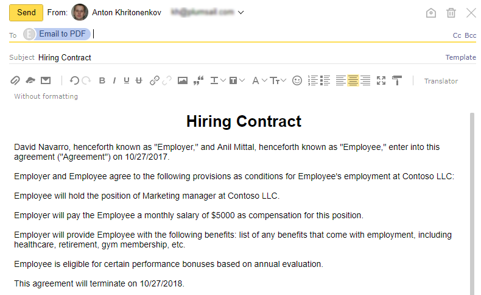
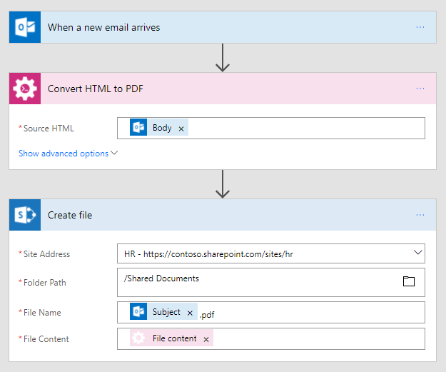
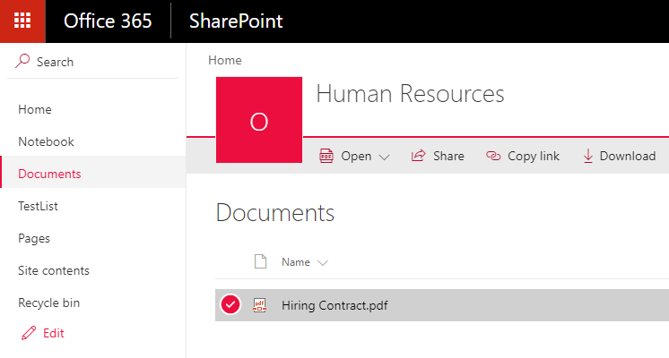

Convert email message to PDF in Microsoft Flow and Azure Logic Apps
===================================================================

This article demonstrates how to convert an email message to PDF with the help of  `Microsoft Flow <https://flow.microsoft.com>`_. 

We will take a hiring contract text as a body of our message:

You can use different Microsoft Flow connectors to receive messages. Some examples:

- Office 365 Outlook
- Outlook.com
- Gmail

In this example, we will convert email messages to PDF when they arrive in Office 365 Outlook inbox. Then we will store PDF files to a SharePoint document library. You can configure your Flow to store documents in any other location. For example, in Dropbox.

This is how complete flow looks:

Here is step by step description for the flow.

**Flow trigger to receive email messages**

Firstly you need to add a trigger to start Flow when a new email arrives. We use Office 365 Outlook trigger called "When a new email arrives".

**Convert HTML to PDF**

This is an action from `Plumasail Documents connector <https://plumsail.com/actions>`_.

Just put body variable from trigger output into "Source HTML" parameter of the action. You can use email subject as a file name. Then you can receive PDF file content as an output of the action.

You can find more information about this action `here <../../actions/document-processing.html#convert-html-to-pdf>`_.

**Create PDF file**

Now you need to store PDF file somewhere. In our example, we use "Create file" action from SharePoint connector to store the PDF document into SharePoint document library. We use email subject as a file name.

You can use any other connector to store PDF document into your system.

.. hint:: You can use `Convert HTML to PDF <../../actions/document-processing.html#convert-html-to-pdf>`_ action in a different scenario. For example, you can `generate HTML document from a template and then convert it to PDF <create-pdf-from-html-template.html>`_. This is useful for automatic generation of invoices, contracts, etc.