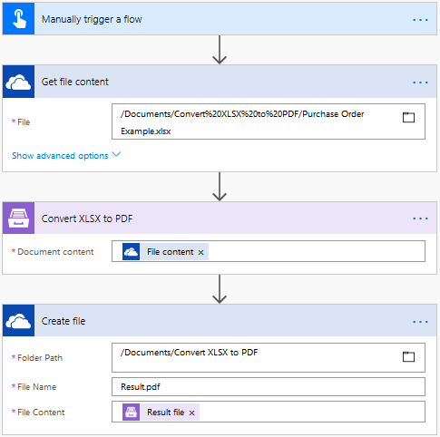
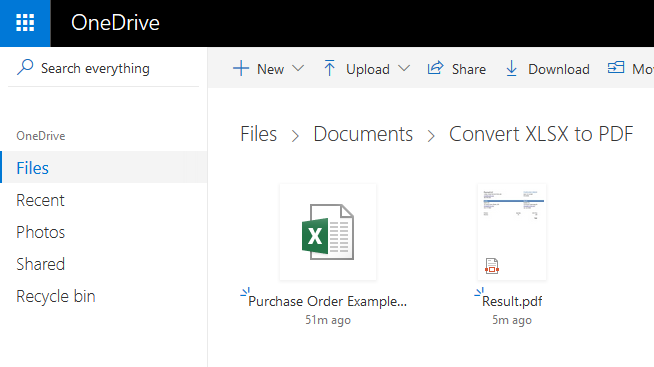

Convert XLSX to PDF in Microsoft Flow and Azure Logic Apps
==========================================================

This article demonstrates how to convert XLSX Word document to PDF with the help of `Microsoft Flow <https://flow.microsoft.com>`_. 

We will take a purchase order as a sample Excel document:

.. image:: ../../../_static/img/flow/how-tos/xlsx-sample.png
   :alt: Select fields

Use `this link <../../../_static/files/flow/how-tos/Purchase%20Order%20Example.xlsx>`_ to download it.

Our document has to be stored somewhere. Microsoft Flow has a lot of connectors for different systems. Here are just a few of them:

- SharePoint
- Salesforce
- Box
- OneDrive
- Google Drive
- Dropbox
- SFTP
- File System

You can store your source file anywhere. In this example, we will store our document in OneDrive. Our Flow will get a file from OneDrive, convert it to PDF and store generated file back to OneDrive. 

This is how complete flow looks:

Here is step by step description for the flow.

**Flow trigger**

You can actually pick any trigger. For example, you can start Flow on file creation in a SharePoint document library. We use "Manually trigger a flow" trigger here to simplify the Flow.

**Get file content**

This action gets file content of the specified file from a SharePoint document library. You just specify SharePoint site URL and path to your file.

You can use any other connector to get files from your system.

**Convert XLSX to PDF**

This is an action from `Plumsail Documents connector <https://plumsail.com/documents>`_.

Just put XLSX file content from the output of the previous action and receive PDF file content as an output of this action.

You can find more information about this action `here <../../actions/document-processing.html#convert-xlsx-document-to-pdf>`_.

**Create file**

Now you need to store PDF file somewhere. In our example, we use "Create file" action OneDrive connector to store the PDF document.

You can use any other connector to store PDF document into your system.

.. hint:: There is also `Create document from XLSX template <../../actions/document-processing.html#create-document-from-xlsx-template>`_ action available. You can use it in conjunction with `Convert XLSX to PDF <../../actions/document-processing.html#convert-xlsx-document-to-pdf>`_ action to `create PDF documents from a template <create-pdf-from-xlsx-template.html>`_.