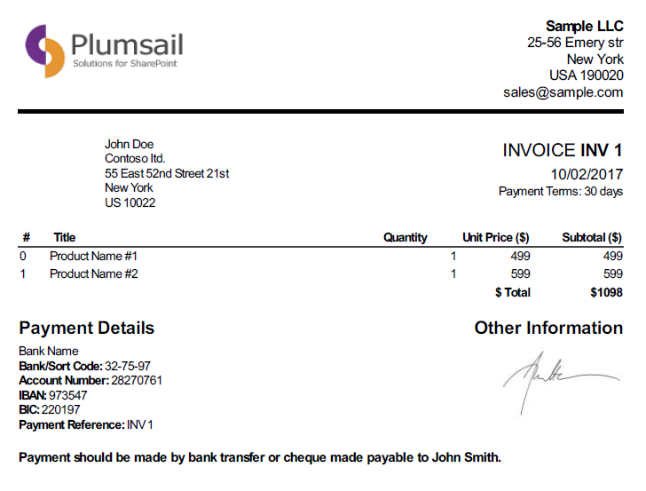
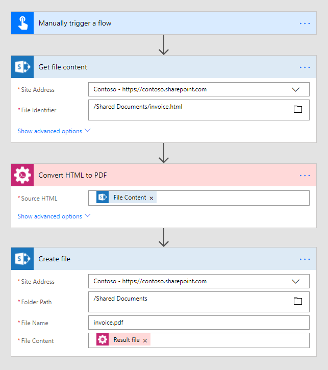
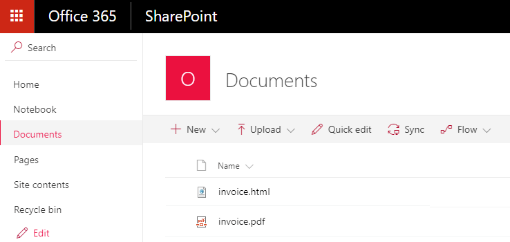

Convert HTML to PDF in Microsoft Flow and Azure Logic Apps
==========================================================

This article demonstrates how to convert an HTML document or an HTML string to PDF with the help of `Microsoft Flow <https://flow.microsoft.com>`_. 

We will take an invoice as a sample HTML document:

Use `this link <../../../_static/files/flow/how-tos/invoice-html-example.txt>`_ to download it.

Our documents have to be stored somewhere. Microsoft Flow has a lot of connectors for different systems. Here are just a few of them:

- SharePoint
- Salesforce
- Box
- OneDrive
- Google Drive
- Dropbox
- SFTP
- File System

You can store your files anywhere. In this example, we will store our documents in SharePoint. Our Flow will get an HTML file from a SharePoint document library, convert it to PDF and store generated file back to SharePoint document library. 

This is how complete flow looks:

Here is step by step description for the flow.

**Flow trigger**

You can actually pick any trigger. For example, you can start Flow on file creation in a SharePoint document library. We use "Manually trigger a flow" trigger here to simplify the Flow.

**Get file content**

This action gets file content of the specified file from a SharePoint document library. You just specify SharePoint site URL and path to your file.

You can use any other connector to get files from your system.

**Convert HTML to PDF**

This is an action from `Plumasail Documents connector <https://plumsail.com/documents>`_.

Just put HTML file content from the output of the previous action and receive PDF file content as an output of this action. You can also use raw HTML string as a source HTML.

You can find more information about this action `here <../../actions/document-processing.html#convert-html-to-pdf>`_.

**Create file**

Now you need to store the HTML file somewhere. In our example, we use "Create file" action from SharePoint connector to store the PDF document into SharePoint document library.

You can use any other connector to store PDF document into your system.

.. hint:: There is also `Create HTML from template <../../actions/document-processing.html#create-html-from-template>`_ action available. You can use it in conjunction with `Convert HTML to PDF <../../actions/document-processing.html#convert-html-to-pdf>`_ action to `create PDF documents from a template <create-pdf-from-html-template.html>`_.