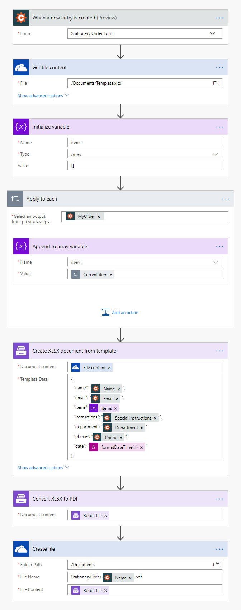
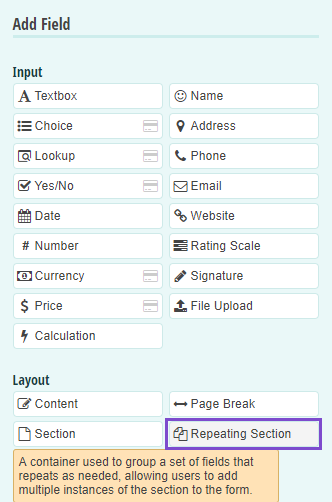
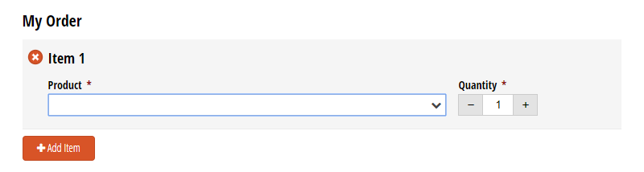
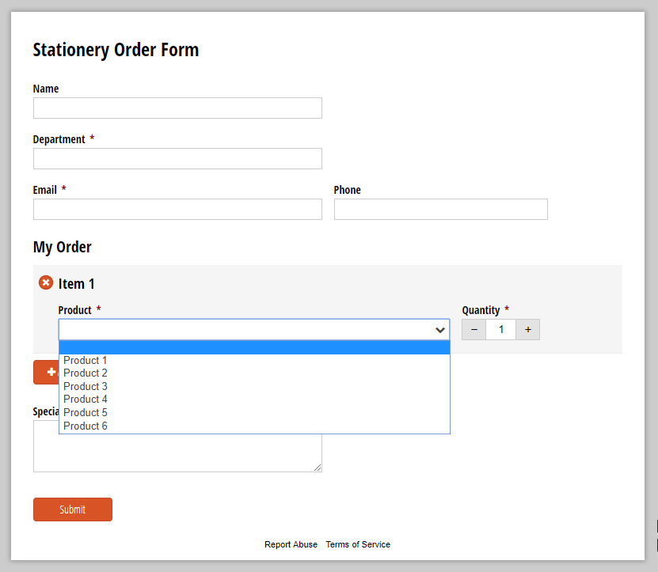
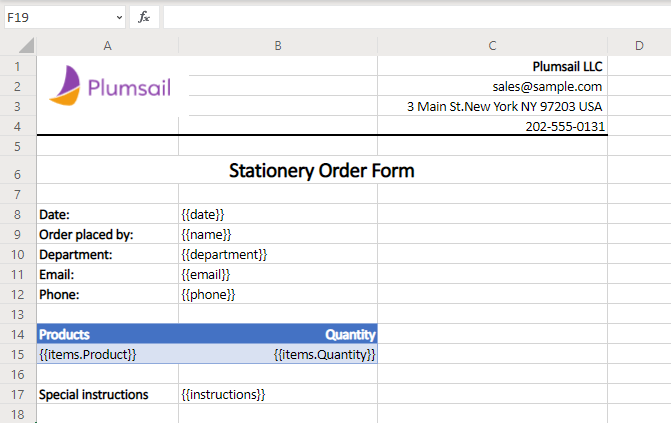
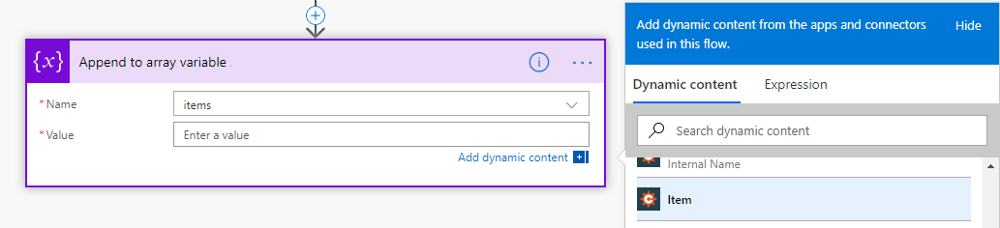
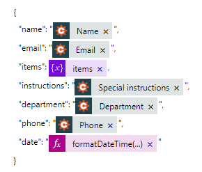
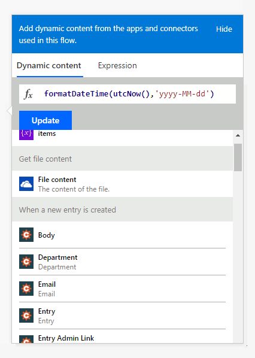
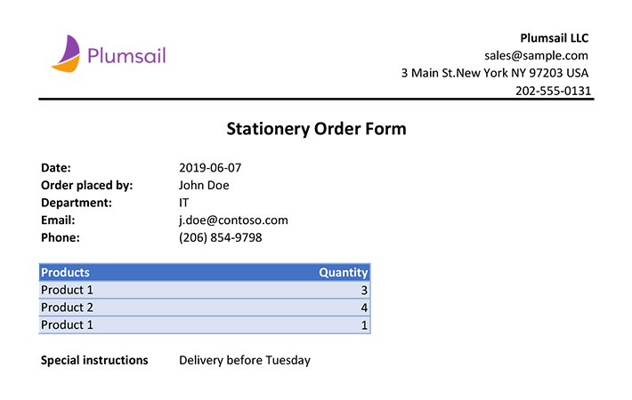

How to create Excel and PDF documents from Cognito Forms in Microsoft Flow and Azure Logic Apps
===============================================================================================

Let's suppose you want to automate the generation of documents in your company. For example, applications, orders, invoices, etc. By going through this article you will learn how to create an XLSX document from a template and convert it to PDF on a Cognito Form submission with help of `Plumsail Documents <https://plumsail.com/documents/>`_ in Microsoft Flow and Azure Logic Apps.

`Cognito Forms <https://www.cognitoforms.com/>`_ is an online form builder that allows you to create powerful forms for your website.

Let's imagine that you want to provide people from different departments in your company a possibility to order office supplies and stationery by filling in a form.

In our example, we will collect data from a Cognito Form, apply the data to our template and generate a new PDF document.

Description
-----------

Our source and result documents have to be stored somewhere. In this example, we store our documents in OneDrive.

Microsoft Flow has a lot of connectors for different systems. Here are just a few of them:

- SharePoint
- Salesforce
- Box
- OneDrive
- Google Drive
- Dropbox
- SFTP
- File System

You can store your source file anywhere.

We need to create a Microsoft Flow that will be triggered by a Cognito Form submission. The flow will get the template from OneDrive, apply data from a submitted Cognito form to this template, convert the generated document to PDF and save it to OneDrive. This is how our complete flow looks like:

Description of Microsoft Flow Actions
-------------------------------------

Please find the description of all the actions from the flow below.

Form is submitted
~~~~~~~~~~~~~~~~~

We've already created a Cognito  form and we will use data from its submission in our flow. If you haven't created a form yet, you can learn how to do it `here <https://www.cognitoforms.com/support/15/building-forms/creating-forms>`_.

We used the *Repeating Section* layout to allow users to add more products. You may also use the *Basic Sales Form* template to add this functionality:

Below is a screenshot of our form:

To start the flow on form submission we search for *Cognito Forms* in MS Flow and add *Cognito Forms - When a new entry is created* trigger.

If this is your first Flow with Cognito Forms, at this point you'll need to Sign into Cognito Account from MS Flow, so you can start using your forms inside your flows.

You'll need to pick the form you want to track in the dropdown.

Get file content
~~~~~~~~~~~~~~~~~

This action gets file content of the specified file from OneDrive. We use this action to read a .XLSX template. You can use any other connector to get files from your system.

Below is our template. You may download it `here <../../../_static/files/flow/how-tos/Create-Word-and-XLSX-template.xlsx>`_.

*Plumsail Excel XLSX templates* use a different approach than most other templating solutions. It uses a minimal amount of syntax to make your work done.

In short, the templating engine thinks that everything between these :code:`{{ }}` brackets is variables where it will write the data you specified in **Template data**. 

Read `this article <../../../document-generation/xlsx/how-it-works.html>`_ to get familiar with the templating engine.

Initialize variable
~~~~~~~~~~~~~~~~~~~

We need to build an array with the data from the Repeating Form's Section to use it in the JSON **Template data** in *Create XLSX Document from Template* action. So, we create an array variable *items*.

Append to array variable - Apply to each
~~~~~~~~~~~~~~~~~~~~~~~~~~~~~~~~~~~~~~~~

Here we append each product's data to the array created in the previous step. Just add *Append to array variable - Variables* action and pick **Item** from the output of *Cognito Forms - When a new entry is created* action in the menu on the right. This will automatically transform this action into repeating one which will be performed for each item.

Create XLSX Document from Template
~~~~~~~~~~~~~~~~~~~~~~~~~~~~~~~~~~
This is the action from `Plumasail Documents connector <https://plumsail.com/actions/documents/>`_. This action is suitable for creating documents from a template. You can find more information about the action by visiting `this page <../../actions/document-processing.html#create-xlsx-document-from-template>`_.

There are two parameters:

**1. Document content**

In the first parameter **Document content**, we specified the output of the previous action as a template.

**2. Template data**

In the second parameter **Template data**, we specified data to apply to the template in JSON format:

This object contains information from our form. We selected the content from the output of *Cognito Forms - When a new entry is created* action in the menu on the right:

We also added the current date using a standard MS Flow expression:

.. code:: json

    formatDateTime(utcNow(),'yyyy-MM-dd')

Convert XLSX to PDF
~~~~~~~~~~~~~~~~~~~
This is also an action from Plumsail Documents connector.

Just put DOCX file content from the output of the previous action and receive PDF file content as an output from this action.

You can find more information about this action `here <../../actions/document-processing.html#convert-xlsx-to-pdf>`_.

Create file
~~~~~~~~~~~

Once the result document is generated, we need to store the PDF file somewhere. In our example, we use *Create file* action from OneDrive connector to store the document in OneDrive.

You can use any other connector to store documents in your system.

This is how the final document will look in our case:

Conclusion
----------

Now you should have an idea of how to use *Create XLSX Document from Template* and *Convert XLSX to PDF* actions from `Plumsail Documents <https://plumsail.com/documents/>`_ for Microsoft Flow to automatically create documents on a Cognito Form submission. If you haven't used our actions yet, `registering an account <../../../getting-started/sign-up.html>`_ would be the first step. It is quite easy to get started.
