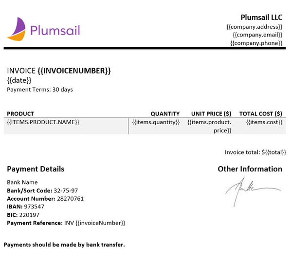

How to create DOCX document from template in Microsoft Flow, Azure Logic Apps and PowerApps
===========================================================================================
Let’s suppose you want to automate the generation of invoices in your company. By going through this article you will learn how to create a DOCX document from a template using `Create DOCX Document from Template`_ action from `Plumsail Documents connector`_ in  Microsoft Flow and Azure Logic Apps.

Probably you have some third party system, where you create data for invoices. Then you get this data in Microsoft Flow, apply it to our invoice template and generate a new document.

This is how the final document will look in our case:

|invoice-result-document|

Our template and result document have to be stored somewhere. Microsoft Flow has a lot of connectors for different systems. Here are just a few of them:

- SharePoint
- Box
- OneDrive
- Google Drive
- Dropbox
- SFTP
- File System

In this example, we will store our documents in SharePoint. 
Our flow will use JSON object as a source data for the template, but you can get data from other sources. For example query list items from SharePoint.

This is how the flow looks like:

|invoice-flow|

Flow trigger
~~~~~~~~~~~~
You can actually pick any trigger. For example, you can start Flow on file creation in a SharePoint document library. We are using "Manually trigger a flow" trigger here to simplify the Flow.

Get file content
~~~~~~~~~~~~~~~~
This action gets file content of the specified file from a SharePoint document library. 
You can just specify SharePoint site URL and path to your file. We are using this action to get our template’s content.

|invoice-flow-get-file-content|

You can use any other connector to get files from your system.

Create DOCX Document from Template
~~~~~~~~~~~~~~~~~~~~~~~~~~~~~~~~~~
This is the action from `Plumasail Documents connector <https://plumsail.com/actions/documents/>`_. This action is suitable for creating documents from a template. 
You can find more information about this action by visiting `this page <../../actions/document-processing.html#create-docx-document-from-template>`_.

There are two parameters:

1. Document content
2. Template data

In the first parameter 'Document content' you can put template’s content from some other action. In our case, we specified the output of the previous action as a template.

`Download the template file <../../../_static/files/document-generation/demos/invoice-template.docx>`_ that we will use in this article.

|invoice-template|

Plumsail Word DOCX templates use a different approach than most other templating solutions. It uses a minimal amount of syntax to make your work done.

Read `this article <../../../document-generation/docx/how-it-works.html>`_ to get familiar with the templating engine.

In short, templating engine thinks that everything between these :code:`{{ }}` brackets is basically variables where it will write the data you specified in 'Template data'.
In our case the most basic example would be: :code:`{{invoiceNumber}}` and :code:`{{date}}` tags, they let the engine know that we want to render the invoice number and its date.

But of course, we can implement more complex scenario, in our template we are referring properties inside simple objects and collections, as well as properties in nested constructions. 
To select properties of our objects inside of the array (in JSON data) we are using a dot operator:

- The :code:`{{company.address}}`, :code:`{{company.email}}`, :code:`{{company.phone}}` tags let the engine know that we want to render properties of the company object.
- The :code:`{{items.product.name}}`, :code:`{{items.product.price}}` tags get the name, description and price properties in each item's product object.

The templating engine is smart enough to understand what content needs to be duplicated. It will iterate through all objects in the array to render them and add the rows automatically.

You can learn more about table rendering in `the tables section <../../../document-generation/docx/tables.html>`_ of the documentation.

In the second parameter, we specified data that is being applied to the template in JSON format:

.. code:: json

    {
        "invoiceNumber": "432",
        "company": {
            "email": "sales@sample.com",
            "address": "3 Main St.New York NY 97203 USA",
            "phone": "202-555-0131"
        },
        "date": "2018-05-21",
        "items": [
            {
                "product": {
                    "name": "Monitor",
                    "price": 99
                },
                "quantity": 10,
                "cost": 990
            },
            {
                "product": {
                    "name": "Stepler",
                    "price": 12.44
                },
                "quantity": 1000,
                "cost": 12440
            },
            {
                "product": {
                    "name": "Fridge",
                    "price": 4219.99
                },
                "quantity": 1,
                "cost": 4219.99
            },
            {
                "product": {
                    "name": "Microwave",
                    "price": 99.99
                },
                "quantity": 5,
                "cost": 499.95
            },
            {
                "product": {
                    "name": "Pen",
                    "price": 7.23
                },
                "quantity": 100,
                "cost": 723
            }
        ],
        "total": 18872.94
    }

Create file
~~~~~~~~~~~
Now you need to store text file somewhere. In our example, we use 'Create file' action from SharePoint connector to store the DOCX document into SharePoint document library.

|invoice-flow-create-file|

You can use any other connector to store documents into your system.

Conclusion
~~~~~~~~~~
Now you should have an idea how to use Create DOCX Document from Template action from `Plumsail Documents connector <https://plumsail.com/actions/documents/>`_ for Microsoft Flow. 
If you haven’t used it yet, `registering an account`_ would be the first step. It is quite easy to get started.

.. _Create DOCX Document from Template: ../../actions/document-processing.html#create-docx-document-from-template
.. _Plumsail Documents connector: https://plumsail.com/actions/documents/
.. _SharePoint connector: https://plumsail.com/actions/sharepoint/
.. _this documentation page: ../../../document-generation/docx/demos.html#sales-invoice
.. _registering an account: ../../../getting-started/sign-up.html

.. |invoice-result-document| image:: ../../../_static/img/flow/how-tos/invoice-result-document.png

.. |invoice-flow| image:: ../../../_static/img/flow/how-tos/create-docx-from-template-flow.png
.. |invoice-flow-get-file-content| image:: ../../../_static/img/flow/how-tos/create-docx-from-template-get-file-content.png
.. |invoice-flow-create-file| image:: ../../../_static/img/flow/how-tos/create-docx-from-template-create-file.png