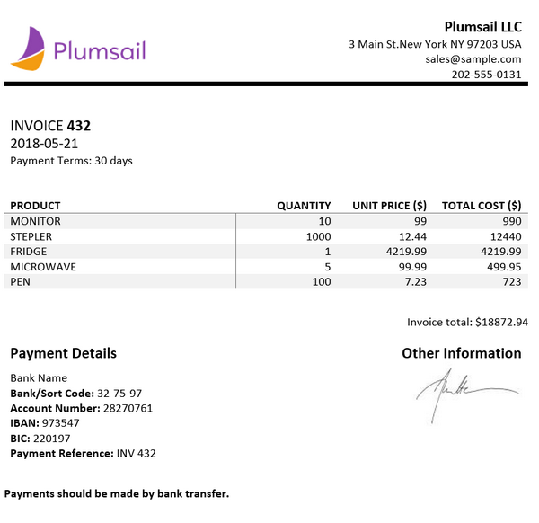
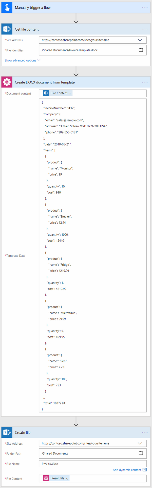
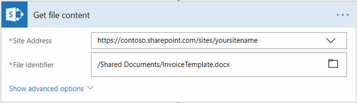
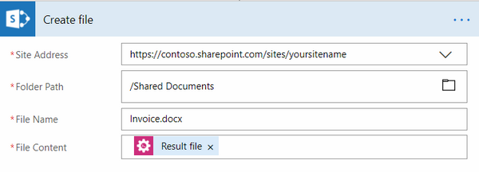

How to create DOCX document from template in Microsoft Flow, Azure Logic Apps and PowerApps
===========================================================================================
Let’s suppose you want to automate the generation of invoices in your company. 
By going through this article you will learn how to create a DOCX document from a template using `Create DOCX Document from Template`_ action from `Plumsail Documents connector`_ in  Microsoft Flow and Azure Logic Apps.

.. important:: 

  This action is not available in public connector in Microsoft Flow yet. It will become available soon. 
  If you want to use this action right now, you can `add this connector as a custom connector <../create-custom-connector.html>`_.

Let us assume that you have some third party system, where you create date for invoices. Then you get this data in Microsoft Flow, apply it to our invoice template and generate a new document.

This is how the final document will look in our case:

|invoice-result-document|

You can store your file anywhere. We also have a `SharePoint connector`_ which might help you to manage your files. In this example, we will store our documents in SharePoint. 
Our flow will use JSON object as a source data for the template, but you can get data from other sources. For example query list items from SharePoint.

This is how the flow looks like:

|invoice-flow|

Flow trigger
~~~~~~~~~~~~
You can actually pick any trigger. For example, you can start Flow on file creation in a SharePoint document library. We are using "Manually trigger a flow" trigger here to simplify the Flow.

Get file content
~~~~~~~~~~~~~~~~
This action gets file content of the specified file from a SharePoint document library. 
You can just specify SharePoint site URL and path to your file. We are using this action to get our template’s content.

|invoice-flow-get-file-content|

You can use any other connector to get files from your system.

Create DOCX Document from Template
~~~~~~~~~~~~~~~~~~~~~~~~~~~~~~~~~~
This is the action from `Plumasail Documents connector <https://plumsail.com/actions/documents/>`_. This action is suitable for creating documents from a template. 
You can find more information about this action by visiting `this page`_.

There are two parameters:

1. Document content
2. Template data

In the first parameter 'Document content' you can put the raw text of a template or a template’s content from some other action. We specified the output of the previous action as a template.

In the second parameter, we specified data to apply to the template in JSON format.

You can download the template we are using, the result file, as well as get the JSON from `this documentation page`_.

The :code:`{{company.address}}`, :code:`{{company.email}}`, :code:`{{company.phone}}` tags let the engine know that we want to render properties of the company object.
The :code:`{{invoiceNumber}}`, :code:`{{date}}` tags let the engine know that we want to render the invoice number and its date.
As you can see, the items object is a two-dimensional array. It is important because the array is required to create table columns dynamically. A new column will be created for each item of the array. 
The :code:`{{items.product.name}}`, :code:`{{items.product.price}}` tags get the name, description and price properties in each item's product object.

Create file
~~~~~~~~~~~
Now you need to store text file somewhere. In our example, we use 'Create file' action from SharePoint connector to store the DOCX document into SharePoint document library.

|invoice-flow-create-file|

You can use any other connector to store documents into your system.

Conclusion
~~~~~~~~~~
Now you should have an idea how to use Create DOCX Document from Template action from `Plumsail Documents connector <https://plumsail.com/actions/documents/>`_ for Microsoft Flow. 
If you haven’t used it yet, `registering an account`_ would be the first step. It is quite easy to get started.

.. _Create DOCX Document from Template: ../../actions/document-processing.html#create-docx-document-from-template
.. _Plumsail Documents connector: https://plumsail.com/actions/documents/
.. _SharePoint connector: https://plumsail.com/actions/sharepoint/
.. _this page: ../../actions/document-processing.html#create-docx-document-from-template
.. _this documentation page: ../../../document-generation/docx/demos.html#sales-invoice
.. _registering an account: ../../../getting-started/sign-up.html

