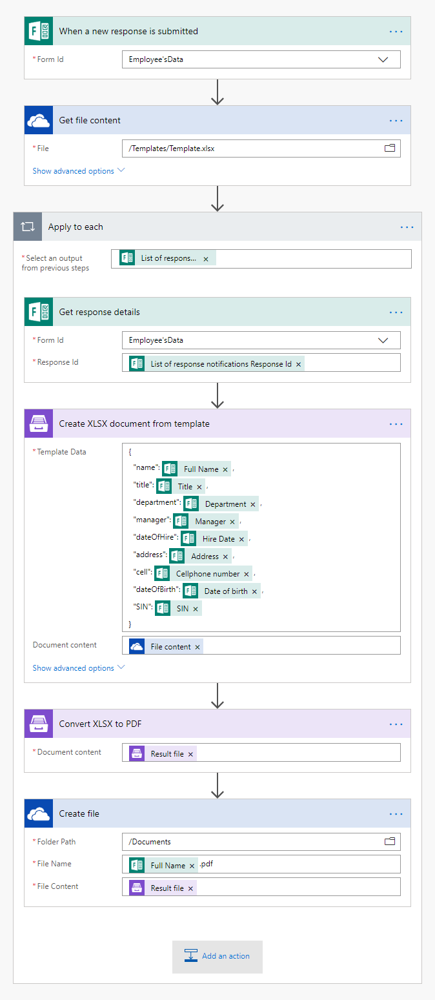
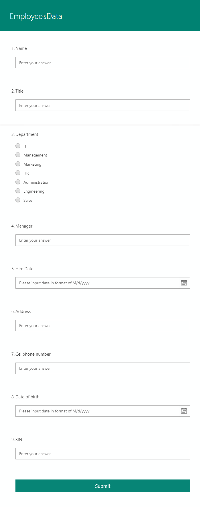
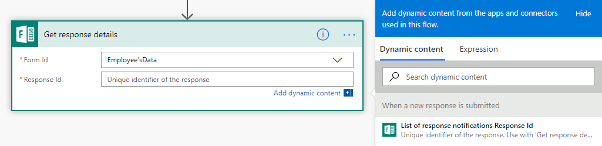
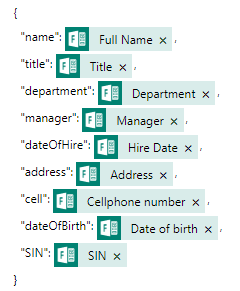
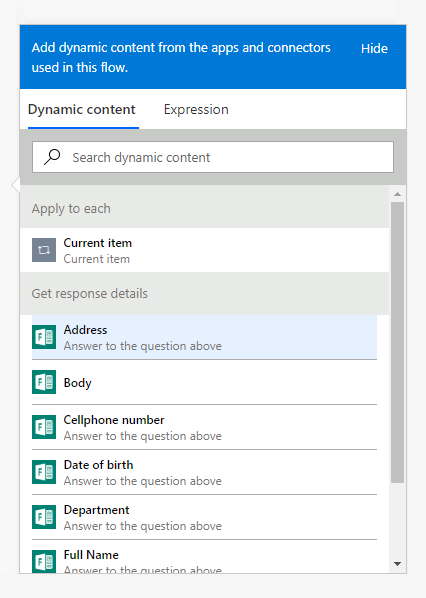
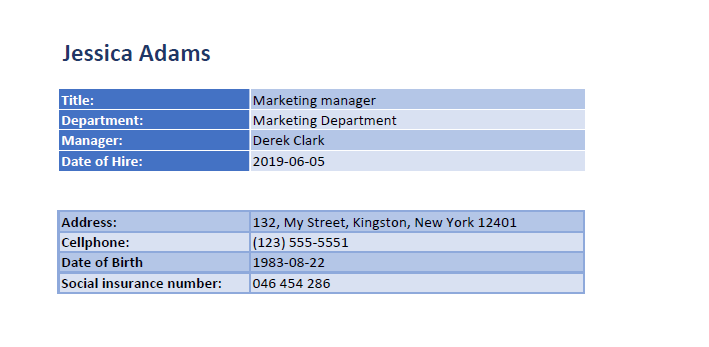

How to create Excel and PDF documents from Microsoft Forms in Microsoft Flow and Azure Logic Apps
===============================================================================================

Let's suppose you want to automate the generation of documents in your company. For example, applications, orders, invoices, etc. By going through this article you will learn how to create a XLSX document from a template and convert it to PDF on a Microsoft form submission with help of `Plumsail Documents <https://plumsail.com/documents/>`_ in Microsoft Flow and Azure Logic Apps.

`Microsoft Forms <https://forms.office.com/>`_ is an online form builder with themes and question branching that allows you to create surveys, quizzes, polls and collects other information.

In our example, we will collect data from a Microsoft form, apply the data to our template and generate a new PDF document.

Description
-----------

Our source and result documents have to be stored somewhere. In this example, we store our documents in OneDrive.

Microsoft Flow has a lot of connectors for different systems. Here are just a few of them:

- SharePoint
- Salesforce
- Box
- OneDrive
- Google Drive
- Dropbox
- SFTP
- File System

You can store your source file anywhere.

We need to create a Microsoft Flow that will be triggered by a Microsoft form submission. The flow will get the template from OneDrive, apply data from a submitted Microsoft form to this template, convert the generated document to PDF and save it to OneDrive. This is how our complete flow looks like:

Description of Microsoft Flow Actions
-------------------------------------

Please find the description of all the actions from the flow below.

Form is submitted
~~~~~~~~~~~~~~~~~

We've already created a Microsoft form and we will use data from its submission in our flow. If you haven't created a form yet, you can learn how to do it `here <https://support.office.com/en-gb/article/create-a-form-with-microsoft-forms-4ffb64cc-7d5d-402f-b82e-b1d49418fd9d>`_.

Below is a screenshot of our form:

To start the flow on form submission we search for *Microsoft Forms* in MS Flow and add *Microsoft Forms - When a new response is submitted* trigger.

If this is your first Flow with Microsoft Forms, at this point you'll need to Sign into Microsoft Forms Account from MS Flow, so you can start using your forms inside your flows.

Select the dropdown under **Form Id** and pick the form you want to monitor.

Get file content
~~~~~~~~~~~~~~~~~

This action gets file content of the specified file from OneDrive. We use this action to read a .XLSX template. You can use any other connector to get files from your system.

Below is our template. You may download it `here <../../../_static/files/flow/how-tos/Create-Excel-and-PDF-EmployeesEvaluation-template.xlsx>`_.

.. image:: ../../../_static/img/flow/how-tos/MS-Forms-XLSX-PDF-template.png
    :alt: Template

The templating engine thinks that everything between these :code:`{{ }}` brackets is variables where it will write the data you specified in **Template data**. 

Read `this article <../../../document-generation/xlsx/how-it-works.html>`_ to get familiar with the templating engine.

Get response details
~~~~~~~~~~~~~~~~~~~~

As we want to get the submitted data we need to add *Microsoft Forms - Get response details* action. On this action, we select the same **Form Id** that we used in the trigger. Then, we click in the **Response Id** text box and pick **List of response notifications - Response Id** in the Dynamic content menu on the right:

As a result, we will get the response details for the responses that caused the trigger. There can be more than one response at the same time, so the **List of response notifications - Response Id** actually represents a list of responses. As a result, when we select this input we will get an *Apply to each* added around the action.

Now, we can apply the data from each response to the template.

Create XLSX Document from Template
~~~~~~~~~~~~~~~~~~~~~~~~~~~~~~~~~~
This is the action from `Plumsail Documents connector <https://plumsail.com/actions/documents/>`_. This action is suitable for creating documents from a template. You can find more information about the action by visiting `this page <../../actions/document-processing.html#create-xlsx-document-from-template>`_.

There are two parameters:

**1. Document content**

In the first parameter **Document content**, we specified the output of the previous action as a template.

**2. Template data**

In the second parameter **Template data**, we specified data to apply to the template in JSON format:

This object contains information from our form. We selected the content from the output of *Microsoft Forms - Get response details* action in the menu on the right:

Convert XLSX to PDF
~~~~~~~~~~~~~~~~~~~
This is also an action from Plumsail Documents connector.

Just put XLSX file content from the output of the previous action and receive PDF file content as an output from this action.

You can find more information about this action `here <../../actions/document-processing.html#convert-xlsx-to-pdf>`_.

Create file
~~~~~~~~~~~

Once the result document is generated, we need to store the PDF file somewhere. In our example, we use *Create file* action from OneDrive connector to store the document in OneDrive.

You can use any other connector to store documents in your system.

This is how the final document will look in our case:

Conclusion
----------

Now you should have an idea of how to use *Create XLSX Document from Template* and *Convert XLSX to PDF* actions from `Plumsail Documents <https://plumsail.com/documents/>`_ for Microsoft Flow to automatically create documents on a JotForm submission. If you haven't used our actions yet, `registering an account <../../../getting-started/sign-up.html>`_ would be the first step. It is quite easy to get started.
