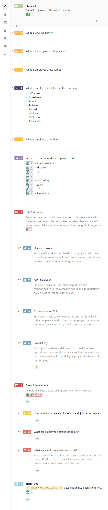
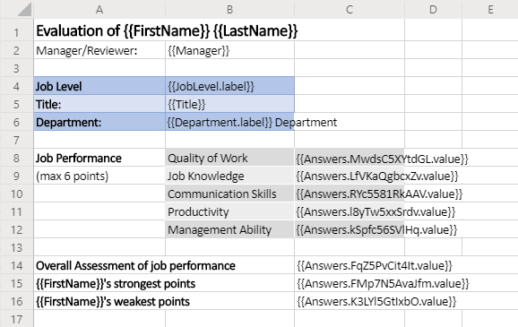
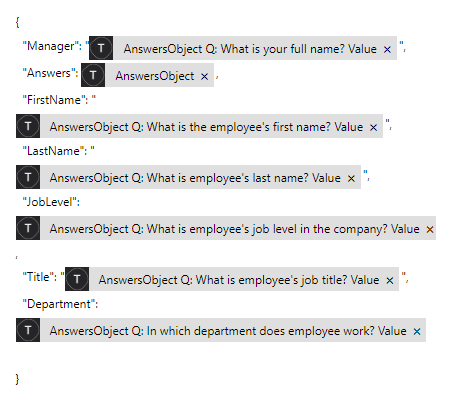
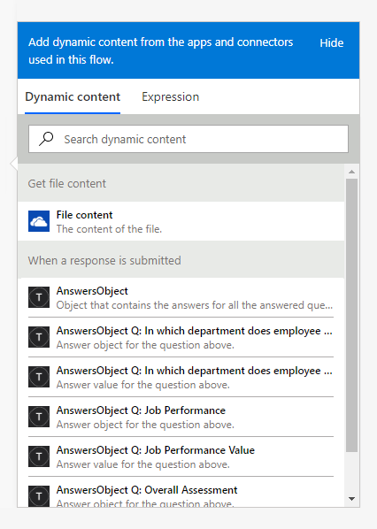
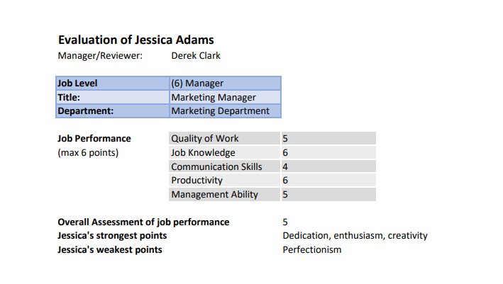

How to create Excel and PDF documents from Typeform in Microsoft Flow and Azure Logic Apps
===============================================================================================

Let's suppose you want to automate the generation of documents in your company. For example, applications, orders, invoices, reviews, etc. By going through this article you will learn how to create an XLSX document from a template and convert it to PDF on a Typeform submission with the help of `Plumsail Documents <https://plumsail.com/documents/>`_ in Microsoft Flow and Azure Logic Apps.

`Typeform <https://www.typeform.com/>`_ is an online form builder that allows you to create modern responsive forms for your website.

In our example, we will collect data from a Typeform, apply the data to our template and generate a new PDF document with an Annual Employee Performance Review.

Description
-----------

Our source and result documents have to be stored somewhere. In this example, we store our documents in OneDrive.

Microsoft Flow has a lot of connectors for different systems. Here are just a few of them:

- SharePoint
- Salesforce
- Box
- OneDrive
- Google Drive
- Dropbox
- SFTP
- File System

You can store your source file anywhere.

We need to create a Microsoft Flow that will be triggered by a Typeform submission. The flow will get the template from OneDrive, apply data from a submitted Typeform to this template, convert the generated document to PDF and save it to OneDrive. This is how our complete flow looks like:

.. image:: ../../../_static/img/flow/how-tos/Typeform-XLSX-PDF-flow.png
    :alt: Creating Excel and PDF documents from Typeform flow

Description of Microsoft Flow Actions
-------------------------------------

Please find the description of all the actions from the flow below.

Form is submitted
~~~~~~~~~~~~~~~~~

We've already created a Typeform and we will use data from its submission in our flow. If you haven't created a form yet, you can learn how to do it `here <https://www.typeform.com/help/my-1st-typeform/>`_.

Below is a screenshot of our form:

To start the flow on form submission we search for *Typeform Forms* in MS Flow and add *Typeform Forms - When a new entry is created* trigger.

If this is your first Flow with Typeform, at this point you'll need to Sign into Typeform Account from MS Flow, so you can start using your forms inside your flows.

You'll need to pick the form you want to track in the dropdown.

Get file content
~~~~~~~~~~~~~~~~~

This action gets file content of the specified file from OneDrive. We use this action to read an .XLSX template. You can use any other connector to get files from your system.

Below is our template. You may download it `here <../../../_static/files/flow/how-tos/Create-Excel-and-PDF-EmployeesEvaluation-template.xlsx>`_.

*Plumsail Word XLSX templates* use a different approach than most other templating solutions. It uses a minimal amount of syntax to make your work done.

In short, the templating engine thinks that everything between these :code:`{{ }}` brackets is variables where it will write the data you specified in **Template data**. 

Read `this article <../../../document-generation/xlsx/index.html>`_ to get familiar with the templating engine.

Create XLSX Document from Template
~~~~~~~~~~~~~~~~~~~~~~~~~~~~~~~~~~
This is the action from `Plumasail Documents connector <https://plumsail.com/actions/documents/>`_. This action is suitable for creating documents from a template. You can find more information about the action by visiting `this page <../../actions/document-processing.html#create-xlsx-document-from-template>`_.

There are two parameters:

**1. Document content**

In the first parameter **Document content**, we specified the output of the previous action as a template.

**2. Template data**

In the second parameter **Template data**, we specified data to apply to the template in JSON format:

This object contains information from our form. We selected the content from the output of *Typeform Forms - When a new entry is created* action in the menu on the right:

You may note that we used quotes with string type values and skipped them for values that are JSON objects, for instance, for *Answers*, *JobLevel*, and *Department*. After our test response has been submitted we will get a JSON like this:

.. code::

    {
      "Manager": "Derek Clark",
      "Answers": {
        "dUWm5EAzrpCj": {
          "type": "choice",
          "choice": {
            "label": "(6) Manager"
          },
          "field": {
            "id": "dUWm5EAzrpCj",
            "type": "dropdown",
            "ref": "2a425b817c69d697"
          },
          "value": {
            "label": "(6) Manager"
          }
        },
        "MwdsC5XYtdGL": {
          "type": "number",
          "number": 5,
          "field": {
            "id": "MwdsC5XYtdGL",
            "type": "opinion_scale",
            "ref": "75d53707e6be88b0"
          },
          "value": 5
        },
        "FqZ5PvCit4It": {
          "type": "number",
          "number": 5,
          "field": {
            "id": "FqZ5PvCit4It",
            "type": "rating",
            "ref": "a07c2e3a3eb024e3"
          },
          "value": 5
        },
        "FMp7N5AvaJfm": {
          "type": "text",
          "text": "Dedication, enthusiasm, creativity",
          "field": {
            "id": "FMp7N5AvaJfm",
            "type": "long_text",
            "ref": "3031f04cd2d850a1"
          },
          "value": "Dedication, enthusiasm, creativity"
        },
        "K3LYl5GtIxbO": {
          "type": "text",
          "text": "Perfectionism",
          "field": {
            "id": "K3LYl5GtIxbO",
            "type": "long_text",
            "ref": "83ffd62b7c93b6ab"
          },
          "value": "Perfectionism"
        }
      },
      "FirstName": "Jessica",
      "LastName": "Adams",
      "JobLevel": {
        "label": "(6) Manager"
      },
      "Title": "Marketing Manager",
      "Department": {
        "label": "Marketing"
      }
    }

The templating engine allows you to refer a property inside an object in your template. You can even refer a property inside an object nested in another object.

For example, :code:`{{Answers.MwdsC5XYtdGL.value}}` tag in our template allows us to display the points that have been given to Jessica to evaluate the quality of her work.

Convert XLSX to PDF
~~~~~~~~~~~~~~~~~~~
This is also an action from Plumsail Documents connector.

Just put XLSX file content from the output of the previous action and receive PDF file content as an output from this action.

You can find more information about this action `here <../../actions/document-processing.html#convert-xlsx-to-pdf>`_.

Create file
~~~~~~~~~~~

Once the result document is generated, we need to store the PDF file somewhere. In our example, we use *Create file* action from OneDrive connector to store the document in OneDrive.

You can use any other connector to store documents in your system.

This is how the final document will look in our case:

Conclusion
----------

Now you should have an idea of how to use *Create XLSX Document from Template* and *Convert XLSX to PDF* actions from `Plumsail Documents <https://plumsail.com/documents/>`_ for Microsoft Flow to automatically create documents on a Typeform submission. If you haven't used our actions yet, `registering an account <../../../getting-started/sign-up.html>`_ would be the first step. It is quite easy to get started.
