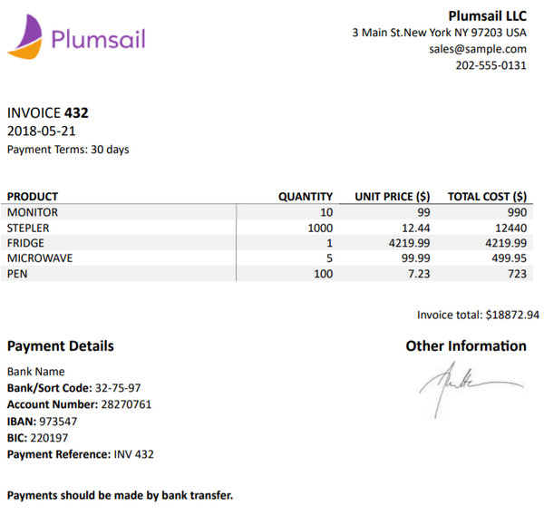
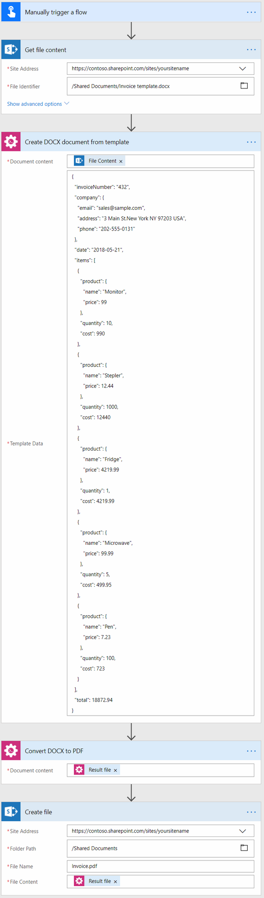
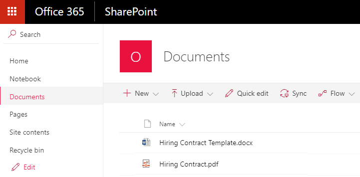

Create PDF from DOCX template in Microsoft Flow and Azure Logic Apps
====================================================================

This article demonstrates how to generate PDF document from a DOCX template with the help of `Microsoft Flow <https://flow.microsoft.com>`_. 

We will firstly generate DOCX document from a template. Then we will convert it to PDF. In this article, we will generate PDF invoice based on some data. This is how our final PDF file looks:

Our template and result document have to be stored somewhere. Microsoft Flow has a lot of connectors for different systems. Here are just a few of them:

- SharePoint
- Salesforce
- Box
- OneDrive
- Google Drive
- Dropbox
- SFTP
- File System

You can store your source file anywhere. In this example, we will store our documents in SharePoint. Our Flow will get a template from a SharePoint document library, generate a new document based on this template and on some data. The resulting document will be stored back to SharePoint document library.

Now we need to create a Microsoft Flow that will get the template from the SharePoint document library, apply data to this template, convert a document to PDF and save it back to the document library. This is how complete flow looks:

Here is the step by step description for the flow.

Flow trigger
~~~~~~~~~~~~
You can actually pick any trigger. For example, you can start Flow on file creation in a SharePoint document library. We use "Manually trigger a flow" trigger here to simplify the Flow.

Get file content
~~~~~~~~~~~~~~~~
This action gets file content of the specified file from a SharePoint document library. You just specify SharePoint site URL and path to your file. We use this action to read .docx template.

You can use any other connector to get files from your system.

Create document from DOCX template
~~~~~~~~~~~~~~~~~~~~~~~~~~~~~~~~~~
This is an action from `Plumsail Documents connector <https://plumsail.com/documents>`_.

There are two parameters:

1. DOCX document content
2. Template data

In the first parameter *'DOCX document content'* we specified file content of a template from the output of the previous action. Use `this link <../../../_static/files/document-generation/demos/invoice-template.docx>`_ to download it.

Read `Create DOCX from template <create-docx-from-template.html#create-docx-document-from-template>`_ article to understand how the templating engine works.

In the second parameter, we specified data to apply to the template in JSON format. This is information about a sample employee. You can actually request this information from an external system with the help of another Microsoft Flow action.

This is our sample data:

.. code:: json

    {
        "invoiceNumber": "432",
        "company": {
            "email": "sales@sample.com",
            "address": "3 Main St.New York NY 97203 USA",
            "phone": "202-555-0131"
        },
        "date": "2018-05-21",
        "items": [
            {
                "product": {
                    "name": "Monitor",
                    "price": 99
                },
                "quantity": 10,
                "cost": 990
            },
            {
                "product": {
                    "name": "Stepler",
                    "price": 12.44
                },
                "quantity": 1000,
                "cost": 12440
            },
            {
                "product": {
                    "name": "Fridge",
                    "price": 4219.99
                },
                "quantity": 1,
                "cost": 4219.99
            },
            {
                "product": {
                    "name": "Microwave",
                    "price": 99.99
                },
                "quantity": 5,
                "cost": 499.95
            },
            {
                "product": {
                    "name": "Pen",
                    "price": 7.23
                },
                "quantity": 100,
                "cost": 723
            }
        ],
        "total": 18872.94
    }

You can find more information about this action `here <../../actions/document-processing.html#create-docx-document-from-template>`_.

Convert DOCX to PDF
~~~~~~~~~~~~~~~~~~~
This is also an action from Plumsail Documents connector.

Just put DOCX file content from the output of the previous action and receive PDF file content as an output of this action.

You can find more information about this action `here <../../actions/document-processing.html#convert-docx-to-pdf>`_.

Create file
~~~~~~~~~~~
Once the result document is generated, we need to store the Word file somewhere. In our example, we use "Create file" action from SharePoint connector to store the document in SharePoint document library.

You can use any other connector to store the Word document into your system.

.. hint:: There is also `Convert HTML document to PDF <../../actions/document-processing.html#create-html-from-template>`_ action available. You can use it in conjunction with `Convert HTML to PDF <../../actions/document-processing.html#convert-html-to-pdf>`_ action to `create PDF documents from an HTML template <create-pdf-from-html-template.html>`_.