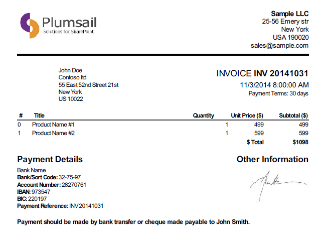
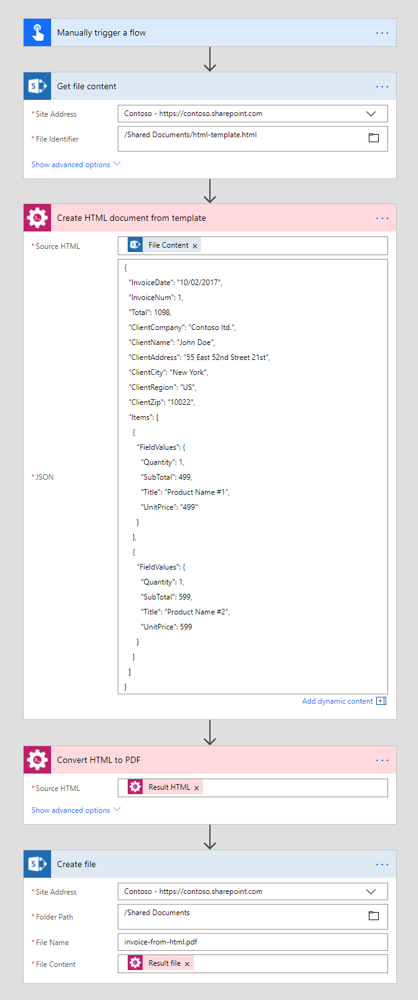
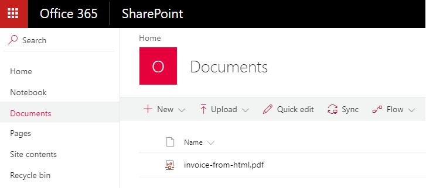

Create PDF from HTML template
==================================

This article demonstrates how to generate PDF document from an HTML template with the help of `Microsoft Flow <https://flow.microsoft.com>`_.

Before starting, ensure that you `added Plumsail Documents connector to Microsoft Flow <../../../getting-started/use-from-flow.html>`_.

We will firstly generate HTML document from a template. Then we will convert it to PDF. In this article, we will generate PDF invoice based on some data. This is how our final PDF file looks:

Our template and result document have to be stored somewhere. Microsoft Flow has a lot of connectors for different systems. Here are just a few of them:

- SharePoint
- Salesforce
- Box
- OneDrive
- Google Drive
- Dropbox
- SFTP
- File System

You can store your files anywhere. In this example, we will store our documents in SharePoint. Our flow will use JSON object as a source data for the template, but you can get data from other sources. For example, query list items from SharePoint or from Salesforce.

This is how our flow looks:

Here is step by step description for the flow.

**Flow trigger**

You can actually pick any trigger. For example, you can start Flow on file creation in a SharePoint document library. We use "Manually trigger a flow" trigger here to simplify the Flow.

**Get file content**

This action gets file content of the specified file from a SharePoint document library. You just specify SharePoint site URL and path to your file. We use this action to read HTML template. 

You can use any other connector to get files from your system.

**Create HTML from template**

This is an action from Plumasail Documents connector, which is a part of `Plumsail Actions <https://plumsail.com/actions>`_. This action is suitable for generation of HTML and text documents.

You can find more information about this action `here <../../actions/document-processing.html#create-html-from-template>`_.

There are two parameters:

1. Source HTML
2. JSON

In the first parameter *'Source HTML'* you can put raw HTML/text of a template or file content of a template from some other action. We specified the output of the previous action as a template. The internal file is quite large because of CSS styles. The template below is just a part of the template with a snippet for invoice items. Use `this link <../../../_static/files/flow/how-tos/html-template.txt>`_ to download the complete template.

.. code:: html

    <table>
        <thead\>
            <tr id="header_row">
                <th class="index_th">#</th>
                <th class="left details_th">Title</th>
                <th class="quantity_th">Quantity</th>
                <th class="unitprice_th">Unit Price ($)</th>
                <th class="subtotal_th">Subtotal ($)</th>
            </tr>
            </thead>
            <tfoot>
                <tr id="total_tr">
                    <td colspan="2">&amp;nbsp;</td>
                    <td colspan="2" class="total" id="total_currency">$ Total </td>
                    <td class="total"> ${{Total}} </td>
                </tr>
            </tfoot>
            <tbody>
                {{#each Items}} {{#with FieldValues}}
                <tr class="item">
                    <td class="item_l"> {{#index}} </td>
                    <td class="item_l"> {{Title}} </td>
                    <td class="item_r"> {{Quantity}} </td>
                    <td class="item_r"> {{UnitPrice}} </td>
                    <td class="item_r"> {{SubTotal}} </td>
                </tr>
                {{/with}} {{/each}}
            </tbody>
    </table>

You may see that there are placeholders like :code:`{{Total}}` and :code:`{{Quantity}}` in the template. There is also :code:`#{{each}}` iterator for rendering invoice items. Please read `template syntax description <../../../advanced/html-template-syntax.html>`_ for more information.

In the second parameter, we specified data to apply to the template in JSON format. This object contains information for invoice header and for invoice items:

.. code:: json

    {
        "InvoiceDate": "10/02/2017",
        "InvoiceNum": 1,
        "Total": 1098,
        "ClientCompany": "Contoso ltd.",
        "ClientName": "John Doe",
        "ClientAddress": "55 East 52nd Street 21st",
        "ClientCity": "New York",
        "ClientRegion": "US",
        "ClientZip": "10022",
        "Items": [
            {
                "FieldValues": {
                    "Quantity": 1,
                    "SubTotal": 499,
                    "Title": "Product Name #1",
                    "UnitPrice": "499"
                }
            },
            {
                "FieldValues": {
                    "Quantity": 1,
                    "SubTotal": 599,
                    "Title": "Product Name #2",
                    "UnitPrice": 599
                }
            }
        ]
    }

**Convert HTML to PDF**

This is also an action from Plumasail Documents connector.

Just put HTML file content from the output of the previous action and receive PDF file content as an output of this action. You can also use raw HTML string as a source HTML.

You can find more information about this action `here <../../actions/document-processing.html#convert-html-to-pdf>`_.

**Create file**

Now you need to store text file somewhere. In our example, we use *'Create file'* action from SharePoint connector to store the PDF document into SharePoint document library.

You can use any other connector to store text document into your system.

.. hint:: You can also `generate PDF from DOCX Word template <create-pdf-from-docx-template.html>`_.
