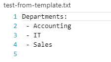
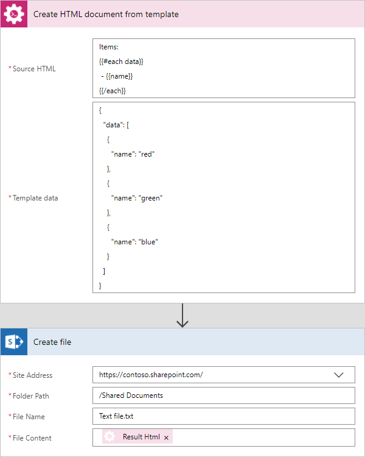
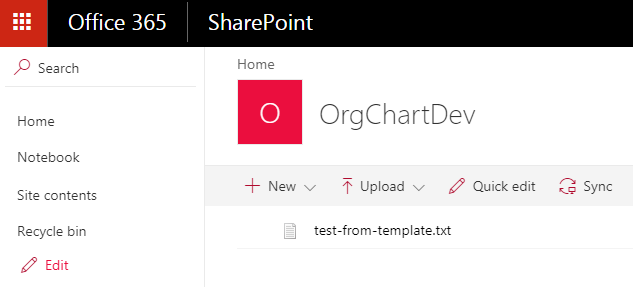

Create text document from template in Microsoft Flow and Azure Logic Apps
=========================================================================

This article demonstrates how to generate text document from a template with the help of `Microsoft Flow <https://flow.microsoft.com>`_.

This approach is suitable  for text files generation as well as for plain text generation. In this article, we will generate a simple text file with the list based on some data. This is how our final file looks:

Our resulting document has to be stored somewhere. Microsoft Flow has a lot of connectors for different systems. Here are just a few of them:

- SharePoint
- Salesforce
- Box
- OneDrive
- Google Drive
- Dropbox
- SFTP
- File System

You can store your file anywhere. In this example, we will store our document in SharePoint. Our flow will use JSON object as a source data for the template, but you can get data from other sources. For example, query list items from SharePoint or from Salesforce.

The same is about source text template. You can store it somewhere as an HTML file and reuse it. In this example, we will put raw HTML code into the Flow action.

This is how our flow looks: 

Here is step by step description for the flow.

**Flow trigger**

You can actually pick any trigger. For example, you can start Flow on file creation in a SharePoint document library. We use "Manually trigger a flow" trigger here to simplify the Flow.

**Create HTML from template**

This is an action from `Plumsail Documents connector <https://plumsail.com/documents>`_. This action is suitable for generation of HTML and text documents.

You can find more information about this action `here <../../actions/document-processing.html#create-html-from-template>`_.

There are two parameters:

1. Source HTML
2. JSON

In the first parameter *'Source HTML'* you can put raw HTML/text of a template or file content of a template from some other action. We specified raw text template in this example:

.. code::

    Departments:
    {{#each departments}} - {{name}} 
    {{/each}}

This action supports rich templates with conditions, iterators and nested placeholders. Please read `syntax description <../../../document-generation/html/index.html>`_ for more information.

In the second parameter, we specified data to apply to the template in JSON format. This is a list of department names:

.. code:: json

    {
      "departments": [
        {
          "name": "Accounting"
        },
        {
          "name": "IT"
        },
        {
          "name": "Sales"
        }
      ]
    }

**Create file**

Now you need to store text file somewhere. In our example, we use "Create file" action from SharePoint connector to store the text document into SharePoint document library.

You can use any other connector to store text document into your system.

.. hint:: This action also can be used in conjunction with `Convert HTML to PDF <../../actions/document-processing.html#convert-html-to-pdf>`_ action to `create PDF documents from an HTML template <create-pdf-from-html-template.html>`_.
