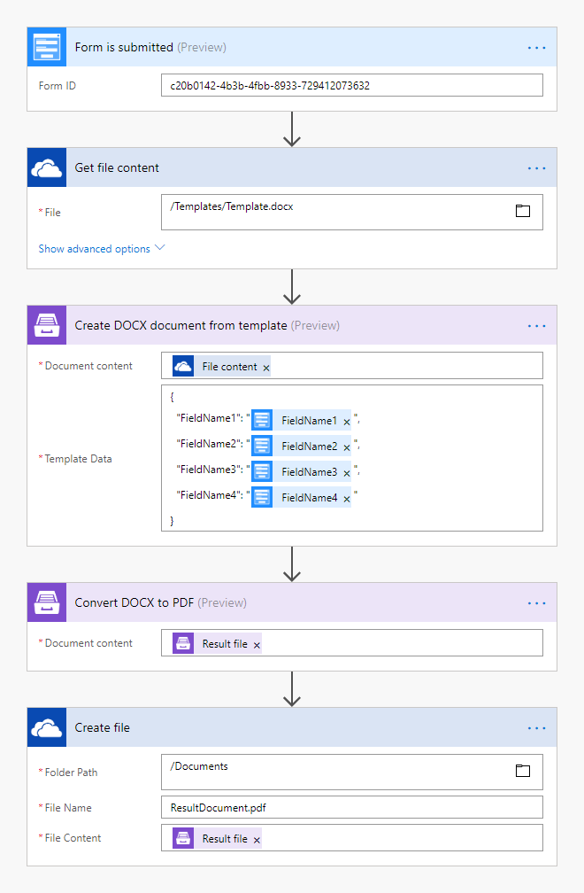
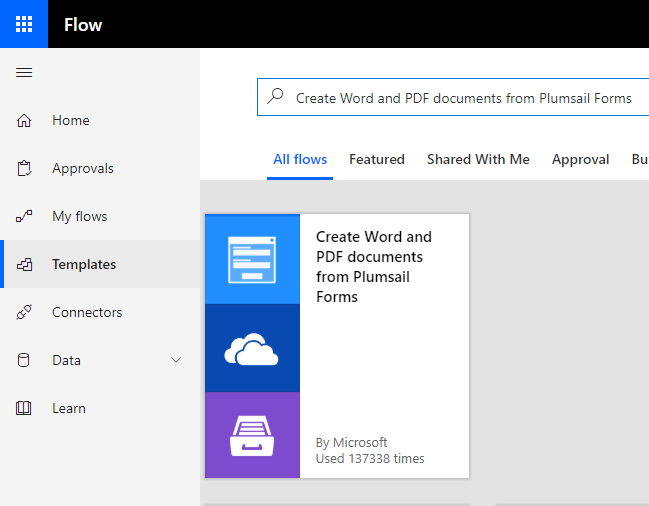
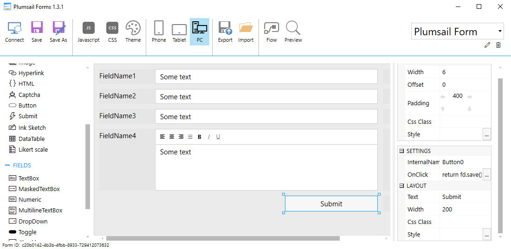
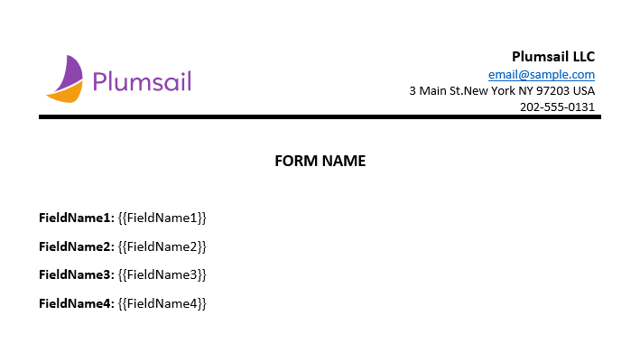
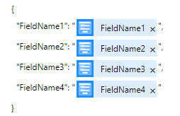
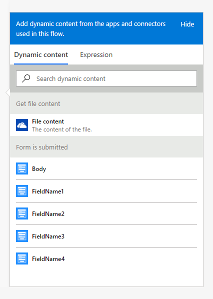
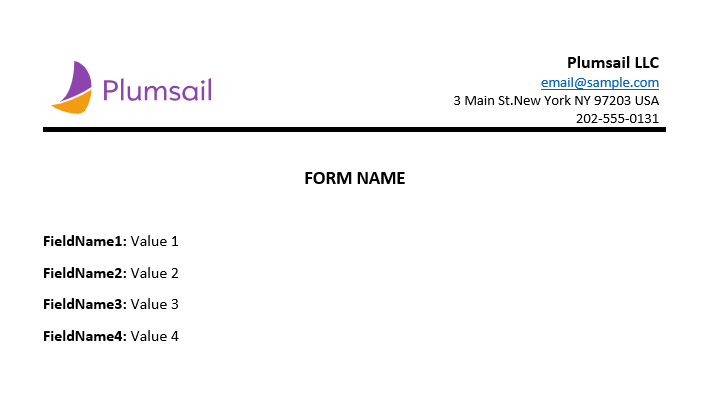

How to create Word and PDF documents from Plumsail Forms in Microsoft Flow and Azure Logic Apps
===============================================================================================

Let's suppose you want to automate the generation of documents in your company. For example, applications, orders, invoices, etc. By going through this article you will learn how to create a DOCX document from a template and convert it to PDF on Plumsail Forms submission with help of `Plumsail Documents <https://plumsail.com/documents/>`_ in Microsoft Flow and Azure Logic Apps.

`Plumsail Forms <https://plumsail.com/forms/>`_ allows you to design elegant, responsive and highly customizable forms for SharePoint Modern UI or any web page.

In our example, we will collect data from a Plumsail Form, apply the data to our template and generate a new PDF document.

Description
-----------

Our source and result documents have to be stored somewhere. In this example, we store our documents in OneDrive.

Microsoft Flow has a lot of connectors for different systems. Here are just a few of them:

- SharePoint
- Salesforce
- Box
- OneDrive
- Google Drive
- Dropbox
- SFTP
- File System

You can store your source file anywhere.

We need to create a Microsoft Flow that will be triggered by a Plumail Form submission. The flow will get the template from OneDrive, apply data from a submitted Plumail form to this template, convert the generated document to PDF and save it to OneDrive. This is how our complete flow looks like:

**We prepared a Microsoft Flow Template that you can use right away.** It includes all the steps described in this article. To use the template just follow `this link <https://emea.flow.microsoft.com/en-us/galleries/public/templates/35bdf13afbad4ff29d3df49e7f288729/create-word-and-pdf-documents-from-plumsail-forms/>`_ or go to MS Flow, click *Templates* in the left navigation, type *Create Word and PDF documents from Plumsail Forms* and hit *Enter*. You will see the template. You may use it as-is or customize it to, for example, store documents in another storage platform.

Description of Microsoft Flow Actions
-------------------------------------

Please find the description of all the actions from the flow below.

Form is submitted
~~~~~~~~~~~~~~~~~

We've already created a Plumsail form and we will use data from its submission in our flow. If you haven't created a form yet, you can learn how to design and publish a Plumsail Form `here <../../../../../forms/design.html>`_.

Below is a screenshot of our form. You may also download the form `here <../../../_static/files/flow/how-tos/Plumsail-Form.xfds>`_, import it into `Plumsail Forms <https://plumsail.com/forms/>`_ and use it as a template.

To start the flow on form submission we search for *Plumsail Forms* in MS Flow and add *Plumsail Forms  -  Form is submitted* trigger.

If this is your first Flow with Plumsail Forms, at this point you'll need to Sign into `Plumsail Account <https://auth.plumsail.com/account/login>`_ from MS Flow, so you can start using your forms inside your flows.

You'll need to add the ID of the form you want to track. Form ID can be found and copied in **Flow** settings in Forms Designer.

Get file content
~~~~~~~~~~~~~~~~~

This action gets file content of the specified file from OneDrive. We use this action to read a .DOCX template. You can use any other connector to get files from your system.

Below is our template. You may download it `here <../../../_static/files/flow/how-tos/Create-Word-and-PDF-template.docx>`_.

*Plumsail Word DOCX templates* use a different approach than most other templating solutions. It uses a minimal amount of syntax to make your work done.

In short, the templating engine thinks that everything between these :code:`{{ }}` brackets is variables where it will write the data you specified in **Template data**. 

Read `this article <../../../document-generation/docx/how-it-works.html>`_ to get familiar with the templating engine.

Create DOCX Document from Template
~~~~~~~~~~~~~~~~~~~~~~~~~~~~~~~~~~
This is the action from `Plumsail Documents connector <https://plumsail.com/actions/documents/>`_. This action is suitable for creating documents from a template. You can find more information about the action by visiting `this page <../../actions/document-processing.html#create-docx-document-from-template>`_.

There are two parameters:

**1. Document content**

In the first parameter **Document content**, we specified the output of the previous action as a template.

**2. Template data**

In the second parameter **Template data**, we specified data to apply to the template in JSON format:

This object contains information from our form. We selected the content from the output of *Form is submitted* action in the menu on the right:

Convert DOCX to PDF
~~~~~~~~~~~~~~~~~~~
This is also an action from Plumsail Documents connector.

Just put DOCX file content from the output of the previous action and receive PDF file content as an output from this action.

You can find more information about this action `here <../../actions/document-processing.html#convert-docx-to-pdf>`_.

Create file
~~~~~~~~~~~

Once the result document is generated, we need to store the PDF file somewhere. In our example, we use *Create file* action from OneDrive connector to store the document in OneDrive.

You can use any other connector to store documents in your system.

This is how the final document will look in our case:

Conclusion
----------

Now you should have an idea of how to use *Create DOCX Document from Template* and *Convert DOCX to PDF* actions from `Plumsail Documents <https://plumsail.com/documents/>`_ for Microsoft Flow to automatically create documents on Plumsail Forms submission. If you haven't used our actions yet, `registering an account <../../../getting-started/sign-up.html>`_ would be the first step. It is quite easy to get started.
