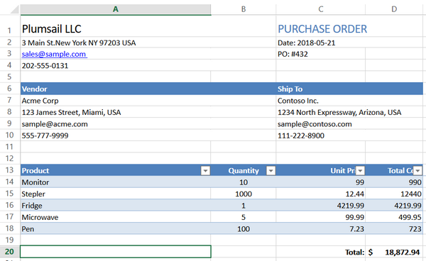
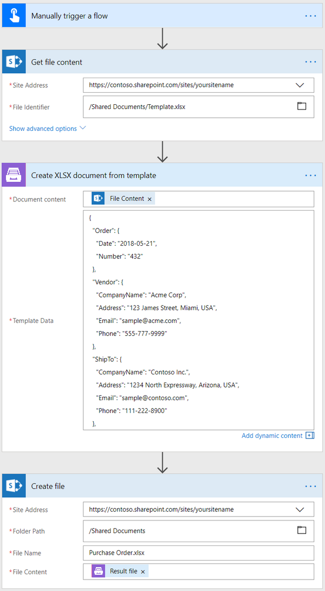
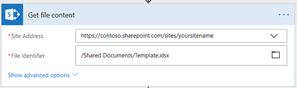
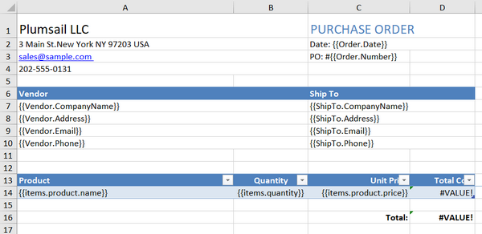
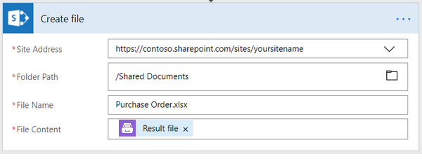

How to create Excel XLSX document from template in Microsoft Flow, Azure Logic Apps and PowerApps
=================================================================================================
If you want to automate the generation of purchase orders in your company, this article will help you achieve that. 
After going through it you will know how to create an XLSX file from a template using `Create XLSX document from template`_ action from `Plumsail Documents connector`_ in Microsoft Flow and Azure Logic Apps.

Probably you have some third party system, where you create data for purchase orders. 
Then you get this data in Microsoft Flow, apply it to our purchase order template and generate a new document.

This is how the final document will look in our case:

|purchase-order-result|

Our template and result document have to be stored somewhere. Microsoft Flow has a lot of connectors for different systems. Here are just a few of them:

- SharePoint
- Box
- OneDrive
- Google Drive
- Dropbox
- SFTP
- File System

In this example, we will store our documents in SharePoint. Our flow will use JSON object as a source data for the template, but you can get data from other sources. For example query list items from SharePoint.

This is how the flow looks like:

|purchase-order-flow|

Flow trigger
~~~~~~~~~~~~
You can actually pick any trigger. For example, you can start Flow on file creation in a SharePoint document library. We are using "Manually trigger a flow" trigger here to simplify the Flow.

Get file content
~~~~~~~~~~~~~~~~
This action gets file content of the specified file from a SharePoint document library. You can just specify SharePoint site URL and path to your file. We are using this action to get our template’s content.

|purchase-order-get-file-content|

You can use any other connector to get files from your system.

Create XLSX  Document from Template
~~~~~~~~~~~~~~~~~~~~~~~~~~~~~~~~~~~
`Create XLSX document from template`_ is the action from `Plumsail Documents connector`_. This action is suitable for creating documents from a template.

There are two parameters:

1. Document content
2. Template data

In the first parameter 'Document content' you can put template’s content from some other action. In our case, we specified the output of the previous action as a template.

`Download the template file`_ that we will use in this article.

|purchase-order-template|

Plumsail Excel XLSX templates use a different approach than most other templating solutions. It uses a minimal amount of syntax to make your work done.

Read `this article`_ to get familiar with the templating engine.

In short, templating engine thinks that everything between these :code:`{{ }}` brackets is basically variables where it will write the data you specified in 'Template data'. 
In our case, the example would be :code:`{{Order.Date}}` and :code:`{{Order.Number}}` object, it lets the engine know that we want to render the purchase order’s number and date.

But of course, we can implement a more complex scenario, in our template we are referring properties inside simple objects and collections, as well as properties in nested constructions. 
To select properties of our objects inside of the array (in JSON data) we are using a dot operator:

- The :code:`{{Vendor.CompanyName}}`, :code:`{{Vendor.Address}}`, :code:`{{Vendor.Email}}`, :code:`{{Vendor.Phone}}` tags let the engine know that we want to render properties of the Vendor object.
- The :code:`{{ShipTo.CompanyName}}`, :code:`{{ShipTo.Address}}`, :code:`{{ShipTo.Email}}`, :code:`{{ShipTo.Phone}}` tags let the engine know that we want to render properties of the ShipTo object.
- The :code:`{{items.product.name}}`, :code:`{{items.quantity}}`, :code:`{{items.product.price}}`, :code:`{{items.cost}}` tags get the name, quantity, price and total cost properties in each item's product object.

The templating engine is smart enough to understand that we refer properties inside a collection. 
That is how it knows what content we need to be duplicated. It will iterate through all objects in the array to render them and add the rows automatically.

You can learn more about table rendering `here <../../../document-generation/xlsx/how-it-works.html#repeating-rows-and-tables>`_.

Please also note that we are using these formulas to calculate the total cost for each item individually and for all of the items:

- :code:`=[Quantity]*[Unit Price]` - for each item
- :code:`=SUM(D14)` - for all of the items

In the second parameter, we specified data that is being applied to the template in JSON format:

.. code:: json

    {
      "Order": {
        "Date": "2018-05-21",
        "Number": "432"
      },
      "Vendor": {
        "CompanyName": "Acme Corp",
        "Address": "123 James Street, Miami, USA",
        "Email": "sample@acme.com",
        "Phone": "555-777-9999"
      },
      "ShipTo": {
        "CompanyName": "Contoso Inc.",
        "Address": "1234 North Expressway, Arizona, USA",
        "Email": "sample@contoso.com",
        "Phone": "111-222-8900"
      },
      "items": [
        {
          "product": {
            "name": "Monitor",
            "price": 99
          },
          "quantity": 10
        },
        {
          "product": {
            "name": "Stepler",
            "price": 12.44
          },
          "quantity": 1000
        },
        {
          "product": {
            "name": "Fridge",
            "price": 4219.99
          },
          "quantity": 1
        },
        {
          "product": {
            "name": "Microwave",
            "price": 99.99
          },
          "quantity": 5
        },
        {
          "product": {
            "name": "Pen",
            "price": 7.23
          },
          "quantity": 100
        }
      ]
    }

Create file
~~~~~~~~~~~
Now you need to store text file somewhere. In our example, we use 'Create file' action from SharePoint connector to store the XLSX document in SharePoint document library.

|purchase-order-create-file|

You can use any other connector to store documents into your system.

Conclusion
~~~~~~~~~~
Now you should have an idea how to use Create XLSX document from template action from `Plumsail Documents connector`_ for Microsoft Flow. 
If you haven’t used it yet, `registering an account`_ would be the first step. It is quite easy to get started.

.. _Create XLSX document from template: ../../actions/document-processing.html#create-xlsx-document-from-template
.. _Plumsail Documents connector: https://plumsail.com/documents/
.. _Download the template file: ../../../_static/files/flow/how-tos/create-xlsx-from-template.xlsx
.. _this article: ../../../document-generation/xlsx/how-it-works.html
.. _registering an account: ../../../getting-started/sign-up.html

