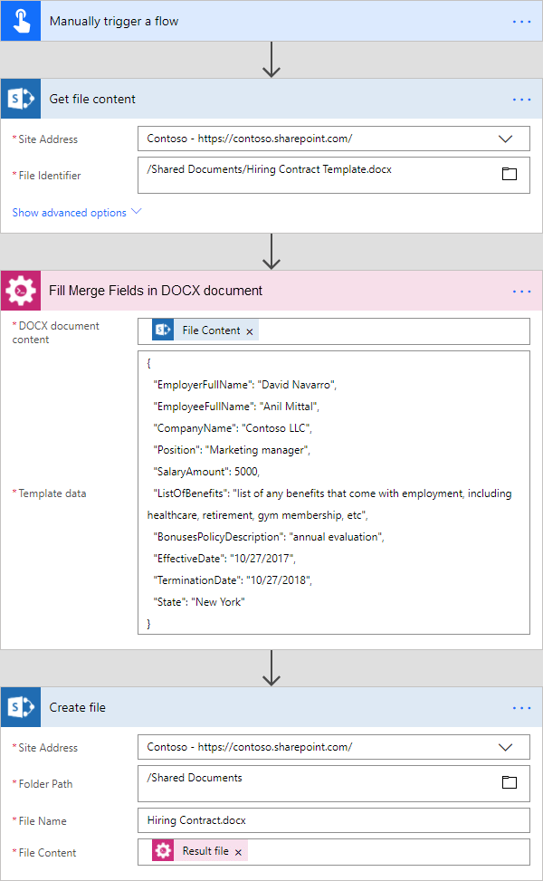
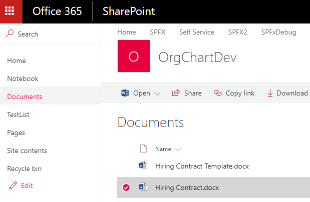

Fill merge fields in DOCX document in Microsoft Flow and Azure Logic Apps
========================================================================

This article demonstrates how to fill merge fields in a DOCX Word document with the help of `Microsoft Flow <https://flow.microsoft.com>`_. This approach allows you to create simple DOCX template with merge fields and generate new documents by filling those fields.

Before starting, ensure that you `added Plumsail Documents connector to Microsoft Flow <../../../getting-started/use-from-flow.html>`_.

We will generate a hiring contract. Our source document with merge fields and result document has to be stored somewhere. Microsoft Flow has a lot of connectors for different systems. Here are just a few of them:

- SharePoint
- Salesforce
- Box
- OneDrive
- Google Drive
- Dropbox
- SFTP
- File System

You can store your source file anywhere. In this example, we will store our documents in SharePoint. Our Flow will get a source document from a SharePoint document library, generate a new document based on source document and on some data. The resulting document will be stored back to SharePoint document library.

Firstly, we have to prepare the source file with merge fields. Please follow `this instruction to prepare your source document <../../../document-generation/docx/create-docx-with-merge-fields.html>`_.

Now we need to create a Microsoft Flow that will get the source document from the SharePoint document library, fill merge fields in this document and save result document back to the document library. This is how complete flow looks:

Here is the step by step description for the flow.

**Flow trigger**

You can actually pick any trigger. For example, you can start Flow on file creation in a SharePoint document library. We use "Manually trigger a flow" trigger here to simplify the Flow.

**Get file content**

This action gets file content of the specified file from a SharePoint document library. You just specify SharePoint site URL and path to your file. We use this action to read source .docx document.

You can use any other connector to get files from your system.

**Fill Merge Fields in DOCX document**

This is an action from Plumasail Documents connector, which is a part of `Plumsail Actions <https://plumsail.com/actions>`_.

There are two parameters:

1. DOCX document content
2. Template data

In the first parameter *'DOCX document content'* we specified file content of the source document from the output of the previous action. Use `this link <../../../_static/files/flow/how-tos/Hiring%20Contract%20Template.docx>`_ to download it.

In the second parameter, we specified data in JSON format that will be used to fill merge fields. This is information about a sample employee. You can actually request this information from an external system with the help of another Microsoft Flow action.

This is our sample data:

.. code:: JSON

    {
        "EmployerFullName": "David Navarro",
        "EmployeeFullName": "Anil Mittal",
        "CompanyName": "Contoso LLC",
        "Position": "Marketing manager",
        "SalaryAmount": "5000",
        "ListOfBenefits": "list of any benefits that come with employment, including healthcare, retirement, gym membership, etc",
        "BonusesPolicyDescription": "annual evaluation",
        "EffectiveDate": "10/27/2017",
        "TerminationDate": "10/27/2018",
        "State": "New York"
    }

You can find more information about this action `here <../../actions/document-processing.html#fill-merge-fields-in-docx-document>`_.

**Create file**

Once the result document is generated, we need to store the Word file somewhere. In our example, we use "Create file" action from SharePoint connector to store the document in SharePoint document library.

You can use any other connector to store the Word document into your system.

.. hint:: There is also `Convert DOCX document to PDF <../../actions/document-processing.html#convert-docx-to-pdf>`_ action available. You can use it in conjunction with `Fill Merge Fields in DOCX document <../../actions/document-processing.html#fill-merge-fields-in-docx-document>`_ action.