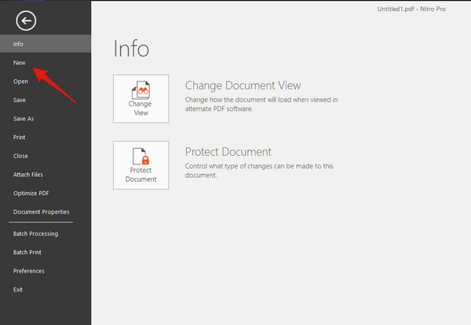
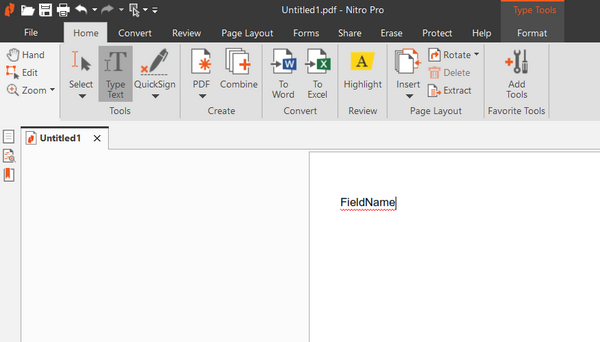
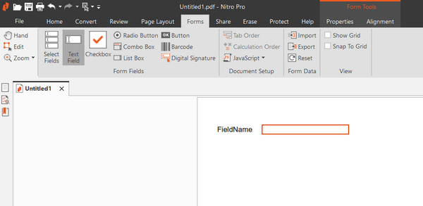
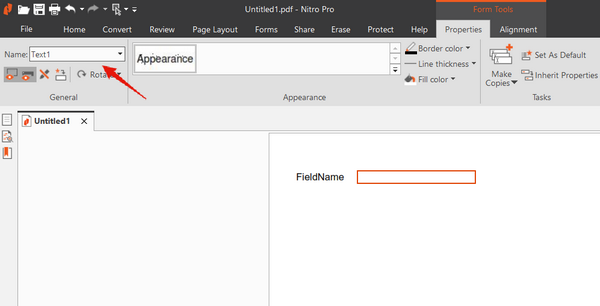
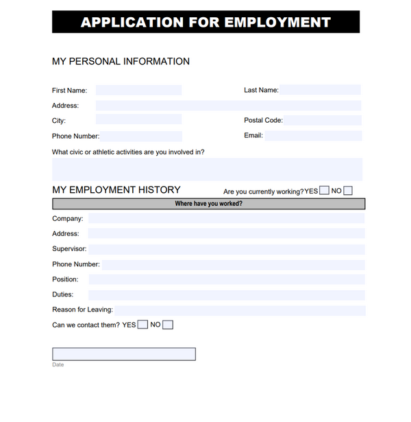
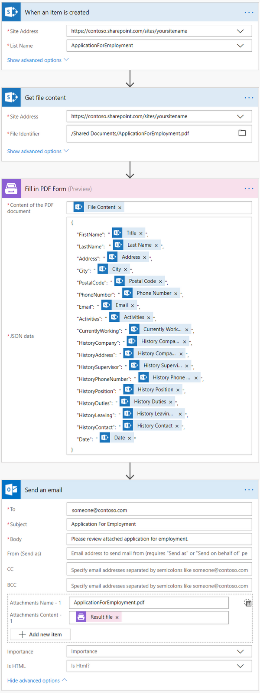
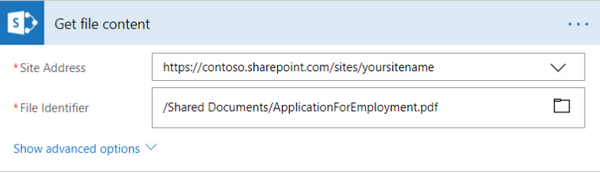
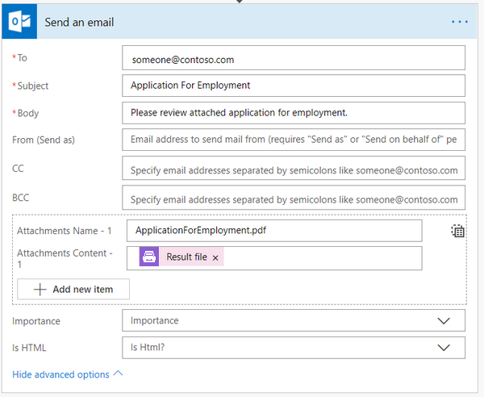

How to automatically populate fillable PDF based on data from third party system in Microsoft Flow, Azure Logic Apps or Power Apps
==================================================================================================================================
In this article, you will learn how to automatically populate fillable PDF forms in Microsoft Flow or Azure Logic Apps. We will use `Fill in PDF Form`_ action from `Plumsail Documents connector`_.

In our case, we will fill in an Application for Employment form based on the data from a SharePoint list. Actually, you can get data from any other source. We use SharePoint list here as an example.

For example, you could place `Plumsail Form`_ on your website and trigger your flow on `form submission`_. Also, you could `extract data from incoming email messages`_ and use this data to fill in your form.

This is how the final PDF document with the form will look in our case:

|fill-in-pdf-form-result|

Our template and result document have to be stored somewhere. Microsoft Flow has a lot of connectors for different systems. Here are just a few of them:

- SharePoint
- Box
- OneDrive
- Google Drive
- Dropbox
- SFTP
- File System

In this example, we will store the initial fillable PDF form and filled PDF documents in a SharePoint document library.

Create fillable PDF
~~~~~~~~~~~~~~~~~~~
You can use `Nitro Pro`_ to create your own PDF file with a form.

First, we need to create a new PDF file:

|nitro-pro-new-file|

Then we need to add text which will indicate a field name (click on Type Text in Home section):

|nitro-pro-add-text|

After that, we should add a field to our PDF file (Forms section):

|nitro-pro-add-field|

Finally, we should specify this field's name which we could use later on in the action (click on the field -> Properties section):

|nitro-pro-specify-name|

`Download the template file`_ for this article. that we are using in this article.

|fill-in-pdf-form-template|

Create Microsoft Flow
~~~~~~~~~~~~~~~~~~~~~
Now let us review the flow and learn how it is implemented:

|fill-in-pdf-form-flow|

Flow trigger
~~~~~~~~~~~~
You can actually pick any trigger. For example, you can start Flow on `form submission`_. We use “When an item is created” trigger to get the newest created item from the SharePoint list.

Our SharePoint list has the same columns as fields in our fillable PDF file.

Get file content action
~~~~~~~~~~~~~~~~~~~~~~~
This action gets file content of the source fillable PDF file from a SharePoint document library. You can just specify SharePoint site URL and path to the fillable PDF that we created earlier.

|fill-in-pdf-form-flow-get-file|

You can use any other connector to get files from your system.

Fill in PDF form action
~~~~~~~~~~~~~~~~~~~~~~~
`Fill in PDF form`_ is the action from `Plumsail Documents connector`_. You can use this action to fill PDF forms.

There are two parameters:

1. Content of the PDF document
2. JSON data

In the first parameter 'Content of the PDF document', you can put file content from some other action. In our case, we specified the output of the previous action as a source fillable PDF.

In the second parameter ‘JSON data’ you can put a JSON object as a source data to fill in your form. Please make sure that you specified the same property names as you used in your fillable PDF. Thus, the action will match properties to fields in PDF and fill them.

Send an Email action
~~~~~~~~~~~~~~~~~~~~
Now you need to send the PDF file with filled in form. In our example, we used 'Send an Email' action from Office 365 Outlook connector.

Please notice how we specified the PDF file. It is essential to specify attachment name with the correct extension.

|fill-in-pdf-form-flow-create-file|

You can use any other connector to send or store documents in your system.

Conclusion
~~~~~~~~~~
Now you should have an idea how to use Fill in PDF form action from `Plumsail Documents connector`_ for Microsoft Flow. If you haven’t used it yet, `registering an account`_ would be the first step. It is quite easy to get started.

.. hint:: There is also `Get Form from PDF`_ action available. You can use it to `collect data from fillable PDF`_.

.. _Fill in PDF form: ../../actions/document-processing.html#fill-in-pdf-form
.. _Plumsail Documents connector: https://plumsail.com/documents/
.. _Plumsail Form: https://plumsail.com/forms/public-forms/
.. _form submission: https://plumsail.com/docs/forms/microsoft-flow.html
.. _extract data from incoming email messages: use-regex-match-to-extract-values.html
.. _Nitro Pro: https://www.gonitro.com/nps/pro/create-pdf-creator
.. _Download the template file: ../../../_static/files/flow/how-tos/fill-in-pdf-form-template.pdf
.. _registering an account: ../../../getting-started/sign-up.html
.. _Get Form from PDF: ../../actions/document-processing.html#get-form-from-pdf
.. _collect data from fillable PDF: collect-data-pdf-form.html

.. |fill-in-pdf-form-result| image:: ../../../_static/img/flow/how-tos/fill-in-pdf-form-result.png

