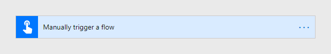
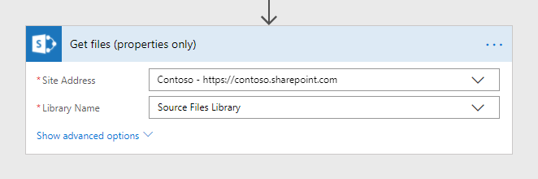
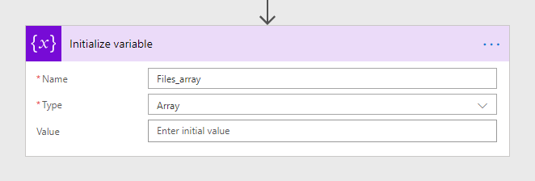
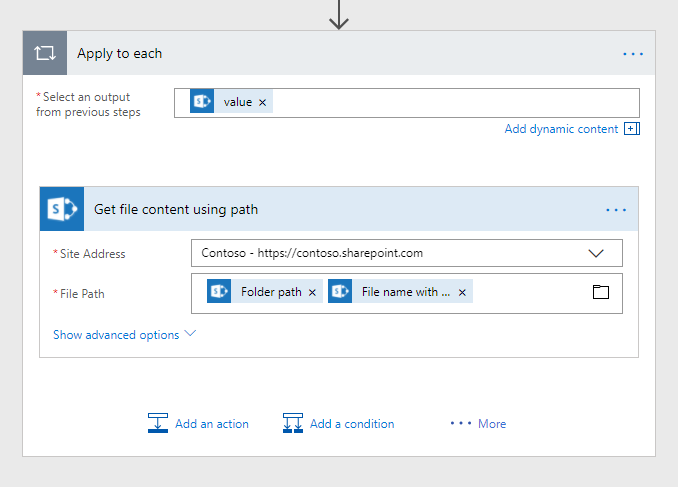
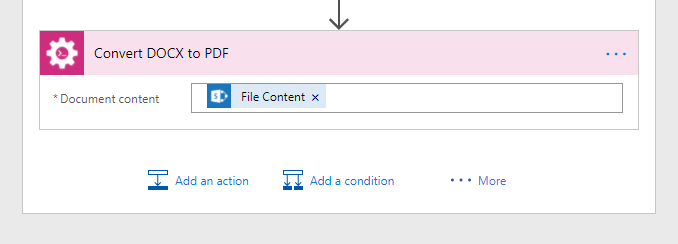
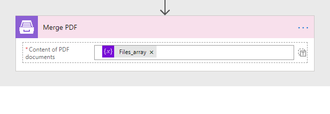
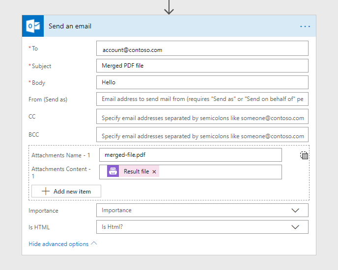
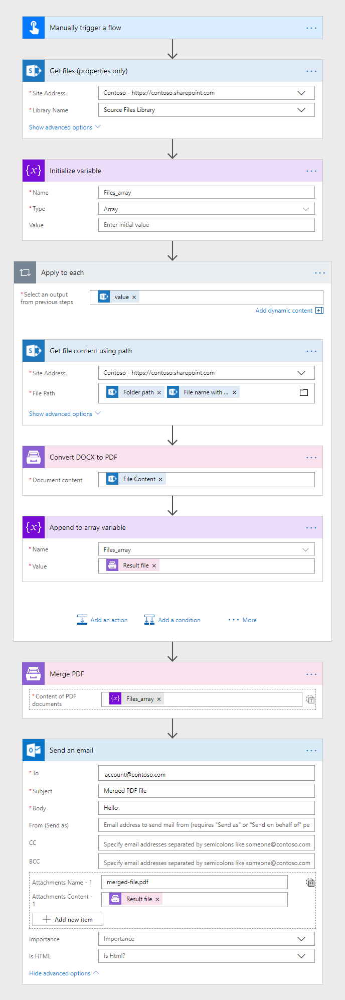

How to merge PDF files in Microsoft Flow, Azure Logic Apps and PowerApps
==========================================================================

This article demonstrates how to merge PDF files with the help of `Microsoft Flow <https://emea.flow.microsoft.com/>`_.

Before starting, ensure that you `added Plumsail Documents connector to Microsoft Flow <https://plumsail.com/docs/actions/v1.x/getting-started/use-from-flow.html>`_.

In this example, we will read three DOCX files from a specific folder, convert these files to PDF, merge them and send the result PDF file by email.

For instance, it may be useful  in a situation when a few employees prepare different sections of a contract at the same time. They load the parts of the contract to a folder, then all files from this folder are merged to form the final document.

So, our source DOCX files have to be stored somewhere. Microsoft Flow has a lot of connectors for different systems. Here are just a few of them:

- SharePoint
- Salesforce
- Box
- OneDrive
- Google Drive
- Dropbox
- SFTP
- File System

In this example, we will store our source DOCX files in SharePoint in a library that we named *Source Files Library*, but you can get data from other sources. You may use these links to download 3 sample DOCX files: `1 <../../../_static/files/flow/how-tos/file1.docx>`_, `2 <../../../_static/files/flow/how-tos/file2.docx>`_, `3 <../../../_static/files/flow/how-tos/file3.docx>`_.

Merging PDF files
-------------------

Here, we will guide you step by step through creating the flow. You also will find a screenshot of the complete flow at the end of the article.

Flow trigger
~~~~~~~~~~~~~

You can actually pick any trigger. For example, you can start Flow on file creation in a SharePoint document library. We use *Manually trigger a flow* trigger here to simplify the Flow.

Get files (properties only)
~~~~~~~~~~~~~~~~~

We start with getting properties of all our DOCX files stored in a specific folder  - * Source Files Library*. In the next step, we will iterate through the output from this action to get those files contents.

You can use any other connector to get files from your system.

Initialize variable
~~~~~~~~~~~~~~~~~

We need to prepare an array of files, that we will put in *Plumsail Documents  -  Merge PDF action* when composing the final document.

Add a new action and search for *Variables  -  Initialize variable* action. Enter a name for the variable and choose the **Array** type for it.

Get file content using path
~~~~~~~~~~~~~~~~~

Now, you need to add *Get file content using path* action to get source DOCX files contents.

Click **File Path** field and add there **Folder Path** and **File name with extension** from a menu on the right. This will automatically transform this action into repeating one which will be performed for each file from the source folder.

Convert DOCX to PDF
~~~~~~~~~~~~~~~~~

This is an action from `Plumsail Documents connector <https://plumsail.com/docs/actions/v1.x/flow/actions/document-processing.html>`_, which is a part of `Plumsail Actions <https://plumsail.com/actions>`_.

Put here **File content** from the output of the previous action.

You can find more detailed information about *Convert DOCX to PDF* action `here <You can find more detailed information about Convert DOCX to PDF action here.>`_.

Append to array variable
~~~~~~~~~~~~~~~~~

Now, add *Variables  -  Append to array variable* action, enter an element of the array into the **Value field** as shown in the screenshot below. **Result file** here is the output from the previous  operation:

.. image:: ../../../_static/img/flow/how-tos/append-to-array.png
   :alt: Append to array variable

The array of PDF files is ready, now we can move to the  main step  -  merging PDFs into the final document.

Merge PDF
~~~~~~~~~

This is an action from `Plumsail Documents connector <https://plumsail.com/docs/actions/v1.x/flow/actions/document-processing.html>`_, which is a part of `Plumsail Actions <https://plumsail.com/actions>`_.

Click a small array icon on the right to switch to the view where you can input an entire array. Add the **Array of the PDF files** you received in the loop to the **Content of PDF documents** field:

Send an Email
~~~~~~~~~

Once the result file is generated, we send an email using *Office 365 Outlook  -  Send email action*. In the **Attachments** section, we add **a name** and **the extension** for the merged PDF file and choose **Result file** output from the previous *Merge PDF* action.

So, here is the complete flow:

Conclusion
-------------------

That is all, the flow is configured. Hope, these steps will help to ease the work with documents.

.. hint::
  You may also be interested in `this article <https://plumsail.com/docs/actions/v1.x/flow/how-tos/documents/split-pdf-files.html>`_ explaining how to Split PDF files in Microsoft Flow and Azure Logic Apps.