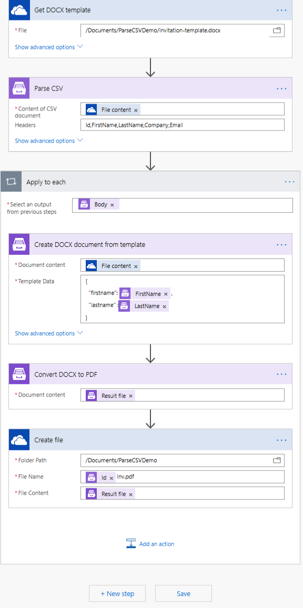
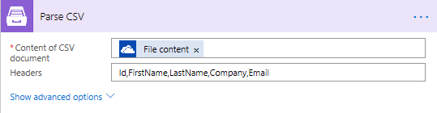
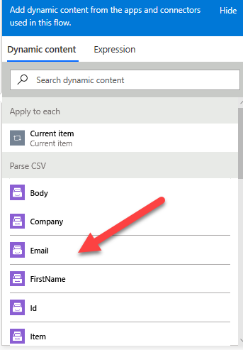
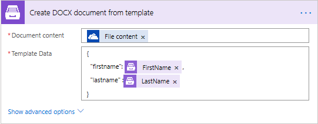

How to read a CSV file in Microsoft Flow and bulk generate documents
=============================================================

This article demonstrates how to use **Parse CSV** action and bulk generate documents.

Let's say a company has a CSV file with customers. They want to bulk generate invitations 
to a conference for all the customers and then print them and send them using postal service.

In this example, we will read a CSV file and use the available headers to fill up the invitations.
The invitation will be a result file of Create DOC document from template action. 
To fill up the DOC template we're going to use Parse CSV output items.

Our source CSV file has to be stored somewhere. Microsoft Flow has a lot of connectors for different systems.

Here are just a few of them:

- SharePoint
- Salesforce
- Box
- OneDrive
- Google Drive
- Dropbox
- SFTP
- File System

You can store your files anywhere. In this example, we will store our source PDF file in OneDrive folder, but you can get data from any other sources. 

This is how our flow looks:

Below is a step by step description of the flow.

Parsing a CSV file
--------------------

Flow trigger
~~~~~~~~~~~~

You can actually pick any trigger. For example, you can start Flow on file creation in a SharePoint document library. We use *Manually trigger a flow* trigger here to simplify the Flow.

Get file content
~~~~~~~~~~~~~~~~

This action gets file content of the specified file from a OneDrive foldery. 
Just specify the  **path** to your file. We use this action to read our sample CSV file and the source DOCX template.

You can use any other connector to get files from your system.

Parsing CSV
~~~~~~~~~

This is an action from `Plumsail Documents connector <https://plumsail.com/documents/>`_.

Put CSV file content from the output of the previous action. 
In the **Headers** field, specify the CSV file headers, then you'll be able to select the headers in the dynamic content window
In our example, we extract the customer first name and the customer ID to name the invitations:

On the next steps we use Plumsail action *Create DOCX document from template*. 
We select the dynamic content from *Parse CSV* and add it ot the JSON.
And finally we convert the resulting DOCX file to PDF and save it to the OneDrive folder. We use ID header to name each invitation.

You can find more detailed information about *Parse CSV* action `here <https://plumsail.com/docs/actions/v1.x/flow/actions/document-processing.html#parse-csv>`_.

Conclusion
----------

That is all, the flow is configured. These few simple steps can help to ease the work with documents.

.. hint::
  You may also be interested in `this article <https://plumsail.com/docs/actions/v1.x/flow/how-tos/documents/create-docx-from-template.html.html>`_ explaining how to create docx document from template in Microsoft Flow and Azure Logic Apps.