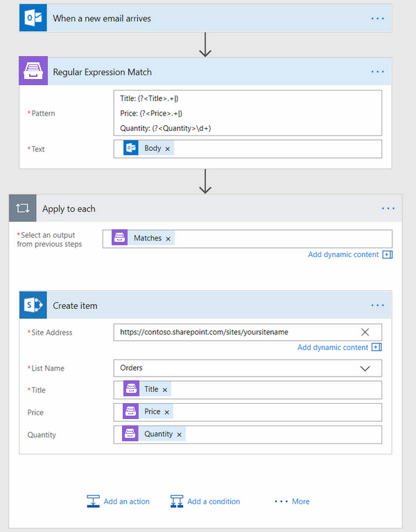
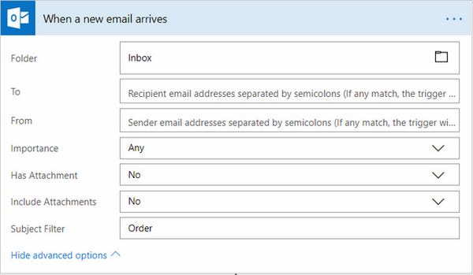
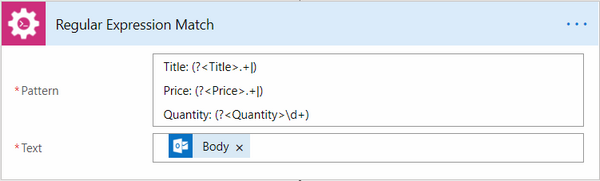
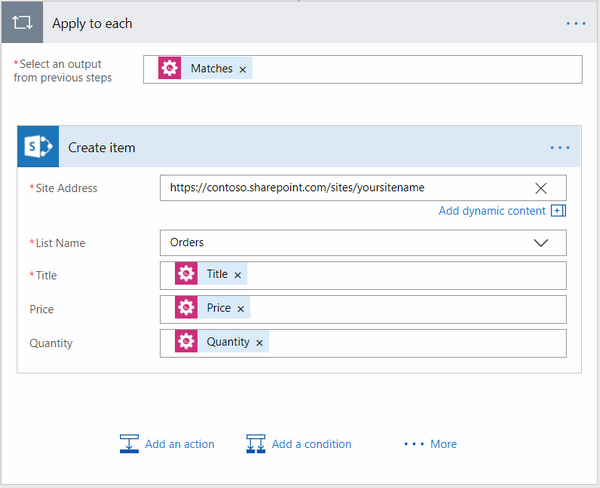
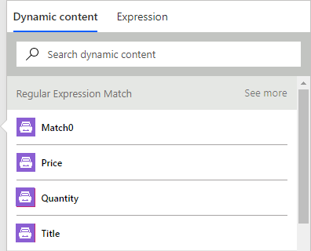

How to use regular expression match to extract values from text in Microsoft Flow and Azure Logic Apps
######################################################################################################
In this article we will be talking about using `Regular Expression Match`_ action `Plumsail Documents connector <https://plumsail.com/documents/>`_ for `Microsoft Flow`_ and `Azure Logic Apps`_.

Let’s suppose you are getting a new email after someone made a purchase and you need to extract information from this email and create a new item in your orders SharePoint list.

Your email might look like this:

.. code::

    *** Order information ***
    Time zone: GMT+00:00
    Reference: 4563452
    Order number: 1400
    Payment method: Visa/MasterCard
    Order status: Credit card payment authorized

    *** Ordered products ***
    Product code: D3F13B23B0
    Title: Tires
    Price: 150
    Quantity: 4

    Product code: FD3423DE
    Title: Cookies
    Price: 30
    Quantity: 20

    Product code: KFG45GK445
    Title: Tools
    Price: 50
    Quantity: 10

    *** Delivery information ***
    First name: John
    Last name: Doe
    Company: Happy Company Ltd
    Country: Australia
    Phone: 01 2345 6780

To achieve this we will be using `Regular Expression Match`_ action.

So your flow might look like this:

|regex-match-flow|

For this case, I'm using the trigger to manual start of the flow. You can use any other trigger available in Microsoft Flow.

Receive email
~~~~~~~~~~~~~
First, we receive an email in Outlook, you can specify Subject Filter field so this trigger will be working only the ones that have ‘Order’ in their subject.

|regex-match-receive-email|

Regular Expression Match
~~~~~~~~~~~~~~~~~~~~~~~~
Then we are using `Regular Expression Match`_ action to find three values: Title, Price, and Quantity in our email's body.

|regex-match-action|

Here is a regex we are using in this flow: 

.. code:: 

    Title: (?<Title>.+|)
    Price: (?<Price>.+|)
    Quantity: (?<Quantity>\d+)

You may notice that Regular expression match in this regular expression has a few outputs:

|regex-match-flow-matches|

There is "Match0" is a full match for the whole regular expression. There are also separate output values for each named regular expression group: Price, Quantity, Title.

You can learn more about named groups `on this page`_. The action is smart enough to create separate output value in Microsoft Flow for each named regular expression group that is used in it. 
It dramatically simplifies extraction of values from text strings. You just write a regular expression with named groups and then use them across your flow.

You can easily put match regex into a named group like this:  ``(?<Title>.+|)``. The name of this group will be "Title", everything that matches regular expression ``.+|`` will be returned as a separate output of the action.

Note, the action returns array of matches, because you may have multiple matches in your text. This is how JSON representation of result may look with multiple matches:

.. code:: json

    [
        {
            "Match0": " Title: Tires\r\nPrice: 200\r\nQuantity: 4",
            "Title": "Tires",
            "Price": "150",
            "Quantity": "4"
        }, {
            "Match0": " Title: Cookies\r\nPrice: 30\r\nQuantity: 20",
            "Title": "Cookies",
            "Price": "30",
            "Quantity": "20"
        }, {
            "Match0": " Title: Tools\r\nPrice: 50\r\nQuantity: 10",
            "Title": "Tools",
            "Price": "50",
            "Quantity": "10"
        }
    ]

Create item in SharePoint list
~~~~~~~~~~~~~~~~~~~~~~~~~~~~~~
In the last step, we are using the values from the previous step to create an item in 'Orders' SharePoint list.

|regex-match-create-item|

In this action, we are going through the 'Matches' array and we are getting its values in the cycle, using the named groups as keys.

Then we are using these keys values to create an item in our SharePoint 'Orders' list.

Conclusion
~~~~~~~~~~
Now you should have an idea how to work with `Regular Expression Match` action in `Plumsail Documents connector for Microsoft Flow`_. 
If you haven’t used it yet, registering an account would be the first step, you can learn about it `here`_. It is quite easy to get started.

.. _Regular Expression Match: ../../../flow/actions/document-processing.html#regular-expression-match
.. _Actions: ../../../index.html
.. _Microsoft Flow: https://flow.microsoft.com
.. _Azure Logic Apps: https://azure.microsoft.com/en-us/services/logic-apps/
.. _Plumsail Documents connector to Microsoft Flow: ../../../flow/create-custom-connector.html
.. _named groups: https://www.regular-expressions.info/named.html
.. _Plumsail Documents connector for Microsoft Flow: https://plumsail.com/documents/
.. _here: ../../../getting-started/sign-up.html
.. _on this page: https://www.regular-expressions.info/named.html

