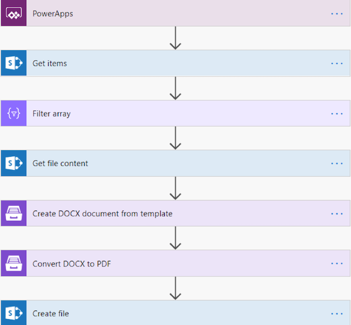
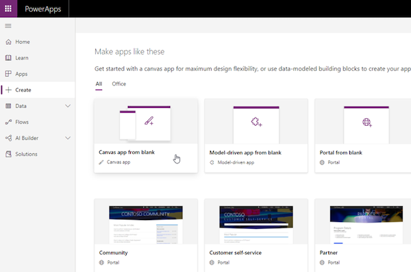
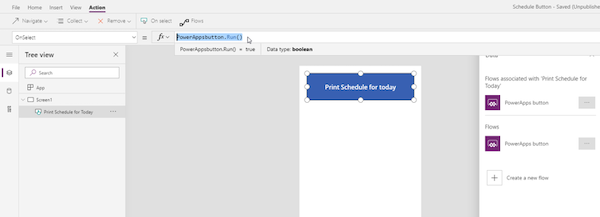
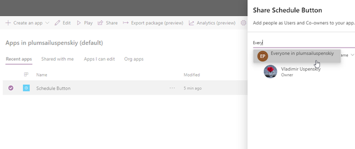
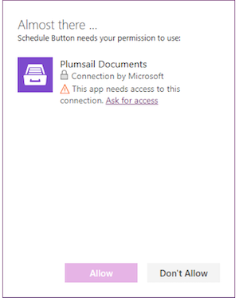
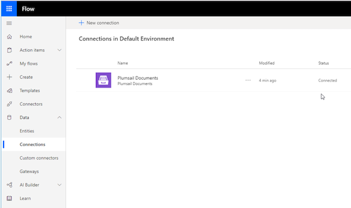
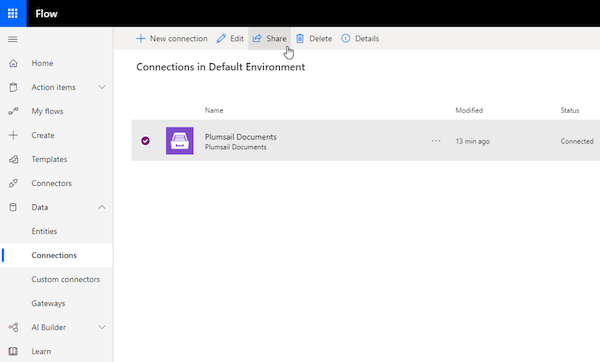
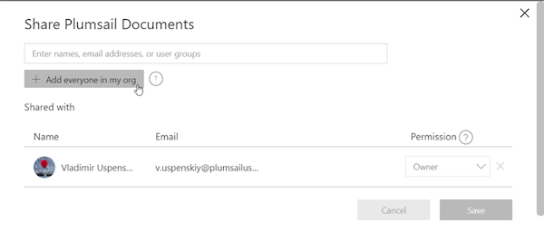

How to use Plumsail Documents flow in PowerApps
######################################################################################################

When you're working on a solution or an app, `Microsoft Flow`_ can be a powerful tool to automate a chain of actions, transfer data between apps and services. Here’s how to use the Plumsail Microsoft Flow action in an app by the example of Microsoft PowerApps.  

`PowerApps`_ can help you easily build a user interface for a mobile-friendly business app. PowerApps can be integrated with cloud services such as MS Dynamics 365, OneDrive, SharePoint, SQL, and Oracle databases. Though the process of building an app is fairly simple and intuitive, there are a few features that might be a bit tricky, such as sharing the app’s resources. 

Here's the simplest example. We'll make an app with a button to get data from a SharePoint list, insert it to a `DOCX template`_, then `convert to PDF`_ and save it to a SharePoint document library. The button is used to save the schedule for the booked conference rooms for today. In this example, a SharePoint list stores room title and time.

Set up a Microsoft flow
~~~~~~~~~~~~~~~~~~~~~~~

First, we’ll set up a Microsoft Flow. It will get triggered on the *PowerApps* call, get the data from the list, filter out rooms booked for today, get the data to a DOCX template and convert it to PDF. We won't go through every step in much detail here. If you wish to get a thorough understanding of how the Plumsail Documents work in a flow, please consider consulting with our `Document generation`_ descriptions and `MS Flow examples`_.

|powerapps-flow|

Create an app
~~~~~~~~~~~~~
After we’ve tested the flow, let’s set up the PowerApps app. We need to open the PowerApps workspace and create a new app:

|powerapps-create-app|

We *insert* a new *button control*, then select *Action* -> *Flows*. In a pop-up window there’ll be a list of all our workflows that have the *PowerApps* trigger. We add the flow created above and make sure to complete the *Run()* method in the formula bar. 

|powerapps-insert-flow|

Then you can share your app with everyone who’s supposed to use it. We’ll add everyone in the Office365 tenant:

|powerapp-share-app|

Share Connection
~~~~~~~~~~~~~~~~
We’re almost there! However, if our end-user tries to use the shared app now, he or she may encounter an error like this one: 

|powerapps-error|

The error claims that our Plumsail Connection wasn’t shared with the end-user, so it’s time to change that.

All your connections are listed in the *Connections* tab of the *Microsoft Flow* menu. (*Data* -> *Connections*)

|powerapps-flow-connections|

To share the app and the connection with the members of your Office365 tenant properly, you need to choose the connection you’re using in the flow and select *Share*:

|powerapps-share-connection|

Select *Add everyone in my org* or choose the *users and groups* you need to share the connection with. 

|powerapps-add-everyone|

Now your connection is available for every user you’ve chosen. They can see the connection on the *Connections* tab in their Microsoft Flow workspace and, more importantly, use your app right away. 

.. _PowerApps: https://powerapps.microsoft.com/
.. _Actions: ../../../index.html
.. _Microsoft Flow: https://flow.microsoft.com
.. _Document generation: ../../../../ /document-generation/docx/index.html
.. _MS Flow examples: create-docx-from-template.html
.. _DOCX template: create-docx-from-template.html
.. _convert to PDF: convert-word-to-pdf.html

