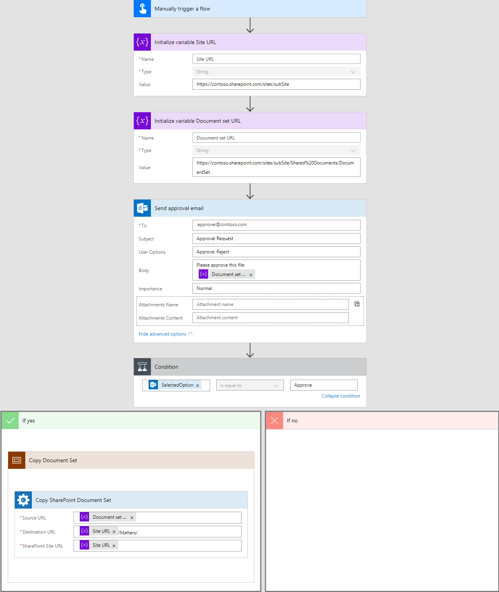

Copy SharePoint document set to another library in Microsoft Flow and Azure Logic Apps
======================================================================================

This article will show how to copy a document set to another library on a SharePoint site using Microsoft Flow.

For example, we consider the following business case:
We have a small company. The company uses SharePoint Online to automate business processes. SharePoint site has a list of matters, each matter it is a document set with some metadata. An employee creates a new Contract using a predefined template (as of an example contract for a sale of real estate), fills in all metadata and prepares all document for a matter.
Then he needs to get approval from some approver and then copy this document set to the special library ("Matters" on this example) on the site. 

For this case, I will use `Send approval email <https://docs.microsoft.com/en-us/connectors/office365connector/#Send_approval_email>`_ from Office 365 Outlook Connector for sending the approval message. I will also use `Copy SharePoint document set <../../actions/sharepoint-processing.html#copy-sharepoint-document-set>`_ from Plumasail SP connector, which is a part of `Plumsail Actions <https://plumsail.com/actions>`_ for copying approved document set to the "Matters" library on the site.

The complete flow is below. You can find step by step description of the flow next to the picture.

Manually trigger a flow
------------------------
For this case, I'm using the trigger to manual start of the flow, you can use any other trigger available in Microsoft Flow.

Initialization of variables
---------------------------
On this step, I set variables with the site URL and the URL of the document set for more convenient using of actions below.

*‘Site URL‘* as :code:`https://contoso.sharepoint.com/sites/subSite`

*‘Document Set URL‘* as :code:`https://contoso.sharepoint.com/sites/subSite/Shared%20Documents/DocumentSet`

You may replace this part by your custom logic of getting URL of source document set.

Send approval email
-------------------
The action `Send approval email <https://docs.microsoft.com/en-us/connectors/office365connector/#Send_approval_email>`_ sends the approval message to an approver. He\she gets this message on email (:code:`"approver@contoso.com"` in the example) and can approve or reject the request. 

In email's body I'm using one of my variables for sending the link on the document set.

Copy SharePoint Document Set
----------------------------
If the request was approved then I call `Copy SharePoint Document Set <../../actions/sharepoint-processing.html#copy-sharepoint-document-set>`_ action for copying document set to another library.

As value for *‘Source URL‘* I'm using the value of *‘Document Set URL‘* variable.

*‘Destination URL‘* I specified as concatenation of the value of *‘Site URL‘* variable and "/Matters/" string - The URL of *‘Matters‘* library that contains approved document sets.

.. note:: If *‘Destination URL‘* ends with slash '/' the document set will be placed in the folder or library without name changes. Otherwise, it will be used as name of your document set.

And finally, *‘SharePoint Site URL‘* I specified as the value of *‘Site URL‘* variable - The URL of the site.

Conclusion
----------

That's all! These few steps can help you to create a simple system for copying approved document set.