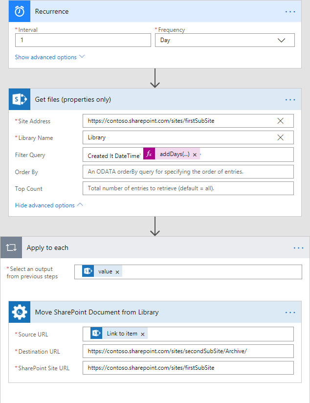

Copy or move SharePoint documents cross-site
===============================================

This article will show how to move documents using Microsoft Flow. I will implement logic of the flow for archiving documents as a proof of concept that moves documents from one document library to another, but you can modify it a little and use to copy documents or folders cross-site.

It will show how to set up the periodical archival process that will run every day, queries all documents older than 30 days and moves them to the document library called "Archive" that located on another site.

For this case, I will use *‘Get files (properties only)‘* from SharePoint Connector for getting properties of documents that need to be moved in the archive and *‘Move SharePoint Document from Library‘* from Plumasail SP connector, which is a part of `Plumsail Actions <https://plumsail.com/actions>`_ for each document that will found on the firts step for moving it to "Archive" folder on a different site.
This flow will be scheduled with "Reccurence" trigger from "Schedule" connector help on run every day.

Before starting, ensure that you `added Plumsail SP connector to Microsoft Flow <../../../getting-started/use-from-flow.html>`_.

The complete flow is below:

Recurrence
-----------
As mentioned above, I'm using this trigger to scheduling the flow.
I specify next parameters for running every day:

*‘Interval‘* - 1

*‘Frequency‘* - choosed "Days" value

.. _getFiles:

Get files (properties only)
------------------------------

.. image:: ../../../_static/img/flow/how-tos/get-files-preporties-with-expression.png
   :alt: Get Files Preporties With Expression

On this step, I get all documents that older than 30 days from source folder:

*‘Site Address‘* as :code:`https://contoso.sharepoint.com/sites/firstSubSite` - The URL of the site. 

*‘Library Name‘* as :code:`"Library"` - The name of the source folder.

The action is using `OData filter <http://www.odata.org/documentation/odata-version-3-0/url-conventions/>`_ as a value of *‘Filter Query‘* field. I compare "Created" field from document's properties and the next expression:
:code:`DateTime'addDays(utcNow(), -30)'`. As you can see, I'm using dynamic expression for getting 30-day offset relatively current date.

Move SharePoint Document from Library
---------------------------------------

This action is using in "each" cycle that based on results of :ref:`getFiles` action.

As value for *‘Source URL‘* I'm using the value of *‘Link to item‘* parameter from *‘Get files (properties only)‘* response:

.. image:: ../../../_static/img/flow/how-tos/move-documents-from-library.png
   :alt: Move Documents From Library

*‘Destination URL‘* I specified as :code:`"https://contoso.sharepoint.com/sites/secondSubSite/Archive/"` - The URL of *‘Archive‘* library on *‘secondSubSite‘* site (different from the source *‘firstSubSite‘*)

**Note:** If *‘Destination URL‘* ends with slash '/' the document will be placed in the folder or library without name changes. Otherwise, the document will be renamed.

And finally, *‘SharePoint Site URL‘* I specified as :code:`"https://contoso.sharepoint.com/sites/firstSubSite"` - The URL of the site for the **source** folder.

Conclusion
-----------

That's all! These few steps can help create a simple archive system that moves old documents from a source folder to your archive.

You may also extend this system by creating a specific folder for every run of this flow with `Create SharePoint Folder by URL <../../actions/sharepoint-processing.html#create-sharepoint-folder-by-url>`_  and `Create SharePoint Folder in List <../../actions/sharepoint-processing.html#create-sharepoint-folder-in-list>`_ actions.

It may be very useful if you need to archive your documents into folder, for example, with the date when the flow was running in the name.