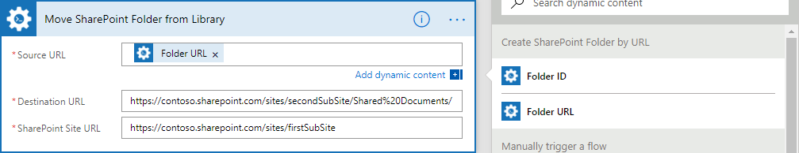
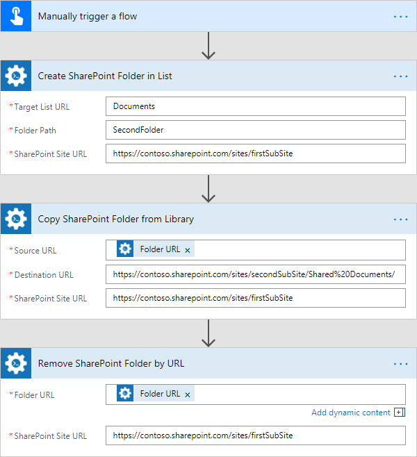
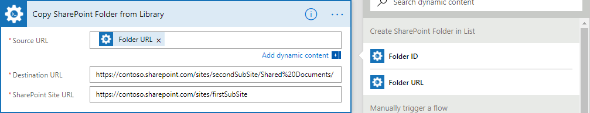

Create, copy, move and remove SharePoint folders cross-site
==============================================================

This article will show how to use Microsoft Flow to create SharePoint folders in two ways, copy, move these folders to another site and remove the source folder after copying.

For example, we consider the following case:

We need to create 2 folders in a document library, then move them to another site.

For the first of them, I will use *‘Create SharePoint Folder by URL‘* for creating the folder and *‘Move SharePoint Folder from Library‘* for moving it to a different site.

For the second folder, I will use *‘Create SharePoint Folder in List‘* for creating and the copy-remove logic for moving: I will copy this folder to another site by *‘Copy SharePoint Folder from Library‘* action and then remove the source folder by *‘Remove SharePoint Folder by URL‘* action.

All these actions from Plumasail SP connector, which is a part of `Plumsail Actions <https://plumsail.com/actions>`_.

So, before starting, ensure that you `added Plumsail SP connector to Microsoft Flow <../../../getting-started/use-from-flow.html>`_.

This article is divided to cases:

- :ref:`createMove`
- :ref:`createCopyRemove`

.. _createMove:

Creating a folder by URL and moving it to another site
---------------------------------------------------------
In this case, was created the flow based on *‘Create SharePoint Folder by URL‘* and *‘Move SharePoint Folder from Library‘* actions and configured it to manual start.

You can find more information about specific parameters of the flow actions in `the documentation <https://plumsail.com/docs/actions/v1.x>`_ .

The complete flow is below:
 
.. image:: ../../../_static/img/flow/how-tos/sharepoint/create-folder-by-url-move.png
   :alt: Creating folder by URL and moving it to another site

Manually trigger a flow
~~~~~~~~~~~~~~~~~~~~~~~~~~

For this case, I'm using the trigger to manual start of the flow.

Create SharePoint Folder by URL
~~~~~~~~~~~~~~~~~~~~~~~~~~~~~~~~

In this action, I specify next parameters:

*‘Folder URL‘* as :code:`"https://contoso.sharepoint.com/sites/firstSubSite/Shared%20Documents/FirstFolder"` - The URL of the folder that I want to create. 
For this simple case, I'm using the simple link. The new folder will be created in *‘Shared Documents‘* library and will be named as *‘FirstFolder‘*.

**Note:** You may create several folders with just one link. For example, if you specify the value for this field as :code:`"https://contoso.sharepoint.com/sites/firstSubSite/Shared%20Documents/FirstFolder/AnotheFolder"` then the action will create *‘FirstFolder‘* folder inside your destination library and *‘AnotherFolder‘* folder inside *‘FirstFolder‘*.

*‘SharePoint Site URL‘* as :code:`"https://contoso.sharepoint.com/sites/firstSubSite"` - The URL of the site.

Move SharePoint Folder from Library
~~~~~~~~~~~~~~~~~~~~~~~~~~~~~~~~~~~~~

As value for *‘Source URL‘* I'm using the value of *‘Folder URL‘* parameter from *‘Create SharePoint Folder by URL‘* response:

*‘Destination URL‘* I specified as :code:`"https://contoso.sharepoint.com/sites/secondSubSite/Shared%20Documents/"` - The URL of *‘Shared Documents‘* library on *‘secondSubSite‘* site (different from the source *‘firstSubSite‘*)

**Note:** If *‘Destination URL‘* ends with slash '/' the folder will be placed in the folder or library without name changes. Otherwise, the folder will be renamed.

And finally, *‘SharePoint Site URL‘* I specified as :code:`"https://contoso.sharepoint.com/sites/firstSubSite"` - The URL of the site for the **source** folder.

.. _createCopyRemove:

Creating a folder in a library, copying it to another site and remove the source library
------------------------------------------------------------------------------------------
In this case, was created the flow based on *‘Create SharePoint Folder in List‘*, *‘Copy SharePoint Folder from Library‘* and *‘Remove SharePoint Folder by URL‘* actions and configured it to manual start.

You can find more information about specific parameters of the flow actions in `the documentation <https://plumsail.com/docs/actions/v1.x>`_ .

The complete flow is below:

Manually trigger a flow
~~~~~~~~~~~~~~~~~~~~~~~~~~

For this case, I'm using the trigger for manual start of the flow.

Create SharePoint Folder in List
~~~~~~~~~~~~~~~~~~~~~~~~~~~~~~~~

In this action, I specify next parameters:

*‘Tagret List‘* as :code:`"Documents"` - The name of the document library where I want to create the folder. 

**Note:** This action is most useful when you do not have the opportunity for getting the full URL of your document library or list because you may specify only the name of the library or the list

*‘Folder Path‘* as :code:`"SecondFolder"` - The path for folder that will be created. It is a simple example with only one folder in the path.

**Note:** You may create several folders if you specify the value for this field, for example as :code:`"SecondFolder/AnotheFolder"`. The action will create *‘SecondFolder‘* folder inside your destination library and *‘AnotherFolder‘* folder inside *‘SecondFolder‘*.

*‘SharePoint Site URL‘* as :code:`"https://contoso.sharepoint.com/sites/firstSubSite"` - The URL of the site.

Copy SharePoint Folder from Library
~~~~~~~~~~~~~~~~~~~~~~~~~~~~~~~~~~~~~

As in previous case, I'm using the value of *‘Folder URL‘* parameter from *‘Create SharePoint Folder in List‘* response as the value for *‘Source URL‘*:

*‘Destination URL‘* I specified as :code:`"https://contoso.sharepoint.com/sites/secondSubSite/Shared%20Documents/"` - The URL of *‘Shared Documents‘* library on *‘secondSubSite‘* site (different from the source *‘firstSubSite‘*)

**Note:** If *‘Destination URL‘* ends with slash '/' the folder will be placed in the folder or library without name changes. Otherwise, the folder will be renamed.

*‘SharePoint Site URL‘* as :code:`"https://contoso.sharepoint.com/sites/firstSubSite"` - The URL of the site for the **source** folder.

Remove SharePoint Folder by URL
~~~~~~~~~~~~~~~~~~~~~~~~~~~~~~~~~~~~~

In this actions I'm also using the value of *‘Folder URL‘* parameter from *‘Create SharePoint Folder in List‘* response as the value for *‘Source URL‘*:

.. image:: ../../../_static/img/flow/how-tos/sharepoint/remove-folder-dynamic-content.png
   :alt: Folder Info Dynamic Content

*‘SharePoint Site URL‘* as :code:`"https://contoso.sharepoint.com/sites/firstSubSite"` - The URL of the site for the source folder.

.. hint:: You are may using the action for setting the variable with your site URL and then use it in Plumsail Actions in *‘SharePoint Site URL‘* field for more convenient using of actions.